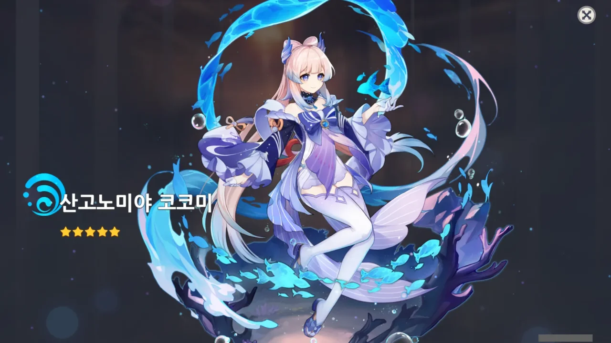

사실 노렸던 것은 바로 이전 기원에서 나온 종려를 뽑아 종려 2돌을 하는 것이었는데... 하필 감동이 나오는 바람에...

물 힐러는 바바라 6돌이 이미 있지만, 그래도 힐러는 다다익선이다. 바바라 아니면 디오나를 써야 했기 때문에 더더욱.

&nbsp;

아무튼 기분 좋다. 사실 이번 기원이 끝나기까지 남은 일수가 별로 없어서 '어떻게 기원 두 번 동안 캐릭터 하나 안 나오냐'라고 생각하고 상당히 울적해하고 있었는데.
