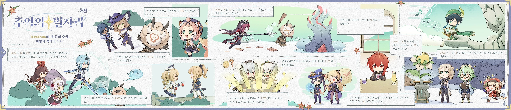
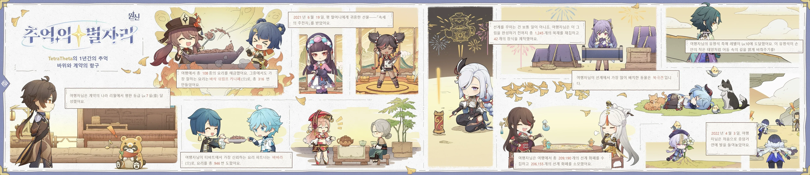
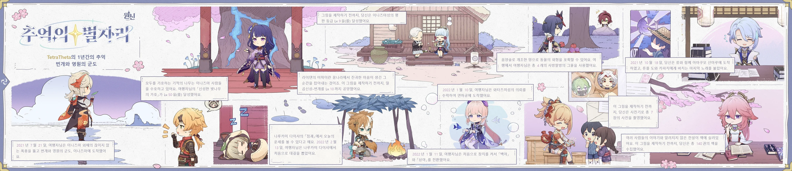
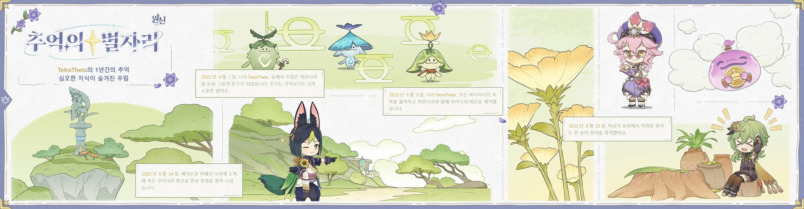
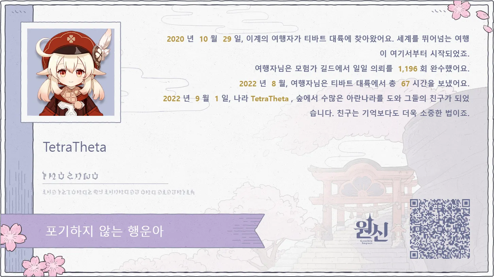

벌써 원신이 2주년을 맞이했다. 시간 참 빠르네.

작년처럼 이번에도 인포그래픽으로 플레이어의 발자취를 돌아볼 수 있도록 해두었다.

벼락 맞기 업적은 있는지도 모르고 길 가다가 번개 맞고 '아, 이거 완전 억까 아냐?'라고 화냈는데.

내가 원신 시작한 날이 10월 29일이었구나. 원신 출시하고 거의 한 달 후에 시작한 셈인가, 그러면?

바삭 쉬림프 카나페를 엄청 많이 만들기는 했는데... 요즘은 다른 세 요리를 더 많이 만들고 있는 것 같다.



솔직히 포켓 피타인가, 이 요리가 정말 혜자라고 생각한다.

밀가루는 밀을 구해서 갈면 나오는 재료이고, 나머지 재료인 우유, 토마토는 상점에서 대량으로 판매하고 있다. 고기마저도 수메르 동물을 잡으면 한 번에 3개씩 대량으로 나오니 재료를 구하기가 너무 쉬운 것이다.

그런데 그래도 바삭 쉬림프 카나페를 엄청 많이 만들기는 했나 보다. 여전히 저게 제일 많네.

그나저나 대길 뽑은 것도 인포그래픽으로 정리해 주네. 난 이거 별 신경도 안 썼는데.

이나즈마도 그렇고 수메르도 그렇고, 아마 업데이트 열리자마자 갔을 거다. 그러니까 저게 업데이트 일자라고 봐도 되겠지.

