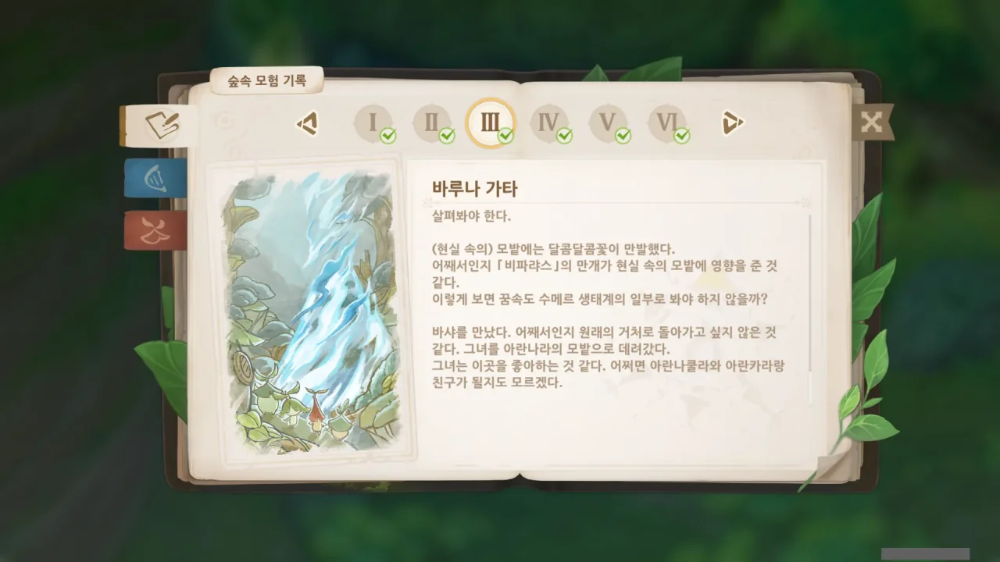
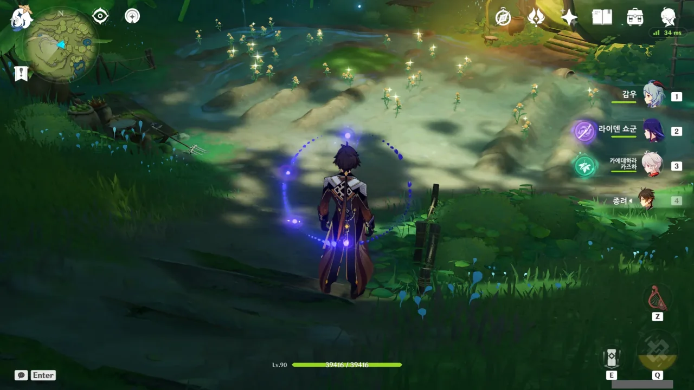

숲의 책을 들여다볼 때마다 저 바루나 가타 부분이 체크가 안 되어서 상당히 눈에 거슬렸다.

그걸 오늘에야 드디어 끝냈다. 정확히는 끝낼 수 있었는데 까먹고 방치하고 있었던 것이지만.

12개의 '풀 모두 밟기' 퍼즐을 모두 풀고, 얻은 씨앗 비스름한 것을 심기는 심었는데, 그다음 날에 방문하는 것을 완전히 잊고 있었다.

그리고 그걸 오늘 한 거고.

&nbsp;

꿈속의 바나라나에서 컷신까지 봤는데 왜 바루나 가타 챕터가 안 끝나나 싶었는데, 죽음의 땅을 정화하던 중 만난 '바샤'라는 꼬맹이를 현실의 바나라나의 그 꽃밭까지 데려가야 완전히 해결되는 것이라고 하더라.

뭔가 그 꼬맹이로 이야기를 더 풀어줄 것으로 생각했는데 뭔가 이렇게 끝나니 허무한 것 같기도 하고, 꼬맹이로 이야기를 더 풀어봤자 비마라 마을처럼 속이 씁쓸한 이야기만 나올 것 같아서 그냥 이렇게 끝나는 게 차라리 나은 것 같기도 하다.

아무튼, 숲의 책 끝!

정확히는 그림 보고 장소 찾아가서 보물 찾는 부분이 남긴 했는데... 그건 뭐 어찌저찌해서 하면 될 거 같으니 스킵.

아무튼 저 긴 숲의 책의 스토리라인을 모두 끝냈다는 게 제일 좋은 거 아닐까?



일단 이 짓거리가 완전히 끝났다는 것이 너무 행복하다.

앞으로 달콤달콤 꽃이 부족할 일은 없지 싶다. 평소에도 많이 캐 두긴 하지만.

미리 캐고 바샤를 만나러 갔는데, 바샤 컷신이 재생되자 저 달콤달콤 꽃이 순식간에 리젠되는 것을 보고 잠깐 감동했다.

와! 달콤달콤 꽃이 두 배!
