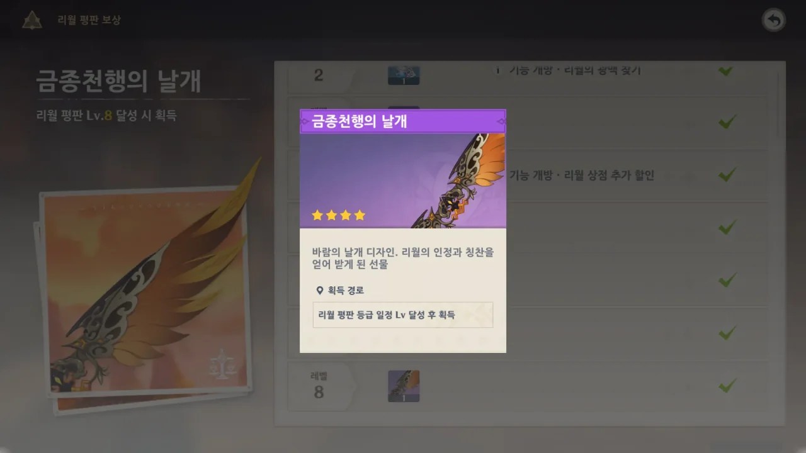
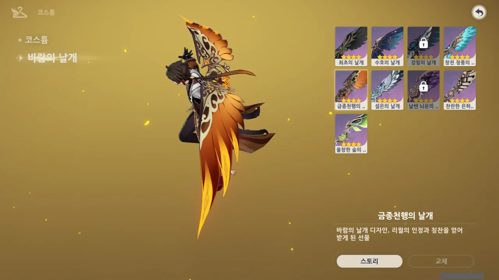
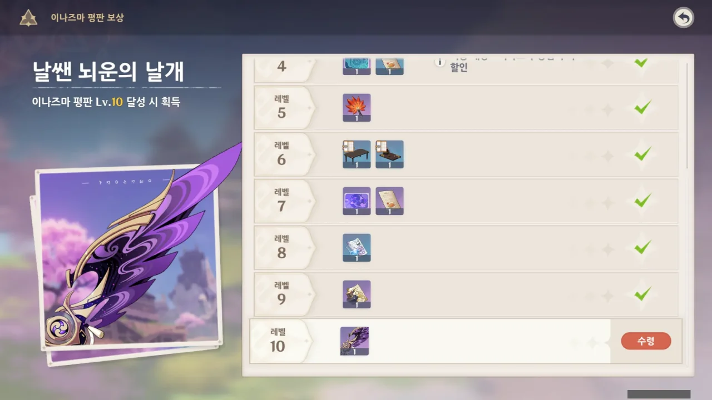
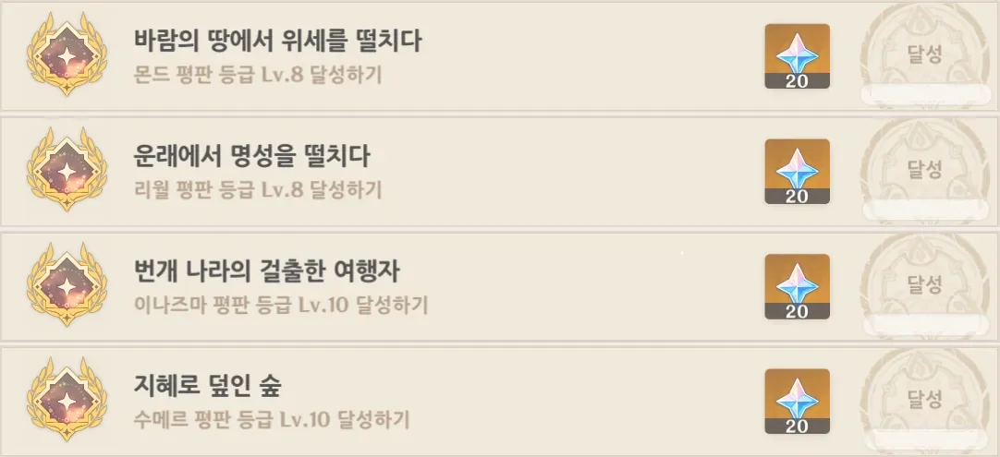
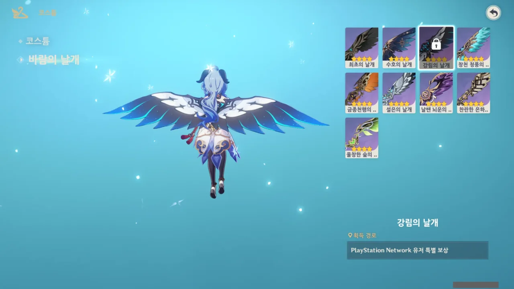

드디어 모든 지역의 날개를 다 얻었다. 드디어...

일단 리월. 예전에 해둔 것이 있어서 몬드에서 그랬던 것만큼 오래 걸리지 않았다.

갈색이 어울리는 캐릭터들에게 전부 날개를 달아주었다. 바위 캐릭터임에도 불구하고 갈색 날개가 어울리지 않는 경우도 있어서 그냥 대충 보면서 색깔을 맞춰주었다.

그다음은 이나즈마. 이나즈마 역시 대충 뇌 빼고 하니까 10레벨을 찍었다.

몬드, 리월, 이나즈마, 수메르 4 지역 모두 평판 등급 만렙을 찍었다. 드디어.

이제 남은 건 강림의 날개인데, 이건 PSN 전용인 데다가 플스 이외의 플랫폼에서는 강제로 날개가 장착 해제된다고 하니, 그냥 없는 셈 치면 된다.

근데 이제 뭐 함?
