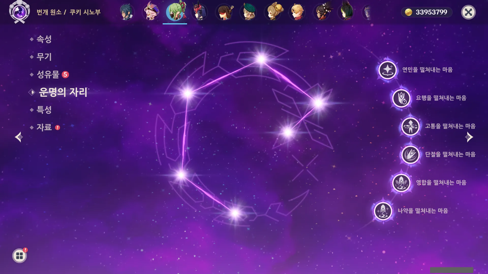
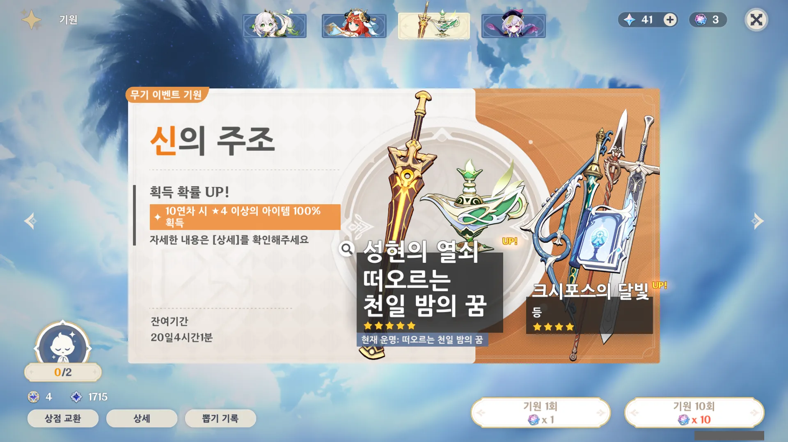

3.6 버전이 되면서 새로운 기원이 열렸다.

현재까지 뒤얽힌 인연을 100여 개 정도 모아 왔기에, 이걸 그대로 모아서 4.0 버전에서 쓸 것인지 아니면 이번 기원에서 쓸 것인지 고민을 좀 했다.

&nbsp;

일단 3.6 버전의 전반에는 나히다와 닐루가 나오고, 후반에는 백출과 감우가 나온다. 현재 미보유중인 캐릭터는 닐루와 백출이 있다. 백출은 사람들이 하는 이야기를 들어보니 그렇게까지 성능이 좋지는 않을 것이라고 하고, 닐루는 돌파와 전무가 필수라고 하길래 빠르게 욕심을 접었다.

나히다 2돌을 하면 좀 나아질 것이라고 하길래, 나히다에 지금까지 모은 인연을 모두 쏟아붓기로 했다. 일단 인연을 90개 이상을 모았으니, 최소한 5성 하나는 뽑아갈 수 있을 것이다.

가챠를 진행하기 전, 최대한 원석을 끌어모았다. 여기에는 당연히 체험 보상으로 주는 원석도 포함되어 있다.

&nbsp;

그런데 닐루 체험이 정말 기묘한 타이밍에 끝났다.

이야, 이렇게 이쁜데... 돌파와 전무가 없으면 제대로 쓰기 힘들다니, 참 안타깝다.



그리하여 모은 105개의 뒤얽힌 인연.

첫 10 연차에는 레일라가 나와주었다.

예전에 누구 기원이었는지는 몰라도 '레일라 정도는 나오겠지'라고 생각하며 가챠를 돌린 적이 있었다. 그런데 레일라는커녕, 레일라 발톱 때도 안 나오더라고. 그런데 레일라가 이제야 나와줬다.

도리도리 잼잼.

순간 타이나리를 보고 '네가 왜 여기서 나와?'라고 생각했다. 아, 참. 타이나리는 상시였지.

전혀 예상치 못한 타이나리에 기분이 좋아졌다. 종종 원신을 같이 하던 사람이 타이나리를 굉장히 잘 쓰는 걸 보고 나도 타이나리를 쓰고 싶다 생각해 왔거든.

&nbsp;

그리고 한동안 시노부만 잔뜩 나왔다.

&nbsp;

&nbsp;

&nbsp;

&nbsp;

&nbsp;

&nbsp;

&nbsp;

&nbsp;

&nbsp;

드디어 나왔다! 

더 이상 10 연차가 불가능해, 단차만 돌리다가 마지막 남은 한 개의 인연을 보며 '이거 안되면 어쩌지...'라고 생각하며 나히다가 나오길 애타게 바랐다.

그리고 나히다가 나와주었다!

그리고 내가 지금껏 모아 왔던 인연은 다시 0개가 되었다.

하지만 괜찮아. 나히다를 얻었으니까.

&nbsp;

&nbsp;

&nbsp;

이제 그동안 나왔던 캐릭터들의 돌파를 해줄 시간.

나히다가 드디어 2돌이 되었다. 다만 두 번째 효과를 적용받으려면 지금 쓰고 있는 조합인 \[감우 나히다 향릉 종려\] 조합을 버려야 한다. 이 파티는 융해와 연소를 쓰거든...

새로운 조합을 짤 때가 되었나...

시노부를 처음 명함으로 얻었을 때 한 생각이 '시노부는 6돌이 된 후에 써봐야겠다'였는데, 정말로 6돌이 되어버렸다.

레일라도 2돌까지 올려주었다. 예전에 레일라 체험으로 써보았을 때에는 쓰기 어렵다고 생각했었는데, 지금은 어떠려나.

&nbsp;

&nbsp;

&nbsp;

P.S.

주인 없는 스타라이트가 있길래 그것마저 몽땅 교환해 인연 3개를 얻었다.

이 운이면 무기 기원에서 5성 무기가 단번에 뜨지 않을까라는 생각에 인연 3개를 몽땅 무기 기원에 부었지만, 너무 큰 욕심이었다. 어림도 없지!

뭐, 그래도 무기 스택은 조금이나마 올렸어...
