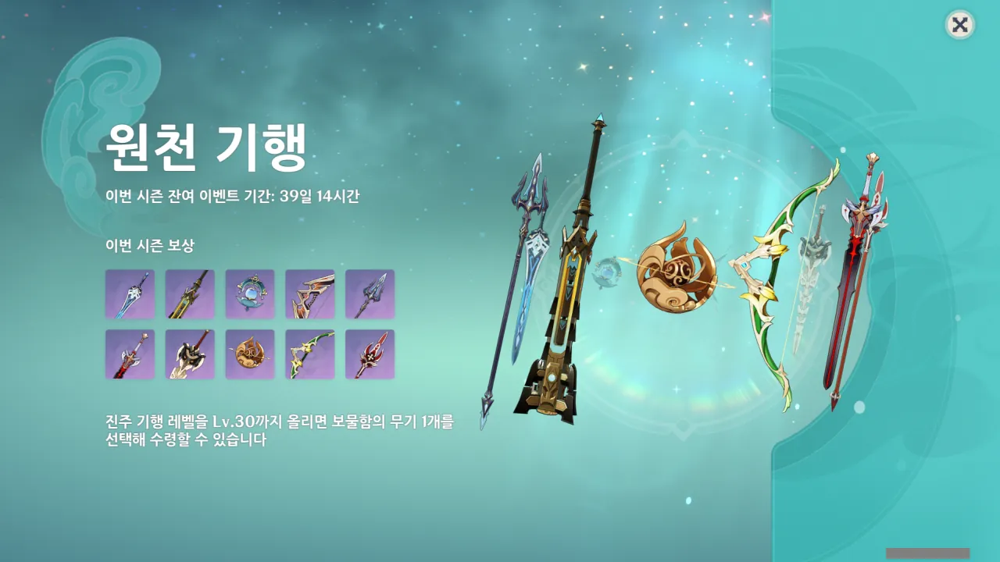
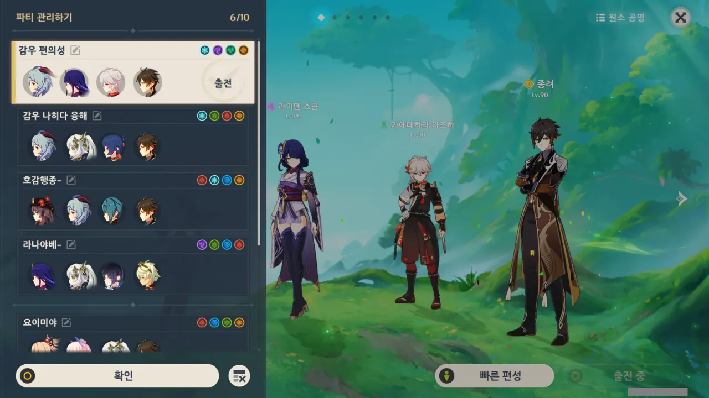
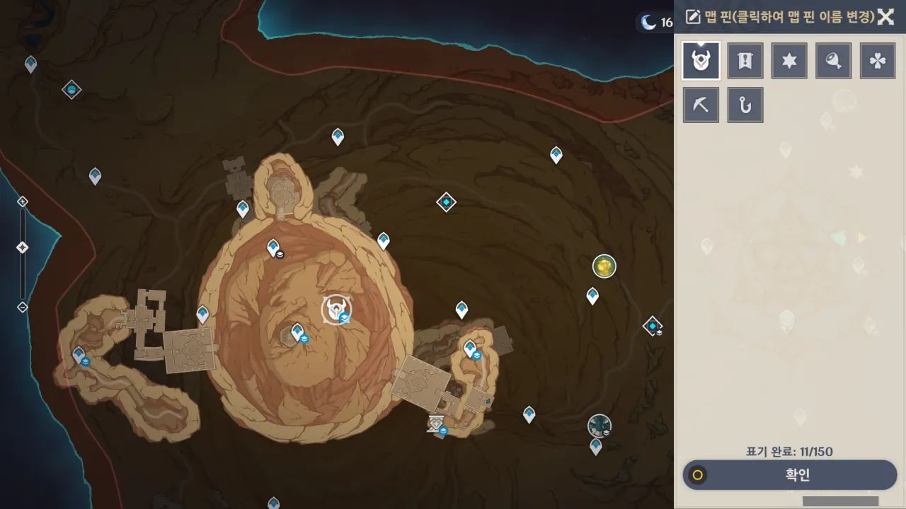
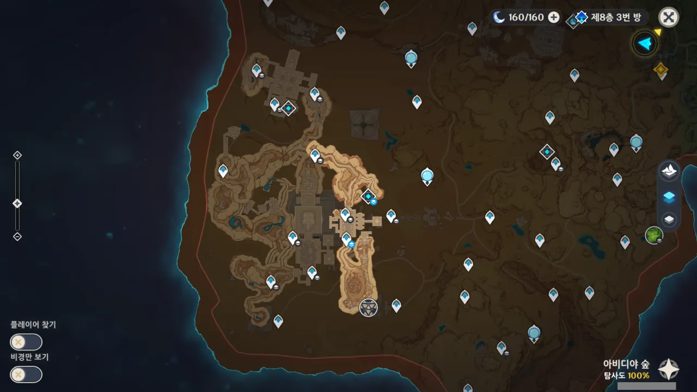
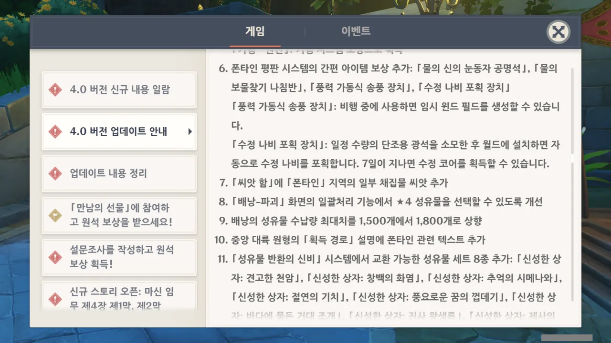
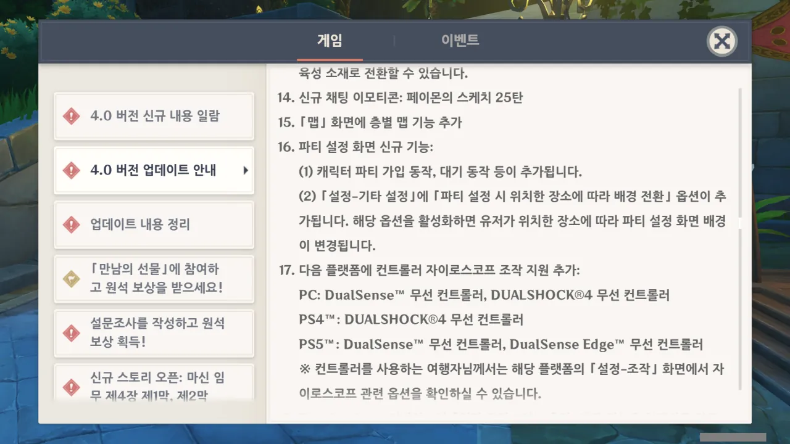
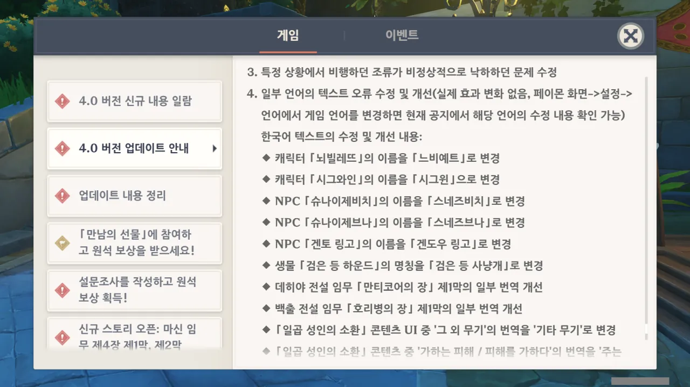
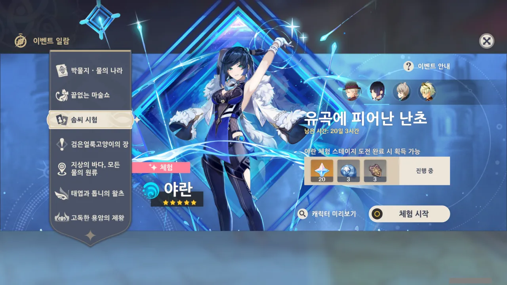
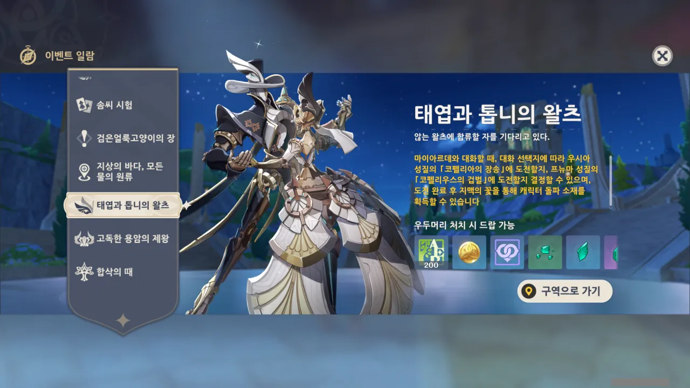

감개무량하달까, 원신도 벌써 버전이 4.0이 되었다.

신규 지역이 추가된 것 외에도, 시스템의 많은 부분이 바뀌었다고 하던데, 그래서인지 업데이트 사전 다운로드 용량이 무려 34GB나 되었다.

그래서 업데이트가 끝난 후, 무엇이 바뀌었는가 한번 대충 살펴보기로 했다.

***

일단 기행 무기가 추가되었다. 기존의 기행 무기는 두 번째 줄에 위치하고 있으며, 이번에 새로 추가된 무기가 첫 번째 줄에 위치하고 있다.

매번 진주 기행을 구매한 사람이라면 기존 기행 무기를 전부 5재련을 했을 텐데, 그런 사람들 입장에서 새로운 기행 무기 추가는 아마 달가운 소식일 것이다.

나? 내가 마지막으로 진주 기행을 산 것이 언제였더라...?



파티 설정 화면이 꽤 많이 변했다.

기존의 파티 설정 화면이 그저 캐릭터 4명을 차렷 자세로 일렬로 세워놓은 것에 불과했다면, 새로 바뀐 파티 설정 화면은 캐릭터 4명을 약간의 전후 위치에 차이를 둔 상태에서 각 캐릭터마다 전용 모션을 취하도록 바뀌었다.

스타레일과 비슷한 방식인데, 카메라 각도가 스타레일처럼 과격하지 않고 부드럽다는 느낌이다. 스타레일은 2번 자리가 너무 부각되는 배치와 카메라 각도였거든...

배경 역시 단조로운 파란색에서 벗어나 현재 위치한 지역에 맞게 바뀐다.

드래그 & 드롭으로 위치를 바꿀 때 저렇게 아이콘으로 뜨는 것이 원래 그랬는지 아니었는지는 잘 기억이 나지 않는다. 애당초 빠른 편성 기능만 썼거든...





캐릭터 편성 모션은 아무래도 각 캐릭터의 PV 영상에서 따온 것 같다. 라이덴 쇼군이나 감우의 모션은 확실히 PV에서 본 것 같거든.

모든 캐릭터를 볼 여유가 없었기에 그냥 적당히 보고 넘어갔지만, 아마 나중에 누군가가 각 캐릭터마다의 편성 모션을 영상으로 만들어주지 않을까?

원래 이렇게 파티 관리창에서 파티원의 원소 속성을 표시해 줬던가...?



내가 제일 기대하던 것 중 하나인 '지하 지도' 기능이다.

지하에 있는 워프 포인트 등을 선택하면 해당 포인트가 위치한 층의 모습을 자동으로 보여준다. 또한 같은 층에 있는 다른 포인트의 우측 하단 아이콘의 색상 역시 푸른색으로 바뀌어 한눈에 다른 포인트들의 위치를 확인할 수 있다.

이제 '저기를 어떻게 해야 갈 수 있더라?'로 머리를 싸맬 필요가 없어질 것 같다.

내가 맵 핀을 잘 쓰지 않아서 모르겠다만, 원래 이렇게 맵 핀의 우측 하단에 저런 아이콘이 달렸었던가?



새로 추가된 지역인 폰타인이다. 아직 폰타인에 가지 않아 맵이 밝혀져있지 않지만, 대충 윤곽은 확인할 수 있다.

다만 이렇게 되면 수메르와 폰타인 사이에 빈 공간이 넓게 생기게 되어 그리 이쁘게 보이지 않는다. 나중에 버전이 올라가면서 이 빈 공간이 채워지기를 기대할 수밖에...

내 예상으로는 파라컬트 쪽은 리월의 층암거연처럼 수메르의 신지역이 추가될 것 같고, 수메르 위쪽과 리월, 몬드 쪽으로는 폰타인의 신 지역이 추가될 것 같다. 마침 리월 북쪽의 미구현 지역인 '교영 마을'이 폰타인과 맞닿은 지역이라는 언급이 있었으니...



수메르만 지하 지도가 추가된 것이 아니다. 이나즈마 역시 지하 지도가 추가되었다.

처음 이나즈마 지하를 돌아다닐 때에는 지하가 참 거지같이 되어있다고 속으로 구시렁대었었는데, 나중에 수메르의 지하를 경험해 보니 이나즈마의 지하는 갓난아기 장난 수준이었더라.

보기만 해도 헛웃음이 나오는 적왕의 무덤 지하 지도.

대충 업데이트 로그를 읽던 도중, 탐나는 것을 하나 발견했다.

「수정 나비 포획 장치」? 쿨타임이 7일이라는 단점이 있지만, 이걸 꾸준히 사용하기만 해도 큰 도움이 될 것 같다. 매번 수정 나비를 잡으러 다니기 좀 귀찮았거든.

성유물 수납량 최대치가 1,500개에서 1,800개로 늘어난 것은 별로 체감이 되지 않는다. 이젠 성유물 파밍을 예전만큼 많이 하지 않기 때문이다.

「풍력 가동식 송풍 장치」는 비행 중 윈드 필드를 생성해 체공 거리를 늘리는 역할로 보인다. 붉은 깃털 부채가 비행 전에 사용해야 효과를 볼 수 있음을 생각해 보면, 비행 중 간편 아이템을 쓸 수 있다는 것은 꽤나 솔깃한 이야기이다.

동적 파티 설정 배경 기능을 끌 수 있다고 하는데, 저사양 기기가 아닌 이상 저걸 끌 일이 과연 있을까?

등장인물의 이름 역시 꽤 많이 바뀐 것 같다.

'슈나이제비치'가 '스네즈비치'로 바뀌고 '슈나이제브나'가 '스네즈브나'로 바뀌었는데, 이러니 '스네즈나야'와의 연관성이 확연히 와닿는다.

&nbsp;

일곱 성인의 소환 관련한 이야기는 전혀 관심이 없으니 패스.



뜬금없이 4성 리넷을 그냥 준다.

이번 기원은 리니와 야란이다.

지금 내 야란이 명함인데, 여기서 1돌로 올리면 야란의 무기를 제례활 말고 다른 무기를 들려줄 수 있다. 하지만... 나중에 푸리나도 나오고 할 텐데 지금 야란에 인연을 써버리는 것은 낭비 아닐까?

리니? 푸리나가 있는데 리니에 관심이 갈 리가 없지. 게다가 남캐잖아.

새로 필드 토벌 보스가 추가된 것 같은데, 전투 진입 전 NPC와 대화해 상대할 적을 선택하는 것으로 보인다. PV에서 봤을 때에는 산호의 수호자처럼 2인 1조 토벌 보스인 줄로만 알았는데...
