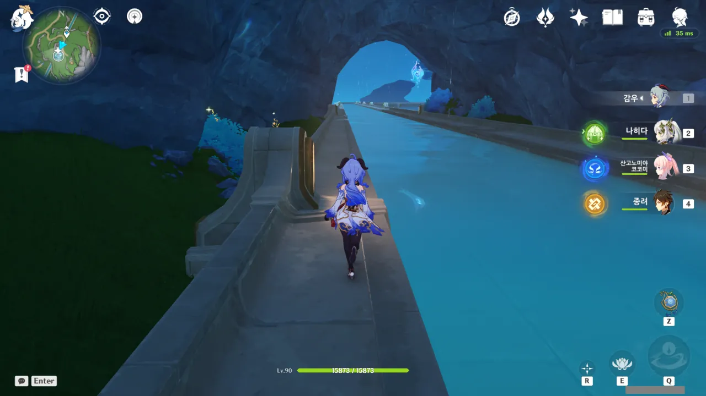
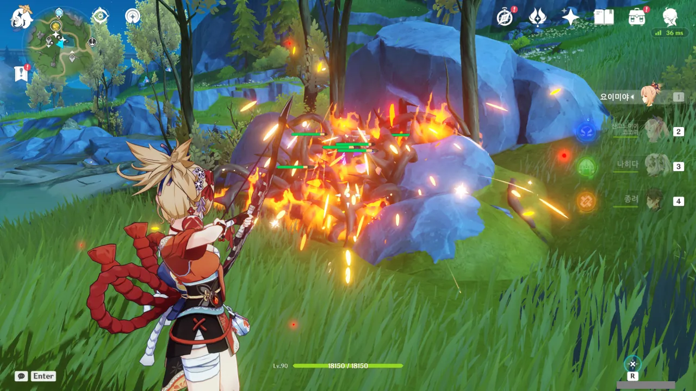
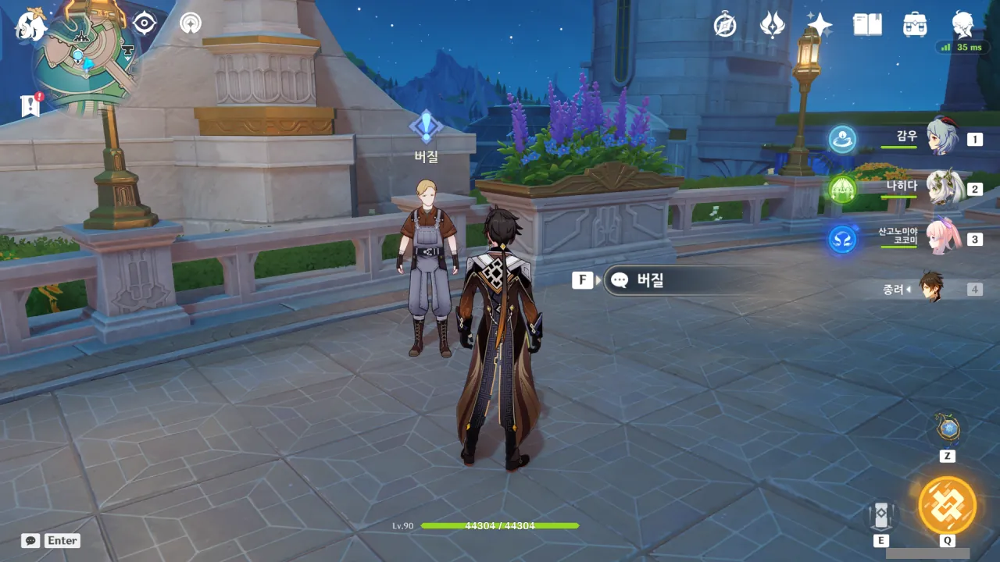
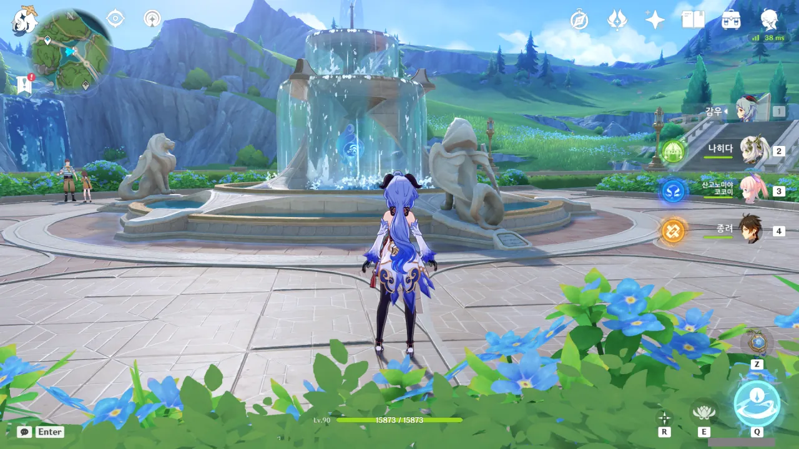
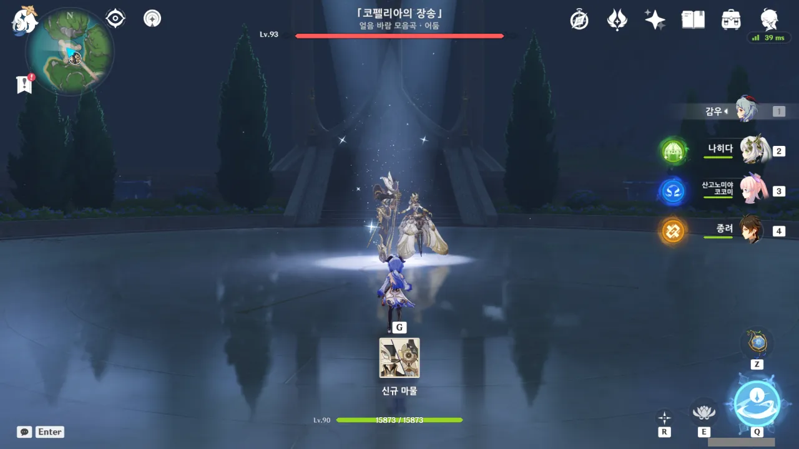

원신의 버전이 4.0으로 올라감과 동시에 새로운 지역인 폰타인이 공개되었다.

새로운 지역을 밝히러 돌아다니기가 영 내키지 않아, 폰타인은 내버려 두고 늘 하던 대로 수메르 일퀘와 탐사만 하고 다녔다.

그러던 어느 날, 갑자기 '아, 폰타인 열어둘까?'라는 생각이 들었다.

쇠뿔도 단김에 빼라고 하던가? 생각이 났으니 곧바로 실천에 옮기기로 했다.

그래서 왔다. 폰타인 지역이 추가될 때 자동으로 해금된 워프 포인트로 이동하면 이렇게 폰타인의 모습을 컷신으로 보여준다.

폰타인의 첫인상은 마치 나이아가라 폭포를 연상케 하는 거대한 폭포였다. 대체 폰타인 땅에 무슨 일이 있었길래, 이렇게 폰타인 땅만 불쑥 솟아오른 걸까?

&nbsp;

시간이 지남에 따라 폭포는 침식 작용으로 인해 모나고 꺾여 튀어나온 부분이 깎여 사라지게 된다.

특히나 나이아가라 폭포나 저 폭포처럼 강 본류가 직접적으로 낙하하는 경우, 폭포에서 떨어지는 막대한 양의 물 때문에 폭포의 침식 속도가 다른 폭포에 비해 압도적으로 빠르게 된다. 나이아가라 폭포는 매년, 무려 1m씩 뒤로 후퇴할 정도이다.

폰타인 땅의 모습을 보니, 폰타인 땅 전체가 하나 이상의 폭포로 둘러싸인 것으로 보인다. 그렇다면 폰타인을 둘러싼 폭포 역시 매년 몇 미터씩 뒤로 후퇴하며 폰타인의 땅을 조금씩 줄여나갈 것이다.

절벽 위에서 내려다보았을 때, '설마 저 항구까지 헤엄쳐 가야 하나?' 하고 걱정했는데, 다행스럽게도 절벽 밑에 파도 배를 소환할 수 있는 파도 배 워프 포인트가 위치해 있었다.

그래... 파도 배가 없으면 꼼짝없이 저기까지 헤엄쳐 가야 하는데, 그러면 스태미나 부족으로 100% 익사할 거라고...

와, 퍼리.

어째서인진 잘 모르겠지만, 저 종족이 엄청 인기가 많더라고.



이번에 추가된 폰타인 지역의 넓이가 그리 넓지 않아 보였기 때문에, 신상 하나만 열면 모든 지역을 다 밝힐 수 있을 거라 생각했다.

그런데 전혀 아니더라고. 그 위쪽에 밝혀야 할 신상이 두 개나 더 있었다.



페이몬의 말에 따르면, 여행자가 신상을 만졌을 때 신상이 갑자기 엄청 밝게 빛났다고 한다.

글쎄...? 여행자가 지금껏 만진 신상들은 전부 하나같이 다 밝게 빛났던 것 같은데.





다른 곳의 신상을 밝혔을 때에는 별다른 말이 없었는데... 설마 이 신상과 상호작용을 함으로써 물속에 들어가 헤엄칠 수 있게 되었다는 설정은 아니겠지?





여행자가 물속을 열심히 헤엄칠 동안, 페이몬이 혼자 물 위에서 유유자적 꿀을 빨려고 하길래 '어 딜도 망가'를 시전 했다.



아니, 이게 정말이었네. 정말로 신상에서 흘러나오는 신비한 힘 덕분에 이제 폰타인의 물속을 헤엄칠 수 있게 되었다는 설정이었다.

웃긴 건, 이 신상을 만지기 전에 이미 난 다른 사람의 세션에서 신나게 물속을 헤엄치고 놀았다는 거다. 뭐... 다인 모드니까, 그런 사소한 문제는 없는 셈 치는 모양이다.

&nbsp;

설명을 잘 읽어보면 물속을 헤엄치며 다니는 건 폰타인에서만 가능함을 확인할 수 있다. 개인적으로 다른 지역의 물속도 헤엄칠 수 있었으면 했는데, 아쉽다.

아, 어쩌면 폰타인의 땅이 다른 곳에 비해 불쑥 솟아오른 것 역시 이를 위한 것일지도 모르겠다.

'잠수할 수 있는 폰타인의 물'과 '잠수할 수 없는 다른 지역의 물'을 구별해야 하는데, 두 물이 같이 붙어 있다면 어디까지가 잠수할 수 있는 물이고 어디부터가 잠수할 수 없는 물인지 알 수 없지 않겠는가.

이벤트 아이콘에 붉은색 느낌표가 들어왔다. 이벤트 창을 열어보니 '박물지 · 물의 나라'라는 새로운 이벤트가 생겨났다.

그런데 이벤트의 남은 시간이 고작 9일이라고...?





새로 생긴 이벤트는 일종의 폰타인 가이드 이벤트였다. 폰타인에 어떤 채집물이 있고, 어떤 동물이 있으며, 어떤 적이나 보스가 있는지 알려주는 그런 가이드 말이다.

그런데 이 모든 걸 전부 9일 안에 다 끝마쳐야 한다. 그렇지 않으면 이벤트가 끝나 보상을 전혀 받지 못하게 된다. 보상을 포기하기에는 각 항목마다 걸린 원석이 너무나도 탐난다.

아아, 내 원래 계획은 천천히 폰타인을 둘러보며 워프 포인트를 하나하나 밝히는 것이었는데... 느닷없이 시간제한이 생겨나버렸다.

어쩔 수 없지.

뭐라고 말해야 할까... 지금까지 보아온 신의 눈동자는 어딘가 날카롭거나 뾰족한 부분이 있었는데, 이번 물의 신의 눈동자는 뭔가 전체적으로 둥글둥글 부드럽게 생겼다.

여기서 유람선을 타고 물길을 따라 이동하는 영상을 봤는데, 아마 유람선을 타고 가며 자연스럽게 신의 눈동자를 먹게 되는 전개인 것 같다.

하지만 난 그런 평범함을 거부하겠어. 지금 바로 먹을 거야.

와, 퍼리 2.

대화 프롬프트가 나타나는 것으로 보아, 시오라와 대화할 수 있을 것으로 보인다. 이 종족은 대체 어떤 개성을 갖고 있을까?

하지만 NPC와 함부로 대화를 했다간 월드 임무를 받게 될 수도 있다. 물론 정말로 월드 임무를 주는 NPC는 머리 위에 푸른색 느낌표가 있지만, NPC와의 일반적인 대화를 통해 월드 임무에 대한 힌트를 얻는 경우가 있을 수도 있지 않은가.

이번 탐사의 주 목표는 '현재까지 공개된 폰타인의 모든 지역 밝히기'와 '박물지 이벤트 완료'이기 때문에, 월드 임무 혹은 그와 연관된 힌트를 줄 수 있는, NPC와의 대화는 나중으로 미뤄두기로 했다.

바다표범을 닮았지만 바다표범보다 훨씬 귀여운 동물이 해변에 편하게 누워있다.

혹시나 해서 때려보니, 대미지를 받는다. 난 이 바다표범이 텐트 거북처럼 전혀 대미지를 입지 않을 것이라 생각해 때린 것이었는데, 조금 당황했다.

하지만 이미 걸린 전투. 주변에 있던 모든 바다표범을 때려잡을 수밖에 없었다. 물론, 전리품은 남김없이 다 챙겨갔다.

지역을 탐사할 때 제일 중요한 건 역시 워프 포인트를 열어두는 것이다. 탐사 도중이나 이후에 인근 지역으로 이동할 때 쓸 수 있으니 말이다.

비경 역시 워프 포인트로 기능하기 때문에, 비경 역시 최대한 열어두는 것이 좋다.

&nbsp;

비경하니까 갑자기 생각난 것이 하나 있다.

원신에 나오는 모든 비경이 성유물이나 육성 재료를 주는 것은 아니다. 그중 일부는 최초 클리어 시에만 보상을 주는 일회성 비경이다.

그리고 난 이런 비경은 활성화만 해놓고 들어가지 않는다. 기껏 비경으로 워프 한다고 해도, 인근 지역으로 가기 위해 워프 하는 것이지, 비경을 플레이하려 워프 하는 것이 아니다.

이유는 많다. 단순히 귀찮은 것도 있고, 나중에 원석이 정말 필요할 때 끌어다 쓰기 위해 아끼는 것도 있다. 중요한 건 결국 안 한다는 거다.

그래서 내 월드에는 이나즈마의 일회성 비경 여럿이 아직도 미완료 상태로 남아있다.

그리고 이렇게 글을 쓰는 지금도 그 비경들을 플레이할 생각이 전혀 들지 않는다.

여기 수로 한가운데에 있는 저 신의 눈동자 역시 유람선을 타고 이동하며 자연스럽게 먹는 설계로 보인다만... 어림도 없지, 난 지금 바로 먹겠어.

여기 이 호수의 물은 뜨거운 김이 모락모락 피어나고 거품이 보글보글 올라오는 것으로 보아, 온천 혹은 열탕인 것으로 보인다. 누가 보면 여기가 불의 나라, 나타인 줄로만 알겠네.

아마 저기에 들어가면 순식간에 '잘 익은 야자염소'가 되어버리겠지?



&nbsp;

그래도 혹시 모르니까 직접 발을 담가보았다.

들어오는 대미지는 캐릭터가 즉사할 정도는 아니지만, 여전히 무시할 수는 없을 정도였다.

잠깐 발을 스치듯이 닿는 정도는 괜찮겠지만, 물속에 10초 정도 서있는다면 정말로 '잘 익은 야자염소'가 될 것이 분명하다.



가시덤불 안에 파란색 무언가가 있다.

그러니까 저 장치에 지속적으로 물을 묻히면 된다는 것이겠지?

처음에는 그냥 코코미로 물을 묻혀보았는데, 장치에 물이 묻는 것이 아니라 장치를 감싸고 있던 가시덤불에 물이 묻었다. 결국 요이미야를 꺼내 장치를 가로막는 가시덤불을 불태워야 했다.

이제는 장치에 물을 묻힐 수 있겠지.

코코미로 물을 묻혔다. 그런데 왜 아무 일도 일어나지 않는 것일까?

한참을 애꿎은 장치만 때리다가 장치에 F키를 눌러 상호작용을 하면 장치를 이동시킬 수 있다는 걸 발견했다. 아니 왜 이걸 안 알려줘서...

장치가 향하는 방향을 보아하니, 아무래도 이 근처에 있는 모든 장치를 호수 한가운데의 섬으로 보내면 저 상자가 열리는 구조인 것 같다.

하나 더 갑니다!

장치 세 개를 전부 섬으로 보냈는데 왜 아무런 일도 일어나지 않을까?



그럴 때에는 튜토리얼을 보면 된다. 역시 튜토리얼이야!

섬에 새로 생겨난 저 '물 씨앗'이라는 것을 얻은 후, 몸에 물을 묻혀 씨앗을 활성화하면 상자가 열릴 것 같다.

바로 옆에 물이 있으니 괜찮을 것이다. 아마도. 잘 익은 야자염소나 잘 익은 종려나무가 될 것 같지만...



크아악, 날 대체 어디로 보내려는 것이냐! 난 상자에서 나온 아이템을 먹기 위해 F키를 연타한 것 밖에 없다고!

상자가 열리자마자 무언가가 상자 자리에 생겨났고, 난 상자에서 떨어진 아이템을 먹기 위해 F키를 연타하고 있었던 터라, 나도 모르는 사이에 그 무언가를 눌러버렸다. 그리고 그 무언가에 의해 난 지금 어디론가 납치당하고 있다. 제발 이런 것 좀 넣어놓지 말아 다오, 미호요!

이 물공 상태에서 수면에 닿으면 물공 상태에서 벗어나 수영 상태가 될 줄 알았는데, 그런 것 없이 그대로 물밑으로 이동한다.

납치당한 곳은 무슨 화산지대처럼 생긴 곳이다.

아, 설마 여기가 아까 그 열탕 호수 밑바닥인 건가?



여기가 얼마나 뜨겁냐면, 이렇게 장작에 붙은 불을 꺼도 곧바로 다시 불이 붙을 정도이다. 와, 자연발화!

내가 대체 뭘 한건진 잘 모르겠지만, 물 씨앗이 떨어져 있길래 그걸 먹고 몸에 물을 묻혀 씨앗을 활성화 한 다음에, 씨앗을 놓을 수 있는 받침에 그걸 놓았다.

그리고 그걸 세 번 하니까 가운데에 있던 물 원소 비석의 잠금이 해제되었다. 이제 여기에 물을 묻히면 뭐가 달라지는 것일까?

샘물이 지하에서 솟아오른다고?

샘물이 지하에서 솟아오른다는 게 무슨 말인가 했는데, 이 공간 전체가 물에 잠긴다는 말이었다. 이런 전개는 상상조차 못 했는데 ㅋㅋㅋㅋㅋㅋ

심지어 퍼즐을 잘 풀었으니 '참 잘했어요' 도장을 받을 자격이 있다며, ~~코코나~~아이언하이드 자작이 나타났다. ~~요쿠 데키마시타~~



아이언하이드 자작은 주변에 있는 생물의 능력을 흡수해 패면 손쉽게 잡을 수 있다.

아이언하이드 자작의 이명이 「승리를 향한 회전」이라는데, 아마 공격 패턴 중 회전하며 돌격하는 것이 있어 붙은 이명일 것이다.

하지만 난 저걸 보니 블루 아카이브의 '무한초밥전대 카이텐져'만 생각나더라고.

> 무한히 회전하는 레일은 이윽고 정의의 미래로 이어진다!
{.block-quote}

아무리 봐도 찰떡이잖아.

아무튼, 아이언하이드 자작이 지키고 있던 상자도 맛있게 먹어주었다.

그 뒤에는 무사히 아까 전 그 호수로 돌아올 수 있었다.

돌아오는 길 귀찮아하지 말라고 빠른 이동 서비스까지 넣어주더라고.

아까 전 뜨거운 지하를 물로 식힌 덕분일까, 이제는 이 호수의 물이 뜨겁지 않다.

이제 이 호수에 발을 담가도 '잘 익은 야자염소'나 '잘 익은 종려나무'가 되지 않는다.

호수 안에는 먹을 것이 아주 많았다. 물의 신의 눈동자, 화려한 보물상자... 너무 좋은걸.

'노심 냉각' 업적은 지하 동굴을 물로 채웠을 때 달성했고, '2만 리 표류' 업적은 수몰된 지하 동굴에서 해류를 타고 빠져나올 때, '「아이언하이드 자작」' 업적은 아까 그 아이언하이드 자작을 처치했을 때 얻었다.



필드를 돌아다니다 발견한 장면. 보물 사냥단이 폰타인 로봇을 이용해 채굴을 하는 모습이다.

자동 기계란 건 '오버 테크놀로지'라고 해도 될 정도의 기술이기 때문에, 폰타인 로봇을 처음 봤을 때 난 국가가 로봇 사용을 엄격히 통제할 것이라 생각했다. 자격증이 필요하다거나, 매우 높은 가격을 요구한다거나, 뭐 그런 식으로 말이다.

하지만 보물 사냥단 같은 범죄 집단이 매우 자연스럽게 폰타인 로봇을 굴리는 저 모습을 보니, 폰타인 로봇은 의외로 민간에 널리 퍼져 있는 것으로 보인다. 그렇지 않고서야, 저 범죄 집단이 로봇을 굴릴 수 있을 리 없잖아.

폰타인 로봇의 동력원은 폰타인에서밖에 구할 수 없다고 하던데, 설마 그래서인 걸까?

지하에 있는 워프 포인트까지 전부 세심하게 챙긴다. 지하에 워프 포인트가 있다는 건, 나중에 지하로 갈 일이 생긴다는 말이니까.

도중에 마주친 선령을 쫓아가 상자까지 낙낙하게 챙겨 먹었다.

푸른색 돌이 곳곳에 박혀있는 저 돌을 보니, 저 돌을 부수면 이 동굴 전체가 물에 잠길 것만 같다.



프리즘 결정이라는 새로운 기믹이 나왔는데, 당장은 뭔가 더 할 수 있는 것이 없다.

상자를 감싸고 있던 석재 구조물 하나를 부술 수는 있었는데 그 외에는 달리 할 수 있는 게 없더라고.

와, 퍼리. 3

이 종족은 뭔가 개체마다 생김새가 약간씩 다른 것 같다. 아직은 어디가 다르다고 정확히 이야기할 수는 없는데, 각자 어딘가 다른 부분이 분명 존재한다.

이 종족 이름이 뭐더라... 무슨 '멜라민'이 생각나는 이름이었는데... 아, 멜뤼진이라고 했었지, 참.



멜뤼진은 환영의 의미로 꽃을 건네는 풍습이라도 있는 것일까? 아니면 그냥 이 바다 거품 마을만의 풍습인 것일까?

아무튼 말하는 게 굉장히 귀엽고 착한 코슨제니아.



바다 거품 마을은 멜뤼진의 집이라고 한다. 마을이라고 할 정도면 어느 정도 규모는 있을 것이고... 여기가 멜뤼진들의 고향인 것일까?



장난기가 발동해 "나쁜 일을 전혀 한 적이 없다곤 못 하겠어..."라고 대답하니까 곧바로 겁에 질려서 부들부들 떠는 코슨제니아. 정말 귀엽다!

'그림자 수사청'은 치안을 담당하는 관청으로 보인다. '그림자'라는 말이 붙은 것으로 보아, 비밀경찰일지도 모르겠는걸.



사실 따지고 보면 여행자는 나쁜 짓을 한 적이 전혀 없지 않나? 현상수배를 당한 적은 있지만, 전부 억울한 일이었거나 오해에서 불거진 일이었으니까.

> 알겠어, 코슨제니아가 믿어 줄게.

몇 번이고 강조해도 지나치지 않을 이야기겠지만, 귀엽다! 삼인칭 화법이라니, 이것도 하나의 모에 요소거든요.



난 볼일이 있어 이곳에 온 코슨제니아가 우연히 여행자를 만나 대화를 한 거라 여태껏 생각하고 있었다. 그런데 코슨제니아의 말에 따르면, 코슨제니아는 여기서 경비 역할을 하고 있었던 모양이다.

그래서 내가 코슨제니아 옆을 지나갈 때 강제로 대화가 시작된 것이었구나.

오, 여기가 바다 거품 마을인가 보다.

수메르에서 만난 아란나라의 건축물은 양파를 연상케 하는 것이 많았다. 집도 양파처럼 생겼고, 꿈 나무도 양파처럼 생겼다.

하지만 폰타인에서 만난 멜뤼진의 건축물은 마치 소라 껍데기를 연상케 한다.

근거도 없고, 지나치게 비약적인 추측이지만, 멜뤼진은 어쩌면 아란나라처럼 폰타인 신의 권속일지도 모른다.

저 앞에 무언가 마법진 같은 것이 있다.

마법진을 향해 가던 중 마주친 무언가. 튜토리얼을 읽어보니 '지상의 어떠한 생물과도 공통점이 없는 이형 생명체'라고 한다.

당연한 말이다. 자갈 같은 것이 공중을 둥둥 떠다니는데 다른 생물과 공통점이 있을 리가.

그런데 생긴 것과 다르게, 좀 튼튼하더라. 좀 많이.

으아니, 대체 이게 뭐야!

마법진에 다가가자 갑자기 무슨 도전 같은 것이 강제로 활성화되었다. 균열을 봉인? 마법진의 결정체? 게다가 왜 뜬금없이 수계 늑대가 나와?

정말 정신없이 수계 늑대들을 해치워야 했다. 신기한 건, 수계 늑대가 도발 기능이 있는 감우 E를 거들떠도 안 보고 결정체만 노리는 것이었다. 우선순위가 정해져 있는 건가?

일단 수계 늑대를 전부 해치우니 진귀한 보물상자를 하나 주긴 한다.

튜토리얼에 따르면 저 마법진, '수계의 균열'은 누군가가 남긴 마법진이며, 자신을 억제하는 결정체를 파괴하기 위해 이계의 마물을 생성한다고 되어 있다.

수계 늑대는 설정상 라인도티르가 창조한 것이며, 분류상 심연 교단 소속으로 되어 있다. 설마... 저 마법진을 라인도티르나 심연 교단이 만든 것일까?

만약 라인도티르가 저 마법진을 만든 거라면, 라인도티르는 켄리아를 한번 불태우고도 만족하지 못한 희대의 사이코라는 말이겠지. 마녀회에서 조금 잠잠하나 싶었는데...

그게 아니라, 저 마법진을 만든 게 심연 교단이라면, '역시나 심연 교단답다'라고 말할 수밖에 없다. 그야, 어딜 가던 민폐를 끼치는 집단이 심연 교단 아닌가.

심연 교단, 츄츄족, 우인단. 티바트에서 문제가 생겼을 때, 십중팔구 저 셋 중 하나가 문제의 근원이다.



뭔가 처음 보는 건축 양식의 폐허를 발견했다.

지금까지 방문한 몬드, 리월, 이나즈마, 수메르 그 어떤 곳에서도 흰색 돌로 건물을 만들지 않았던 것으로 기억한다. 연하궁은 환경의 색조가 푸른색이라, 건물이 흰색인 건지 회색인 건지 잘 모르겠다.

파멸의 유적 가디언과, 그 밑에 있던 유적 드레이크를 처치하니 상자가 하나 열린다.

지금 산 꼭대기에 있는 것으로 보이는 워프 포인트를 향해 이동 중인데... 설마 워프 포인트가 저 비행선 위에 있는 건 아니겠지?

다행스럽게도 그건 아니었다. 그런데 왜 네가 여기 있냐, 츄츄 순찰자?



츄츄 순찰자를 처치하자 위의 비행선으로 가는 길이 열렸다. 비행선 위에는 프뉴마 에너지 덩어리가 있었는데, 그걸 주웠다간 도전 같은 것이 활성화될 것 같아 그냥 얌전히 내려왔다.

튜토리얼을 읽어보니, 내 짐작이 맞았던 것 같다. 에너지 덩어리를 줍는 것이 도전 활성화 방법인 것으로 보인다.

신의 눈동자가 비행선보다 훨씬 더 높이 위치하고 있다. 저건 지금 당장 먹을 수 있는 게 아닌 것 같다. 비행선 도전을 완료하면 저기로 갈 수 있는 방법이 생길지도 모른다.

비행선 도전을 하지 않고, 방랑자를 써 수직으로 상승하면 신의 눈동자가 있는 높이까지 갈 수 있을지도 모르지만, 저번에 방랑자를 잠시 써본 결과, 방랑자의 수직 상승 높이는 그리 높지 않았던 것으로 기억한다. 수평으로 이동할 때 점차 떨어지는 고도도 생각해야 하고.

다른 워프 포인트를 향해 가다가 신의 눈동자가 보여 온 곳에서 아래를 내려다보니 거대한 생물의 갈비뼈 같은 것이 보인다.

드래곤 스파인에 남은 두린의 뼈나, 야시오리 섬에 남은 오로바스의 뼈처럼, 이것 역시 거대한 생명체가 죽은 흔적일지도 모른다.

그러고 보니, 여기엔 멜뤼진들의 마을이 있는데... 설마 멜뤼진과 연관이 있는 건 물의 신이 아니라 이 생물인 걸까?

처음으로 폰타인을 바라봤던 곳을 정반대로 폰타인에서 보고 있다. 저 멀리 적왕의 무덤과 씨앗의 어머니 나무가 확연히 보인다.

그러고 보니, 씨앗의 어머니 나무는 저 멀리 몬드의 페보니우스 대성당에서도 볼 수 있을 정도라고 하던데... 정말 그런지 확인하러 나중에 한번 가봐야겠다.

내 장담컨대, 분명 저기에 새로운 토벌 보스가 추가될 것이다.

원래라면 저기에 물 큐브가 있겠지만, 물 큐브는 이나즈마 와타츠미 섬에 있다. 음... 그러면 여기엔 대체 뭐가 추가될 예정인 걸까?



저 멀리 폰타인성과 그 뒷산이 보인다.

내 짐작에 따르면, 나중에 폰타인성의 뒷산도 나중에 올라가게 될 것이다. 드래곤 스파인처럼 춥지는 않겠지만, 거기서 아무튼 뭔가를 할 것 같다. 저 높은 산을 그냥 장식으로 둘 리가 없잖아.

아, 안 해요, 안 해. 마법진은 이제 그만!

아까 계속 돌아다녔던 섬 이름이 '엘리나스'라고 하더라.

아무튼, 엘리나스를 뒤로 하고 이제는 물속에 있는 워프 포인트를 해금할 시간이다.



대체 내가 뭘 잘못했길래 이렇게 된 건진 모르겠지만, 수많은 기계 장치들이 날 잡으려고 달려들었다.

한 대 한 대는 그렇기 아프지 않지만, 그게 쌓이고 쌓이니까 좀 많이 아프더라고. 물속에서는 종려의 실드도 쓸 수 없기 때문에, 그 대미지를 고스란히 받아야 했다.

그리고 길고 긴 전투의 끝에 남은 것은 상자 세 개와 곳곳에 떨어진 전리품이었다.

내가 이겼어, 이겼다고!



박물지 이벤트를 위해 물속을 돌아다니던 중, 이상한 것을 발견했다.

이거 설마, 가까이 가면 터지는 그거 맞지? 이름이... 폭탄열매였나? 정작 생김새가 열매보다는 연꽃처럼 생겨서 정말 와닿지 않는 이름이다.

아무튼, 그걸 전부 터트리자 잠긴 상자 세 개가 나타났다. 저 상자도 따로 이름이 있었는데, 기억이 나지 않는다.

솔직히 말해, 그냥 '적당한 속성으로 터트리면 열리는 상자' 정도로밖에 기억나지 않는다.

폰타인에서는 나비가 물속에 삽니다!

분명 땅 위에서도 물 수정 나비가 날아다니는 것을 본 것 같았는데... 여기 나비는 수륙양용 나비라도 되나 보다.



현재까지 밝힌 구역의 모든 워프 포인트를 해금했다. 이제 폰타인성으로 갈 차례이다.

내가 이럴 줄 알고 근처에 파도 배를 정박해 뒀지...

폰타인 성에 가까이 가면서 발견한 것이 하나 있다.

폰타인성은 분명 폰타인이라는 나라의 수도 역할을 하는 성이지 않은가? 그런데 그 성 곳곳에 무너진 곳이 있다.

당장 파도 배 왼쪽에 보이는 저 무너진 벽도 그중 하나이다. 누가 벽 위에 TNT를 한가득 쌓아놓고 터트린 것처럼 생겼다.

폰타인성의 정면을 샅샅이 살펴봤지만 아무래도 위쪽의 수도교를 통하지 않고서는 안으로 들어갈 수 없을 것 같다.

정상적으로 유람선을 타고 폰타인성으로 들어가는 것은 지금 내 선택지에 존재하지 않기 때문에, 하는 수 없이 성벽을 등반하기로 했다.

그리고 성벽을 정말로 등반하려던 찰나, 성벽 위쪽을 향해 대각선으로 배치된 이동 기믹을 발견했다.

아, 이런 건 어쩔 수 없지. 이걸 이용해주지 않는다면 이 기믹을 여기에 배치한 사람이 실망할게 분명해.

도착한 곳은 성벽 바로 위. 바로 옆에 도전이 있기에 기꺼이 응해주었다.

이후로도 내 앞길을 막는 벽은 전부 등반과 비행으로 극복해 버렸다. 그리하여 폰타인성 내부에 드디어 도착했다.

역시 내 등반 실력은 어디 가지 않았다니까.

옛날, 원신에 정나미가 완전히 떨어졌을 때, 내가 원신을 부르던 명칭 중 하나가 바로 '리월 등반 시뮬레이터'였다. 리월을 돌아다닐 때, 등반을 엄청 해야 했거든.

그때 워낙 등반을 많이 한 터라, 지금은 내 앞에 있는 벽이 내가 등반으로 올라갈 수 있는 높이인지 아닌지를 척 보고 단번에 알 수 있다.

뭔가 뜬금없는 곳에 연금 합성대가 배치되어 있다.

각 지역별로 연금 합성대가 있는 곳은 다음과 같다.

* 몬드: 연금술사 데마우로스 앞
* 리월: (기억이 안 남)
* 이나즈마: 야요이 칠기 앞
* 수메르: 키미야(연금 점괘) 옆

잘 기억나지 않는 리월을 제외하면, 연금 합성대는 전부 연금술과 관련 있는 사람 근처에 놓여 있었다.

칠기가 왜 연금술과 관련이 있냐고? 칠기에 쓰는 옻 대신 덜 유독한 약품을 만들기 위해 연금술을 쓸 수도 있지 않은가. 수메르에서 공부한 걸 바탕으로 가게를 차렸다고 했으니, 충분히 그럴 수 있다.

그런데 왜 폰타인에서는 시계점 앞에 연금 합성대가 배치되어 있는 걸까? 시계 제작과 연금술은 아무리 생각해도 연결고리가 보이지 않는다.

등반은 폰타인에서도 멈추지 않는다. 앞을 가로막는다면 그저 등반해 넘어갈 뿐.

폰타인에서는 「스팀버드」가 도시 평판을 맡는 것 같다.

폰타인 평판을 올려야 공중에 윈드 필드를 설치해 주는 그... 이름이 잘 기억나지 않는 간편 아이템을 획득할 수 있다. 정확히는 그 설계도를 얻는다고 해야 하지만.

벽! 등반한다! 벽! 넘는다!



신상이 위치한 곳까지 올라오는 데 성공했다.

내가이겼어내가이겼어내가이겼어내가이겼어내가이겼어내가이겼어내가이겼어내가이겼어내가이겼어내가이겼어



드디어 현재까지 공개된 모든 폰타인 지역을 밝히는 데에 성공했다. 모든 워프 포인트를 여는 것은 조금 나중의 이야기.

그런데 저 '수락 대기'는 대체 뭘까? 월드 임무임은 확실해 보이는데, 왜 '수락 대기'라는 말이 붙어 있는 건지 잘 모르겠다.

가까이 가보니 버질이라는 NPC가 월드 임무를 주기 위해 기다리고 있다. 설마 아까 그 '수락 대기'라는 것이 이 월드 임무를 말하는 것인가?

월드 임무는 나중에.

와, 퍼리. 4

멜뤼진이라는 멀쩡한 종족명이 있는 것은 알지만, 솔직히 '퍼리'가 더 입에 착착 감긴다.

어? 승강기?

설마 폰타인성 안에서 이 승강기를 타면 여기까지 곧바로 올라올 수 있었던 거야? 그런 거야? 나 괜히 등반한 거야? 머리가 나빠서 몸이 고생한 거야?

어렴풋이 기억나는 PV 속에는 저기 광장 한가운데에 위치한 장치가 맹렬하게 돌아가고 있었다. 그걸 보고 저게 마신 임무에서 어떤 역할을 할 것이라 생각했었는데.

정확한 건 마신 임무를 시작해야 알 수 있을 것이다.

미호요가 수메르에서 지하 구역에 맛을 들이더니, 기어이 폰타인성에도 지하 구역을 만들었다.

음식점(?) 역할을 하는 카페 옆에 이렇게 아래로 내려가는 계단과 철문이 있다.

PV에서 처음 이곳을 봤을 때 '에이, 그래도 정말 그렇게까지 깊지는 않겠지'라고 생각했었는데, 생각보다 더 깊은 것 같다.

바닥이 안 보여!

혹시나 해서 낙하 공격을 해보았는데, 피가 적잖게 깎인다. 여길 그냥 떨어졌으면 종려라도 죽었겠지.

하수도는 도시의 온갖 더러운 물이 흐르는 곳이다. 그게 하수도니까. 그런데 여기에 사람이 살고 있음을 나타내는 흔적이 곳곳에 보인다.

상식적으로, 정상적인 도시에서는 사람들이 이런 더러운 곳에 살지 않는다. 하지만 여기 이렇게 하수도에 살고 있는 사람이 있는 건, 폰타인이 화려한 겉모습과 달리, 그 속이 단단히 썩었기 때문이 아닐까?

나중에 직접 보면 알 수 있겠지.

하수구에서 아이 둘이 놀고 있다. 더러운 하수구에서. 세상에, 맙소사.

아니, 여기서 텐트 거북을 만나게 될 줄은 전혀 몰랐는데. 게다가 '콘시글리에레'라는 간지 나는 이름까지 달고 말이다.

하수도라는 열악한 환경에서 사는 탓에 먹고살기 바쁠 마을이 텐트 거북을 괜히 여기에 두었을 리 없다. 어쩌면 이 텐트 거북은 말을 할 줄 아는 텐트 거북이고, 마을의 장로 혹은 지도자 역할을 맡고 있는 게 아닐까?

&nbsp;

아무튼, 폰타인성의 지하 워프 포인트도 다 뚫었으니, 이제 성 바깥으로 나가 나머지 워프 포인트를 열 시간이다.



폰타인성 인근을 항해하던 중, 수면에 툭 튀어나온 구조물을 발견했다. 그 위에는 위를 가리키고 있는 이동 기믹이 있었고, 한참 위에는 물의 신의 눈동자가 있었다. 이동 기믹을 이용해 신의 눈동자를 먹으라는 뜻임이 분명했다.

하지만 이동 기믹의 목적지는 신의 눈동자가 아니었다. 그보다 한참 더 위에 있는, 평소에는 투명해 보이지 않는 플랫폼에 날 내려놓더라고. 이동 기믹 이용 중에는 탈출이 불가능하기 때문에, '어어' 하면서 그대로 플랫폼까지 끌려갈 수밖에 없었다.

그 위에서 만난 건 물의 환령, 물 슬라임 등 온갖 종류의 물 속성 적들이었다. 플랫폼 위의 모든 적을 처치하면 그 위층의 플랫폼으로 갈 수 있는 이동 기믹이 나오더라고.

감우 덕분에 적들은 꽁꽁 언 채 아무것도 하지 못하고 사라져야만 했다.

모든 아레나를 끝마치니, 진귀한 보물상자가 나타난다.

플랫폼에서 뛰어내려 아래로 내려가자, 지금까지 이용했던 이동 기믹이 일렬로 늘어서있는 것이 보인다. 저 기믹, 나중에도 이용할 수 있겠지?

아까 도전 중 무슨 업적을 달성했는데, 그게 뭔지 찾아 확인해 보니 '후끈후끈!'이라는 업적이 완료되어 있었다.

두세 번째 즈음에서 만난 적이 '탁한 물의 환령'이었는데, 그 환령, 내가 감우로 패니까 아무것도 하지 못하고 사라졌거든.

누가 원신 맵스 덧글에 '방울이와의 재회는 최악이었다'라는 드립을 쳐놓은 걸 보고 웃음을 참을 수 없었다. ㅋㅋㅋㅋㅋㅋ



수중 워프 포인트를 해금하던 중, 폰타인성 인근 지하에 위치한 수몰된 구역을 발견했다.

폰타인의 물 밑을 탐사하다 보면, 이렇게 물에 잠긴 건물을 적잖게 발견할 수 있다. 게다가 이 수몰 구역은 폰타인성의 옛 성곽 안에 위치하고 있다.

어쩌면 지금 폰타인성은 폰타인의 수위가 한차례 급격히 상승해 수몰된 구 폰타인성 위에 세워진 것일지도 모른다.

아까 폰타인성 안을 돌아다닐 때, 안쪽에서 본 성벽의 높이가 바깥에서 볼 때보다 훨씬 높게 느껴졌었다. 어쩌면 네덜란드처럼, 폰타인성의 내부 지면의 높이가 성벽 바깥의 수면보다 낮은 걸지도 모른다.



나머지 워프 포인트를 해금하려 이동하던 중, 컷신이 나왔다. 컷신이 나온다는 건 새로운 임무가 강제로 활성화된다는 뜻이다. 안돼!

&nbsp;

물의 정령처럼 생긴 무언가가 벽에 몸을 비비고 있다.





「작은 양배추」? 「마룡 나르키소스」? 그게 뭔데? 뭔가 소꿉놀이에서나 나올법한 이름인데...

그나저나 물속에서 멀쩡하게 대화를 할 수 있었구나. 여행자가 매우 자연스럽게 페이몬과 대화를 나눠서, 지금 글을 쓰고 있는 지금에서야 알아차릴 수 있었다.

수선화 십자 모험단? 왜 '베니 모험단'이 갑자기 여기서 생각나는 걸까?

이리하여 수선화의 안 제1막 「수선화 십자 대모험」 월드 임무가 개방되었다.

아니, 난 그저 워프 포인트를 해금하러 왔을 뿐이라고!





난 지금 이 월드 임무를 할 생각이 전혀 없다. 지금 안이 아무리 뭐라 해도, 나중에 이 월드 임무를 하게 될 때 즈음이면 죄다 다 까먹을 게 분명하다.

그래서 난 안이 아무 말도 하지 않았으면 했다. 지금 해봤자, 나중엔 다 까먹을 거니까. 그런 내 바람과는 다르게, 안은 끊임없이 말을 쏟아내었다.

일단 나중을 위해, 여기서 얻은 정보를 간략하게 정리해 두기로 했다.

> 「작은 양배추」가 「마룡 나르키소스」의 사악한 부하에게 포위당했다.
> '안'은 「수선화 십자 모험단」의 멤버이며, 「수선화 십자 모험단」은 「수선화 십자 왕국」이 「마룡 나르키소스」에게 점령된 이후 「릴리스 공주」를 구하고 왕국을 재건하기 위해 만든 조직이다.
{.block-quote}



아무튼 무사히 워프 포인트를 해금했으니, 도망친다! 날 붙잡지 마!

폰타인성 왼쪽에 있는 수중 워프 포인트는 모두 해금했으니, 이제 육지에 있는 워프 포인트를 해금할 차례이다.

여기도 무너진 성곽이 보인다.

길 오른편에 새 두 마리가 폴짝폴짝 대고 있다.



마치 이 모습처럼 폴짝폴짝 뛰고 있더라고.

아직 한참 남았다. 이걸 언제 다 해금한담?

폰타인성 오른편을 향해 가던 중 이상한 구조물을 발견했다. 정육면체 모양으로 된 물이 공중에 붕 떠있는 것 같다. 그 오른편에는 폐허 같은 것이 또 위치해 있고.

분명 나중에 저기로 갈 일이 생길 것이다.

외딴섬 위에 기계 장치가 홀로 외로이 서있는 것을 발견했다. 가까이 다가가니까 다짜고짜 날 공격하더라.

기계 장치를 처치한 후, 물의 신의 눈동자와 상자를 맛있게 먹었다.



얼씨구. 여긴 한술 더 떠서 물 위의 배 옆에 낚시 포인트가 있다.

엑, 설마 여기서 낚시를 하려면 미끼를 또 따로 만들어야 해?

수메르에서도 이렇게 미끼를 따로 만들어야 했었나? 내가 수메르에서 낚시를 한 적이 없어서 정말 모르겠다.

얼마 지나지 않은 곳. 성벽 잔해 위에서 들라로슈라는 폰타인 낚시꾼이 낚시를 하고 있다.



구피를 잡아오면 폰타인 전용 낚시 미끼를 만들 수 있는 도면을 살 수 있다.

저 '유지 보수 장치 · 기술 시범 타입'이라는 것은 하우징에서 쓸 수 있는 장식으로 추정된다.



'파도를 가르는 결투의 창'은 다른 지역에서 그랬던 것처럼 폰타인 지역 특화 낚싯대인 것으로 보인다. 다만 내게는 이미 '달을 묶은 밧줄'이 있어서 이 낚싯대를 구할 이유가 별로 없다.

하지만 '낚싯줄 안정 장치'는 조금 탐난다. 설명만 보면 낚시에 걸리는 시간을 단축시켜 주는 간편 아이템으로 보인다.



어떻게 한손검이 구리 파이프 ㅋㅋㅋ 이걸 나중에 누구에게 쥐여줘야 할까 ㅋㅋㅋ

새가 세 마리 있었는데요, 없었습니다.

물의 신의 눈동자가 분수대 한가운데에 대놓고 있다. 미니맵을 잘 살펴보지 않는 사람이라면 무심코 지나칠 법하다.



원신에는 두 가지 종류, 아니 세 가지 종류의 물이 있다.

1. 잠수가 불가능한 물
2. 잠수가 가능한 물
3. 물처럼 생겼지만 물이 아닌 물

이게 무슨 소리냐고? 일반적으로 물과 얼음이 만나면 빙결 반응이 일어나 물이 얼게 된다. 하지만 이렇게 분수대나 수로의 물 중 일부는 얼음을 만나도 빙결 반응을 일으키지 않는다. 하지만 그런 주제에, 플레이어에게 물 원소를 부착할 수는 있다.

가장 대표적인 예가 바로 몬드의 분수대 물이다. 분수대에 아무리 감우 강공을 갈겨도 물은 얼지 않는다.

드디어 현재까지 공개된 폰타인의 모든 지역과 워프 포인트를 밝혔다!

지도를 열어보고서야 알게 된 건데, 폰타인의 물은 바닷물이 아니라 호숫물이라고 한다. 이게 다 민물이라는 뜻이다.

'모든 물의 근원'이라... 폰타인 인근의 바다보다 상대적으로 고지대인 폰타인에서 흘러나온 물이 바다로 흘러들어 가니, '모든 물의 근원'이라고 칭할만하다.

그러면 폰타인 주변의 바다는 염도가 엄청 낮겠네.

박물지 이벤트의 임무 중 하나는 저기 저 아이스링크 위에서 춤추고 있는 기계 장치를 격파하는 것이다.

난 저게 그냥 돌바닥인 줄 알았는데, 기계 장치가 움직일 때 그 궤적을 따라 하얀 얼음이 피어나는 걸 보면, 저 바닥 자체가 얼음이 아닐까 한다.





저 기계 장치의 정식 명칭은 「얼음 바람 모음곡」이라고 한다.

원래 설계는 단순히 춤에 특화된 태엽 장치였는데, 마이아르데가 프로젝트를 넘겨받으면서 전투 기능을 추가했다고 한다. 이 무슨 악덕! 심지어 수집하려고 하는 데이터도 춤과 관련된 데이터가 아니라 전투와 관련된 데이터이다.

솔직히 말해봐. 넌 애당초 춤에 관심이 없었지?





굉장히 특이한 방식의 토벌 보스이다.

그냥 다가가서 공격하면 되는 게 아니라, NPC에게 말을 걸어 도전할 토벌 보스를 선택해야 한다.

* 여성형 보스(코펠리아): 「코펠리아의 장송」
* 남성형 보스(코펠리우스): 「코펠리우스의 겁벌」

그리고 그 선택에 따라 얻을 수 있는 보상도 달라진다고 한다.



일단 첫 번째 선택지인 「코펠리아의 장송」에 먼저 도전하기로 했다.

난 토벌 보스를 선택한다는 말에, 둘 중 하나만 나와서 나와 싸울 거라 생각했었다. 그런데 둘이 같이 나오네? 이건 정말 예상 밖이었다.

다만 피격 판정이 있는 것은 현재 도전 중인 보스인 코펠리아뿐이다. 코펠리우스에게는 피격 판정이 전혀 없다. 하지만 코펠리우스는 날 때릴 수 있지.

이거, 불공평해!

보스에 따른 드롭 아이템의 차이점은 저 '오토마톤 태엽 감개' 뿐인 것 같다.



그런데 이건 좀 아니지. NPC에게 먼저 말을 걸어야 하는 귀찮음을 추가했으면 적어도 토벌 쿨타임은 없어야 하는 것 아니냐?

꼼짝없이 토벌 보스가 재생성되기까지 기다려야 한다!

물론, 토벌 보스와 멀리 떨어진 곳에서 기다려야 한다는 점 역시 동일하다!

이런 젠장맞을, 오히려 귀찮음이 하나 더 추가된 것뿐이잖아.

이번에는 「코펠리우스의 겁벌」에 도전하기로 했다.



코펠뭐시기 어서 오고.

이번에는 코펠리우스에게만 표식이 찍힌다.

역시 차이점이라고는 태엽 감개밖에 없는 것 같다.



솔직히 튜토리얼 안 보고 그냥 무지성으로 감우로 들이박았다.

얼음/바람 속성인 것을 보면 호두 같은 불 속성 딜러로 패는 것이 더 나았을지도 모르겠다.

그리고 남은 박물지 임무 또한 모두 마쳤다. 원석 보상이 아주 달달하다.

간략한 폰타인 탐험 끝! 나중에 폰타인 마신 임무 때 다시 보자구.
