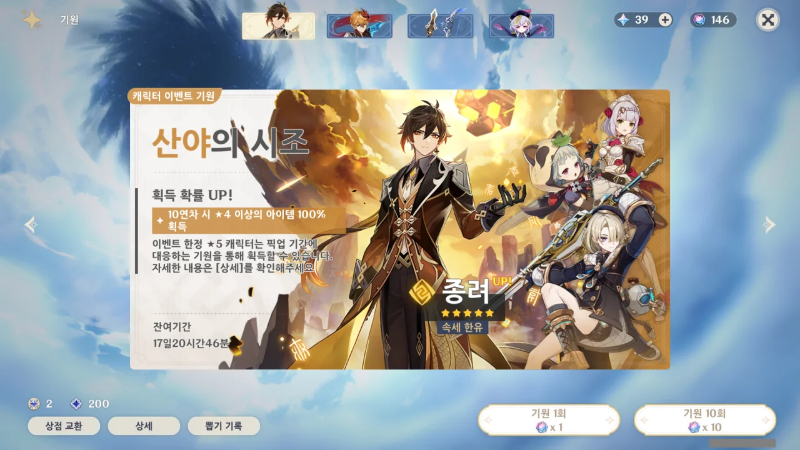
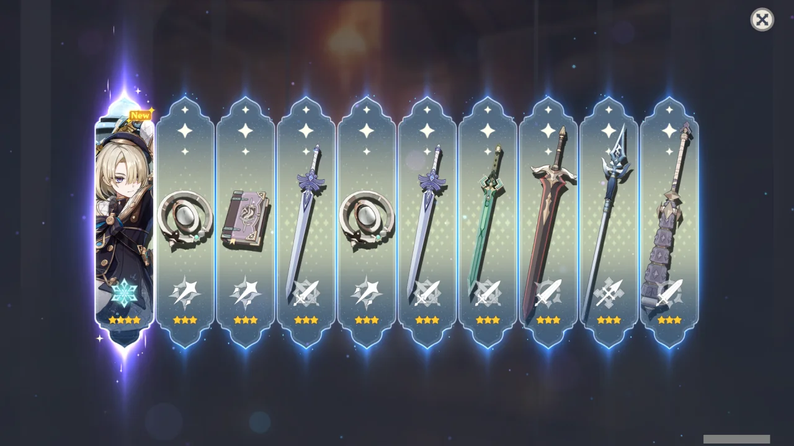
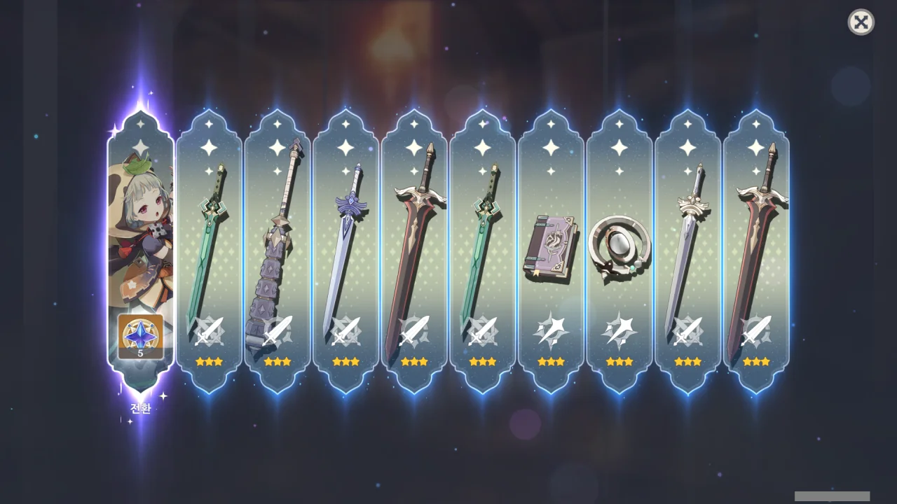
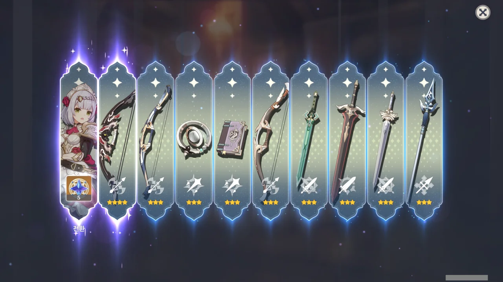
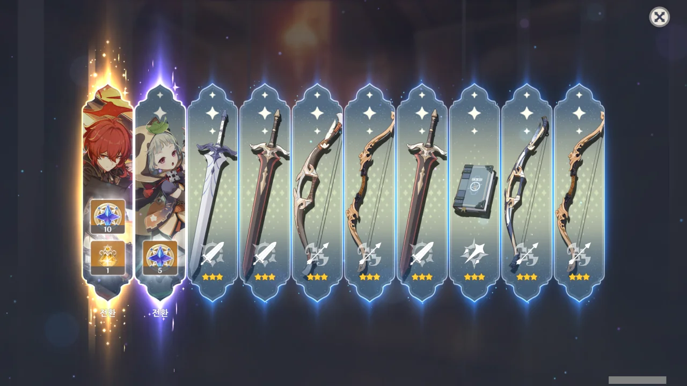
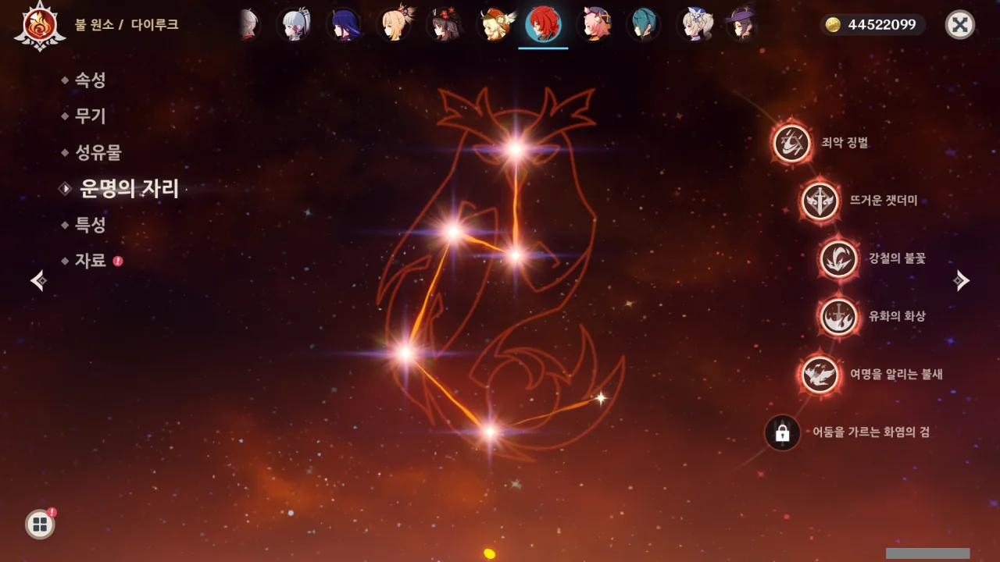
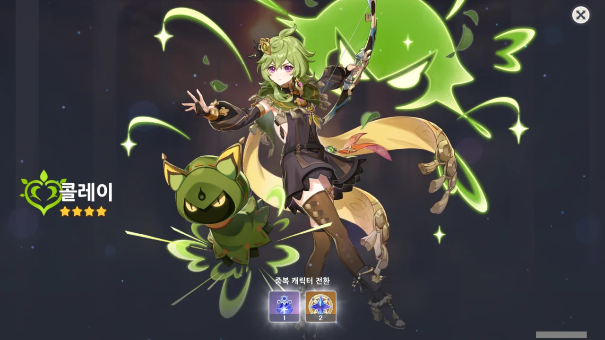

이번 가챠는 종려와 타르탈리아이다.

평소 종려 2돌을 만들고 싶어 했기 때문에, 한번 종려 가챠를 돌려보기로 했다.

다만 나중에 푸리나가 나오면 푸리나를 뽑아야 하기 때문에, 5성이 나오면 곧바로 멈추기로 했다.



10 연차와 20 연차 모두 노엘이 나왔다.

문제는 내 노엘이 이미 6돌이란 거지.

30 연차에는 프레미네가 나왔다. 이건 조금 의외네.



40 연차와 50 연차 모두 노엘이 또 나왔다.

제발 그만 나와...

60 연차에는 사유가 나왔다.

내 사유가 아직 6돌이 아니었던가?

노엘, 제발 그만 나와다오...

ㅋㅋㅋㅋㅋㅋㅋㅋㅋㅋㅋㅋㅋㅋㅋㅋㅋㅋㅋㅋㅋㅋㅋㅋㅋㅋㅋㅋㅋㅋ

다ㅋㅋㅋ이ㅋㅋㅋ루ㅋㅋㅋ크ㅋㅋㅋ

그나마 희망을 가지자면, 다음 가챠에선 무조건 픽업 5성이 나올 거란 정도밖에 없다.

내 다이루크는 5돌이다! 이제 곧 6돌 되겠네!

***

PS. 상시를 돌렸더니 콜레이가 나왔다.
