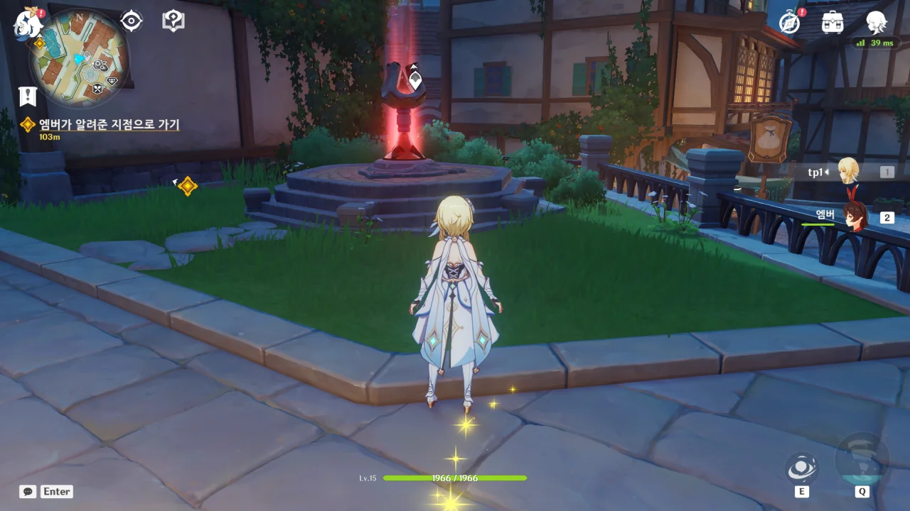
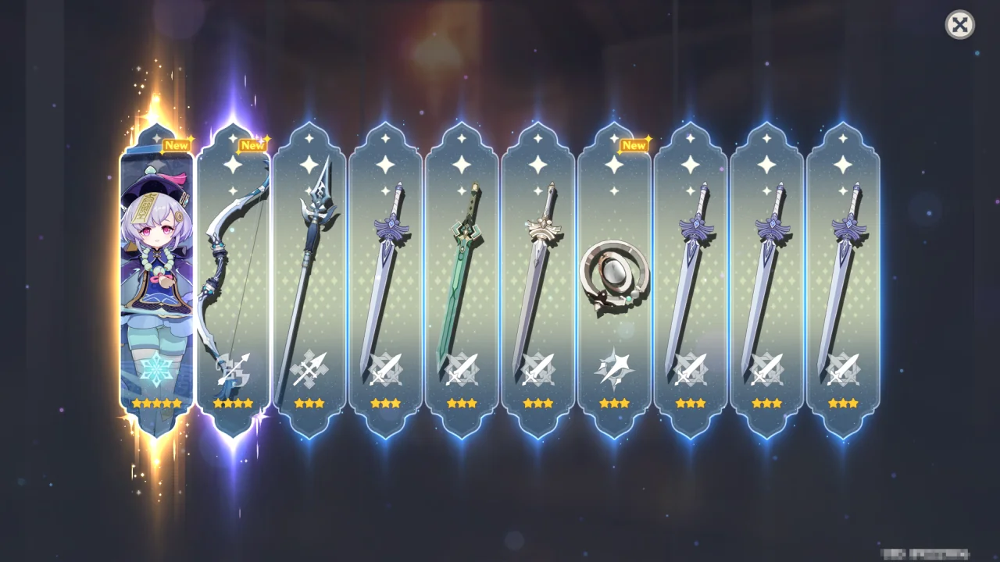

지금껏 원신을 플레이하며 마음 한구석에 담아두고 있는 후회가 하나 있다. 바로 게임을 처음 시작할 때, 남행자를 고른 것이다. 다른 게임에서는 잘만 여자 주인공을 선택했으면서, 왜 원신에서는 남행자를 골랐을까?

컷신에 남행자가 등장할 때마다 그 후회가 자꾸만 수면 밖으로 튀어나왔다.

&nbsp;

블로그를 옮기기 위해 옛날에 작성한 글을 몇 주 동안 보다 보니, 결국 그 불만이 폭발하고 말았다. 더 이상 남행자를 보기 싫다. 더 이상 버틸 수 없다.

지금 쓰고 있는 계정에 지른 돈이 절대 적지 않지만, 이건 매몰 비용이다. 여기에 묶여 앞으로 남행자가 나오는 컷신을 보는 건 나에게 있어 현명한 선택이 아닐 것이다.

&nbsp;

그래서 무한 리세마라를 시작했다. 초기에 주인공 성별을 선택할 때는 무조건 여자로.

주 사용 계정을 완전히 옮길 생각으로 원신 맵스에 있던 모든 핀을 초기화해 기존 계정의 진행도 기록을 날려버렸기 때문에, 이제는 돌아가고 싶어도 돌아갈 수 없게 되었다.

리세마라를 어제 시작했더라면 느비예트 기원에서 느비예트를 뽑는 걸 목표로 했겠지만, 하루 늦은 탓에 기원이 라이오슬리와 벤티 기원으로 바뀌었다.

폰타인 캐릭터인 라이오슬리는 제대로 육성하기 위해서 폰타인까지 가야 하지만, 벤티는 몬드 캐릭터니, 육성이 훨씬 쉽다. 또한 벤티의 E 스킬은 필드 탐사를 수월하게 만든다.

그래서 라이오슬리 대신 벤티를 뽑는 것을 목표로 했다. 원신의 리세마라는 전부 손으로 해야 하니, 다른 쓸만한 5성 캐릭터가 나온다면 일단 적어뒀다가 리세마라를 포기할 때 쓰기로 했다.



이야, 진짜 오랜만이다. 앞으로 리세마라를 하며 수도 없이 볼 장면이기도 하다.



지금 페이몬과는 달리, 초창기 페이몬은 나긋나긋하게 말했구나. 사실 처음 페이몬보다 지금 페이몬이 더 마음에 든다.

> 아... 부럽다. 나도 이렇게 멋지게 싸우고 싶어!

페이몬이 전투 능력이 없다는 건 잘 알고 있었지만, 여행자가 싸우는 모습을 처음 보고 부럽다고 표현한 건 이제 알았네.



페이몬은 마스코트가 아니라 비상식량이다.

난 여기 워프 포인트 옆에 항상 서 있는 우인단 둘이 처음부터 여기에 서 있는 줄 알았다. 그런데 아니네.

원신을 하며 처음으로 치치를 봤다.

해당 계정에서는 다른 5성이 나오지 않았기 때문에, 그냥 기록만 해두고 새 계정을 만들었다.

&nbsp;

그런데 이 글을 쓰다 깨달은 것이, 저 계정 역시 다른 계정처럼 영원히 잊히는 신세가 되었다는 것이다.

저 계정에 다시 로그인하기 위해선, 등록할 때 쓴 임시 이메일 주소로 보내진 번호를 입력해야 한다. 그런데 임시 이메일 계정에 다시 로그인하기 위해 필요한 정보를 적어두는 걸 깜빡한 탓에, 그 번호를 영영 확인할 수 없게 되었다.



몇 시간 동안 리세마라를 한 것인지 기억조차 흐릿해질 무렵, 벤티가 나왔다. 곧바로 계정 정보를 제대로 된 정보로 변경한 후, 초기 설정을 완료했다.

몬드, 리월, 이나즈마, 수메르, 폰타인의 모든 마신 임무와 월드 임무를 또다시 할 생각을 하니 쓴웃음만 나온다. 하지만 여행자로 즐길 수 있다. 그것만으로 충분하다.

&nbsp;

안녕, 3년간의 추억이여. 안녕, 새로운 시작이여.
