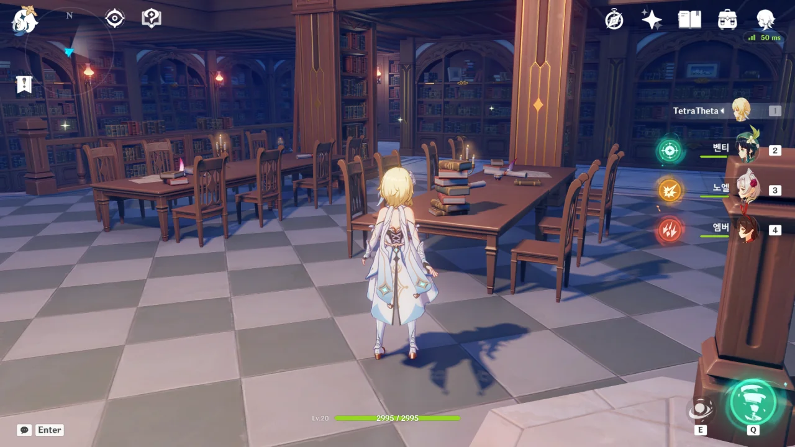

내가 생각이 조금 짧았다.

단순히 네 지역의 마신 임무와 월드 임무만 생각하고, 내가 예전에 했던 곳까지 다시 가는 데 그리 오랜 시간이 필요하지 않으리라 생각했다.

그런데 모험 등급이 내 발목을 잡고 있다. 모험 등급이 너무 안 올라가...

몬드 신상에 이렇게 앉으면 '바람 신의 총아'라는 업적 하나가 깨진다.

이걸 처음 친구에게 들었을 때 '정말? 거짓말하는 거 아니지?'라고 몇 번이고 되물은 기억이 난다.

앰버 전설 임무, '바람, 용기와 날개: 토끼의 장 제1막'을 하면서 본 옛날 벤티의 모습.

그냥 별생각 없이 본다면 모를까, 저 모습이 벤티가 아직 정령일 시절, 인간 친구의 모습임을 생각하면 조금... 징그럽다. 친구가 저세상에서 통곡하겠네.

> 뭐야 이거 나잖아
{.bq}

이유는 모르겠지만, 이런 유치한 장난이 난 좋다.

지금은 「괴조」가 보물 사냥단의 일원임을 알지만, 처음 이 이야기를 들었을 때는 「괴조」에 대한 정보가 전혀 없어, 「괴조」가 독립적으로 활동하는 도둑인 줄 알았다.



아, 폭탄 드랍이 앰버 전설 임무에서 할 수 있는 거였어? 난 클레 전설 임무에서 할 수 있는 건 줄 알고 있었는데...

「괴조」 역시 일반 보물 사냥단 NPC 모델을 돌려쓸 줄 알았는데, 나름 고유 모델이 있었다.

「괴조」가 무슨 준비를 단단히 한 것 같은데, 그를 만나자마자 갈긴 벤티 궁에 「괴조」를 포함한 모든 보물 사냥단 적이 빨려 들어가 곱게 갈려버렸다.

마침 주변에 물이 깔려 있어서 물 원소 대미지도 같이 들어가는 거 같더라고.

아무튼, 앰버 전설 임무가 이렇게 끝났다.

몬드성 다리 건너에는 파헤쳐진 클레의 보물 매장지가 있다. 이게 원래부터 이렇게 파헤쳐져 있었구나...

드발린이 떨어트린 결정 속에는 오염된 힘이 있는데, 그 힘이 신의 눈 사용자 몸속에 있는 원소의 힘과 서로 배척한다고 한다.

난 왜 이걸 이제야 안걸까?

처음 원신을 할 때는 전혀 그런 낌새를 눈치채지 못했는데, 지금 다시 보니 진이 하는 말이 조금 이상하다.

'널 실권은 단 하나도 없고 단지 직책뿐인 명예 기사로 임명할 테니 우리를 도와줘'라고 말하는 것처럼 들리는데, 나만 그렇게 느끼는 걸까?

와! 책이다! 수집 요소다!

이유는 모르겠는데, 이렇게 수집한 책 중 일부는 화면 왼쪽에 나타나는 토스트의 배경이 없다.

버그인 걸까, 아니면 어떤 다른 의미가 있는 걸까?

확실히 이후의 스토리를 알고 게임을 하니, 처음 할 때는 보이지 않았던 것이 보인다.

이 사람, 수메르 아카데미아 학자잖아. 하는 말조차 본인이 수메르에서 왔다는 걸 암시하고 있고.

> 아래에서 같은 차림의 행인을 본 것 같아

페이몬이 말할 때, 벤티가 어디론가 뛰어가는 모습이 나타난다. 이 장면을 잘 곱씹어 보면 벤티가 '날 좀 봐줘'라며 고트 호텔 주변을 계속 뛰어다니고 있었다는 결론이 나온다.

페이몬이 저 말을 하려면 여행자와 대화하기 전, 이미 벤티가 고트 호텔 앞에서 뛰어다니는 걸 봤어야 한다. 그리고 페이몬과 여행자가 대화할 때, 또다시 벤티가 고트 호텔 앞에서 뛰어다니는 모습이 보인다.

그러니까 벤티는 고트 호텔 앞을 최소 두 번이나 뛰어다녔다는 말이다. 이게 '날 좀 봐줘'라며 시위하는 것과 뭐가 다르겠는가?

하여튼 재미있다니까.

분명 조금 전까지만 해도 저기엔 아무도 없었는데... 마지막 발자국을 따라 밟자마자 벤티와 NPC들이 생겨났다.

{}





















{}

> 이건 아주 오래전 태고 시절부터 시작된 이야기야.
> 신들이 아직 살아 숨 쉬고 있을 때 하늘에서 드래곤이 내려와 이 세상에 호기심을 품었어.
> 드래곤은 자신의 답을 찾고자 했지만, 속세의 난잡함은 도저히 이해할 수가 없었지.
> 바람을 노래하는 자가 천공의 하프를 연주하면 하프는 그에게 하나하나 답해줬어.
> 드래곤은 호기심 가득한 아이였어. 아무런 걱정 없이 하늘을 활공했지.
> 그는 노래 가사에 귀를 기울였고 자신의 마음을 만물에 들려주고 싶어 했어.
> 노래하는 자와 드래곤은 전설이 되었고 세상은 암흑시대에 접어들었어.
> 사자의 이빨은 썩고, 매는 더 이상 창공을 가르지 못할 때, 사악한 드래곤 한 마리가 몬드성에 다가왔어.
> 고난은 성당을 뒤덮는 음울한 그림자여라.
> 탄식은 시인의 노래가 되어 울려 퍼졌고, 노래의 부름을 듣고 돌아온 드래곤은 폭풍 속에서 악룡과 사투를 벌였어.
> 천공의 드래곤은 독혈을 마시고 깊은 잠에 빠졌어.
> 오랜 시간이 흐른 뒤에 다시 깨어났지만, 아무도 그를 알아보지 못했지.
> 「인간들이 왜 날 이리도 미워하는 거지?」
> 천공의 하프는 아무런 답을 해주지 않았어.
> 분노와 슬픔, 그리고 생명은 독혈과 함께 눈물로 되어 그의 눈가로 흘러내렸어.
> 노래가 더는 울려 퍼지지 않고, 쉽게 악에 물들게 됐지만, 천공의 하프는 여전히 아무 말도 할 수 없었지.



처음 만날 때부터 벤티는 얄미웠구나.

여행자를 '드발린을 놀라게 해서 도망치게 만든 사람'이라고 기억하는 건 사실이니 어쩔 수 없지만, 드발린과 아는 사이냐고 물어보자 '맞춰봐~'라고 답하는 걸 보면, 머리를 한 대 콱 쥐어박고 싶다.



이상한 녀석 맞아...

자꾸 능청스럽게 여행자가 무슨 말을 하는 건지 모르겠다는 태도를 취하는 벤티.

분명 두 번째 보는 장면일 텐데, 왜 이렇게 새롭지?

난 여태껏 드발린의 눈물이 정화되었다는 사실을 모르고 있었다. 아니, 까먹고 있었다는 게 더 정확하겠지.

이래서 책이든 영화든 몇 번이고 반복해서 봐야 하는가 보다.





벤티가 건네준, 또 다른 드발린의 눈물 결정 역시 정화해 내는 여행자.

아, 위에 있는 페이몬 비교 영상에서 페이몬이 '에?!' 하는 장면이 여기였구나.

대화하다 말고 뜬금없이 "「몬드 건립의 상징」"이란 말만을 남긴 채 어디론가 가버리는 벤티.

... 내 원래 계정의 배낭에도 이 아이템이 있었던가?

다시 보는 원신 마신 임무 이야기는 보면 볼수록 혼란스럽기만 하다. 아니, 분명 한 번 봤던 이야기인데!

난 이 광풍의 핵이 정말 싫다.

3년 전 처음 원신을 할 때는 내 파티 전체를 갈아먹었고, 이번에는 앰버를 회전 회오리 단 한방 만에 저세상으로 사출시켰다.

벤티가 드발린과 대화하려다 방해받는 바람에, 드발린의 저주를 풀긴커녕 되려 「심연」의 독에 당했다고 하기에 "혹시 나 때문에...?"라고 물었다.

너무나도 해맑게 "맞아!"라고 답한 벤티를 보며 벙찐 여행자.
