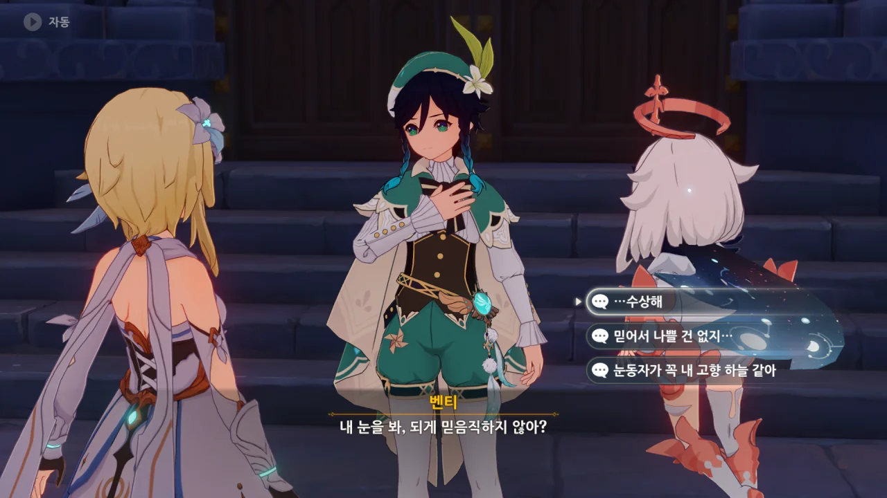
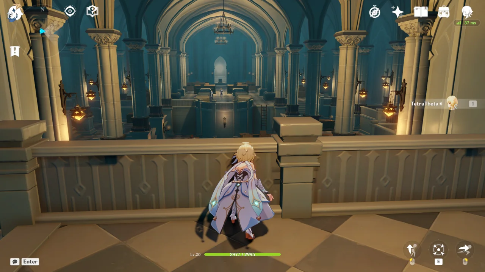
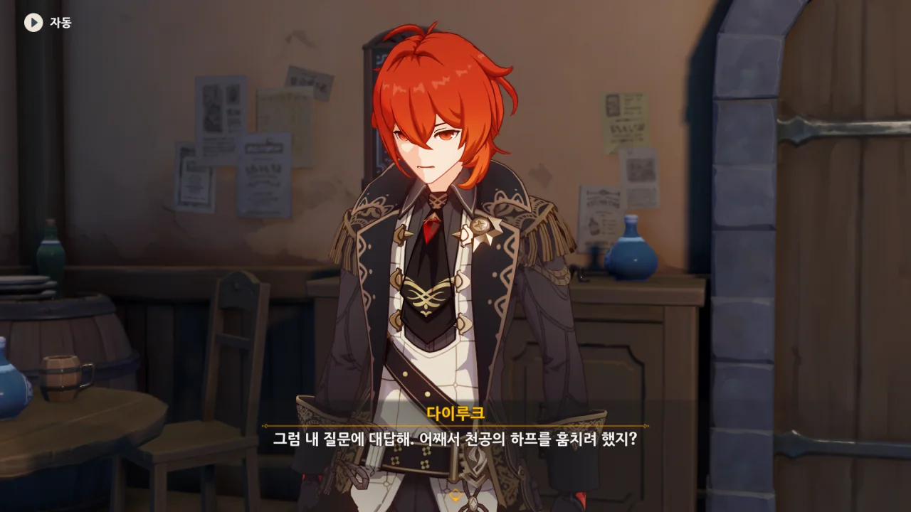
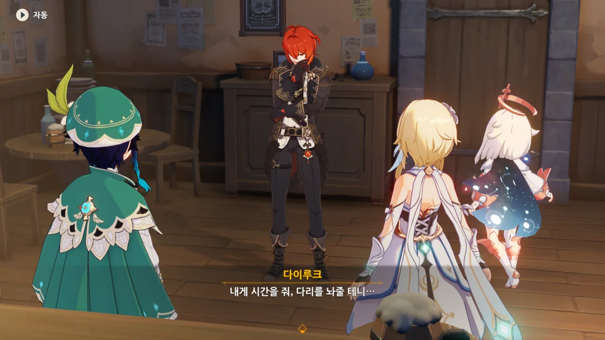
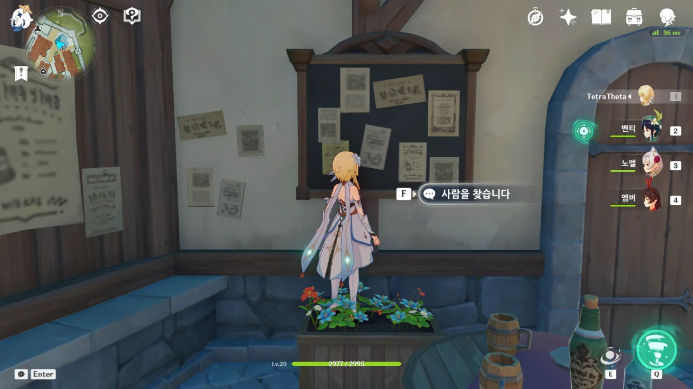

> 내 눈을 봐. 되게 믿음직하지 않아?

전혀 믿음직하지 않다.



드발린을 치유하기 위해, 성당의 유물인 '천공의 하프'가 필요한 상황.

대화로 안 되니 곧바로 훔칠 생각을 하는 벤티. 심지어 자기는 노래 말고 잘하는 게 없다며 여행자더러 천공의 하프를 훔치라고 한다.

이 부분을 한 번 더 플레이하고 느낀 것이 하나 있다. 난 잠입 액션에 전혀 맞지 않는 사람이다.

돌이켜 생각해 보니, 다른 게임을 할 때도 마찬가지였다. 항상 적에게 들켜, 경보가 울리고, 보이는 모든 적을 죽여야 했었지... 아무튼 목격자만 없으면 잠입 아닌가.

하지만 다른 무엇보다 더 약 오르는 것이 하나 있다. 바로 여기에도 상자가 있다는 것이다. 심지어 상자의 위치조차 경비병들이 대놓고 보고 있는 곳이기에, 경비병들의 눈을 피해 돌아다녀야 하는 여행자에게 있어 여기 있는 6개의 모든 상자를 먹는 건 불가능에 가깝다.



최대한 사람들의 주목을 끌어모아야 할 음유시인이 사람의 눈길이 닿지 않는 곳을 찾자, 대번에 의심하는 다이루크.



> 팔 수도 없는 물건을 훔칠 바엔 차라리 내 술 저장실을 털고 말지.

다이루크가 '좀도둑'을 찾아 천사의 몫까지 온 경비병들을 다른 곳으로 보내며 하는 말이 정말 대단하다. 팔 수도 없는 천공의 하프보다 자기 술 저장실의 술이 더 가치 있다는 말 아냐.

그나저나 천공의 하프가 바르바토스가 직접 연주했던 악기였구나. 진짜 원신 스토리를 다시 보면 볼수록 '왜 내가 이걸 이제야 알게 된 거지?'라는 생각을 멈출 수 없다.



벤티 이놈은 대뜸 술부터 찾고 있다. 





> 내가 처음 술을 마셨을 때 당신은 ---

이거 분명, '내가 처음 술을 마셨을 때 당신은 아직 태어나지도 않았다'라고 말하려던 거 맞지?

벤티가 저래 보여도 꽤 오래전부터 살아온 마신 중 하나니까.





다이루크와 천사의 몫 사장의 관계는 회사 사장과 직영점 점장 관계라고 할 수 있다.

다이루크를 그저 "아주 유명한 사람이야"라고 소개한 후 붙이는 사족이 더 긴 걸 보면, 정말 벤티는 술 없이는 못 사는 성격인가 보다.



진짜 천공의 하프를 훔쳐서 이렇게 쫓기는 거였으면 차라리 덜 억울했을 거다.

아니, 우인단 번개 치친 술사가 내 눈앞에서 '약 오르지롱~'하면서 천공의 하프를 훔쳐 갔다니까요?



> 페이몬: 우리가 훔친 게 아냐! 이건 오해야.

페이몬은 거짓말을 하지 않았다.

> 벤티: 이런 사람이 왜 몬드의 성물을 훔치려 하겠어?

이 녀석, 입만 열면 아주 거짓말이 술술 나와요... 심지어 그거, 네가 시킨 거잖아!



> 그저 연주 한번 들어준 관계라고 할 수 있죠

벤티와 선을 바로 그어버리는 여행자 ㅋㅋㅋㅋㅋㅋ





모두가 알다시피, 다이루크는 페보니우스 기사단에 매우 유감이 많다.

그래, 이 질문을 언제 하나 계속 궁금해했다.



벤티가 "기사단과 관련된 성가신 일에 말려들 수 있다"라고 겁을 줘도 "나야말로 기사단에 성가신 존재"라며 일축한다.

다이루크의 또 다른 정체인 '다크 히어로'를 생각해 보면, 참으로 적절하다.



> 보수는 5모라부터 천공의 하프야. 내용에 따라 정하지.

그러니까 벤티가 헛소리하는 것 같으면 곧바로 경비대에 넘겨버리겠다는 말이다.

심지어 설사 여행자와 벤티가 천공의 하프를 훔쳤어도 그건 이미 자기 손에 들어온 거나 마찬가지라고 말하는 것이기도 하다.

엄청난 자신감!



맨 처음에 거대 신상 앞에서 했던 노래를 또다시 부르는 벤티.

그 컷신을 또 보지 않는 건 환영이지만, 노래를 줄여도 좀 많이 줄이는 것 같다.



대체 다이루크는 왜 저 이야기를 '중요한 비밀'로 생각한 걸까? 내가 보기엔 그냥 과거 이야기일 뿐인데 말이다.

원신을 처음 할 때도, 지금도 다이루크가 말한 저 "다리를 놔줄 테니"라는 말이 무슨 의미인지 잘 모르겠다. 대체 누구와 다리를 놔준다는 거지?



여행자에 대해선 수배 전단에 그저 '금발'이라고만 나와 있어 행동이 자유롭지만, 벤티는 워낙 눈에 튀는 옷차림이라 일이 어느 정도 풀리기 전까진 계속 천사의 몫에 갇혀 있어야만 한다.

그런데 벤티는 좋아하더라. 술을 잔뜩 마실 수 있을 거로 생각하는 모양이지.

이 '사람을 찾습니다' 쪽지는 의외로 몬드 스토리 초반부터 붙어 있었다.

앰버가 일이 어느 정도 정리된 후 가족을 찾는 걸 돕겠다고 했는데, 여행자와 헤어지고 난 후 곧바로 몬드성 곳곳에 쪽지를 붙인 모양이다.
