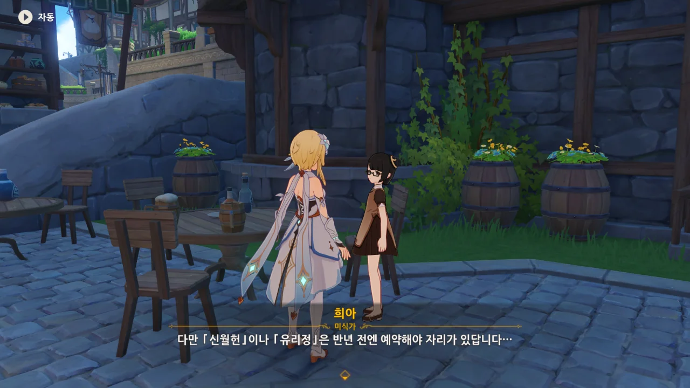
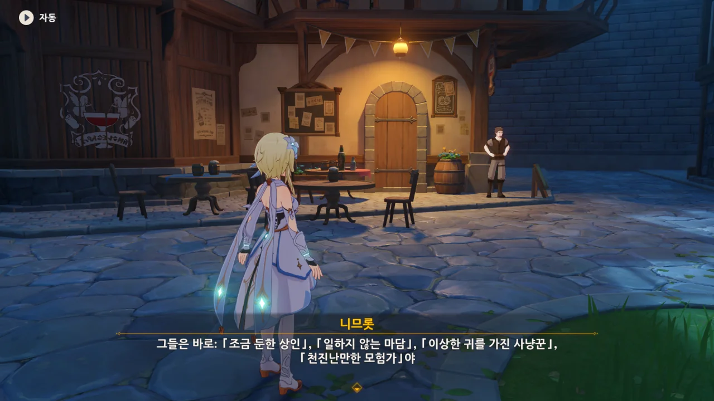

음... 어째 게임을 하며 '어머, 이건 찍어야 해!'라고 생각하며 사진을 찍는 것이 점점 빈번해지고 있다. 이러다간 기타 카테고리가 아니라 마신 임무 카테고리로 분류해야 할 것 같은데...

그만큼 몬드 마신 임무에서 '새롭게' 알게 된 것이 많다는 의미일 것이다.





수메르 사람뿐만 아니라 리월 사람도 몬드에 있었구나.

자칭 미식가, 희아에게서 리월의 양대 요리에 대한 정보를 얻을 수 있었다.

> **리 요리**: 「산속의 식자재」를 주로 사용해 만든, 기름지고 빛깔이 짙으며, 다양한 맛을 특색으로 가진 요리. 「유리정」이 리 요리의 대표 주자.
> **월 요리**: 해산물을 주로 사용해 만든, 담백하고 신선한 요리. 「신월헌」이 월 요리의 대표 주자.
{.bq}

잘 보면 「유리정」과 「신월헌」의 이름에는 각각 '리'와 '월' 글자가 들어가 있다.

「디어 헌터」에서 요리 레시피를 사려했으나, 모험 등급이 20이나 되어야 요리 레시피를 살 수 있다.



처음 이 봉인을 봤을 때, 대체 누가 여기에 이런 봉인을 설치해 둔 건지 정말 궁금해했었지...

지금도 모른다. 그냥 누군가가 설치해 둔 봉인을 나중에 모나가 풀게 되고, 그 보답으로 저 집에 싼 월세로 살 수 있게 되었다는 정도만 알고 있다.

캣테일 술집은 분명 3.3 버전에서 일곱 성인의 소환을 위해 진입할 수 있는 지역으로 변경되었지만, 아직 모험 등급이 모자란 모양인지 들어갈 수 없다.

ㅋㅋㅋㅋㅋㅋㅋㅋㅋㅋㅋㅋㅋㅋㅋㅋㅋㅋㅋㅋ

니므롯과 대화하다가 니므롯이 갑자기 뾱 하고 사라져 버렸다. 그런데 정작 대화는 끊어지지 않고 계속 진행할 수 있어, 여행자가 허공에 대고 대화하는 모양새가 되어버렸다.

이게 대체 뭐야 ㅋㅋㅋㅋㅋㅋㅋㅋㅋㅋㅋㅋㅋㅋㅋㅋㅋㅋㅋㅋ

워프 포인트 옆, 미하일과 류드밀라는 저렇게 계속 서 있기만 하고, 아무런 말도 하지 않는다.

원래 마신 임무 진행도에 따라 저 둘이 하는 대화가 달라졌던 거로 아는데, 아직은 그때가 아닌가 보다.

천사의 몫이 문을 닫은 후 들어가자, 진이 있었다. 순간 다이루크가 배신한 줄 알았다.



다이루크는 벤티와 여행자를 내보낸 후, 진에게 곧바로 연락한 모양이다. 뭐... 그게 맞는 말이긴 하지...

다행인 점은 진 역시 공식적인 입장으로 여기에 온 것이 아니라는 점이다. 그러니까 체포될 염려는 없겠지, 아마?



나도 진이 여기에 있는 걸 보고 굉장히 놀랐다.

나중에 진, 다이루크와 함께 움직인다는 건 예전 기억으로 알고 있었지만, 여기서 이렇게 만날 줄은 몰랐다고.



> 뭐 이미 선을 넘어버린 것 같지만...

그러게...





아까 다이루크가 진에 관해 이야기할 때, "네가 명예 기사라 해도 가까이서 직접 볼 수 있는 사람이 아니다"라고 한 것을 생각해 볼 때, 다이루크는 진과 여행자가 이미 면식이 있는 사이인 걸 전혀 몰랐던 모양이다.

진이 여행자와 벤티의 말을 단번에 믿어버리자, 말하다 말고 "... 응?"이라고 되묻는다.

다이루크가 당황하는 몇 안 되는 장면이지 않던가, 이게?

그나저나 '고집스러운 진 단장'이라니... 진, 고집이 센 성격이었구나. 그러니 모든 일을 도맡아 처리하다 과로로 쓰러지지...



듣고 보니 그렇네. 벤티의 황당하다면 황당한 이야기가 현재 몬드의 사신수 중 하나인 드발린이 난데없이 몬드를 공격하는 이유를 설명할 수 있으니 말이다.

그런데 두린의 침공이 몇 년 전 있었던 일이라고? 난 몇백 년 전의 일로 알고 있었는데?

&nbsp;

어디서 들은 이야기인진 잘 기억나지 않지만, 두린은 정말 순수한 의도로 몬드에 놀러 왔다가, 드발린에게 죽임을 당한 것이라고 한다. 심지어 두린은 죽을 때조차 '저들과 다른 시간, 다른 장소에서 만나 노래하고 춤을 췄다면 얼마나 좋았을까'라고 생각하며 죽었다고 한다.

씁쓸한 이야기지.



우인단 때문에 페보니우스 기사단은 공개적으로 드발린을 두둔할 수 없는 상황. 그래서 비공식적으로 움직여야 한다고 한다.



물론, 기사단을 '일 처리가 아주 비효율적이다'라며 까대던 다이루크는 진의 말을 듣고 "이래서 기사단이 싫다니까"라고 말한다.



선배? 다이루크가 진의 선배라고? 난 왜 이걸 처음 듣는 거 같지?

그러고 보니 다이루크가 페보니우스 기사단에 있다가 기사단에 환멸을 느껴 기사단을 나왔다고 했었지...



진이 다이루크를 선배라고 부른 걸 물고 늘어지자, 둘 다 아무 말도 하지 않는다.

큿, 괜히 무안해지게...



진은 우인단이 바람 신이 남긴 힘을 노리고 있다고 보고 있다. 그 작업을 수월하게 하기 위해 기사단에 몬드성의 방위를 넘기라고 한 건가?



드발린을 죽이려는 시도가 기사단의 반발로 차단되었으니, 천공의 하프를 훔치는 것이 바람 신이 남긴 힘을 얻을, 남은 수단이라고 하는 진.



다이루크가 말하는 걸 들어보면, 천공의 하프의 현재 위치를 알아내기 위해 우인단을 납치한 후, 심문한 것 같다. 물론 조금의 고문도 곁들였겠지?



아무리 몬드의 사신수를 기사단 앞에서 대놓고 죽이겠다고 할 정도로 간 큰 우인단이라지만, 훔친 천공의 하프를 몬드성 안에 보관하는 게 미친 짓이라는 건 잘 알고 있는 모양이다.





벤티는 우인단이 천공의 하프를 훔쳐 간 것이 「바람」의 연계를 통해 바람의 신의 현재 위치를 알아내려는 목적일 것이라고 말한다.

뭐야, 그러면 이 모든 걸 처음부터 알고 있었단 거야?



아, 물론 그 주장에 대한 근거는 밝힐 수 없다고 한다.

뭐, 그야 여기서 자길 바르바토스라고 밝힐 수는 없을 테니...



여행자에게 위장용 가면을 건네는 다이루크.



괜한 말썽을 일으킬 수 있으니, 신분을 숨기라고 한다.

그런데 나중 가면, 우인단도 가면 쓴 여행자를 알아보더라고. '그런 단순한 가면으로 우릴 속일 수 있을 줄 알았냐'라면서 말이야...
