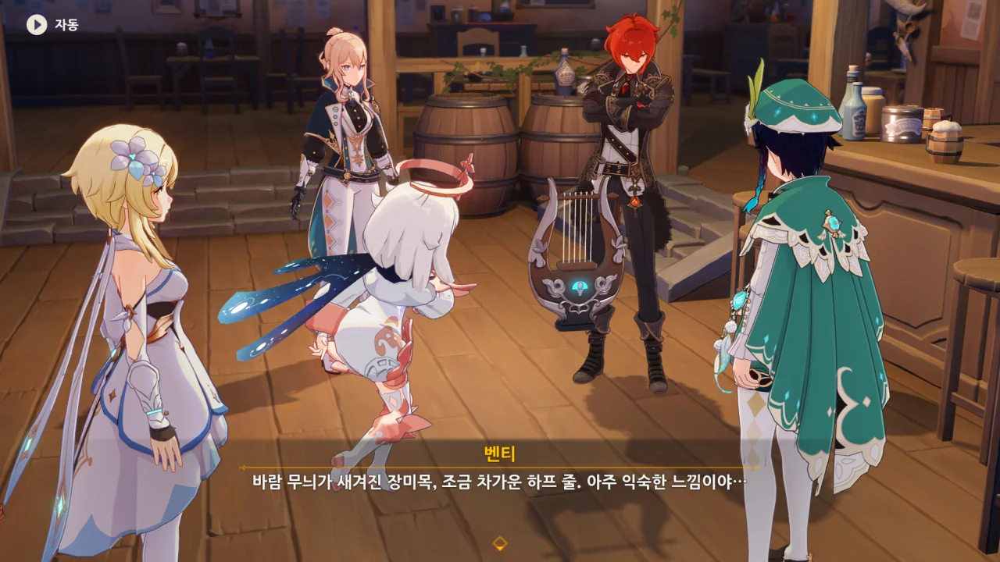
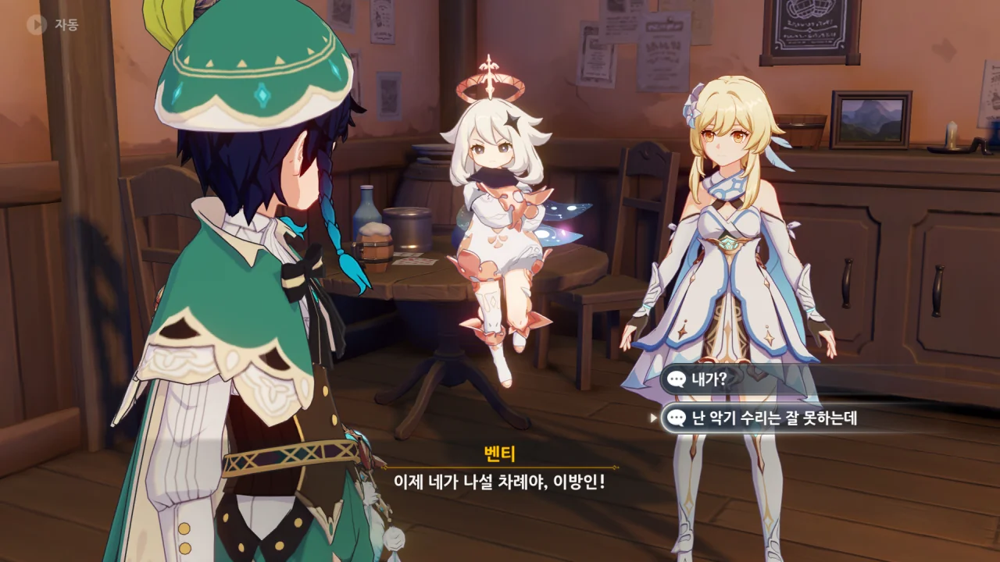
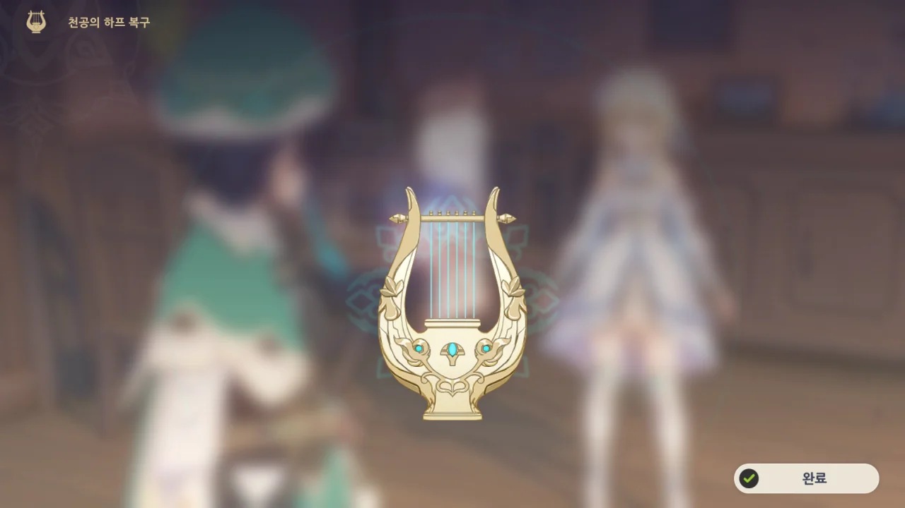
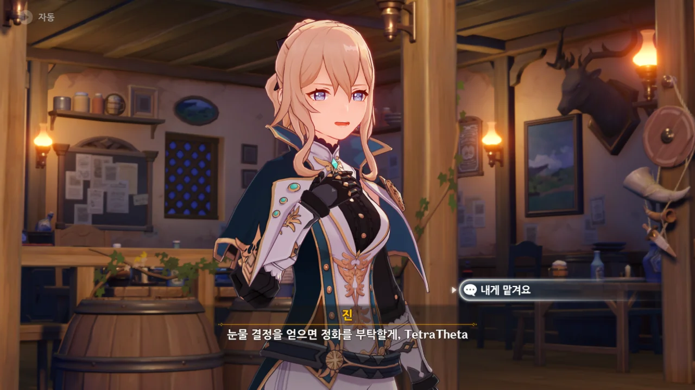
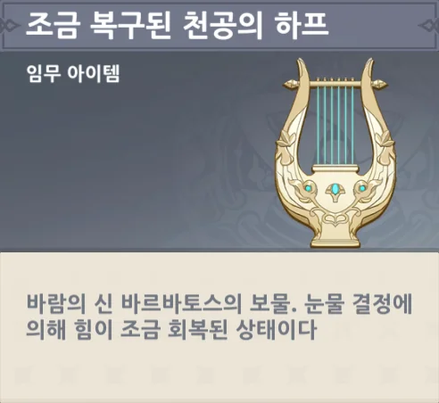



여행자와 다이루크가 가면을 쓰고 있다. 다른 캐릭터들 역시 가면을 쓰고 있나 확인해 봤는데, 여행자와 다이루크만 가면을 쓰고 있더라.



우인단 집행관 서열 8위, 「시뇨라」는 얼마 지나지 않아 이나즈마에서 잿더미가 될 예정입니다. 이 점 참고하시기를 바랍니다.



> 너희들의 말로를 보고 만든 시인의 노래는 몬드 아이들의 잠 못 이루는 악몽이 되겠지...

구질구질하게 도망칠 때조차 시적인 표현을 남기는 우인단 채무 처리인.

설마 우인단 기본 소양에는 문학도 포함된 걸까?

> 천공의 하프
> ***
> 바람의 신 바르바토스의 보물이었으나, 현재는 '바람'의 힘이 모두 사라졌다.
{.block-quote}

아니나 다를까, 그냥 지나치기 쉬운 임무 아이템 플레이버 텍스트에도 신경을 썼다.

왜 "아주 익숙한 느낌이야..."라는 대사가 "아아, 이 서늘하고도 묵직한 감각. 2년 만이구만."라고 들리는 걸까?



한국어 더빙도 나쁘지 않지만, 역시 일본어 더빙이 이 부분에 있어서는 최고지.

위키를 뒤적이다 발견한 [에헷떼난다요 리믹스](https://youtu.be/bIPZcwDTa30?t=101)가 아주 죽여주더라.



아니, 왜 갑자기 여행자더러 악기를 수리하라는 거지? 이거, 네가 쓰던 거잖아.



정화된 드발린의 눈물 결정을 하프 위에 조금씩 떨어트려 보라고 한다.

이건 할 때마다 헷갈리더라. 눈물 결정을 길게 누르고 있는 게 아니라, 그냥 더블 클릭하면 된다.

더블 클릭 말고 길게 누르고 있거나 드래그해도 아무런 변화가 없어서 마지막으로 더블 클릭을 시도하니 되는 걸 보니 헛웃음이 나오더라.



드발린의 눈물 결정에 있던 바람 원소 덕분에 하프에 있던 「바람」 원소가 완전히 사라지지 않았다고 한다.

드발린의 눈물이 더 필요하다고? 드발린을 몇 대 더 때려주면 아파서 눈물을 흘리지 않을까?



그리고 여행자는 쓰레기가 되었다.

우우, 쓰레기~

드발린의 눈물 결정 정화는 여행자가 맡게 되었다. 여행자 말고 할 수 있는 사람이 없기도 하고.



벤티 이 녀석은 여기서 또 놀고먹으려고 하네. 야, 너도 같이 가면 좀 덧나냐?



그래서 벤티는 「각설이」가 되었다.

작년에 왔던 각설이, 죽지도 않고 또 왔소~

&nbsp;

{}









{}

동풍의 용 유적지에서 누군가가 훔쳐 간 보물인, 바람 신의 「기운」을 담은 작은 병을 다이루크와 우인단이 동시에 노렸고, 서로 간의 돈지랄이 시작되었다.

우인단은 모조품을 수천 점 만들어 세계 각지의 시장에 풀었고, 다이루크는 그걸 전부 다 사들이는 것으로 대응했다.

결국 다이루크도, 우인단도 진짜 병을 지금까지 찾지 못하고 있다. 페이몬 말처럼 둘 다 제정신이 아니라니까.

우인단이 얼마나 모조품을 만들어 냈는지, 다이루크에게 20개나 가져다줘야 겨우 맥주 한 잔과 바꿀 수 있다고 한다.

드발린의 눈물을 떨어트리자, 천공의 하프가 '조금 복구'되었다.

> 조금 복구된 천공의 하프
> ***
> 바람의 신 바르바토스의 보물. 눈물 결정에 의해 힘이 조금 회복된 상태이다.
{.block-quote}
