보통 글 하나에 쓰는 사진 개수가 약 50장 정도 되는데, 이번 시리즈는 어째 그 개수가 들쑥날쑥하다. 어떨 때는 60장 정도가 되고, 어떨 때는 고작 38장밖에 되지 않는다.

사이트 용량 때문에 글 하나에 가능한 한 많은 사진을 넣고 싶지만, 이야기의 흐름 때문에 그럴 수가 없다.

좋은 수가 없을까?



우인단이 다이루크를 「반갑지 않은 사람」이라고 선포했다고 한다.

&nbsp;

외교 용어 중, 'Persona non Grata(페르소나 논 그라타)'라는 용어가 있다. 직역하면 '환영받지 못하는 사람'이라는 뜻인데, 적당히 의역하면 '외교적 기피인물'이라는 뜻이 된다.

비엔나 협약에 의거, 해당 외교관을 파견한 국가는 최대한 빨리 해당 인물을 본국으로 소환하여야 한다. 이를 지체할 시, 상대 국가가 해당 외교관을 더 이상 외교관으로 간주하지 않을 수 있고, 그 사람은 불법체류자 신세가 되어 체포 혹은 추방 대상이 될 수 있다.

다만 기피인물 지정은 그 국가와의 외교를 단번에 험악하게 만들며, 그 국가에 파견한 자국 외교관 역시 기피인물로 지정되어 추방당할 수 있기에 되도록 피한다고 한다.

&nbsp;

그러니까 다이루크는 스네즈나야, 혹은 우인단에게 있어 '환영받지 못하는 사람'이 된 것으로 보인다.

거기에 대해 다이루크는 "그들이 누군가를 「반가운 사람」이라고 선포한 적도 없잖아"라며 시큰둥하게 넘겨버린다.

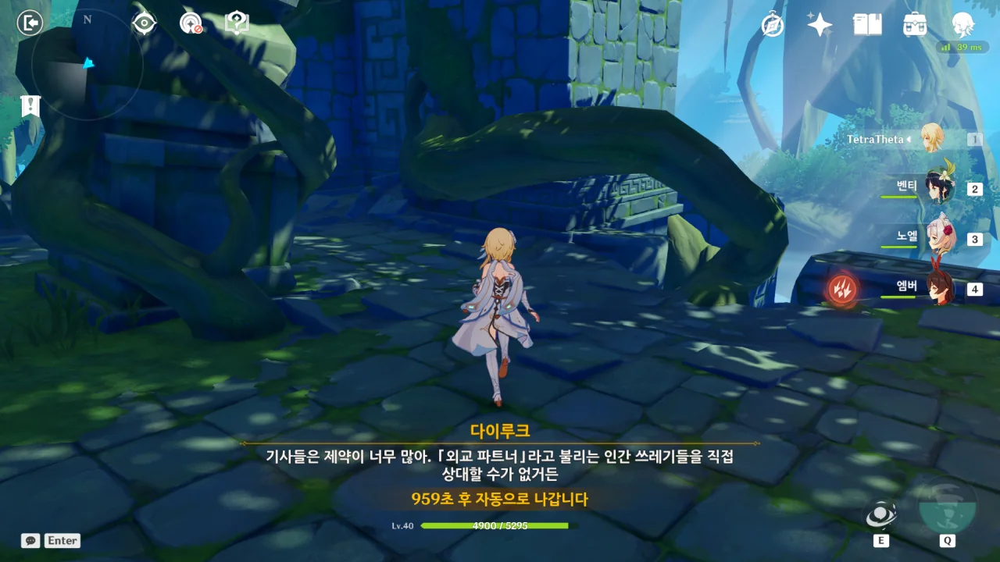

> 「외교 파트너」라고 불리는 인간쓰레기

ㅋㅋㅋㅋㅋㅋ 다이루크, 너무 표현이 직설적인 거 아냐? ㅋㅋㅋㅋㅋㅋ 뭐, 우인단이 쓰레기이긴 하지.



> 나보고 「슬라임 삼키기」와 「우인단 가입」 중에 하나를 고르라면 하늘에서 떨어진 운석을 맞고 땅에 박혀 죽는 걸 택하겠어.

아무리 봐도 저 '하늘에서 떨어진 운석을 맞고' 부분이 리월의 '돌을 먹는 형벌'을 떠올리게 한다.

음... 「드발린 보호 협회」... 이게 맞나? 아니, 맞는 표현이긴 한데...



이곳저곳에서 긁어모은 드발린의 눈물 결정을 정화한다.



> 재미있군. 술을 거를 때처럼 기분이 상쾌해.

와이너리 사장이라서 그런가, 비유를 해도 술에 비유하네.

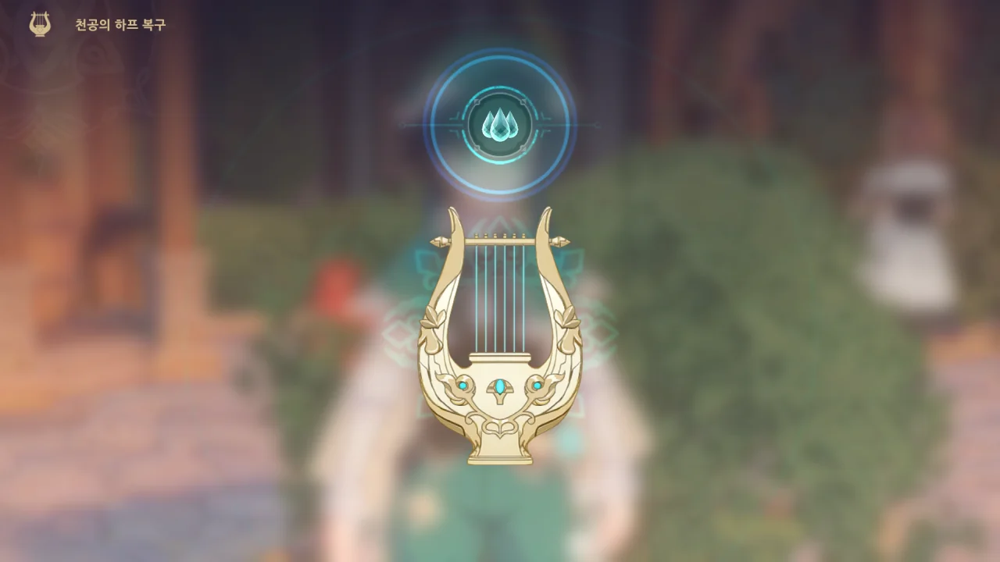

저번처럼 눈물 결정을 더블 클릭해, 하프에 떨어트린다.

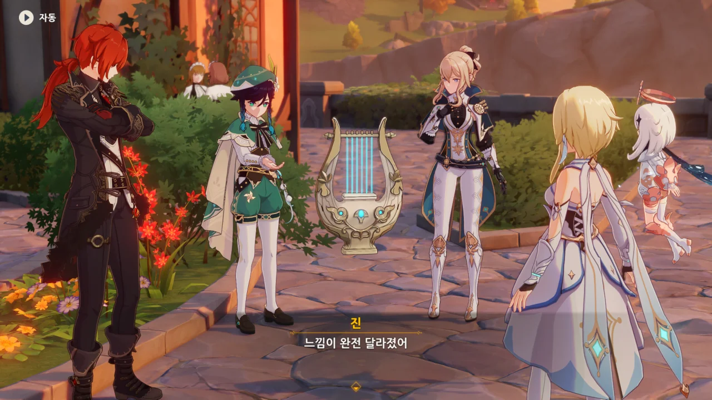

그런가? 난 전혀 모르겠는데.

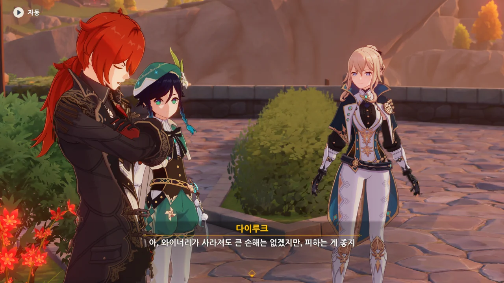

> 아, 와이너리가 사라져도 큰 손해는 없겠지만, 피하는 게 좋지.

대체 다이루크는 얼마나 부자인 거야? 와이너리 사업이 주된 수입원 아니었어?

드발린을 부를 장소에 대해 토의하던 중, 와이너리에 드발린을 부르면 와이너리가 무너질 것이라는 말에 '와이너리쯤이야'라고 말하는 다이루크다.

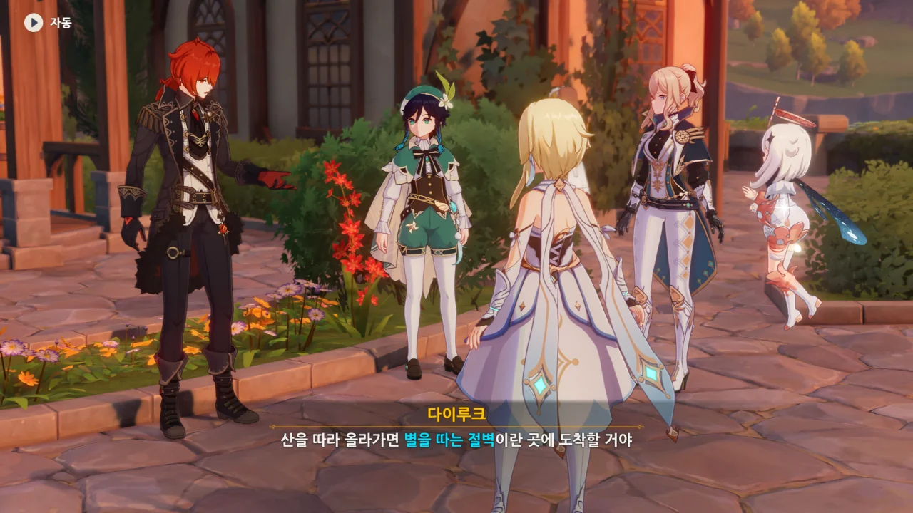

드발린을 부를 장소는 '별을 따는 절벽'으로 정해졌다.



벤티 이 자식이? 야, 겉보기에는 너랑 나랑 거기서 거기야, 이 녀석아.

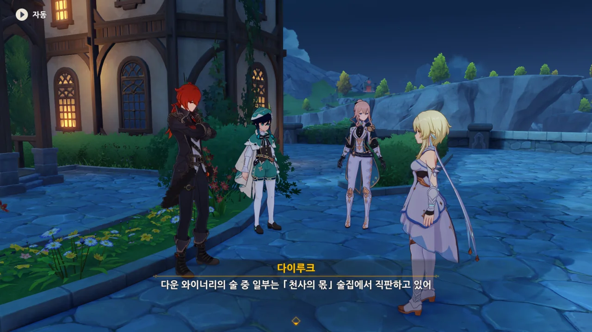

예상했던 바지만, 「천사의 몫」에서 다운 와이너리의 술을 파는 것이었다.

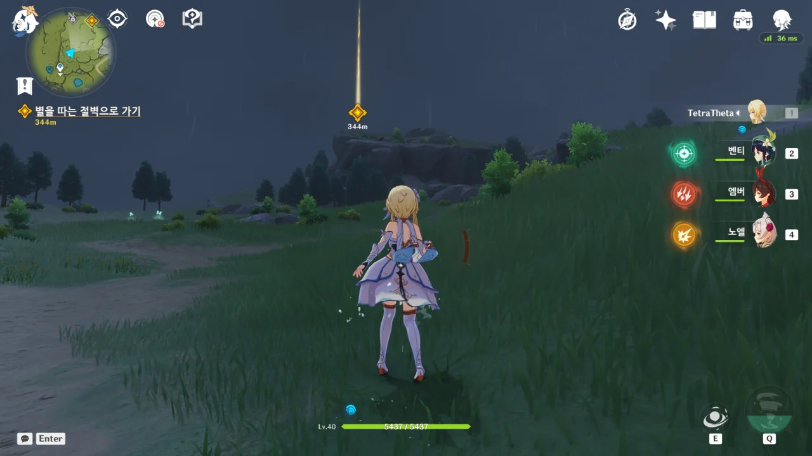

아오, 정말 더럽게 머네. 게다가 비까지 추적추적 내리고 있다.

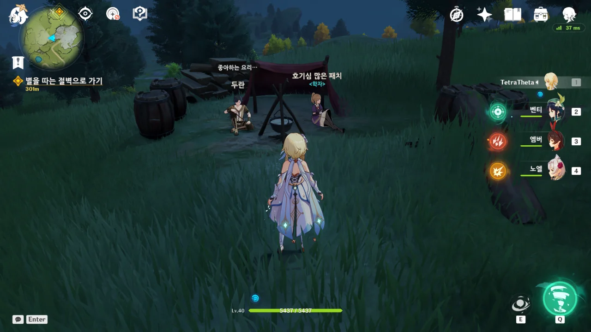

이 둘, 비가 오는데 텐트 밖에서 느긋하게 앉아있다. 뭐지, 텐트는 장식이란 건가?



벤티가 별을 따는 절벽에서 드발린을 부른다.

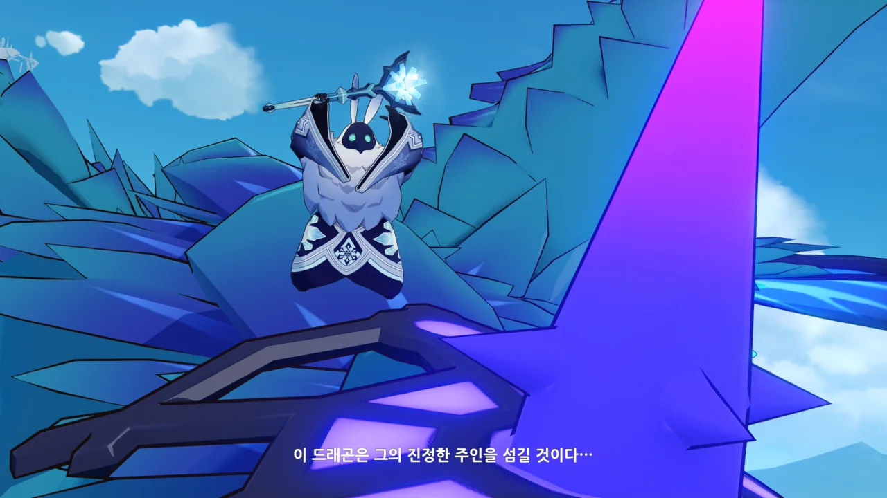

당연히 잘 될 리가 없다.

심연 메이지가 천공의 하프를 공격해 망가트리고 드발린의 귀에 나쁜 말을 속삭인다.

아오, 저 란란루.



드발린이 벤티를 바르바토스라고 부른 탓에, 벤티의 진짜 정체가 드러나 버렸다.

그래도 자길 여전히 벤티라고 불러줘서 고맙다고 한다.



컷신에서도 봤듯이, 천공의 하프는 이미 망가질 대로 망가져, 더 이상 악기 노릇을 할 수 없게 되었다.





다이루크가 자신의 정보망을 이용해 심연 교단을 찾겠다고 한다.





야, 너 정말 오랜만이다. ㅋㅋㅋㅋㅋㅋ

이제서야 안 건데, 심연 행자의 속성은 무속성인 흰색이다. 아마 여행자 역시 바람 신상을 만지기 전까진 속성이 무속성이었을 거다.

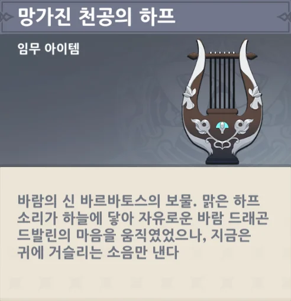

> 망가진 천공의 하프
> ***
> 바람의 신 바르바토스의 보물. 맑은 하프 소리가 하늘에 닿아 자유로운 바람 드래곤 드발린의 마음을 움직였었으나, 지금은 귀에 거슬리는 소음만 낸다.
{.bq}

완전히 복구된 천공의 하프 사진도 찍어둘 걸 그랬다. 아쉬운 대로 플레이버 텍스트를 찾았다.

> 완벽하게 복구된 천공의 하프
> ***
> 바람의 신 바르바토스의 보물. 원소의 힘으로 가득하다. 어쩌면 이걸로 바람 드래곤 드발린을 부를 수 있을지도 모른다.
{.bq}

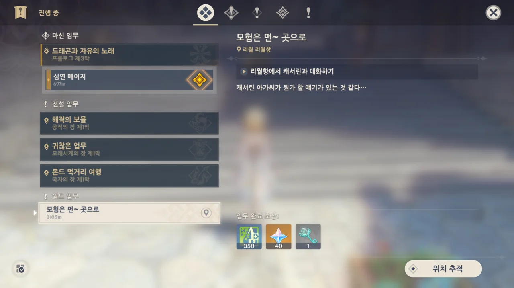

아니, 벌써 여행자를 리월로 보낸다고? 아직 몬드 스토리도 덜 끝났는데?

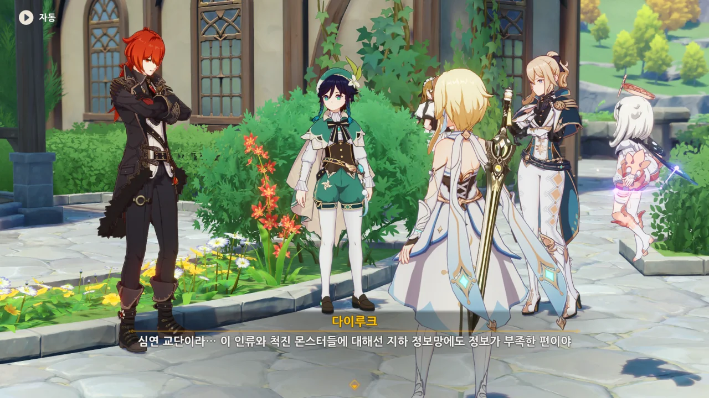

다시 만난 다이루크. 다이루크의 지하 정보망에도 심연 교단에 대한 정보는 별로 없는 모양이다.

뭐, 지금까지 밝혀진 심연 교단에 대한 정보도 직접적인 언급보다는 정황상 추측에 기반한 것이 많으니, 이런 건 어쩔 수 없겠지.





사실 일곱 신은 집정관에 불과하며, 신의 직책을 수행해야만 신력을 쌓을 수 있다. 하지만 오랜 기간 몬드를 방치에 가깝게 내버려 둔 벤티는 신력이 거의 없다시피 한지라, 드발린의 문제를 해결하기 위해선 인간의 힘을 빌려야 한다.

&nbsp;

하지만 썩어도 준치라고, 벤티 역시 지금껏 세대교체를 겪지 않은 신 중 하나라, 저 말이 정말인지는 잘 모르겠다.

일단 전성기 때의 바르바토스는 모락스 급의 위력을 지녔던 것으로 생각된다.  
항상 건조하고 깎아지른 절벽만이 가득한 설원 지대에 계절풍을 일으키고 땅을 깎아 지금의 온화한 기후의 몬드를 만든 게 바르바토스니 말이다. 그가 거대한 설산을 깎아 만든 게 지금의 머스크 암초이고, 금사과 제도 역시 벤티가 산을 깎아 바다에 던진 흔적이니 말이다.

게다가 현재 진행 중인 원신 이야기 곳곳에서 나오는 벤티의 능력을 생각해 볼 때, 정말 벤티가 신력을 잃은 게 맞긴 하였는지조차 의문이다.

* 드발린과 대치 중인 여행자와 페이몬의 머릿속에 말을 걸고 바람의 힘을 주어 드발린과 맞서 싸울 수 있게 해줌
* 모나가 점성술로 벤티의 운명을 몰래 점치려 하자, 강풍을 보내 포기하게 만듦
* 스탠리 앞에 정체를 드러내 그의 고뇌를 덜어주고, 기억을 지운 후 진짜 스탠리의 영혼을 성불시킴
* 업장에 미쳐버리기 직전인 소의 업장을 여러 번 피리 소리로 가라앉혀 진정시킴

이게 전부 원신 내에서 직접적으로 언급된 '벤티'의 능력이다.

&nbsp;

진짜 페이몬 말처럼, 집정관 일을 맡기 싫어서 몬드를 방관하고, 정말 필요할 때만 개입했다고 보는 게 더 맞는 말처럼 보인다.

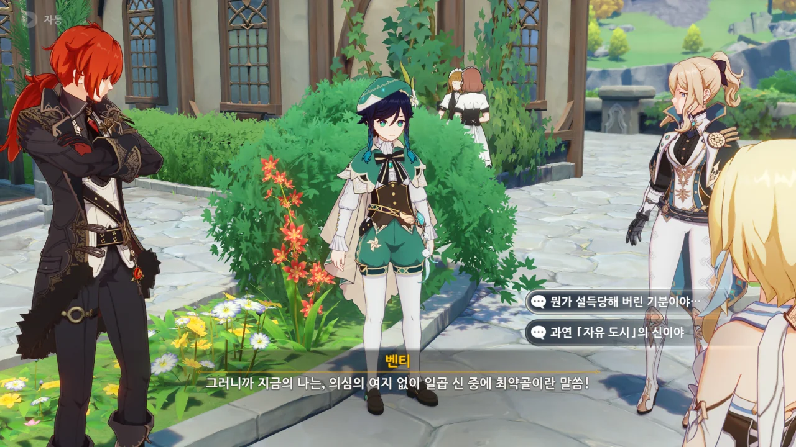

아무리 봐도 수상쩍은데...

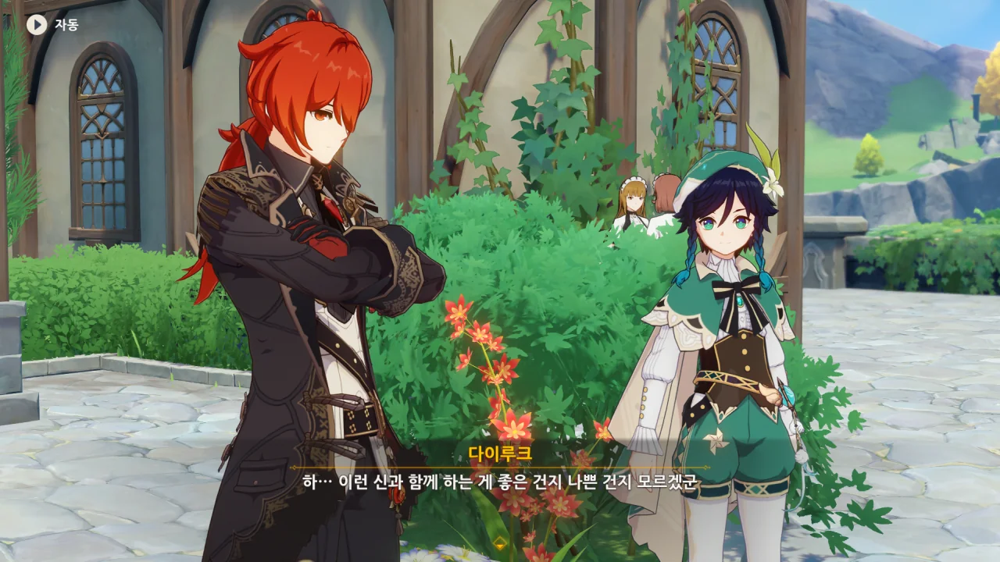

> 이런 신과 함께 하는 게 좋은 건지 나쁜 건지 모르겠군

ㅋㅋㅋㅋㅋㅋ 얼마나 못미더웠으면 ㅋㅋㅋㅋㅋㅋ



이번에 알아낸 심연 메이지의 흔적은 바로 다운 와이너리 근처라고 한다.

뭐요? 이야, 너네들, 정말 간도 크다. 심지어 기껏 끌고 온 게 츄츄족 궁수랑 츄츄족 샤먼 하나야?



벤티가 지금껏 드발린과 소통할 수 없었던 이유가 심연 메이지가 방해해서란다.





벤티가 드발린이 살고 있는 「바람 드래곤의 폐허」로 가겠다고 하니, 다들 벤티가 드발린을 잡으려고 하는 줄 안다.

뭐... 정황상 그렇게 볼 소지가 다분하지...





뭐요? 내가 비장의 무기라고? 드발린의 눈물 결정을 정화해서? 그게 왜?

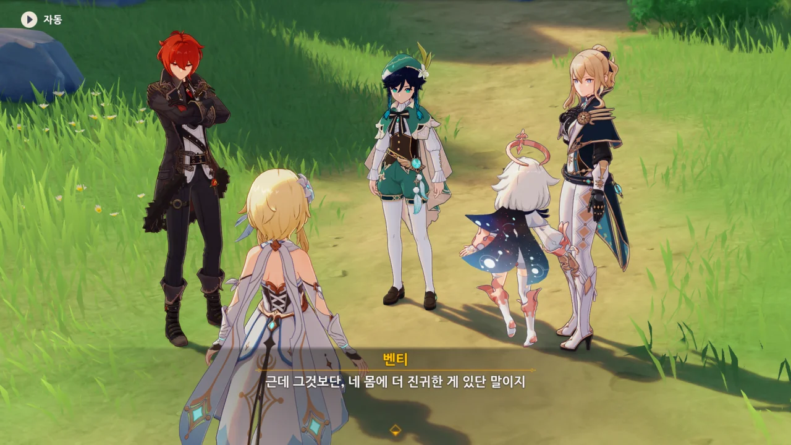

> 네 몸에 더 진귀한 게 있단 말이지

순간 저 말을 듣고 '내단', '코어'같은 용어를 상상해 버렸다. 설마, 여행자, 여기서 해체당하는 거야? 아니라는 걸 이미 알고 있는데도 말이다.

이게 다 오해하기 쉽게 말을 한 벤티 탓이다.

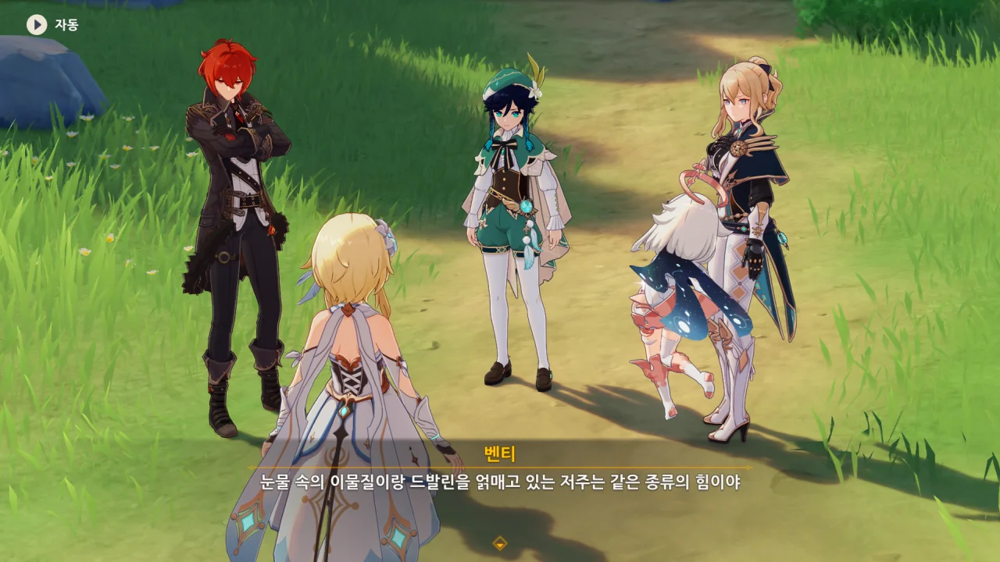

아, 그러니까 여행자가 눈물 결정을 정화한 것처럼 드발린의 저주 역시 정화할 수 있으리라 보는 거구나.

정작 여행자가 드발린에게 한 건 그냥 드발린을 때려잡은 것밖에 없는 거 같은데...

아아, 걱정 말아. 나 싸움 잘해. 지면 리트 할 거야.

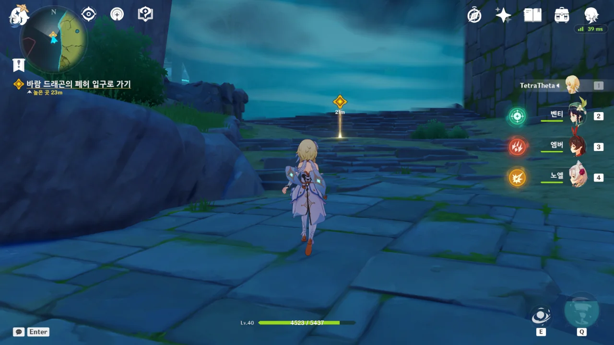

아직 지도가 밝혀지지 않은 곳으로 가는 게 왜 이렇게 불안할까. 난 역시 지도가 없으면 안 되나 봐...

그래도 가는 길에 있는 상자는 알뜰살뜰하게 하나하나 전부 체크해 가며 먹었다.



장벽을 깨부수려는데 뒤에서 츄츄족이 '까꿍' 하면서 나타났다.

눈을 휘둥그레 뜬 벤티의 모습이 뭔가 웃겨서 사진을 찍었다.



> 츄츄족은 일반적으로 원소 농도가 높은 구역에서 활동하지 않아.
> 이곳에선 몸이 훨씬 많은 부담을 감당해 내야 하니까...

처음 원신을 할 때는 그냥 넘긴 말이었는데, 수메르에서의 일을 생각해 보니 저 말도 상당한 떡밥을 지닌 말이었다.

아마 사람에게 원소력을 지나치게 많이 주입하면 츄츄족처럼 변하던가, 그럴 것이다.



아무튼, 습격해 온 츄츄족도 물리쳤겠다, 길을 막고 있던 바람 장벽을 해체하는 벤티.

그리고 페이몬에게 "가끔 쓸모가 있구나"라고 칭찬을 받았다. ㅋㅋㅋㅋㅋㅋ



드발린같은 큰 몸집으로 저 문을 어떻게 통과할까 궁금해하는 페이몬에게 드발린은 저 문을 이용하지 않고 날아다닌다며 핀잔을 주는 벤티.

페이몬도 거기에 뭐라 더 대꾸하지 못하고 떨떠름하게 '너도 맞는 말을 하는구나'라고 대답한다.



성실은 무슨, 개뿔이... 여행자가 열심히 돌아다닐 동안 벤티 넌 「천사의 몫」에만 있었잖아.



아, 드디어 이곳의 지도를 밝혔다. 이제 좀 돌아다니기 편하겠네.

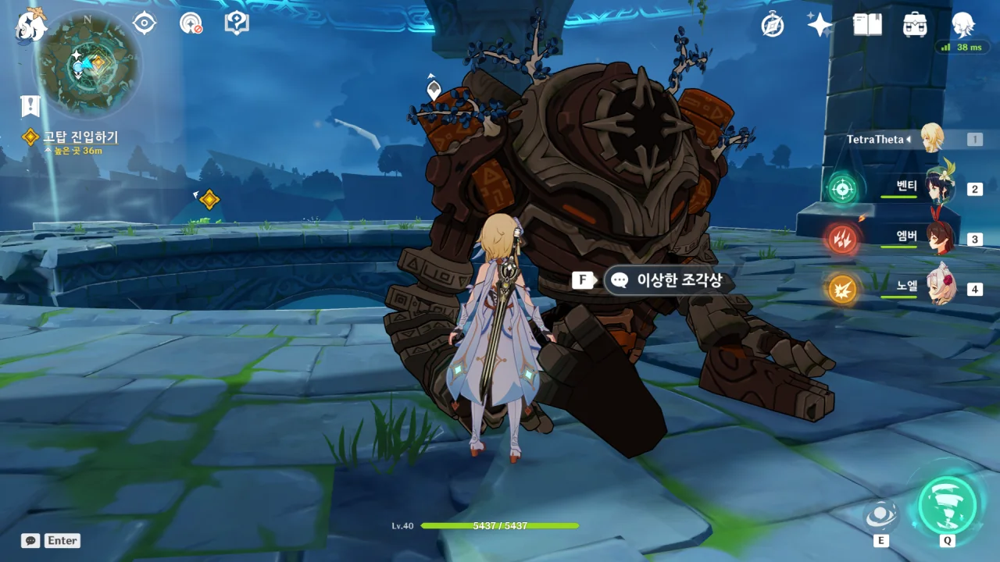

나중에 경작기 코어를 회수하러 여기에 다시 방문할 것이다.

지금은 이걸 조사해 봐도 '...'라는 대사만 나올 뿐, 아무런 정보가 나오지 않더라고.



또다시 벤티에게 핀잔을 듣는 페이몬.

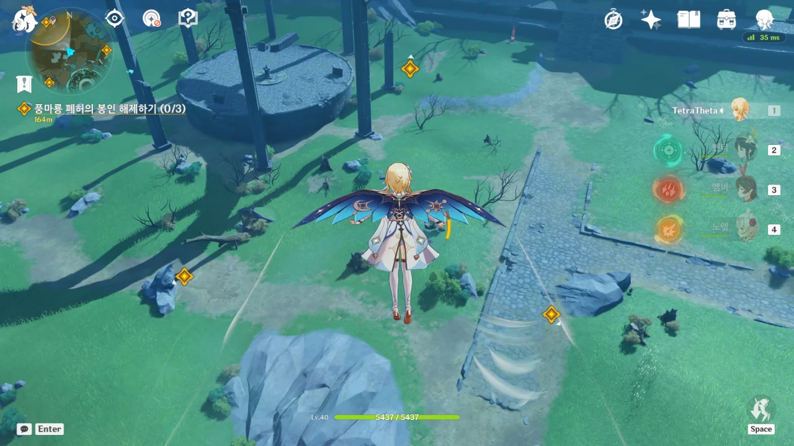

저 밑에 저 토네이도! 내가 여기서 제일 싫어하는 필드 기믹이다. 등장 조건도 모르겠고 파훼 방법도 모르겠는데, 한 번 걸리면 공중에서 무력하게 둥둥 떠다니다가 낙사하는 것밖에 답이 없는 저 토네이도!



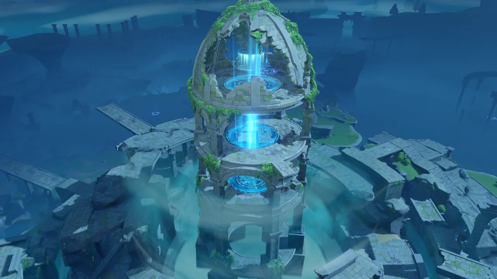

모든 「빛 인도 장치」를 완료했다. 이제 드발린을 잡으러 가면 되겠지.
