

여행자 피부과 의원에서 출장 클리닉에 나선 모습이다.

어허, 손님! 그렇게 격하게 움직이고 반항하시면 등드름을 짜기 힘들어요!

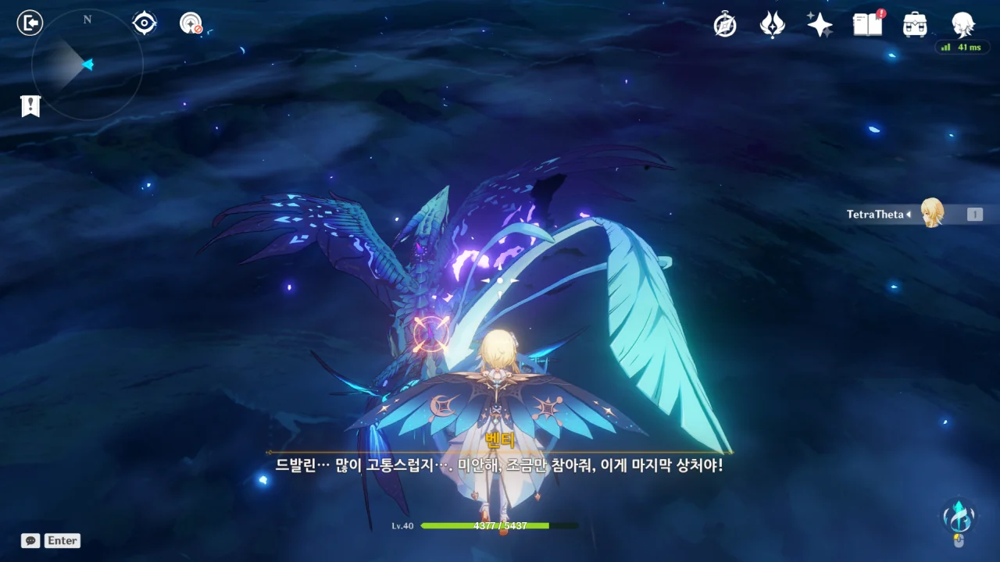

국소 마취 없이 한 시술 때문에 손님이 많이 고통스러워하고 있다.

그... 그래, 맞아. '아파야 청춘이다'! 그런 말 안 들어봤어요?

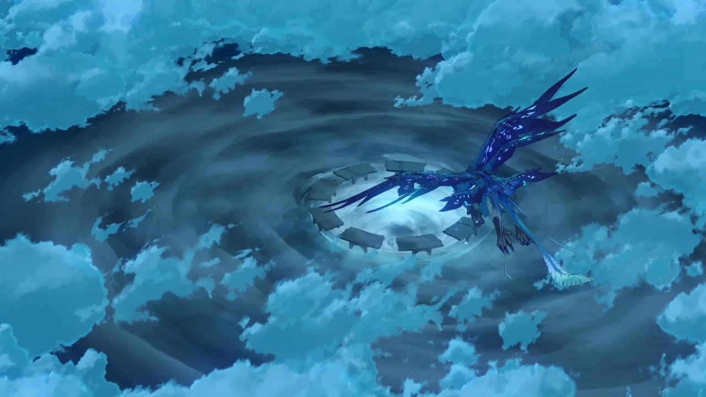

결국 고통을 견디지 못한 손님이 도망쳐 버렸다.

어어, 그렇게 등에 난 여드름을 방치하다간 종기가 될 수도 있어요? 등창 못 들어보셨어요?

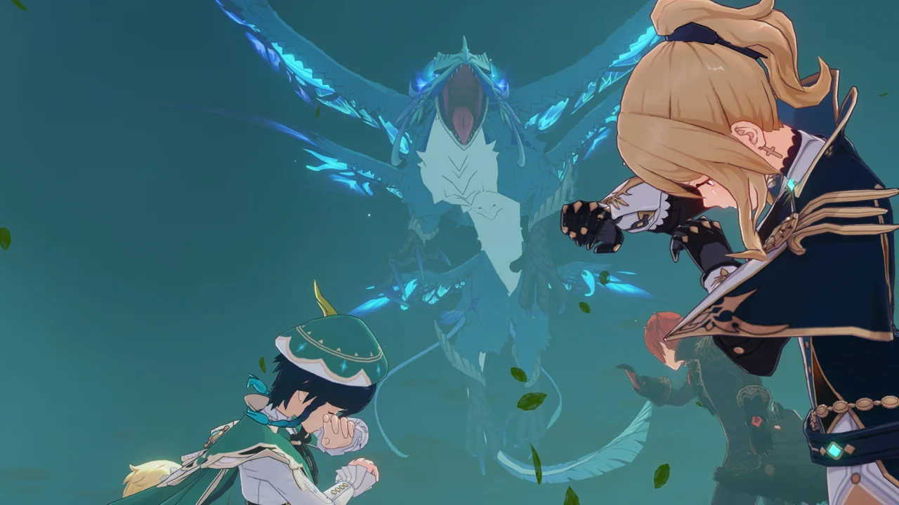

왜 마취 없이 생살을 째냐고 거세게 항의하는 손님의 모습이다.

물론 금방 진압했다.



등드름은 제거했지만, 제거하는 와중 손님이 부린 난동 때문에 플랫폼이 무너져 내린다.

어휴, 내 팔자야.

등드름이 완전히 제거된 손님이 매우 흡족해하며 추락하던 모두를 구해준다.



> 아까는 어째서... 예전처럼 나에게 「지키라」 하지 않은 거냐...

드발린이 제정신을 차린 모양이다.





> 심연에 복종하지 않았으면 한다는 게 꼭 나한테 복종하란 얘기는 아니야, 드발린.
> 신에게 명령받은 「자유」도 결국은 일종의 「구속」이잖아.



벤티가 손에 바람의 기운을 모아 드발린에게 준다.



> 이건... 바람 신의 권속의 힘인가? 하지만 난 이미 「바람 사신수」가 아닌 것을...





> 그 신분이 아니더라도 여전히 우릴 지켜주고 있잖아?
> 이제부터는 내 축복과 함께 더 자유롭게 날아봐...

벤티가 말하는 「자유」가 뭔지 어느 정도 알 것 같기도 하다.



> 몬드의 용의 재앙이 이렇게 일단락됐다.
> 난 기사단을 대표해 시민들에게 오해를 해명하고 사건이 해결됐다고 발표했다.

오해라...





> 시민들의 입장에선 「풍마룡」이 갑자기 습격했다가 또 갑자기 사라졌으니까.
> 많은 의혹이 있겠지.

이 사건 이후, 드발린은 과연 몬드에서 어떤 이름으로 불리게 될까? 「바람 사신수」? 「풍마룡」? 혹은 둘 다?



화자가 진에서 벤티로 바뀐다.

> 하지만 바람의 방향은 항상 바뀌는 거니까, 언젠가는 더 빛나는 곳으로 부는 날이 올 거야...

원신의 프롤로그라 그런지 몰라도, 지금 이렇게 이야기가 끝나고 나서 뒤돌아보니, 이야기가 휙휙 빠르게 지나간 느낌이다.

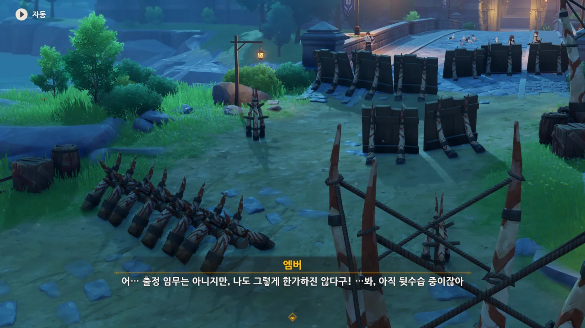

웬 뒷수습? 몬드성 앞에는 왜 바리케이드가 처져 있고?



진이 없는 동안, 츄츄족이 몬드성을 「총공격」했다고 한다.



츄츄족에겐 이런 총공격을 할 조직력이 없기 때문에, 기사단에선 이 습격 역시 심연 교단이 꾸민 짓이라고 추측한다.

아마 그렇겠지.



처음 앰버를 만났을 때, 앰버가 「허니캐럿그릴」을 대접하겠다고 약속했는데, 일이 꼬이고 꼬이는 바람에 여태껏 앰버가 식사를 대접할 겨를이 없었다.

> 앰버가 잊어버려도, 페이몬은 절대 안 잊어버리지롱!

그런 건 좀 잊어도 되지 않을까, 페이몬? 요 식탐 마왕아.

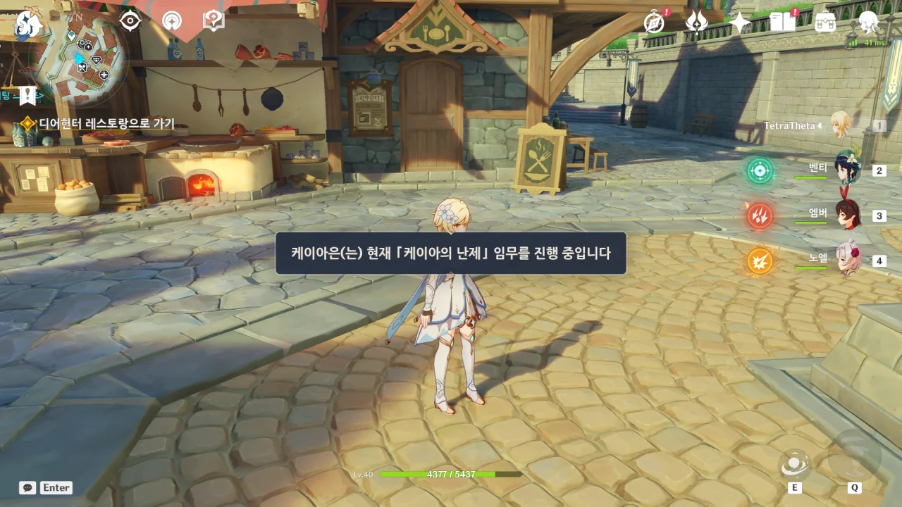

...

마신 임무 마무리를 하려는데 NPC 임무 선점 때문에 진행이 막혔다.

다음 버전에서는 전설 임무를 끄고 켤 수 있게 만든다던데, 그러면 이런 식으로 전설 임무 때문에 마신 임무나 이벤트 임무를 하지 못하게 되는 상황이 사라질 것이다.



그래서 일단 바바라를 얻기로 했다. 드디어 내 파티에도 힐러가 들어오는구나.

하지만 아직 레벨이 부족해, 바바라를 기용하는 건 좀 나중의 일이 될 것 같다. 어휴, 어디서 8레벨을 채우지?

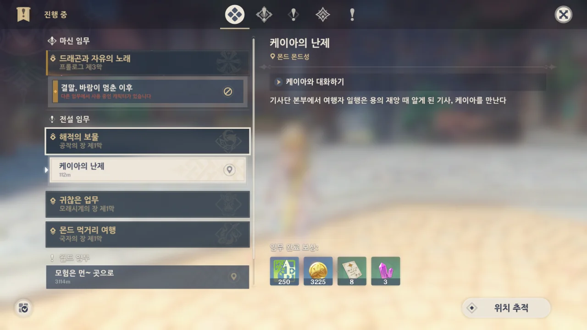

마신 임무를 진행하기 위해선 일단 케이아 전설 임무를 진행해야 한다.



와 정말요 (무미건조)

케이아의 말을 듣고 "응응"이 아니라 "ㅇㅇ"로 건성건성 대답한 페이몬이 제일 압권이다.

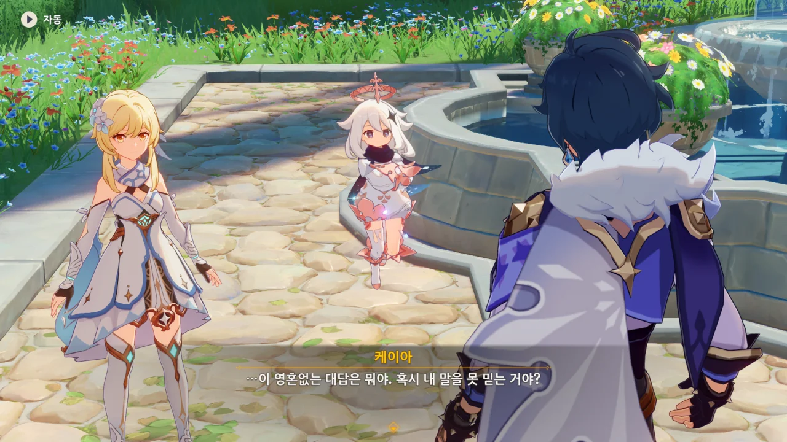

네. 당연하죠.



단순한 페이몬은 보물 이야기에 그만 눈이 돌아가 버리고 말았다.





한 가지 확실한 건, 케이아는 정말 소설을 못 쓴다.

아니, 저런 허황된 말을 누가 믿어? 그런 칼이 있었으면 이미 벌써 그런 이야기가 온 세상이 퍼졌겠지.

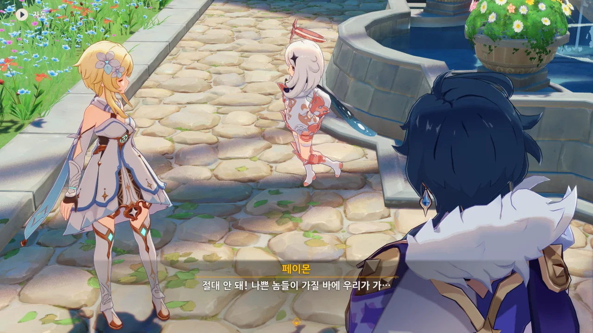

페이몬, 본심이 튀어나왔어.

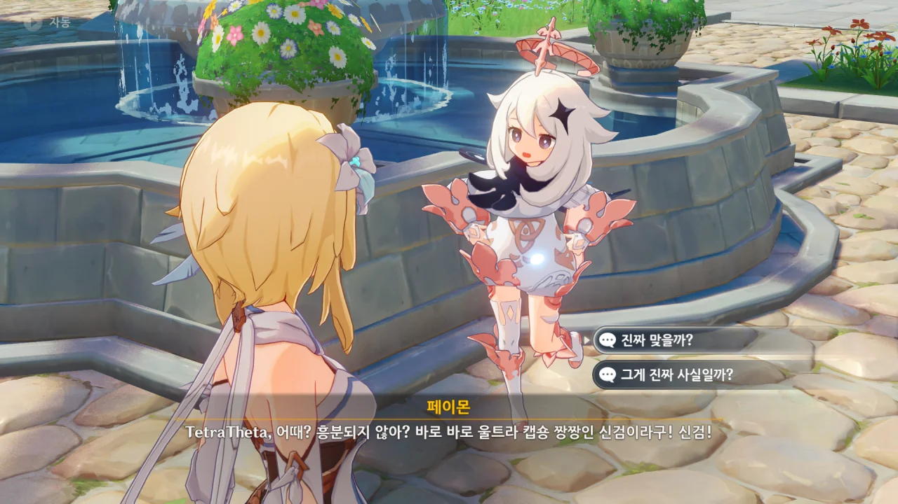

아냐, 페이몬. 날 믿어. 정말 아냐. 케이아를 믿지 말고 날 믿어.

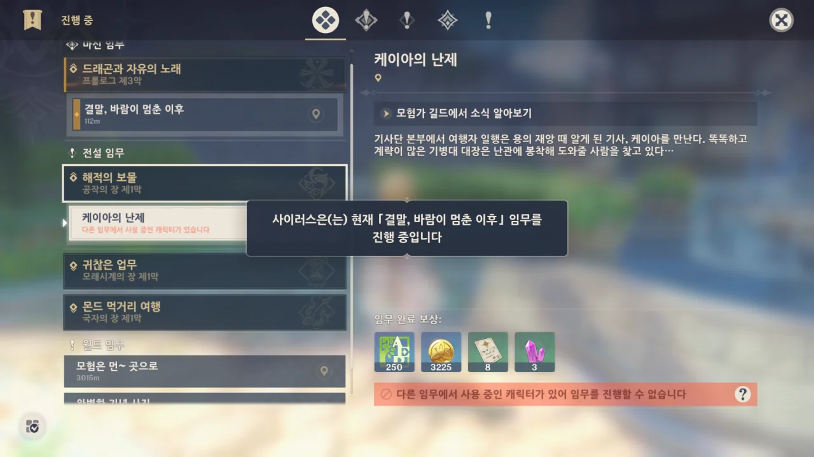

...



다행스럽게도 사이러스와는 이미 대화를 한 상태라, 그대로 진행이 가능했다.

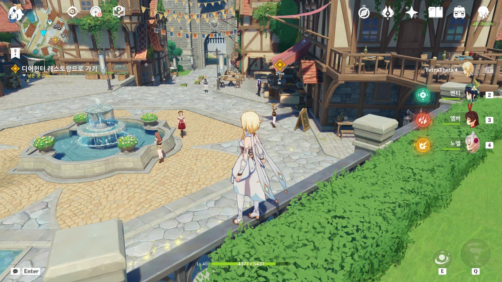

아, 여행자가 케이아와 디어 헌터 앞에서 만나게 하려고 임무끼리 서로 충돌이 생긴 거였어?





케이아는 모두가 성 밖에서 츄츄족을 막고 있을 때야말로 성안에 누군가가 잠입하기 좋을 시기라고 생각했다.





그리고 케이아는 정말로 몬드성 안에 잠입한 심연 교단의 침입자와 대면할 수 있었다.

그와의 대화에서 케이아가 알아낸 건, 심연 교단 뒤에는 또 다른 통솔자가 있다는 것과, 이번 드발린 사태 역시 그 통솔자가 꾸민 일이었다는 것이다.



그런 정보는 자신의 「언어적」 재능 덕분에 얻을 수 있었다고 하는데...

난 처음에 케이아 역시 다이루크처럼 적을 고문해서 정보를 얻었을 것으로 생각했다.

하지만 케이아의 다음 말을 듣고 나서, 생각이 조금 바뀌었다.

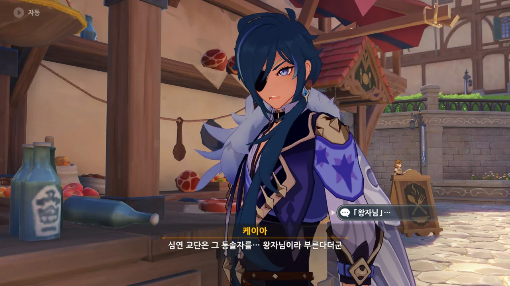

심연 교단은 그 통솔자를 「왕자님」이라고 부른다는 것이다.

&nbsp;

여기서 잠깐 내 나름대로의 추측을 해보았다.

케이아가 말한, 몬드성에 침입한 사람은 아마 심연 행자일 것이다.

심연 교단의 구성원은 심연 행자를 제외하면 전부 마물이기 때문에, 몬드성에 잠입하기가 쉽지 않다. 케이아 역시 마물을 '침입자'라고 사람처럼 부를 이유도 없을 거고.

하지만 심연 행자는 사람이기 때문에, 자연스럽게 몬드성에 들어올 수 있다. 케이아 역시 그와 '대화'를 해, 필요한 정보를 얻었을 것이고.

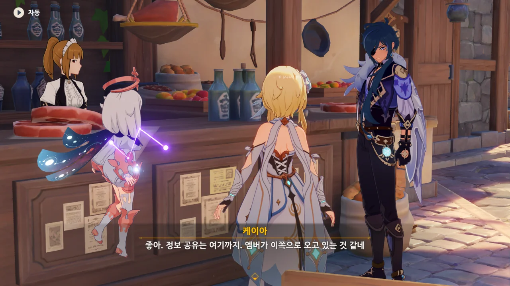

케이아는 앰버가 다가오자, 도망쳤다.



케이아가 또 빈둥댄다며 투덜대던 앰버는 배가 고프다며 아까 말했던 「허니캐럿그릴」을 주문한다.

난 나중에 이게 페이몬이 가장 좋아하는 음식이 될 줄은 몰랐지.

&nbsp;

> 허니캐럿그릴
> ***
> 고기에 벌꿀 소스를 발라 구운 요리. 당근으로 고기의 잡내를 없앴고 꿀을 더해 달달함을 극대화했다. 추운 겨울에 먹기 아주 적합하다.
{.bq}

재료가 짐승고기 3개, 당근 2개, 설탕 2개인데, 정작 설명에는 설탕 대신 벌꿀 소스를 쓴다고 적혀있다.



> 앞으로의 계획은 뭐야?

순간 '아니, 여기서 장래 희망을 물으셔도...'라고 생각해버린 나 자신이 밉다.



괜찮아. 앞으로 몬드에 이벤트마다 오게 될 거니까...



엑, 그러고 보니, 드발린을 부를 때, 천공의 하프가 망가졌었지...
