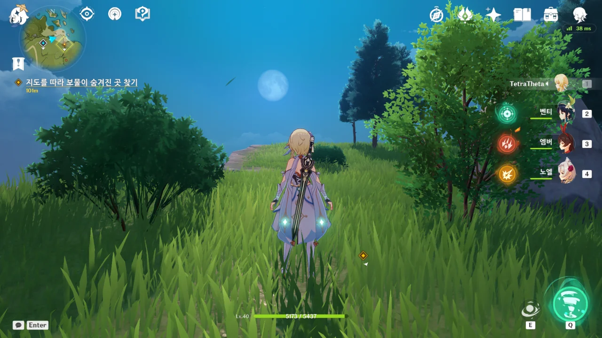
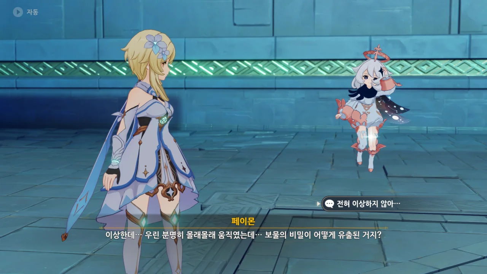
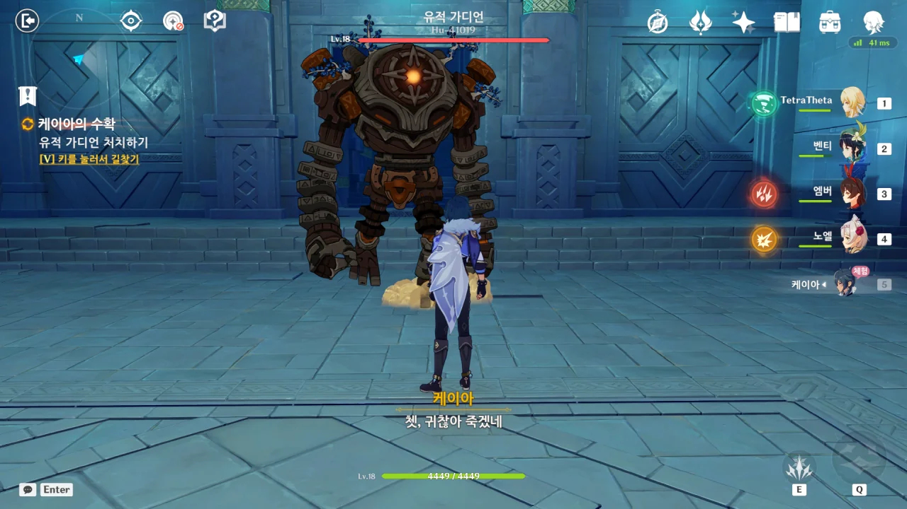
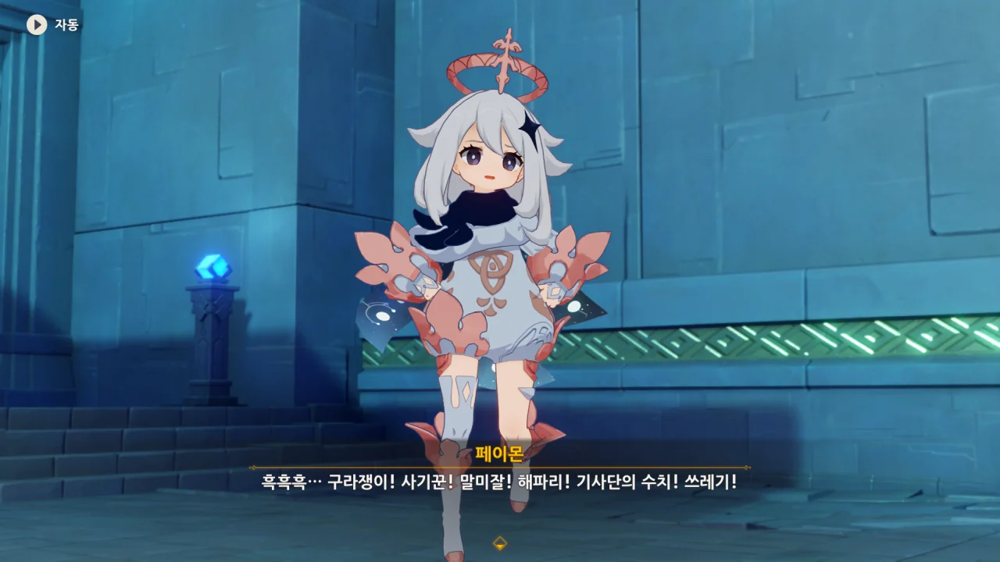
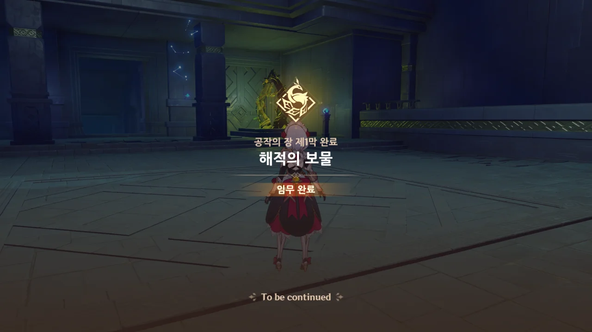

몬드에 있는 상자와 신의 눈동자를 모두 수집하기 전에, 일단 전설 임무를 먼저 끝내기로 했다.

어쭈, 이 녀석 봐라. 페이몬이 하는 말이 아주 가관이다.

> 응...? 페이몬은 그럴 필.요.없.다.고 생각하는데?
> 바로 안 갔다가 다른 사람한테 뺏기면 큰일 나잖아. 그러니까 그... 케이아가 말했던 「보물 사냥단」 같은 놈들 말이야.
> 아무튼, 난 그냥 그 검을 빌려서... 아... 아니, 그냥 한번 구경해 보고 싶을 뿐이야.
> 절대로 천하무적이 되어 먹고 놀고 싶은 게 아냐! 절대!

페이몬. 속마음 다 들켰어...

얼마나 좋았으면 "시작이당!"이라고 말할까...

물론 우리 모두 이 이야기의 결말을 매우 잘 알고 있다.

원신의 달도 지구의 달과 같은 모습일까? 스카이림에서의 우주는 우리가 아는 우주와 정말 다른 우주던데 말이다.





보물 생각에 너무 신난 나머지, 안쪽에서 들려오는 굉음에도 그저 "생쥐가 있나 보네"라고 건성건성 대답하는 페이몬.

이게 무슨 '큰 할머니'도 아니고... 그런 생쥐가 어디 있겠냐!



어휴... 이젠 노래까지 부르며 보물을 찾네.



그리고 나타난, 약속된 전개.

케이아와 처음 이야기할 때부터 누군가 엿듣고 있었는데, 드디어 정체를 드러냈다.



그래도 인성은 바른 녀석인지, 안내해 줘서 고맙다고는 하네. 아, 물론 비꼬는 거다.

모험가 길드에서부터 그렇게 중요한 내용을 다 떠들고 다녔으니, 당연히 비밀이 유출되고도 남지.

그리고 딱히 몰래몰래 움직인 것도 아니지 않은가.



아자드... 그 말 감당할 수 있어? 정말로? 내가 지맥을 돌며 때려눕힌 보물 사냥단이 얼마인데...





그리고 등장하는 케이아.

아자드가 말한, '밖에서 매복 중인 형제들'을 모두 붙잡고 오는 모양이다.

물론, 아자드도 그들과 감방 동기가 될 예정이다.



페이몬, 뻔뻔하기까지 하네... 제일 케이아의 보물에 눈독 들인 건 페이몬 아닌가?



"보물을 거의 손에 넣었는데..."라며 아쉬워하는 아자드에게 사실 보물 같은 건 처음부터 없었다는 충격 선언을 하는 케이아.



물론 페이몬까지 큰 충격을 받았다.





이자드는 비경 깊은 곳으로 도망치려다, 잠자고 있던 유적 가디언을 깨웠다.

> 쳇, 귀찮아 죽겠네.

그래. 나도 귀찮다.



그리하여 아자드는 몬드성으로 연행되었다.



뭐요? 우리까지?



뭐, 예상했던 바지만, 케이아가 보물 이야길 꺼낸 건 여행자를 미끼 삼아 보물 사냥단을 끌어내 잡기 위해서였다.

페이몬 혼자 거기에 속아, 오두방정을 떤 셈이 되어버렸다.

> 흑흑흑... 구라쟁이! 사기꾼! 말미잘! 해파리! 기사단의 수치! 쓰레기!

왜 페이몬이 흑흑 대며 아무렇게나 내뱉는 말을 들으니 입꼬리가 올라가는 걸까?



> 그게 아니라면, 왜 나한테 알리지도 않고서 혼자서 여길 왔겠어?

거기에 대고 케이아가 페이몬에게 '나에게 말도 안 하고 여기 온 건 너 역시 보물을 탐내 그런 것 아니냐?'라고 한다.



물론 거기에 대해 할 말 없는 페이몬은 "흥! 칫! 뿡!"이라는 말밖에 할 수 없었다.

와, '흥칫뿡'이라니. 이게 대체 얼마 만에 듣는 말이야?







케이아가 미안하다며, 페이몬에게 「여명신검」을 주겠다고 하자, 페이몬은 거기에 홀라당 넘어가 버린다.

그런데, 케이아가 준다는 「여명신검」, 고작 3성짜리다.

> 여명신검
> ***
> 오래전 아침 햇살처럼 빛나던 보검. 이 검을 가진 자는 근거 없는 자신감에 가득 차게 된다. 검신의 빛나던 발광 재료는 이미 사라졌다.
{.bq}

'근거 없는 자신감' ㅋㅋㅋㅋㅋㅋ

케이아, 사실 이거 노리고 페이몬에게 「여명신검」을 주려는 거 아냐?



케이아는 '더 이상 이렇게 속이지 않겠다'라는 말을 남기고 가버린다.

케이아 전설 임무, 공작의 장 제1막, 해적의 보물 완료!
