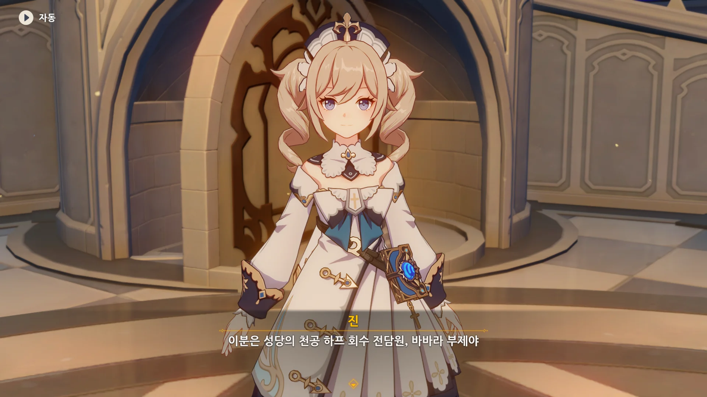
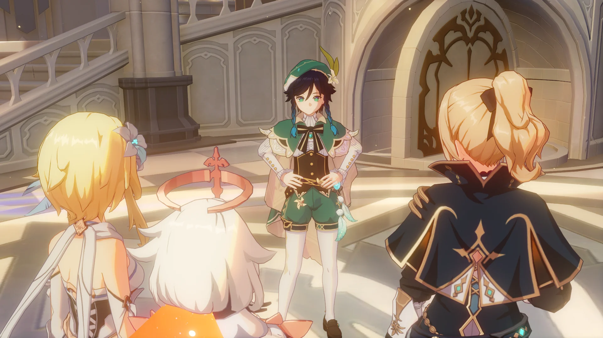
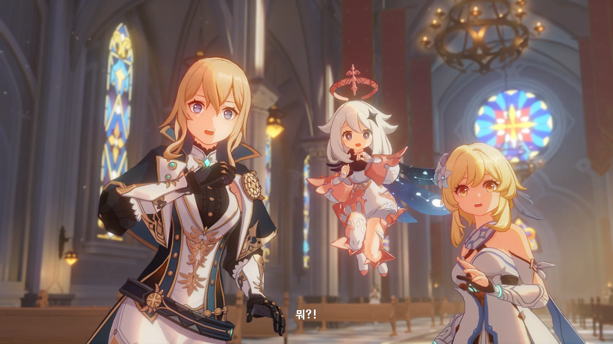
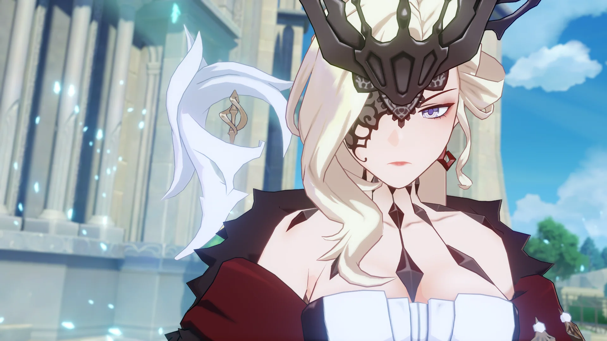
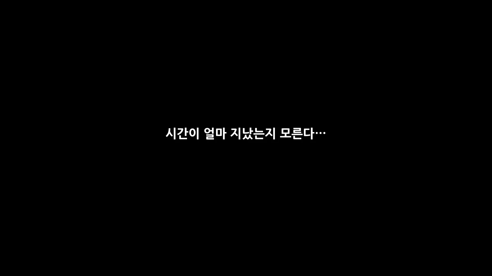
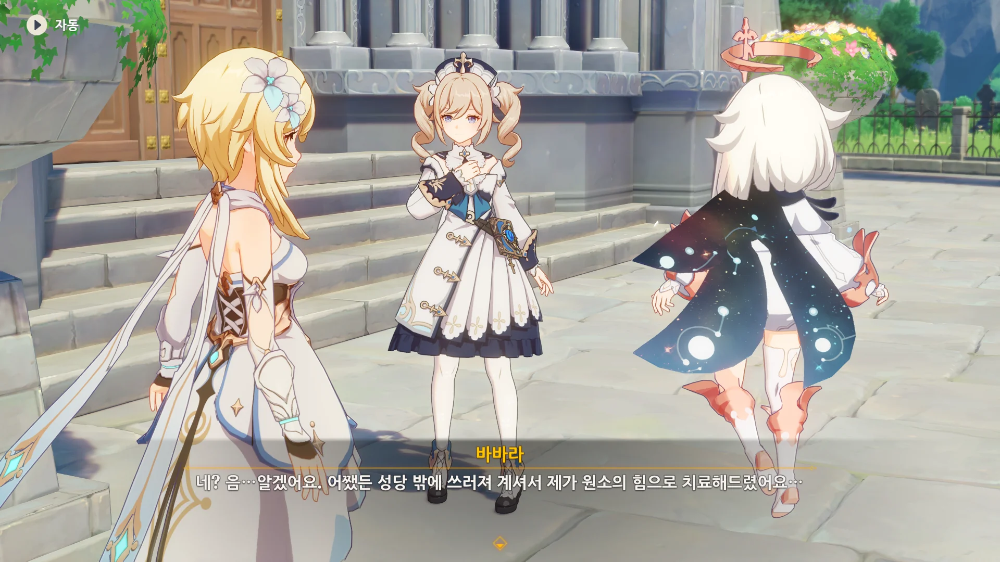
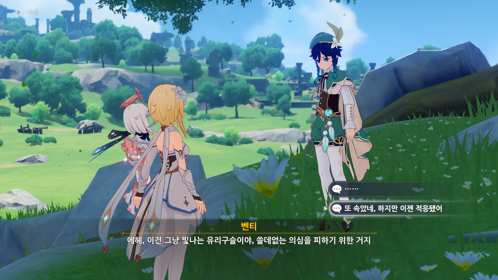
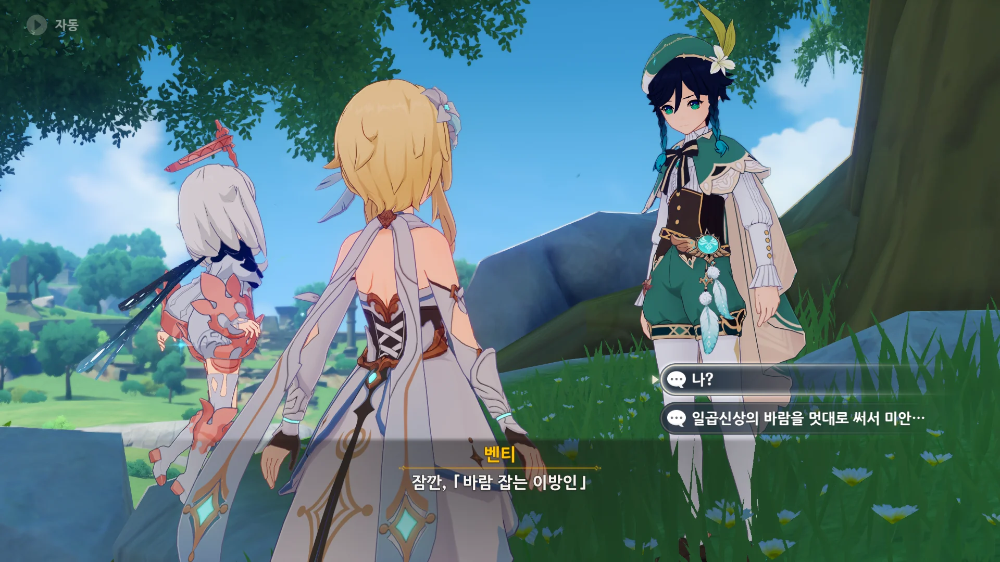
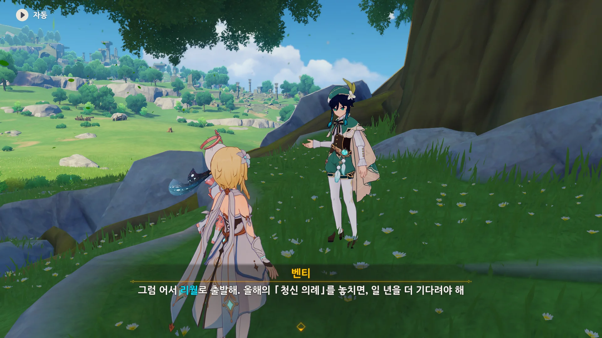

어쩌다 보니, 전설 임무를 다 끝내지도 않았는데 마신 임무를 다 끝내버렸다. 어... 음... 뭐, 어차피 금방 끝날 이야기였으니까.

천공의 하프가 도둑맞은 후, 성당에선 아예 회수 전담원을 임명한 모양이다. 뭐, 소중한 성물이니까.



그렇지... 만약 드발린을 죽였더라면 그 여파는 상상을 초월했을 것이다.

이런 상황을 기독교에 빗대긴 힘들지만, 대천사가 느닷없이 지상을 공격하고, 인간이 이에 맞서 대천사를 죽인 꼴이 되었을 테니까.

아마 바르바토스 신앙 자체에도 큰 타격이 있겠지.





물론, 우인단 역시 외교적 무능을 만천하에 드러낸 꼴밖에 되지 않았다.

몬드 내에서 자체적으로 해결할 수 있는 일을 가지고 잔뜩 설레발치며 '몬드성의 방위를 우인단에게 넘겨라'라고 한 것이니 말이다.

이번 일로 페보니우스 기사단과 관계가 나빠진 건 말할 것도 없다.



천공의 하프를 되찾은 후, 본디 성당에 반환해야 할 천공의 하프를 진의 담보 하에 대여한 것으로 처리한 모양이다.

어... 음... 그게 말이지...



박살이 난 천공의 하프를 본 바바라가 대경실색한다.



어... 그게... 그 바르바토스, 지금 네 옆에 있거든...



그걸 본 벤티가 한숨을 내쉬더니, 천공의 하프를 받아 들고, 다시 원래대로 돌려놓는다.



바바라의 표정이 순식간에 절망에서 행복으로 바뀌었다.

바바라가 천공의 하프를 제자리에 돌려놓으려 자리를 비운 사이, 벤티가 빨리 도망치자고 한다.



> 내가 천공의 하프를 「고친」 환술... 아, 아니 마법은 100% 완벽한 건 아니니까.

그럼 그렇지. 망가진 천공의 하프에 환영을 덮어씌워, 멀쩡해진 것처럼 보이게 만든 것이었다.

당연히 모두가 기겁했다. 벤티는 도망쳤고.



벤티를 쫓아가는 페이몬이 귀엽다.

***



열심히 성당에서 도망치는 벤티의 뒤를 바닥에서 슬그머니 나타난 우인단 채무 처리인 두 마리가 덮치려 하자, 여행자가 바람 원소의 힘으로 이 둘을 방해한다.



그리고 어디선가 불어오는 차가운 바람.

페이몬은 벌써 얼음조각이 되어 뒤로 날아갔고, 여행자가 바람을 팔을 들어서 막는 동안 우인단 채무 처리인이 뒤에서 여행자를 구속한다.

벤티 역시 다리가 꽁꽁 얼었다.



> 훗, 집 나간 햄스터가 결국 돌아왔네.

그리고 나타나는 「시뇨라」.

야, 정말 오랜만이다. 잿가루가 된 이후 처음이네.





> 햄스터가 아니라 쥐겠지---

벤티가 맞받아치자, 벤티의 뺨을 때리는 시뇨라.





> 흥, 몬드를 통치하길 포기한 신에게 겨우 이 정도의 힘만 남아있다니...

> 허, 지금 주인한테 빌려온 힘으로 나를 조롱하는 거야?

둘의 신경전이 아주 볼만하다.

시뇨라가 쓰고 있는 얼음의 힘은 우인단이 지급한 사안(邪眼)에서 비롯된 힘이니, '주인한테 빌려온 힘'이 아주 틀린 말이 아니거든.

물론 그 말을 듣자, 시뇨라의 표정이 썩었다.

시뇨라 역시 벤티, 아니 바르바토스에게 아주 악감정이 많거든.



벤티에게 달려들어 벤티의 가슴을 꿰뚫는 시뇨라.



> 이게 바로--- 「신의 심장」인가? 내 소장품인 체스 말보다 못하군 그래.

시뇨라가 벤티에게서 「신의 심장」을 강탈했다.



여전히 '입만 살은' 벤티에게서 미적 감각이 구려서 그렇다는 이야기를 듣자, 벤티를 걷어차 버리는 시뇨라.



처음 목표했던 것이 벤티의 「신의 심장」이었는지, 「신의 심장」을 확보한 시뇨라와 우인단은 페보니우스 기사단이 알아차리기 전에 재빨리 도망친다.



물론 여행자의 목덜미를 내리쳐 기절시킨 후에.

&nbsp;

이렇게 처음엔 우인단에게 무력하게 당하던 여행자가 여행할수록 강력해져, 나중엔 우인단 집행관과도 싸울 수 있을 정도가 된다는 게 참 신기하네.



기절한 여행자를 바바라가 깨운다.



"여긴 어느 행성이지?"라고 개드립을 쳤더니 페이몬이 "여행자의 헛소리는 무시해!"라고 말한다.

요 요 비상식량이...

바바라가 성당 밖으로 나와보니, 여행자가 쓰러져 있어, 물 원소의 힘으로 치료해 주었다고 한다.

무슨 일이 있었는지 목격한 사람은 전혀 없던 모양이네.





같이 쓰러져 있던 벤티에게는 바바라의 치료가 전혀 통하지 않았고, 벤티는 그게 정상이라며 「몬드 영웅의 상징」으로 향했다고 한다.

벤티가 바람의 신, 바르바토스이니 평범한 치료는 당연히 소용없을 테지. 그걸 안 진 역시 바바라에게 벤티를 그냥 보내라고 말했다.





벤티에게 「신의 심장」이 무엇인지 묻자, 원래 평범한 사람들과는 이런 이야기를 하면 안 되지만, 특별히 알려주겠다고 한다.



소수의 인재만이 「신의 눈」이라는 외부 마력 기관을 통해 원소의 힘을 사용할 수 있다.

하지만 동시에 「신의 눈」 소유자는 신이 될 수 있는 자격이 있어 「원신」이라 불리며, 셀레스티아에 오를 수 있는 자격이 주어진다.



하지만 집정관에겐 「신의 눈」 대신 「신의 심장」이라는 마력 기관이 주어진다. 이 마력 기관은 셀레스티아의 공명과 연결되어 있다고 한다.

아, 지금 벤티가 허리춤에 차고 있는 건 가짜 「신의 눈」이다.

여행자가 「신의 눈」 없이 원소의 힘을 사용하는 게 특이 체질이라고 불리는 만큼, 괜한 의심을 사지 않기 위해 대충 만든 것이다.



시뇨라에 관해서도 설명하는 벤티.

시뇨라가 11명의 우인단 집행관 중 서열 8위라는 말은 이전에도 나왔었지.



우인단의 모든 집행관은 얼음의 신인 스네즈나야 여왕에게서 사안을 지급받고 일반인을 뛰어넘는 힘을 얻었다.

시뇨라 역시 얼음 속성의 사안을 지급받아 그 힘을 쓰고 있는 것이다.



500년 전의 얼음의 신은 알아도, 지금 그녀의 모습은 낯설게 느껴진다는 벤티.



500년 전의 대재앙 이후, 얼음의 신이 자신과의 교류를 끊었다는 이야기를 끝으로, 더는 아무 말도 하지 않는다.



자연스럽게 몬드의 이웃 나라, 리월로 여행자를 인도하는 벤티.



> 그렇다고 해도, 누구보단 일을 더 많이 하는 것 같네.

> 에?

뭘 그렇게 쑥스럽다는 듯이 머리를 긁적이냐.



아까 말했던, 바위의 신이 공식적으로 세상에 내려오는 「청신 의례」가 얼마 남지 않았다며, 여행자가 리월로 가기를 재촉하는 벤티.

&nbsp;

벤티가 저렇게 여행자를 자꾸 리월로 보내려고 해서, 사실 벤티가 일곱 신 중 여행자의 오빠에 대해 제일 많이 알고 있는 게 아니냐는 의혹이 지속해서 제기되고 있긴 하다.

게임의 막바지에 처음 시작했던 지역으로 되돌아오는 건 꽤 유명한 클리셰이기도 하고.



여행자를 「바람 잡는 이방인」이라 부르며, 마지막 조언을 해주는 벤티.



프롤로그라서 그런가, 다른 지역의 마신 임무에서는 일일이 집정관에게 물어야 했던 걸 자동으로 물어보네.

{}





그래서 드발린에게 그냥 바람 신의 권속의 힘만을 불어넣어 주고 끝낸 모양이다.

거기서 '자유로워져 봐'라고 말해보았자, 그건 또 하나의 구속일 테니까.

{}

{}



분명 벤티는 케이아에 대해서도 잘 알고 있겠지? 케이아가 말해준 정보라고 말하자, "케이아의 정보라고?"라고 되묻는다.





> 심연 교단에 「왕자」가 있단 이야긴 처음 듣는데...

벤티가 처음 들을 정도의 이야기면, 심연 교단에 「왕자」가 나타난 건 비교적 최근의 일일 것이다.

{}

{}





뻔뻔하게 몬드의 신의 「신의 심장」을 강탈해 놓고서, 몬드와의 동맹 관계를 계속 유지하려는 우인단의 속셈을 잘 모르겠다. 

만약 「신의 심장」만이 목표였다면, 몬드와의 관계가 어찌 되던 상관 하지 않고 그냥 「신의 심장」만 가져갔으면 되는 일이니까.





심연 교단이 곳곳에서 암약하는 와중에, 스네즈나야가 우인단을 내세워 다른 나라를 함부로 대하는 모양이다. 

이래서야는 일곱 국가의 단결은 영 무리이지 않을까. 다른 여섯 국가가 힘을 합쳐 일단 스네즈나야를 무너트린 후 심연 교단을 상대한다면 모를까.



나도 얼음의 신이 대체 500년 전의 일로 어떤 생각을 가지게 되었는지 정말 궁금하다. 

최소한 우인단의 일에 직접적으로 개입하지는 않는 것 같던데…

{}

{}



「신의 심장」은 「신의 눈」보다 더 상급의 원소 제어 중추이자, 일곱 신좌의 상징이라고 한다.

예전에 들은 바에 따르면, 사람들의 신앙을 힘으로 변환해 주는 역할도 수행한다고 했었지.



일곱 신 중 누가 여행자의 오빠를 데려간 건지는 모른다. 

하지만 우리는 그게 일곱 신이 아니라, '천리의 주관자', 셀레스티아의 신이 한 짓임을 잘 알고 있지.



여행자는 오빠를 찾기 위해 이 티바트 대륙을 떠돌아다니고 있는걸. 

그리고 인게임 캐릭터 정보를 보면, 아무래도 여행자가 '천리의 주관자'처럼, 티바트 전체를 담당하는 「신」이 될 것으로 보이기도 한다.

> 균형의 수호자가 죽어가고, 창조자는 아직 그 모습을 드러내지 않았다.
> 하지만 세상은 더는 불타지 않을 것이다. 그대가 「신」의 자리에 오를 것이기 때문에...
{.block-quote}



으휴... 페이몬, 이 눈치 없는 녀석...

{}

하지만 몬드에 있는 모든 상자를 다 깐 후에 리월로 갈 건데?
