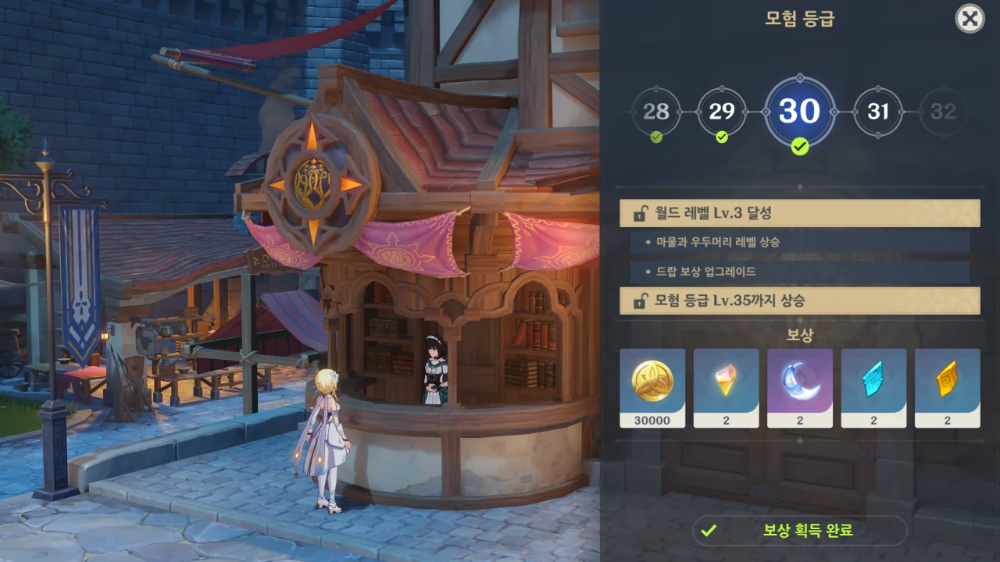

다시 모험 등급 30이 되었다. 그리고 내일이 되면 4.2 버전 업데이트와 함께 푸리나가 나올 것이다.

내일 버전 업데이트가 있을 예정이지만, 놀랍게도 별 감흥이 없다. 그야, 내가 거기서 얻을 수 있는 게 별로 없으니까.

&nbsp;

푸리나를 뽑기에는 원석의 양이 턱없이 부족하다. 현재 리월의 보물상자를 샅샅이 털어먹고 있지만, 상자를 열어도 원석이 기껏해야 2개 정도밖에 나오지 않기 때문에, 원석의 양은 모자를 수밖에 없다.

아마 점검 보상으로 들어올 원석을 전부 털어 넣어도 10연차조차 힘들겠지.

&nbsp;

새로운 마신 임무조차 내게는 먼 이야기이다. 아직 난 리월 마신 임무조차 제대로 시작하지 않았거든.

리월 마신 임무부터는 제대로 사진을 찍어 정리할 예정인데, 사진을 찍고 분류하고 적당히 잘라낸 후, 거기에 맞는 글을 쓰기가 보통 어려운 일이 아니다. 자연스레 꺼려질 수밖에.

&nbsp;

말은 이렇게 해도, 내일 있을 뽑기에서 푸리나가 나왔으면 좋겠다.
