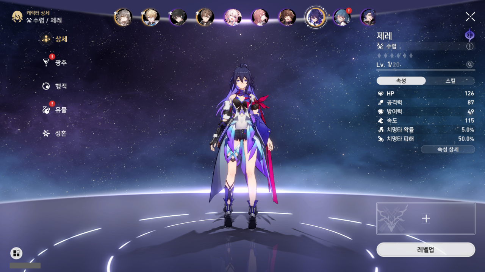

야릴로-6 행성에서의 스토리가 모두 끝날 때까지 모은 모든 성옥을 캐릭터 워프에 꼬라박았다. 모을 수 있는 성옥을 죄다 모았더니 캐릭터 워프를 약 70번 정도 할 수 있는 성옥이 모였다. 다음 캐릭터 워프? 그게 뭐죠?

그리고 얻었다. 보라, 이 찬란한 제레의 모습을!

***

사실 제레를 뽑았을 때의 화면 역시 찍고 싶었는데, 스크린샷을 찍는데 쓰는 ShareX의 문제 때문에 그 장면을 놓쳐버리고 말았다.

&nbsp;

난 ShareX에서 작업별로 다른 이미지 효과를 적용할 수 있을 줄 알았는데, 그게 아니었다.

내가 ShareX를 이용해 게임 스크린샷을 찍는 게임이 원신과 붕괴: 스타레일이 있는데, 두 게임에서의 UID 표시 영역이 서로 다르다. 그래서 두 게임을 위한 이미지 효과를 각각 따로 만들어두었는데, 스타레일 스크린샷을 찍으니까 스타레일 UID 영역 대신 원신 UID 영역이 가려져 있었다.

&nbsp;

이것저것 알아본 결과, ShareX는 그냥 전체화면 사진을 찍는 용도로만 쓰고 FFmpeg 스크립트에서 자체적으로 UID를 가리고 이미지 변환을 진행하는 것이 제일 효율적인 것 같다.

ShareX 레포지토리에 내가 원하는 것처럼 보이는 PR이 하나 있긴 했지만, 재작년에 이미 닫힌 PR이었다. 그래서 원본 코드를 찾아 직접 적용해 컴파일해 보니, 내가 원하는 방식의 PR이 아니었다.

그냥 ShareX는 사진 찍는 용도로만 써야지...
