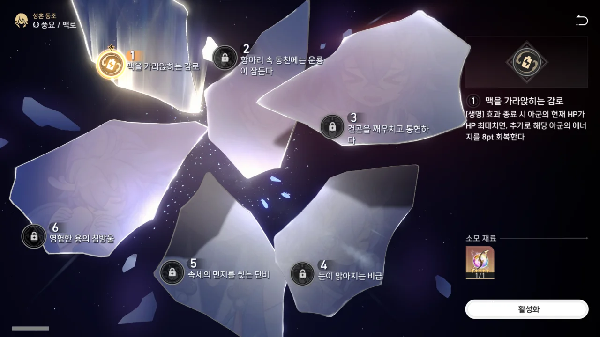

경원을 향해 하루하루 가챠 스택을 쌓던 어느 날, 드디어 5성이 떴다.

그런데 백로네. 번개는 번개고, 5성은 5성인데, 경원이 아니라 백로가 떴어...

가챠 기간이 앞으로 약 일주일 하고 절반 정도가 남았는데, 이 기간 안에 가챠를 70회 돌리는 건 트럭이라도 쏟아붓지 않는 한, 불가능하다.

그래도 5성이면 좋은 게 아니냐고 할 수 있지만, 내가 보기에 백로의 핵심 성흔은 아군의 부활 횟수가 1회에서 2회로 늘어나는 6성흔이다.

하지만 6성흔이다. 6성흔을 열기 위해선 앞으로 백로가 5번은 더 나와야 하는데, 그건 그만큼 내가 픽업 캐릭터를 얻지 못한다는 말과 일맥상통한다.

무과금으로 게임을 하는 입장에서, 이건 상당히 치명적인 문제다.

&nbsp;

에휴, 뭐, 어쩌겠나. 이번 경원은 그냥 마음을 놓기로 하자.

어차피 다음 픽업 때 성능이 죽여주는 은랑이 나온다고 했으니, 은랑을 노리도록 하자.

다음엔 은랑을 뽑을 수 있겠지...
