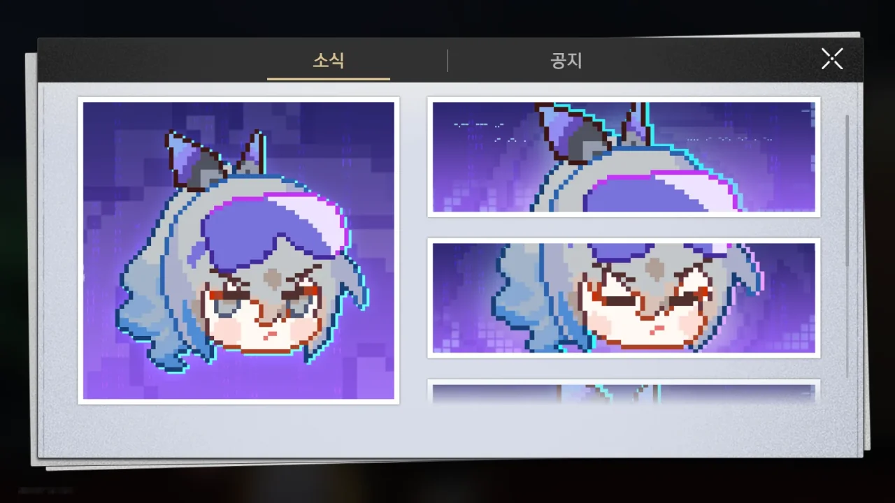

오늘 스타레일을 켜니 대충 이런 내용의 편지와 함께 연료 10개가 들어왔다.

> \>\>알 수 없는 신호:
> 「██ █ ███ 컴퍼니 너네 사람 잘못 건드렸어」
> 「피어포인트로 가는 길에 쪽쪽이 문 애송이가 나 보고 그러더라? "은랑, 너 뭐 되냐?"」
> 「그래서 말해줬지. "내가 손가락만 까딱하면 스타피스 엔터테인먼트의 서버를 로켓콩을 먹은 것처럼 아이템, 점수, 소재, 보상을 토해내게 만들고 모든 우편함을 폭파할 수 있다고, 알아?"」
> 「그랬더니 웃으면서 그러더라. "해보든가"」
> 「그래서 똑같이 웃어줬지. "그래, 그럼" █ ███ ██ █」
> \>\>\>신호 오류---------
> &nbsp;
> \>\>\>스타 네트워크:
> 「공지: 네트워크 불안정으로 인해 일부 사용자 화면에 표시 오류 및 비정상적인 메시지 문제가 발생했습니다」
> 「현재 비정상적인 메시지는 모두 삭제됐으며, 화면 표시 오류도 시스템 시간 12시간 이내에 수정될 예정입니다」
> 「스타피스 엔터테인먼트는 이번 일로 불편을 겪은 사용자분들께 진심으로 사과드리며 이에 따른 보상을 보내드립니다」
> \*보상은 개척 임무 「야릴로-Ⅵ」-「겨울밤의 여행자 무리」를 완료하신 개척자님께 발송될 예정입니다. 2023/07/19 05:59:00(UTC+8) 전에 [우편]에서 수령해 주세요.
> &nbsp;
> \>\>\>알 수 없는 신호 감지:
> 「██ █ ███ 공지가 이게 다야? █ ███ ██ █」
{.block-quote}

원래 은랑이 제4의 벽을 넘는 행동을 많이 해왔기에, 이번에도 그런 설정이라 생각하고 넘겼다. 연료 10개는 맛있었다.

&nbsp;

그리고 공지를 열자 이런 화면이 날 반겨주었다.

저 그림을 보고 순간 뇌가 1초 정도 정지했다. 아니, 은랑이 게임 공지까지 해킹했다고?

&nbsp;

설정상, 이것 역시 은랑이 제4의 벽을 넘은 것이라 볼 수 있다. 다만 여기에서까지 이럴 줄은 몰랐던 거지.

* 은랑 캐릭터 PV 내용  
  캐릭터 PV 영상에서 은랑은 붕괴 3rd에서 핵서 버니를 플레이하고 있다.  
  이야기하면 길어지지만, 붕괴: 스타레일에 등장하는 캐릭터는 둘 중 하나의 경우에 속한다.
  * 붕괴 시리즈의 다른 게임에서 모티브를 가져옴  
    대부분의 캐릭터가 이 경우에 속한다. 은랑 역시 마찬가지이다.
  * 붕괴 3rd에 등장한 캐릭터이다  
    여기에 속하는 캐릭터는 웰트가 유일하다.
  
  그리고 은랑은 핵서 버니에서 모티브를 강하게 가져왔다고 추정되는 캐릭터이다.
* 은랑 캐릭터 PV 덧글  
  은랑 캐릭터 PV 영상의 덧글에 붕괴 3rd 공식 계정이 "재미있지~?"라는 내용의 덧글을 달았다. 그리고 붕괴: 스타레일 공식 계정은 거기에 "재미있네"라고 답했다.  
  은랑 캐릭터 PV의 제목은 '재미있네'이다.
* 공식 트위터, 공식 카페 *해킹*  
  공식 트위터와 공식 카페의 프로필 아이콘이 도트로 그려진 은랑 얼굴 그림으로 바뀐 적이 있다.  
  해당 캠페인에서 제공하는 버튼을 누르면 트위터에 로그인하도록 하는데, 자신의 트위터 계정에 로그인하면 자신의 트위터 계정의 프로필 아이콘, 헤더, 자기소개란의 문구가 전부 은랑과 관련한 것으로 바뀌게 된다.  
  이 역시 은랑이 해당 사용자의 계정을 해킹했다는 콘셉트이다.
* 은랑의 필살기 대사  
  은랑이 필살기를 쓸 때, 2배속으로 플레이 중이었다면 "2배속이 이거야?"라는 대사가 기존 필살기 대사 대신 출력된다.

공식 트위터나 카페, 유튜브 등은 캐릭터 홍보 캠페인의 일환이라 생각할 수 있지만, 캠페인과 관련 없는 게임의 공지에서까지 이럴 줄은 정말 몰랐다.

&nbsp;

이렇게 제4의 벽을 넘는 캐릭터가 하나 정도 있으면 재미있을 거라고 생각하고 있었기에, 이런 시도는 내게 큰 즐거움을 줬다.
