오랜만에 마인크래프트 싱글 플레이가 조금 당겼다.

평소 마인크래프트의 새로운 정보를 알려주는 유튜브 채널을 구독 중인데, 거기서 1.16 스냅샷 버전에 도구와 방어구를 만들 수 있는 새로운 자원인 '네더라이트'가 추가되었다는 소식을 듣고 직접 그걸 체험해 보고 싶어서였다.

&nbsp;

마인크래프트의 공식 런처를 이용하면 무슨 수를 쓰더라도 마인크래프트 관련 파일이 C 드라이브에 저장되는 것을 피할 수 없다.

그래서 늘 하던 대로 MultiMC를 이용해 최신 1.16 스냅샷 버전을 받았다.

이렇게 하면 모든 마인크래프트 관련 파일이 MultiMC가 설치된 하드 드라이브에 설치되므로 C 드라이브에 그 어떤 파일도 저장되지 않게 된다.

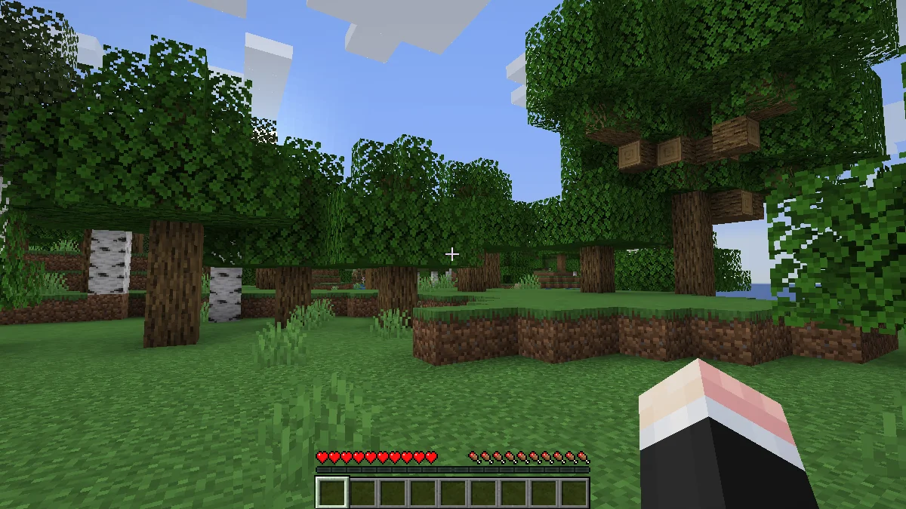

마인크래프트의 기본 해상도인 854x480은 너무 작기 때문에 1200x675로 크기를 늘려서 플레이한다.

이 비율은 마인크래프트 창의 가로세로 비율을 크게 해치지 않으면서 창 크기를 늘린 비율이다.

비슷한 해상도에는 1300x730이 있다.

&nbsp;

늘 1.12.2 버전에 기반한 모드 팩만 플레이하다가 1.14부터 바뀐 기본 리소스 팩을 보자니 뭔가 감회가 새롭다.

확실히 새로운 리소스 팩이 더 부드러운 느낌을 준다.

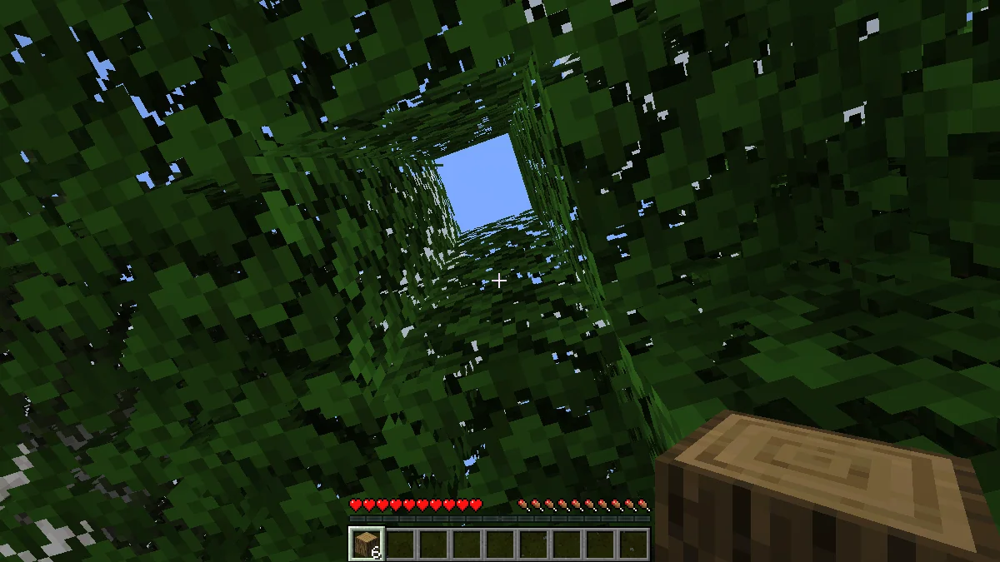

그 어떠한 모드도, 플러그인도 없다.

싱글 플레이니까 플러그인을 쓰지 못하는 것은 당연한 일이고, 모드를 적용하고 싶어도 관련 파일을 전혀 설치하지 않았다.

&nbsp;

그래서 이렇게 나무줄기를 전부 캐도 나뭇잎이 빠르게 사라지지 않는다. 벌써 모드가 그리워지기 시작한다.

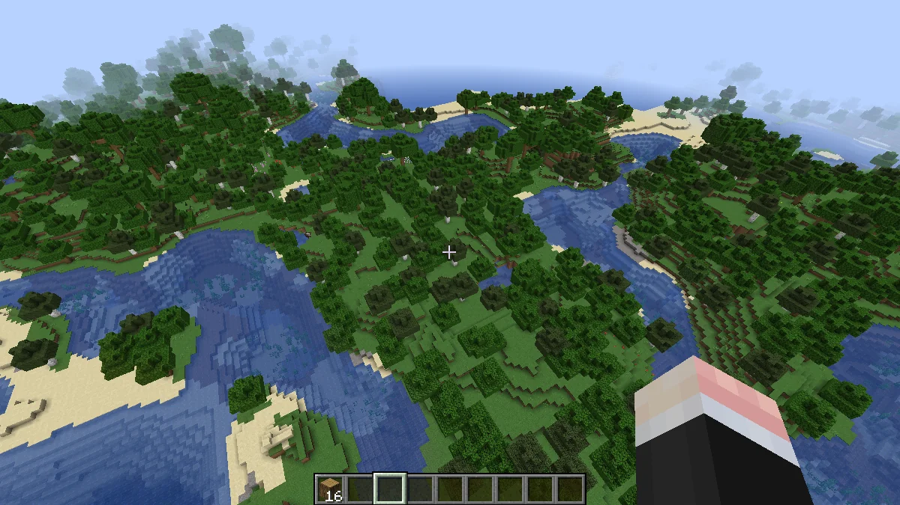

주변을 잠깐 둘러보았는데 처음 스폰한 곳이 좋은 지형인 것 같아 잠깐 크리에이티브 모드로 바꾼 후 주변을 둘러보았다.

정말 오랜만의 평범한 스폰 지형이다.

여태껏 새 월드를 생성하면 처음 스폰한 곳이 사막 한가운데이거나 깎아지른 절벽 중간 같은, 집을 짓고 살아가기 불편한 곳이기 일쑤였는데, 이번 스폰 지형은 무난하게 좋다.

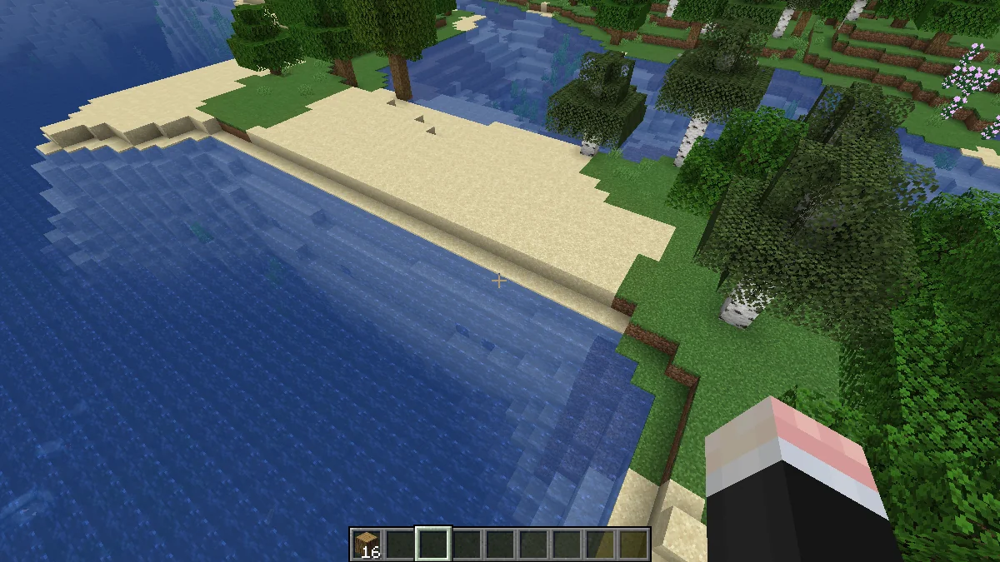

다시 땅으로 내려가 서바이벌 모드로 전환하려는 찰나, 일직선 지형이 눈에 들어왔다.

마인크래프트에서 직선으로 된 지형은 잘 나타나지 않기 때문에, 설마 청크를 생성하다가 버그가 나 청크가 깨진 것인가 걱정하며 그곳으로 가보았다.

다행스럽게도 매우 정상적인 청크였다.

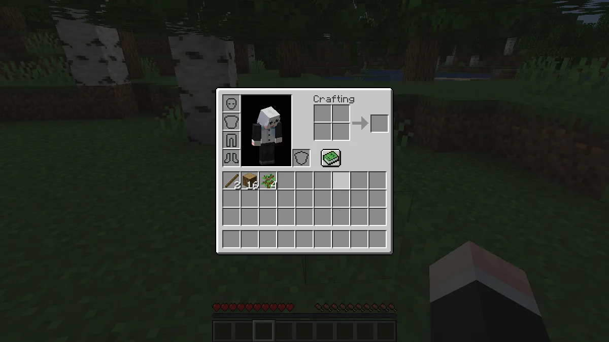

또다시 모드가 그리워졌다. 바로 인벤토리 정리 때문이다.

평소의 마인크래프트라면 이 화면에서 `R` 키를 눌러 인벤토리 정리 모드로 인벤토리를 정리했겠지만, 이번 월드의 컨셉은 '그 어떠한 모드나 플러그인 없이 가장 최신 마인크래프트 버전을 플레이하는 것'이기 때문에 모드를 설치하고 싶다는 유혹을 애써 참고 있다.

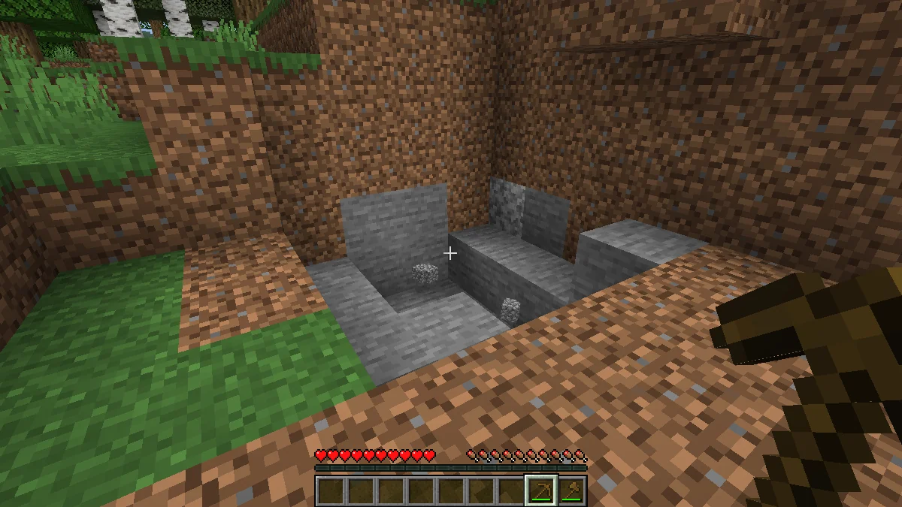

마인크래프트를 플레이하는 데 있어 중요한 것이 두 가지가 있다.

바로 집터와 광산터이다.

&nbsp;

집터는 당연히 집을 지어야 그 안에 상자나 화로 등을 배치해 생활할 수 있기에 중요하다.

광산터 역시 어디에서 어느 방향으로 굴을 파 내려갈 것인가 결정하는 중요한 요소이다. 이걸 잘못 결정했다간 아무리 땅을 파도 다이아몬드를 발견할 수 없거나, 대각선으로 파 내려가다 지하 절벽을 만나 떨어질 수 있다.

&nbsp;

이번 월드에서는 적당한 집터는 찾았는데 그와 가까운 곳에 적당한 광산터가 없어, 그냥 집 주변에 있던 연못의 한쪽 구석을 파 광산터로 삼았다.

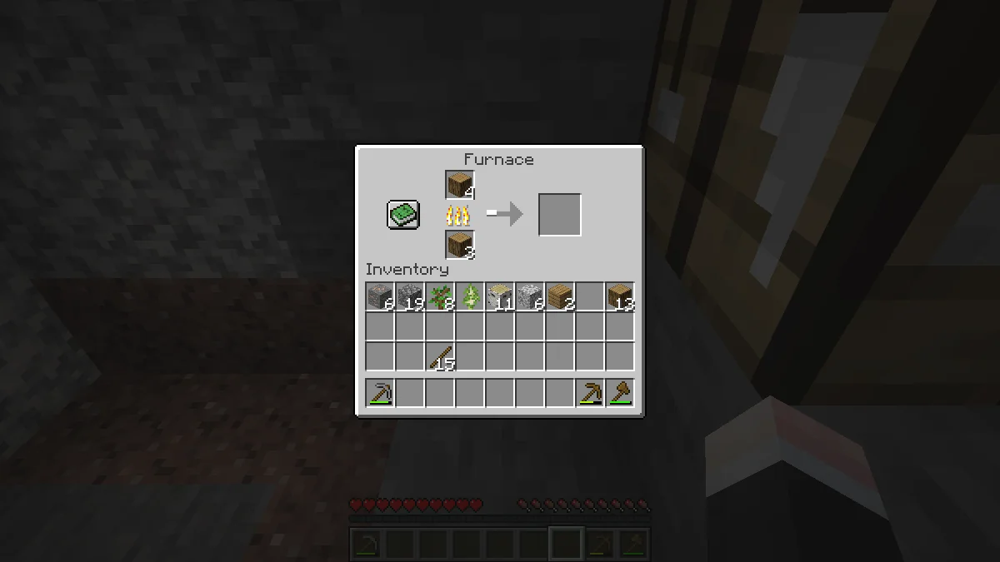

석탄을 찾지 못해 목탄을 굽고 있다.

보통 서바이벌 모드를 할 때는 석탄을 제일 먼저 찾기 마련인데, 이번 월드에서는 석탄이 아닌 철을 제일 먼저 찾았다.

오랜만에 마인크래프트를 해서 그런가, 이런 것마저 새롭게 느껴진다.

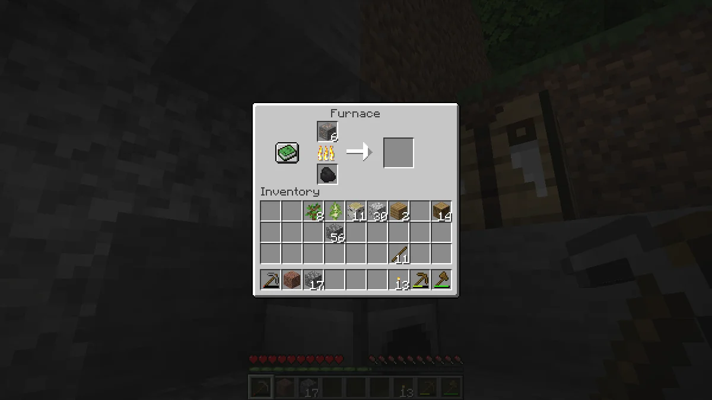

철 역시 화로에 구워서 철 도구를 만들 생각이다.

여태껏 팅커스 컨스트럭트 모드를 쓸 때처럼 철 원석을 모으며 '나중에 용광로를 만들어서 이 철을 두 배로 불려야지'라고 생각하고 있었다.

여긴 모드가 없지, 참.

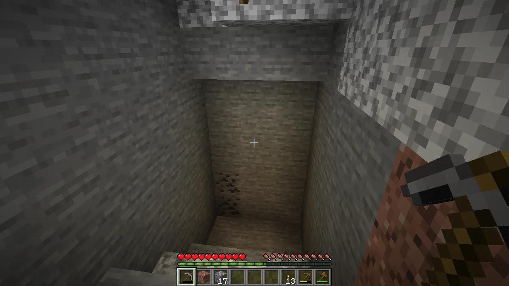

이제야 석탄이 나왔다.

&nbsp;

내가 광질을 하는 방식은 어느 마인크래프트 버전을 플레이하든, 어느 모드 팩을 플레이하든 동일하다.

바로 가로 3칸, 세로 6칸짜리 사각형을 한 칸씩 내려가며 파는 것이다.

가끔 더 높은 천장을 위해 세로로 7칸을 팔 때도 있지만 대부분은 6칸으로 판다.

이는 팅커스 컨스트럭트 모드에서 제공하는 해머라는 도구가 한 번에 3x3영역을 팔 수 있으므로 거기에 맞추던 것이 버릇으로 굳어진 것이다.

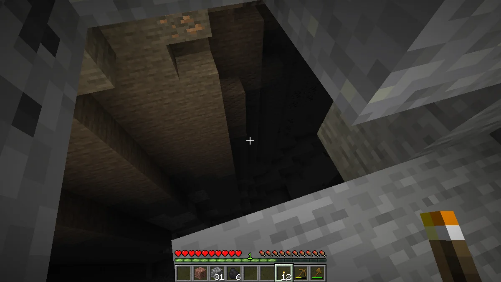

아까 내가 이야기한 것이 바로 이런 상황이다.

지하 협곡을 잘못 만나면 속절없이 아래로 떨어져 낙사하거나, 아래에 생성된 몹에게 맞아 죽을 수 있다.

게다가 내 성격상 이런 지하 협곡을 만났다고 옆으로 돌아가거나 다른 방향으로 파 내려가지 않고 그대로 계단을 만들며 내려가기 때문에 지하 협곡은 더 위험하다.

정신없이 광질을 하다 보니 자원이 꽤 많이 모였다.

석탄도 충분하겠다, 내친김에 그럴듯한 집을 지었다.

&nbsp;

집의 모양과 크기에도 나만의 규칙이 있다.

* 가능한 한 여러 청크에 걸쳐 짓지 않기
* 정사각형으로 짓기

집을 한 청크 안에 짓는 것에는 여러 이점이 있다.

만약 맵 파일이 손상되더라도 내 집이 있는 청크만 무사하다면 나머지 손상된 청크는 날려버려도 괜찮다.

집 안에 배치한 장치가 청크 경계에 걸쳐진 상태에서 한쪽 청크만 불러와져 장치가 고장 나는 일이 없다.

집을 정사각형으로 짓는 이유는 그래야 나중에 공간을 계산하기 편하기 때문이다.

&nbsp;

보통은 16x16 크기의 집을 짓지만, 이번에는 모드 같은 것이 없으니 9x9의 작은 집을 지었다.

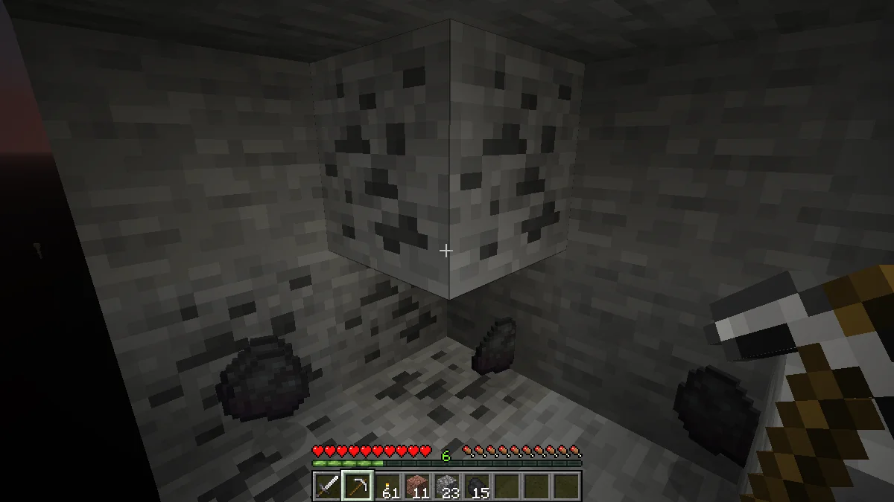

석탄을 열심히 캐다가 버그를 하나 발견했다.

사진에서도 보이듯이, 내 왼쪽 시야에 있는 블록이 투명하게 보인다.

&nbsp;

이 버그가 발생하는 조건이 무엇인지 정확히는 잘 모르지만, 흔히 말하는 엑스-레이로 쓰기에는 블록이 아예 보이지 않기 때문에 그리 유용해 보이진 않는다.

뭐, 어차피 이 버그도 누가 제보했겠지.

&nbsp;

평소 마인크래프트를 할 때 32x32 크기의 리소스 팩을 썼는데, 마인크래프트의 기본 리소스 팩의 크기는 16x16이기 때문에 평소보다 블록의 픽셀이 더 크게 보이는 느낌이다.
