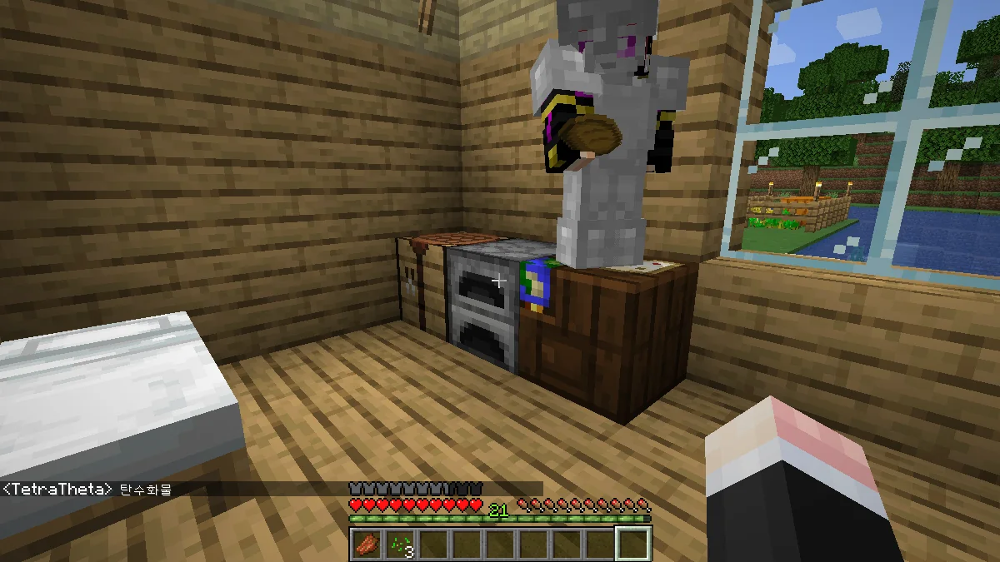

두 번째 이야기.

원래 계획은 싱글 플레이로만 할 생각이었지만, 갑자기 혼자 하기 너무 쓸쓸해 멀티 플레이도 하기로 했다.

버킷과 같은 서드-파티 서버가 아니라 순정 마인크래프트 서버를 열 경우, 월드 파일을 싱글 플레이와 멀티 플레이에서 별다른 변환 과정 없이 그대로 옮겨 쓸 수 있기 때문에 가능한 일이었다.

친구에게 자신이 살 집을 알아서 지으라고 한 후, 나는 지하로 내려와 광질을 시작했다.

드디어 다이아몬드를 발견했다. 심지어 다이아몬드가 여러 개 나와서 더욱 좋았다.

이번 스냅샷을 하는 이유가 네더라이트 장비를 쓰기 위해서임을 생각해 보면, 다이아몬드를 얻었다고 최종 단계의 장비를 만들 수 있는 것은 아니다. 다이아몬드 다음이 바로 네더라이트거든.

&nbsp;

이번의 목표는 모든 도구와 방어구를 네더라이트 장비로 맞추는 것이다.

지상으로 올라와 보니 친구가 어느새 다리를 완성했다. 다른 사람이 만든 것은 어딘가 마음에 들지 않는 부분이 있기 마련인데, 이 다리는 내 마음에 쏙 드는 다리이다.

&nbsp;

집 근처에 삼지창을 든 좀비가 나왔다길래 다급하게 지원을 나갔다.

삼지창을 맨몸으로 맞으면 매우 아프다.

심지어 그걸 참아가며 좀비를 잡았는데 삼지창을 떨어트리지 않았다.

뭐... 그럴 수도 있지.

다리에 계단이 없어 다리를 올라갈 때 매번 스페이스 바로 뛰어야 했기 때문에, 다리에 계단을 추가하기로 했다.

일단 내 집 쪽에 있는 부분에 계단을 추가한 후 친구 집 쪽 부분에도 계단을 추가하러 가는데, 친구 역시 자기 집 쪽에 계단을 추가하고 내 집 쪽에 계단을 추가하려고 오고 있었다.

서로 똑같은 생각을 하고 있었던 것인데, 다른 사람과 같이 게임을 하면서 이렇게 마음이 잘 맞은 적이 없었다.

밤에 자지 않는 나쁜 어른이를 혼내주기 위해 팬텀이 습격하는데, 이게 너무나도 거슬려 침대를 만들기로 했다.

그런데 왜 주변에 양이 없지? 아까 분명 양이 있었다고 한 소리를 들은 것 같은데...

결국 양 세 마리를 찾아 침대를 만들었다.

침대를 검은색으로 염색하고 싶었지만, 먹물을 찾기가 귀찮아 그냥 흰색 침대로 만들었다.

아까 양을 찾다가 우민 순찰대와 마주쳤는데, 아무 생각 없이 몰살시켰다.

이 월드를 시작한 지 얼마 되지 않은 것 같은데, 꽤 일찍부터 우민 순찰대가 나타나는 것 같다.

&nbsp;

우민 순찰대가 들고 있던 배너는 집 입구 옆에 붙여두었다. 이쁘네.

내가 우민 순찰대와 투닥대는 동안, 친구는 보물 지도를 찾았다.

지금 친구가 손에 든 것이 바로 보물 지도인데, 이 근처에 보물이 있다고 한다.

지도의 왼쪽 윗부분이 이미 밝혀져 있던데, 그렇다면 정말 여기와 가까운 곳일 것이다.

나는 평소 마인크래프트의 언어를 영어로 설정하고 플레이한다.

모든 모드가 한국어로 번역이 되어 있으리라는 보장이 없기 때문에, 한국어로 마인크래프트를 플레이할 경우 한국어 사이에 영어가 나타날 수 있기 때문이다.

그걸 별로 신경 쓰지 않는 사람도 있겠지만, 난 그게 너무나도 신경 쓰인다. 그래서 차라리 모든 모드가 100% 지원할 영어로 마인크래프트를 플레이하는 것이다.

하지만 이번에는 그 어떤 모드도 쓸 생각이 없기 때문에 다시 한국어로 마인크래프트를 플레이해도 될 것 같다.

보물 지도가 가리키는 위치까지 왔는데, 보물이 전혀 보이지 않는다.

위키를 뒤져보니 '보물상자는 해당 지역 근처에서 발견할 수 있는 블록으로 둘러싸여 있다'라고 되어 있는데, 아무리 주변을 뒤져보아도 보물상자가 있을 것 같은 곳이 보이지 않았다.

결국 관전자 게임 모드로 전환해서 벽을 투시한 끝에서야 보물상자를 찾을 수 있었다.

&nbsp;

위 사진에서는 이미 주변을 정리해서 상자가 보이지만, 원래 저 상자는 벽에 완전히 파묻힌 상태에서 외부에 돌 블록 하나만 노출하고 있었다.

이걸 어떻게 찾아!

흑요석을 먼저 캘 것인가, 아니면 농경지를 먼저 만들 것인가로 고민했다.

장기적으로 보면 농경지를 먼저 만들어 안정적인 식량 공급을 꾀하는 것이 옳다고 생각되어 농경지를 만들기 시작했다.

농경지의 형태는 늘 만들던 대로 9x9의 농경지를 바둑판처럼 여러 개 배치하는, 대량생산에 적합한 형태다.

농경지도 다 만들었겠다, 흑요석을 캐기 위해 또다시 지하로 내려갔다.

광질 중 발견한 용암 호수로 가는 길을 기억하고 있었던 터라, 별로 힘들이지 않고 흑요석을 여럿 얻을 수 있었다.

마법 부여대를 만드는 데에 흑요석이 4개가 필요하고, 지옥문을 만드는 데에 흑요석이 14개가 필요하다.

총 18개의 흑요석만을 캐고 다시 지상에 올라와 지옥문을 만들었다.

이번에 지옥문을 만들 때는 마치 반지하처럼 지옥문이 땅에 약간 파묻히도록 만들어봤다.

&nbsp;

보다시피 지옥문 근처를 전부 벽돌로 만들었는데, 이걸 만들기 위해서 엄청난 양의 점토가 들어갔다.

만약 내가 보이는 석탄마다 그냥 지나치지 않고 전부 캐지 않았더라면 점토를 구울 석탄이 부족했을 것이다.

지옥문은 만든다고 끝이 아니다. 그 안에 들어가서 주변 환경을 파악하는 것도 해야 한다.

두 바이옴 사이에 위치한 지옥문이라니, 이번 지옥문은 운이 좋다.

&nbsp;

내가 평소 즐겨보던 유튜버의 지옥문은 세 바이옴 사이에 자리 잡고 있던데, 거기까지 바라는 것은 과욕일 것이다.

첫 수확의 결실을 친구에게 주었다.

빵은 밀로 만들고, 밀은 곧 탄수화물이니, 탄수화물을 찬양할지어다.

지하에서 캐온 다이아몬드 3개를 친구에게 주어 다이아몬드 곡괭이를 만들게 시켰다.

친구가 그 다이아몬드로 곡괭이를 만들었는지 만들지 않았는지는 잘 모른다.

농작물들이 잘 자라고 있다.

&nbsp;

밀이 생산성이 좋은 편이다 보니, 주식은 밀로 만든 빵이 될 예정이다.

그 외에도 종이를 많이 만들기 위한 사탕수수와 기타 요리 재료인 호박이나 감자도 키우고 있다.

&nbsp;

WAILA 모드가 있었더라면 농작물이 얼마나 자랐는지 한눈에 확인할 수 있었을 텐데... 모드에 너무 길든 것일까, 나는.
