컴퓨터를 포맷했다.

칩셋 드라이버를 잘못 설치한 탓인지, 간혹 오디오가 길게 늘어지는 버그가 생겼다.

거기다가 게임이나 프로그램이 별다른 이유 없이 강제 종료되기도 해서 그냥 큰마음을 먹고 컴퓨터를 포맷했다.

&nbsp;

컴퓨터를 포맷할 때는 컴퓨터에 있는 모든 드라이브를 포맷하기 때문에, 미리 파일을 따로 백업하지 않으면 파일이 영영 사라진다.

마인크래프트 월드를 백업하지 않은 줄 알고 아쉬워하고 있는데 MultiMC를 열어보니 여태 하던 맵이 그대로 들어있었다. 맵을 미리 백업해 둔 것이다.

&nbsp;

16x16 크기의 기본 리소스 팩을 보다 보니 내 눈도 정사각형으로 변할 것 같아 별도의 리소스 팩을 쓰기로 했다.

이번에 적용한 리소스 팩은 두 가지이다.

* [Faithful Team의 공식 홈페이지](https://faithful.team/downloads/)에 올라온 Faithful Snapshot 리소스 팩
* [Mc둥근모](https://eatch.dev/dgm/) 한글 폰트 리소스 팩

단순히 텍스처와 글꼴을 개선하는 리소스 팩이니만큼, 이 정도는 내가 처음에 정한 제한 사항을 위반하지 않는다. 게다가 이 리소스 팩의 적용 역시 마인크래프트가 기본적으로 제공하는 기능이니까.

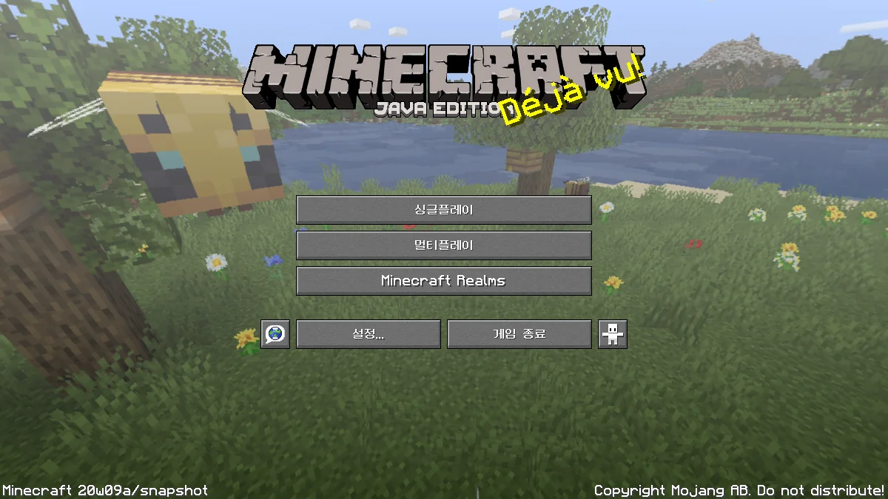

보라! 이 아름다운 자태를!

마인크래프트의 기본 한국어 글꼴은 너무 가늘어서 보기가 힘들었는데, Mc둥근모 글꼴을 적용하니 훨씬 보기 편하다.

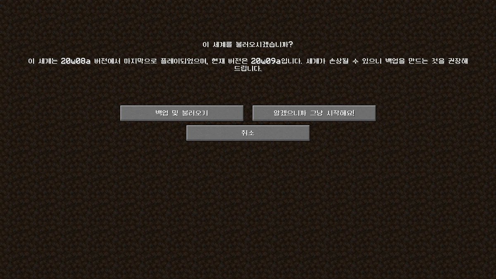

내가 '그냥저냥 002' 편을 쓴 날, 새 마인크래프트 스냅샷이 나왔다고 한다.

이전 버전에서 만든 맵을 20w09a 버전에서 불러오려니 이런 경고 메시지가 나타난다.

&nbsp;

혹시 1.16이 정식 출시될 때 스냅샷과 다르게 무언가가 확 바뀌진 않겠지? 만약 그렇게 된다면 나는 이 월드를 버리고 새로운 월드를 만들어야 할 것이다.

기껏 만들어 놓은 것을 포기하기는 매우 아깝지.

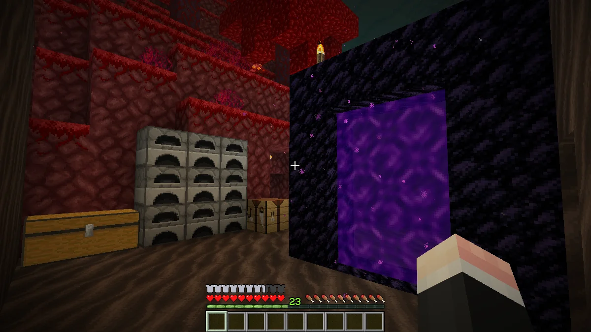

지옥문 너머를 조금 개척해 두었다.

하늘에서 언제 가스트가 화염구를 날려 지옥문을 터트릴지 모르기 때문에, 가스트가 화염구를 날리더라도 지옥문에 닿지 않도록 높은 벽을 쳤다.

그리고 여기서 네더라이트를 캐다 나온 네더랙은 전부 구워서 네더 벽돌로 만들 생각이다. 네더 벽돌은 이쁘니까.

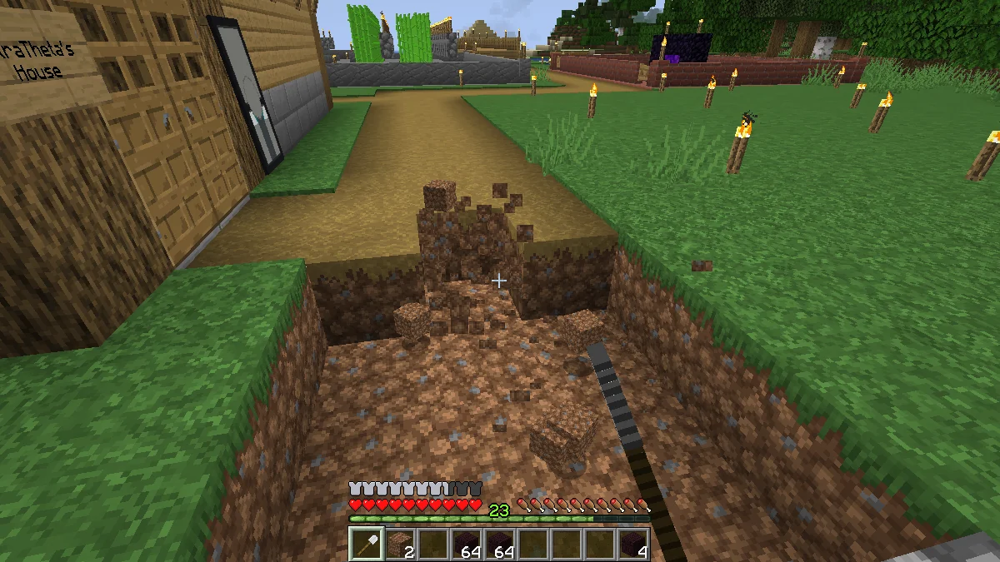

네더랙은 매우 부드럽기 때문에, 금방 많은 양이 모였다.

그걸 전부 네더 벽돌로 만든 후, 기존에 깔아둔 잔디 길을 네더 벽돌로 교체하기 시작했다.

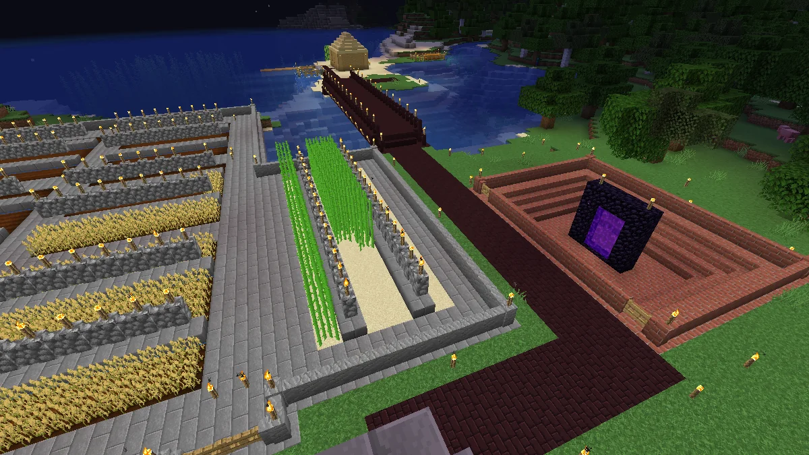

작업 끝.

기존에 있던 다리 역시 전부 네더 벽돌로 통일시켰다.

밟으면 속도가 빨라지는 특성을 가진 블록이 있다면 그걸 네더 벽돌 대신 깔았을 것이다. 하지만 내가 알기로 그런 블록은 마인크래프트에 없지...

어차피 남는 것이 네더 벽돌이니, 지옥에서도 바닥을 네더 벽돌로 깔 생각이다.

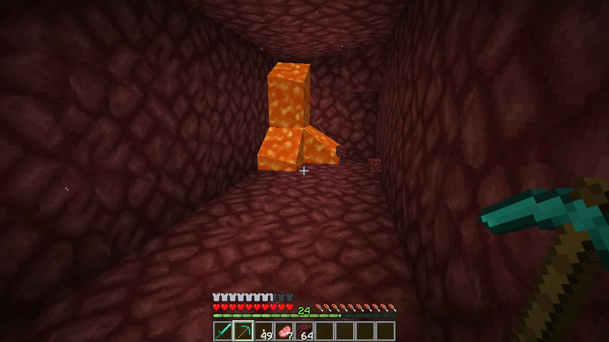

지옥에서는 절대로 생각 없이 굴을 파면 안 된다.

지옥에서의 용암은 오버월드에서의 물처럼 빠르고 넓게 퍼지기 때문에, 자칫하다간 용암 족욕 끝에 갖고 있던 아이템과 목숨을 잃을 수 있다.

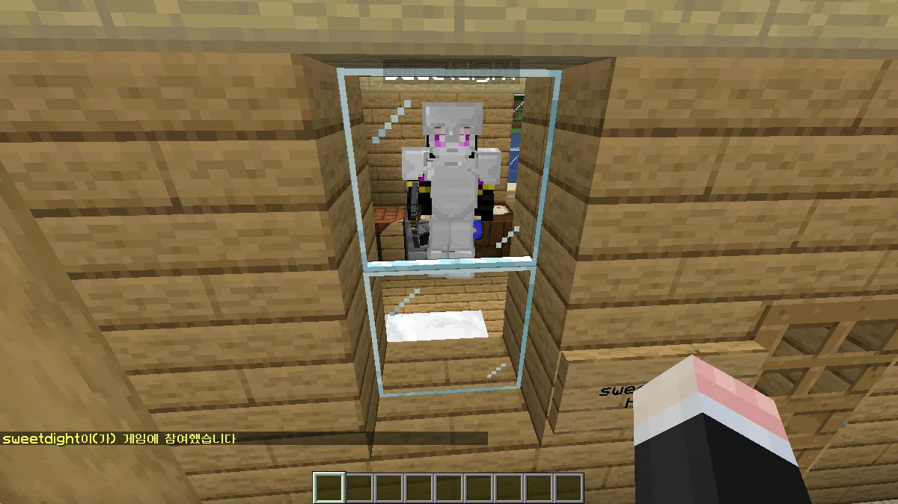

친구를 또다시 불렀다.

요즘은 이런저런 새로운 게임들이 많이 나와, 마인크래프트를 계속하는 사람이 더 적어졌다.

당장 나도 3월 2일 오후 8시가 되자마자 디비전 2의 새 확장팩을 통해 뉴욕 여행을 떠날 것이기 때문에 그 이후에는 마인크래프트를 하지 않을 것 같고.

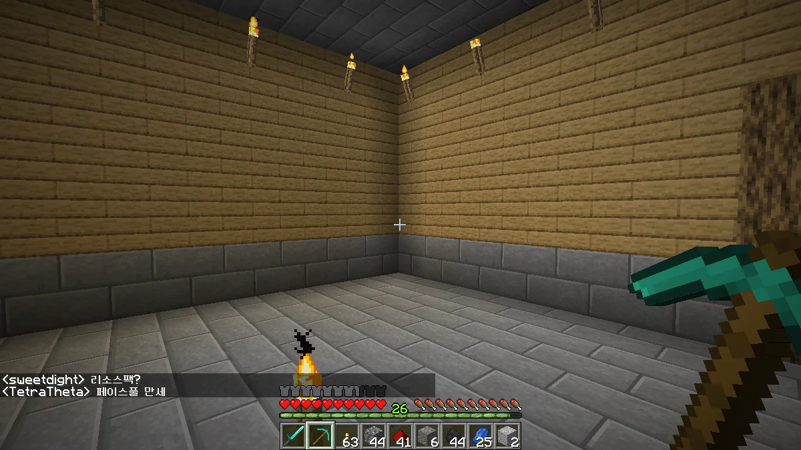

이 깔끔하고 아름다운 집 내부를 보라. Faithful 리소스 팩을 내가 괜히 좋아하는 것이 아니다.

지금까지 쓴 그 어떤 리소스 팩보다 더 마음에 드는 것이 Faithful 리소스 팩이다.

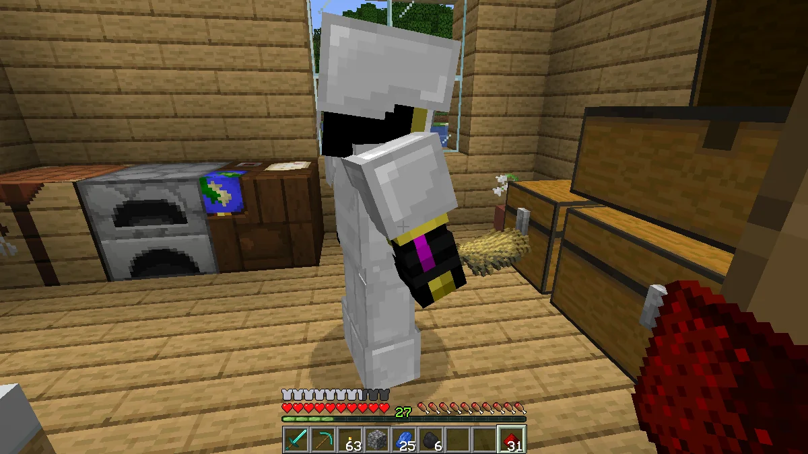

레드스톤이 필요하다는 친구에게 내가 갖고 있던 레드스톤을 조금 주고 왔다.

친구의 집은 볼 때마다 아주 작다고 생각하지 않을 수 없다. 극한의 미니멀리스트라고 해야 할까, 이걸?

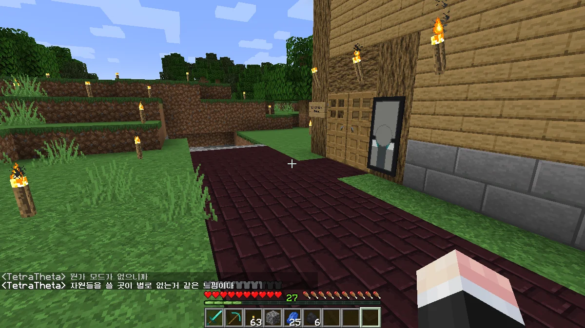

레드스톤이 남아도는 이유는 간단하다.

팅커스 컨스트럭트 도구에 레드스톤을 바르면 도구의 효율이 올라가기 때문에 레드스톤을 보는 족족 전부 캐는 버릇이 들었다.

하지만 지금 하는 월드에는 팅커스 컨스트럭트 모드가 없다. 내가 레드스톤 회로를 이용해 무언가를 만들 수 있는 사람도 아니기 때문에, 자연스럽게 레드스톤이 남아돌게 되는 것이다.

물론 나중에 철로를 깔게 된다면 레드스톤을 쓰게 되겠지만, 그건 한참 나중의 일이겠지.

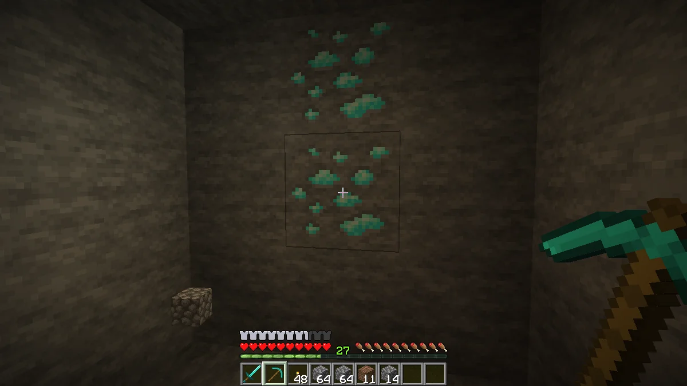

그동안 파던 방향에서 90도 꺾어 판 지 얼마 되지 않았는데 다이아몬드가 또 나왔다. 이제 다이아몬드 도구와 방어구를 전부 갖추기까지 얼마 남지 않았다.

하지만 그 전에 내가 네더라이트 주괴를 구할 수 있을까?

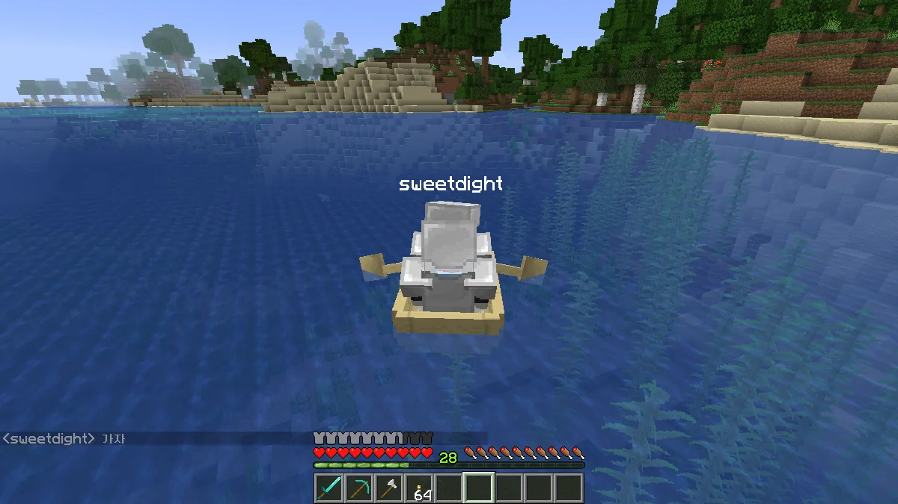

친구가 바다 밑에 있는 유적 비슷한 것을 발견했는데, 그 주변에 익사체가 너무 많아 접근하기 두렵다고 한다.

둘이 함께 가면 되겠지.

이때 나는 머리가 좀 멍한 상태였기에, 내가 집 좌표를 외우지 않은 채 무작정 친구를 따라가고 있음을 눈치채지 못했다.

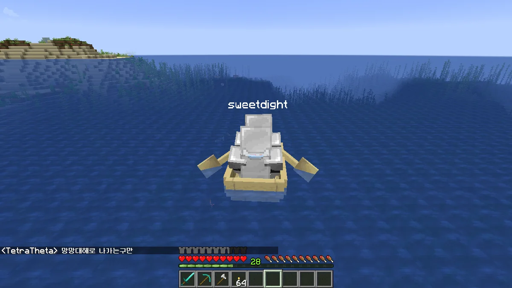

친구가 말한 그곳까지 직선 경로로 가고 있기 때문에, 배를 타고 가다가 내려서 한참 땅 위를 달리다가 물을 만나면 또다시 배를 타는 식으로 이동 중이다.

그러다 문득 정신을 차려보니 우리는 망망대해로 나아가고 있었다.

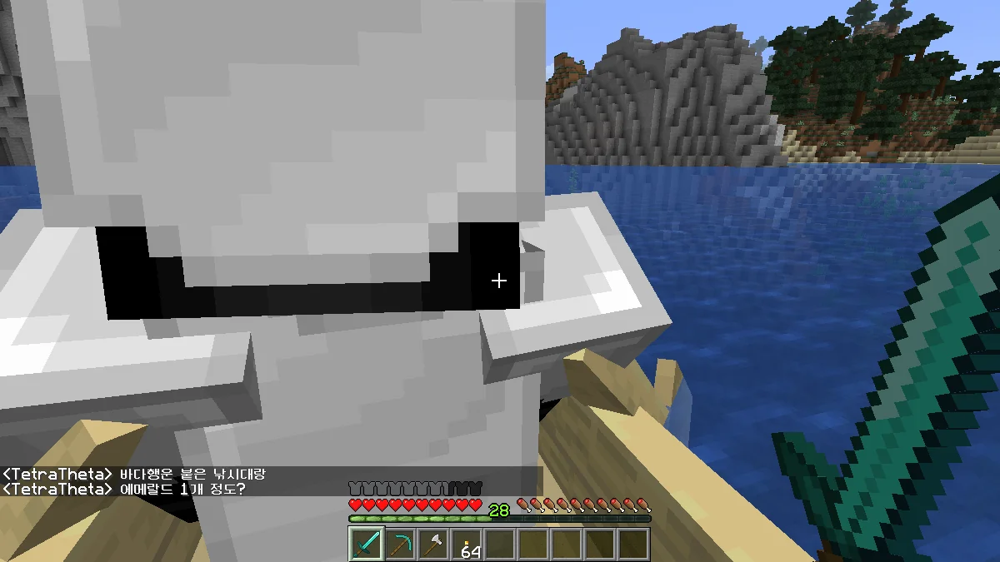

친구가 말한 구조물은 내가 생각하던 바다 밑 피라미드가 아니었다. 그냥 작은 우물 같은 것이 있는 정도였는데, 그 밑에 보물상자가 있었다.

하지만 상자 안의 내용물은 그리 좋지 않았다.

에메랄드 1개와 '바다의 행운' 마법이 부여된 낚시대 하나 정도가 그나마 쓸만한 수확이었다.

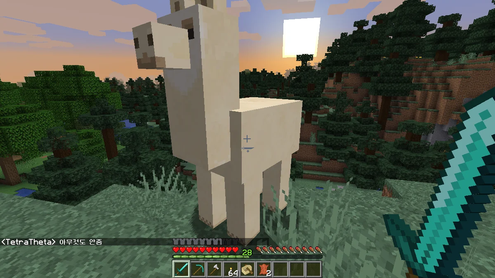

라마는 잡아도 고기나 가죽을 주지 않는다. 그럼, 대체 왜 있는 거야?

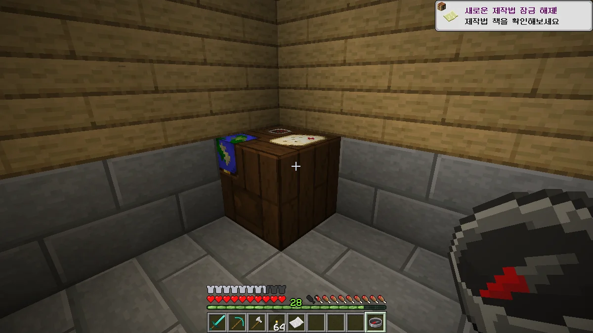

우리가 집으로 무사히 돌아올 수 있었던 것은 친구가 미리 지도를 만들어 둔 덕분이었다.

미니맵 모드가 없는 지금, 나 역시 지도를 만들어 항상 휴대하고 다니지 않으면 집을 잃어버릴 수 있다.

그래서 나도 친구처럼 지도를 만들기로 했다.

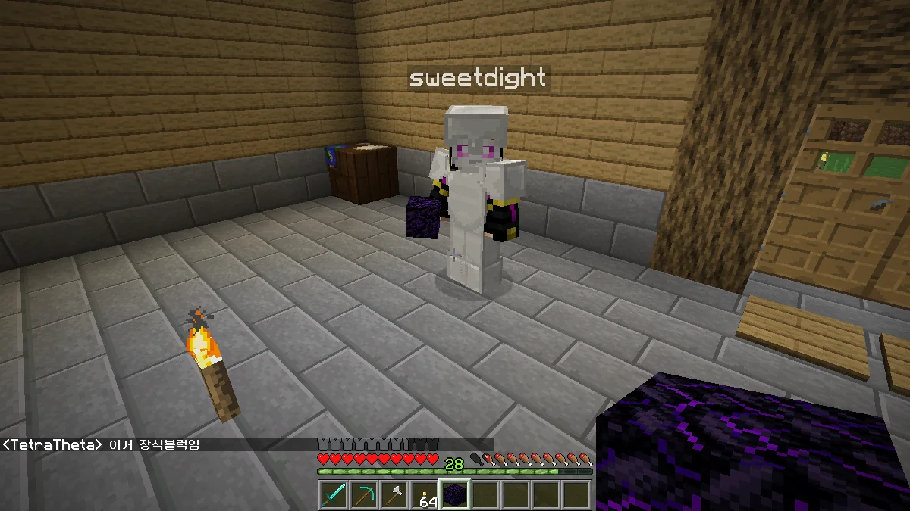

내가 지도 제작대와 씨름하는 동안 친구는 언제 지옥에 다녀온 것인지 금 갑옷 없이 피글린과의 거래를 시도하다가 흠씬 얻어맞질 않나, 거래했더니 '우는 옵시디언' 블록을 얻질 않나, 꽤 재미있는 체험을 하고 왔다.

피글린과의 금괴 거래는 짭짤하다면 짭짤하고, 창렬이라면 창렬인 느낌이라 아직 나는 시도하지 않았다.

안 그래도 금 찾기가 힘든데 뭐가 나올지도 모르는 거래에 금을 소비하고 싶지 않거든.

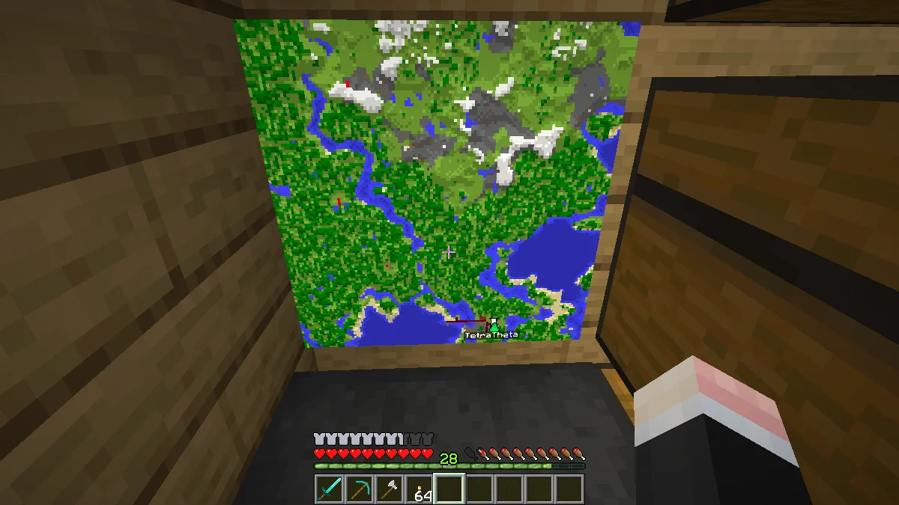

일단 우리 집이 표시된 지도를 만들었다. 지도를 두 번 축소했으니, 지도의 축척이 얼마나 되는지는 잘 모르지만.

우리 집은 저번에 우민을 잡고 나온 배너를 이용해 표시했다.

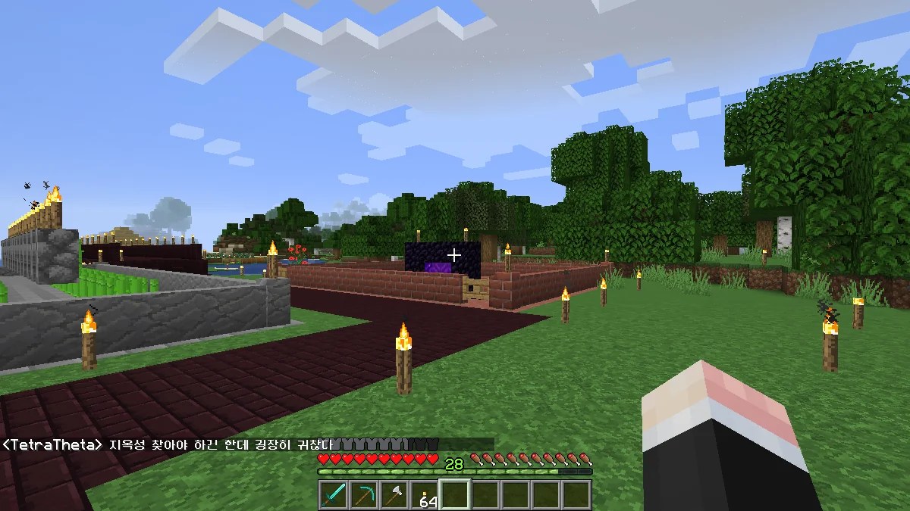

지옥에서 마련해야 할 것은 네더라이트뿐만이 아니다.

지옥에서는 전투를 피할 수 없기 때문에, 전투를 대비한 포션도 만들어야 한다.

하지만 그러려면 지옥 요새를 발견해야 하는데, 그걸 어떻게 일일이 돌아다니며 찾지? 너무 귀찮은데...

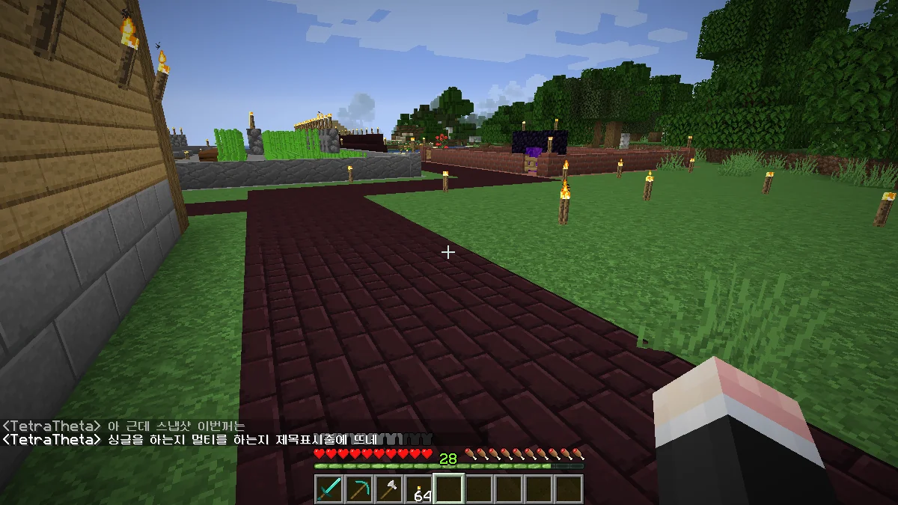

이번 스냅샷에서 창 제목 표시줄에 새로운 요소가 적용되었다.

이제 마인크래프트에서 어떤 활동을 하고 있는지가 표시된다. 내가 싱글 플레이를 하고 있는지, 멀티 플레이를 하고 있는지, 싱글 플레이에서 LAN 서버를 열어 플레이하고 있는지와 같은 정보가 나타난다는 것이다.

이건 꽤 유용할 것 같다.
