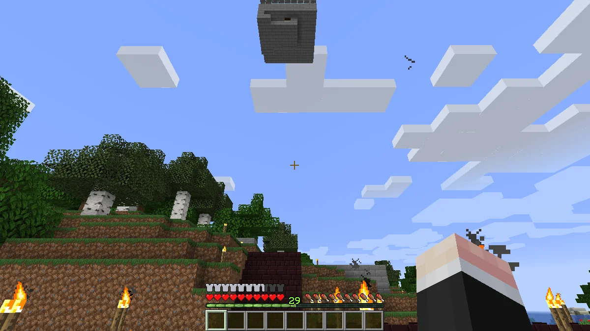

디비전 2는 제작진들이 월클병에라도 걸린 것인지, 1편 때의 불릿 스펀지가 다시 돌아왔다.

의욕이 급격히 떨어졌다.

&nbsp;

이럴 때에는 역시 마인크래프트가 최고다.

광산에 철로를 깔아놓았다.

지옥에 만든 광산에도 마찬가지로 철로를 깔려 하니까 자원들이 쑥쑥 빠져나간다.

그래, 지금까지 자원을 모아둔 건 다 이걸 위한 거였지.

지옥 쪽의 지옥문 근처도 이렇게 대충 꾸며놓았다. 철이 많이 들었지만 상관없어.

&nbsp;

이 정도의 시설이라면 오버월드로 가지 않고 지옥에서 계속 살아도 될 것 같다.

식량은 호글린을 잡아 나오는 돼지고기로 해결할 수 있고, 나무나 연료는 지옥에 자라는 나무를 이용하면 된다.

철이 굉장히 부족한 상황이다. 철로를 까는 데에 철이 많이 들다 보니 어쩔 수 없다.

&nbsp;

이 문제를 해결하려면 자동화된 철 농장을 만들 수밖에 없다.

철 농장은 저기 강 건너편에 만들 생각이다.

&nbsp;

나중에 여유가 된다면 저곳에 철 농장 말고도 다른 자동 농장을 지을 생각이다.

철 농장을 짓기 전에 집 주변에 자란 나무를 모두 정리했다.

밤만 되면 나무 그늘 밑에서 몹이 나타나는 통에 여간 거슬리는 것이 아니었다. 이렇게 하면 밤에도 집 주변이 밝을 테니 몹이 나타나는 일은 없을 것이다.

&nbsp;

어디 횃불 말고 좀 더 자연스러운 조명이 없을까? 횃불은 그 크기가 작긴 하지만 인위적이라는 느낌을 지울 수 없다.

지옥에서 광질을 하다 보면 네더랙이 남아돈다. 거긴 돌 대신 네더랙이 있는 곳이니까.

그래서 넘쳐나는 네더랙을 이용해 네더 벽돌을 만들어 건너편으로 향하는 다리를 만들었다.

모드나 플러그인 없이 바닐라 마인크래프트에서는 청크 로더를 절대로 만들 수 없을 줄 알았는데, 아니라고 한다.

이렇게 두 청크 경계에 깔때기를 서로에게 연결한 후 깔때기에 아무 아이템이나 하나 넣어두면 깔때기가 맞은편 깔때기에 아이템을 보내기 위해 맞은편 청크를 계속 활성화한다고 한다.

&nbsp;

어차피 혼자 하는 마인크래프트 월드이니, 청크 두어 개 정도가 더 활성화된다고 해서 성능에 문제가 생기지는 않을 것이다.

철 농장을 완성했다.

주민이 좀비를 보고 공포에 질리면 마을을 지키기 위해 철 골렘을 생성한다.

생성된 철 골렘은 물살에 떠밀려 아래로 떨어지고, 그곳에 설치된 용암에 의해 대미지를 입고 죽어 철 주괴를 남기는 구조이다.

용암을 바닥에서 한 칸 떨어지도록 설치하면 용암에 의한 대미지는 입지만 골렘이 죽고 떨어트리는 철 주괴와 꽃은 용암에 닿지 않기 때문에 가능한 방법이다.

&nbsp;

유튜브에서 적당한 영상을 찾아 보고 그대로 따라 해서 만들었는데, 아무래도 철 골렘의 생성 속도가 느린 것 같아 하나 더 만들었다.

아주 잘 굴러가네! 벌써 철 주괴가 10개가 모였다.

정말 잘 만든 구조이다.

만들기에 따라서 무한하게 확장이 가능할 것으로 보인다. 당장 이걸 마주 보게 만들면 4코어가 되고, 위로 한 번 더 쌓으면 8코어가 된다.

오, 철 골렘 두 마리가 동시에 생성되는 건 드문 일인데...

지금 설계에서는 철 골렘이 하나씩 용암에 닿는 구조이기 때문에 철 골렘을 죽이는 속도가 느린 것 같다. 나중에 이걸 개선해 봐야겠다.

다시 지옥으로 향했다. 아직 네더라이트를 얻지 못했다.

이걸 시작한 이유가 네더라이트 장비를 갖추는 것이기 때문에, 네더라이트를 얼른 모아야 한다.

&nbsp;

* 갑옷: 투구, 흉갑, 레깅스, 부츠 - 네더라이트 주괴 4개
* 도구: 곡괭이, 삽, 도끼, 칼 - 네더라이트 주괴 4개

총 8개의 네더라이트 주괴가 필요하다.

처음으로 네더라이트를 얻을 수 있는 '고대의 잔해'를 발견했다.

이걸 캐면 되긴 한데... 너무 안 나온다. 어찌 된 것이 다이아몬드보다 찾기 힘든 것 같다.

주변을 샅샅이 뒤져 몇 개의 고대의 잔해를 더 찾아낸 후 싱글벙글하며 집으로 돌아가는 중이다.

고대의 잔해 한 개를 화로에 구워봤는데 네더라이트 주괴가 나오는 것이 아니라 네더라이트 파편이 나온다.

조합법을 알아보니 네더라이트 파편 4개를 금 주괴 4개와 조합해야 네더라이트 주괴 1개가 나온다고 한다.

뭐야, 그러면 고대의 잔해를 8개가 아니라 32개나 찾아야 하는 거야? 이런 젠장맞을.

&nbsp;

네더라이트는 너무 창렬이다.
