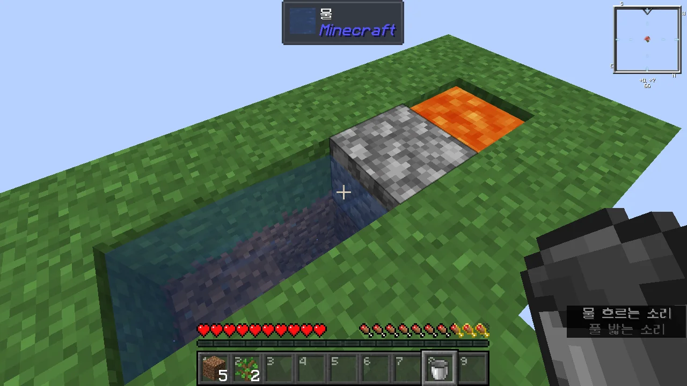
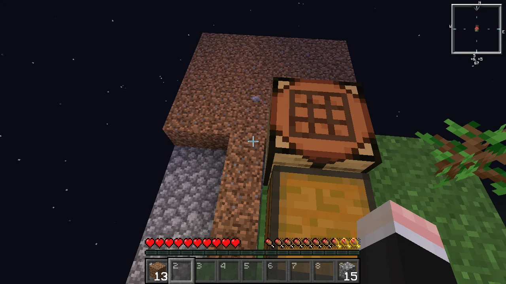

마지막으로 블로그에 마인크래프트 글을 쓴 것이 20년 3월이니, 벌써 4년이라는 시간이 지났다.

4년이란 시간 동안 마인크래프트를 아예 플레이하지 않은 건 아니다. 가끔 잊을만하면 마인크래프트 멀티플레이 서버를 만들어, 지인들과 함께 즐기곤 했다.

하지만 나와 다르게, 사람들은 마인크래프트에 금방 흥미를 잃었다. 대여섯 명이 동시에 접속하던 서버에는 어느새 나 혼자밖에 남지 않게 되었고, 나 역시 홀로 외로이 땅을 파다 마찬가지로 게임에 흥미를 잃게 되어, 서버를 완전히 닫고 관련 파일을 삭제하길 여러 번 반복했다.

멀티플레이 서버를 플레이 한 시간도 그리 길지 않았는데, 그 내용조차 딱히 블로그에 쓸만한 내용이 아니었기에, 이 카테고리는 4년 동안 정전 상태였다.

***

그러던 오늘, 갑자기 마인크래프트 싱글플레이가 하고 싶어졌다. 마인크래프트 싱글플레이에는 여러 콘텐츠가 있지만, 그중에서도 '스카이블록(Skyblock)'이 하고 싶어졌다.



이 영상을 보니, 스카이블록이 매우 하고 싶어 지더라고.

&nbsp;

스카이블록 맵은 역사가 굉장히 오래되었다. 스카이블록 v1.1이 마인크래프트 Beta v1.7.3(11년 7월 출시)용 맵이었으니, 처음 나온 후 13년이 다 되어가는 맵이다.

10년이 넘는 시간 동안 마인크래프트에는 여러 요소들이 추가되었고, 그에 따라 스카이블록 맵 역시 새로운 콘텐츠에 맞춘 업데이트를 필요로 하게 되었다. 하지만 원 제작자 역시 마인크래프트에 흥미를 잃은 건지, 스카이블록 맵의 마지막 버전인 v2.1은 마인크래프트 v1.16.4(20년 11월 출시)용 맵이며, 그다음 버전용 업데이트는 아직도 없다.

다행스러운 점은, 이미 다른 여러 사람들이 각자만의 스카이블록 맵을 공개하고 있다는 것이다. 원 제작자가 더 이상 맵을 업데이트 하지 않더라도, 다른 사람이 만든 스카이블록 맵을 쓰면 되는 것이다.

&nbsp;

이번에 내가 플레이할 마인크래프트의 버전은 v1.20.6이므로, 스카이블록 맵이 지원하는 버전 역시 v1.20.6 혹은 v1.20.5 --- v1.20.5와 v1.20.6은 큰 차이가 없다 --- 이어야 했다. 그렇지 않으면 새로 추가된 콘텐츠를 즐기지 못할 테니 말이다.

처음 선택한 맵은 정식으로 v1.20.5를 지원하는 [Skyblock 1.20](https://www.planetminecraft.com/project/skyblock-1-20)이었다. 하지만 맵을 플레이하던 중, 한쪽 방향으로 계속 이동하면 정해진 맵 영역을 벗어나 바다와 숲, 사막이 생성된 원래 오버월드로 갈 수 있다는 걸 발견해, 맵을 삭제 했다.

내 기준에 따르면, 스카이블록 같은 맵은 아무리 멀리 가도 원래 오버월드로 갈 수 없어야 한다. 만약 원래 오버월드로 갈 수 있다면, 뭐 하러 열심히 스카이블록을 하겠는가? 그냥 다른 것 다 집어치우고 원래 오버월드로 간 다음, 거기서 살면 될 텐데.

그래서 생각한 것이 데이터팩을 이용한 스카이블록 맵이었다. 새 월드를 만들 때 월드 생성기 데이터팩을 미리 집어넣으면 그 데이터팩의 내용대로 월드가 만들어지기 때문에, 새 월드를 만들 때 스카이블록 월드 생성기 데이터팩을 쓰면 스카이블록 월드가 만들어질 것이다. 물론, 내가 원하던 것처럼, 한 방향으로 아무리 가도 원래 오버월드를 절대 볼 수 없을 것이고.

[BluePsychoRanger의 데이터팩](https://github.com/BluePsychoRanger/SkyBlock_Collection)이 검색 결과 상위권에 위치해 있길래, 이걸 선택했다. 마인크래프트 v1.20.6까지 정상적으로 지원하며, 내가 원하는 대로 데이터팩을 선택해 적용할 수 있기에, 매우 마음에 들었다.

선택지가 많다는 건 무얼 골라야 할지 머리를 써야 한다는 말과 동일하다. 정확히 어떤 데이터팩을 써야 할지 처음에는 감이 잘 잡히지 않았지만, 공식 문서를 차분히 처음부터 끝까지 읽자, 내가 뭘 받아야 할지 알 수 있게 되었다.

* `skyvoid_worldgen_full_lava_v1_0_5-MC_1_20.zip`
* `skyvoid_island_standard_v1_0_6-MC_1_20.zip`
* `skyvoid_sand_island_v1_0_1-MC_1_20.zip`
* `skyvoid_additions_v1_1_6-MC_1_20.zip`
* `skyvoid_advancements_v1_0_4-MC_1_20.zip`

`skyvoid_advancements_v1_0_4-MC_1_20.zip`와 함께 써야 하는 리소스팩은 이름을 `resources.zip`로 바꾼 다음 월드 폴더 최상단에 두면 된다길래, 그렇게 했다.

&nbsp;

마지막으로 이 카테고리에 글을 쓸 때는 1.16 스냅샷 버전을 플레이했었는데, 지금 플레이하는 버전은 1.20.6이며, 조만간 1.21 버전이 나올 예정이다. 시간 참 빠르네.

***

아무리 콘텐츠가 추가되어도, 마인크래프트는 하염없이 땅을 파야 하는 단순 노동 게임에서 벗어날 수 없다. 몇십 분씩 땅을 파면 지루해지는 것은 당연한 일. 그래서 사람들은 마인크래프트를 할 때 자기가 좋아하는 노래를 따로 틀어 배경음으로 삼으며, 이를 '노동요'라고 부른다.

이번에 내가 선택한 노동요는 [헬다이버즈 2 OST](http://www.youtube.com/watch_videos?video_ids=KDGK78Vtt-A,E4kAHaiP-iU,ZN_g-DHeP_Y,M0_Zvp59TaA,gZOWCQZDNzE,uYzwXWmP2-I,5sHOHrNGOCo,X7EAvik5BQM,4XEZ_WRqOX8,TrFiSyngWc4,f2W45_8Dh-E,Ed9ED5KSHQc,0CFlP4oLAIs,noCwgCocLBU,heS4D6LtMCo,VNUJewTUTh8)였다. 평소 자주 듣던 재생목록이기도 했고, 노래가 가슴이 벅차오를 정도로 매우 신나, 지루함을 덜어줄 수 있었기 때문이었다.

늘 하던 대로, [Vanilla Tweaks](https://vanillatweaks.net/picker/resource-packs/) 리소스팩을 적용했다.

옛날에 마인크래프트를 할 땐 Faithful 같은 x32 리소스팩을 항상 끼고 다녔다. 하지만 Vanilla Tweaks를 한번 맛보고 나니, 더는 Faithful로 돌아갈 수 없게 되었다.

Faithful의 32x32 리소스팩이 싫어진 건 아니다. 하지만 Vanilla Tweaks가 제공하는 여러 편리한 기능들이 너무 좋다. Vanilla Tweaks는 Faithful x32와 호환되지 않을뿐더러, 둘을 같이 섞어 쓰면 전혀 이쁘지 않기 때문에, 둘 중 잊히는 건 자연스럽게 Faithful이 되었다.

Skyblock 1.20을 할 때, 기존 마인크래프트 발전 과제 대신 맵에서 자체적으로 추가한 발전 과제를 사용하는 게 굉장히 인상 깊었다. 이 데이터팩 역시 자체적으로 추가한 발전 과제를 쓴다.

스카이블록 초반에 맵을 리셋해야 하는 경우가 딱 셋 있다.

* 나뭇잎에서 묘목이 단 한 개도 나오지 않았을 경우:  
  나무를 더는 얻을 수 없게 된다.
* 용암이 흑요석으로 변했을 경우:  
  조약돌 생성기를 만들 수 없다.
* 묘목, 용암 양동이, 얼음 중 1개 이상을 들고 공허로 떨어져 죽었을 경우:  
  나무 혹은 조약돌 생성기를 만들 수 없게 된다.

그러니 자연스럽게 'Please Drop...'이라며 묘목이 나뭇잎에서 떨어지길 빌 수밖에. 발전 과제 이름을 참 잘 지었다.

Skyblock 1.20을 할 때에는 굉장히 오랜만의 스카이블록이라, 조약돌 생성기를 만드는 것조차 버벅거리며 곤란해했는데, 그 맵에서 약간의 시행착오를 겪고 나니, 이젠 조약돌 생성기를 만드는 데에 익숙해졌다.



보통 조약돌을 캘 때, 처음 사진처럼 아래를 대각선으로 내려다보며 캐기 마련이다. 그렇게 하면 조약돌 밑에 있는 흙을 잘못 캘 우려가 있는데, 이렇게 내가 한 칸 더 내려와서 캐면 다른 블록을 부술 염려를 하지 않아도 된다.

다만 이렇게 하면 저 뚫린 뒤쪽으로 조약돌이 튀어, 나중에 한번 뒤로 직접 가서 튄 조약돌을 회수해야 하는 귀찮은 일이 생긴다.



섬을 조금 확장하기로 했다. 물을 이용해 엘리베이터를 만든 후, 섬 밑바닥에 조약돌을 붙이는 식으로 플랫폼을 만들면 된다.

스카이블록을 플레이할 때 주의해야 할 점 중 하나가 바로 '모든 잔디 블록을 캐지 말 것'이다. 잔디 블록을 추가로 얻는 방법은 기존에 있던 잔디 블록에서 잔디가 번지는 것 밖에 없는데, 여기서 플랫폼을 확장한답시고 모든 잔디 블록을 캐버리면 더는 잔디 블록을 얻을 수 없게 된다.

왜 잔디 블록이 중요하냐고? 밀 씨앗을 얻을 방법이 그것 말고는 없기 때문이다. 밀 씨앗을 얻으려면 먼저 스켈레톤을 잡아 뼈를 얻은 후, 그걸 갈아 뼛가루로 만들어 잔디 블록에 써야 한다. 거기서 자란 풀을 부수면 낮은 확률로 밀 씨앗이 나온다.

밀은 식량 자원으로써 매우 큰 쓸모가 있기 때문에, 밀 확보는 매우 중요하다.

조약돌 생성기도 개선을 마쳤다. 이제 조약돌이 기반암 위에서 생성되기 때문에, 이전처럼 약간 아래를 바라보고 조약돌을 캐다 그 아래 블록도 같이 캐버릴 걱정을 하지 않아도 된다.

잔디도 잘 퍼지고 있고, 나무도 잘 자라고 있다.



나무가 어느 정도 모인 것 같으니, 곧바로 목탄을 만들기로 했다. 목탄으로 횃불을 만들면, 본격적으로 플랫폼 확장을 시도할 수 있다.

잔디가 아래쪽에 제법 많이 퍼졌기 때문에, 위쪽 잔디 블록을 전부 걷어내었다.

지금은 여기에 화로와 조합대가 같이 있지만, 나중에 플랫폼을 확장하면 화로와 조합대를 다른 곳에 둘 예정이다.

나무 농장을 만들었다.

이 앞은 늪지대 바이옴이기 때문에, 이 앞쪽엔 슬라임 농장을 만들 예정이다. 나무 농장은 좌우로 확장할 수밖에.

아, 사과! 훌륭한 식량 자원이지!

아직 밀 농장을 만들지 못했기 때문에, 당분간은 사과 하나만으로 버텨야 한다.

플랫폼 확장을 위해선 부지런히 조약돌을 캐야 한다.

조약돌을 캐기 위해 계속 마우스 버튼을 누르고 있는 건 지루하기 짝이 없다. 그래서 이번엔 꼼수를 좀 쓰기로 했다.

마우스 버튼을 누른 채로 <kbd>F3</kbd>+<kbd>T</kbd>를 누르면 리소스팩을 다시 불러오는데, 이때 마우스 버튼이 계속 눌린 것으로 게임이 인식한다. 따라서 미리 <kbd>F3</kbd>+<kbd>P</kbd>로 게임 창이 포커스를 잃어도 게임이 일시정지 되지 않도록 해두었다면, <kbd>F3</kbd>+<kbd>T</kbd>로 백그라운드에서 자동으로 조약돌을 캐게 만들 수 있다.

여기서 말하는 'a patch of grass'에 필요한 잔디 블록이 대체 몇 개인지 잘 모르겠다. 지금 내가 갖고 있는 흙 블록의 개수는 약 40개인데, 이걸로 과연 충분할까 걱정된다.

모래섬을 캐기로 했다. 선인장 농사도 농사지만, 모래섬에 있는 상자에서 혹시 흙 블록이 추가로 나오지 않을까 기대하고 있기 때문이다.

그런데 모래섬의 높이가 플랫폼의 것보다 낮다. 보다시피, 모래섬을 받치고 있는 블록이 없기 때문에, 섣불리 모래를 캤다간 모래가 모조리 공허 속으로 사라질 것이므로, 먼저 모래섬을 받칠 플랫폼을 만들어야 한다.

나중에 물 엘리베이터로 만들면 되겠지.



모래섬을 받칠 플랫폼을 만들려는 찰나, 비가 오기 시작하길래 헐레벌떡 나무 농장으로 달려갔다. 비가 오면 나무가 더 잘 자라기 때문이다. 이때 나무를 많이 모아두면 나중에 편하지 않을까?



나무를 어느 정도 수확한 후, 모래섬 밑에 플랫폼을 만들고 모래섬을 통째로 캤다.

모래섬 상자에 있던 건 자연적으로 얻을 수 없는 아이템들이었다. 흙이 없어서 아쉽네...

흙을 어떻게 해야 더 구할 수 있을지 잘 모르겠으니, 일단 갖고 있는 흙으로 'a patch of grass'를 만들어보기로 했다.

과연 여기서 비선공 몹이 스폰될까?



멀리 떨어져서 비선공 몹이 스폰되길 하염없이 기다릴 바에, 차라리 그 시간에 지옥문을 만드는 게 더 나을 것 같다. 지옥 섬에 흙이 든 상자가 있을 수도 있잖아?

용암을 이용해 나무판자에 불을 붙이고, 그 불로 지옥 포탈을 만드는 게 좀 어려웠다.



지옥 포탈을 타기 전, 지옥 포탈 근처에 울타리 문을 쳤다. 이러면 지옥 포탈에서 좀비 피글린이 생성되더라도 지옥문 주변을 벗어나지 않을 것이다.

지옥 포탈에서 생성된 좀비 피글린을 제거한 후, 지옥으로 들어갔다.

지옥 역시 실망스럽긴 마찬가지였다. 여긴 아예 상자가 없다! 그래도 다 자란 네더 와트가 있길래 새로 심어주고 왔다.

음... 어떻게 해야 흙을 더 얻을 수 있을까? 물 양동이도 하나 더 있었으면 좋겠는데...

흙을 더 확보하는 건 조금 나중으로 미루고, 몹 타워를 먼저 만들기로 했다.

그러려면 이렇게 임시 몹 스포너를 만들어 뼛가루를 구해야 한다.



왜 뼛가루가 필요하냐면, 이렇게 흐르는 물에 뼛가루를 우클릭하면 해초가 자라는데, 그 해초를 부수면 해초가 차지하고 있던 자리가 물 근원으로 변한다. 그러면 방금 달성된 발전 과제 이름처럼, 무한 물을 만들 수 있게 된다.

나중에 여기서 낚시도 해볼 생각이라, 낚시가 가능한 최소 크기인 5x5x1보다 조금 더 깊게, 5x5x3 크기의 풀장을 만들었다. 물이 조금 더 깊으면 좋은 아이템이 나올 확률이 조금은 올라가지 않을까?



물을 확보했기 때문에, 몹 타워를 만들 수 있게 되었다.

벌써부터 수확이 짭짤하다.

가끔 떨어지는 거미를 잡아 실을 얻고, 실을 모아 양털을 만들었다.

드디어 침대에서 잘 수 있다!



좀비를 열심히 잡으니, 당근과 감자를 준다. 나중에 농사 지을 때 유용하게 쓸 수 있을 것이다.

하지만 지금 내가 바라는 건 철 주괴이다. 위키에서는 분명 좀비를 잡으면 낮은 확률로 철 주괴를 떨어트린다고 적혀 있는데, 지금껏 그런 적을 단 한 번도 보지 못한 것 같다.



아, 드디어 나왔다.

철 주괴가 하나 나올 동안, 이렇게 많은 몬스터 전리품을 얻었다. 이거, 다른 방법으로는 철을 못 얻으려나? 너무 가성비가 떨어지는데.



몬스터를 잡는 데 싫증이 나, 기분이라도 전환할 겸, 낚시를 해보기로 했다. 마법 부여가 되지 않은 일반 낚싯대를 쓰는 만큼, 좋은 수확은 못 얻겠지만, 그래도 멍하니 허공에 칼질하는 것보단 재미있을 것이다.

여태껏 쌓인 화살은 그냥 갖다 버리기로 했다. 화살을 쓰는 조합법이 뭐가 있나 살펴봤는데, 화살에 포션 효과를 적용하는 게 전부라, 지금 이렇게 전부 갖다 버려도 아무런 문제가 없을 것이다.

스켈레톤 전리품 중 쓸만한 건 뼈밖에 없기에, 얼른 철을 모아 깔때기를 만들고 싶다. 깔때기만 충분하다면 아이템 필터를 만들어, 화살과 활을 곧바로 내다 버릴 수 있을 테니 말이다.

창고에 전리품이 점점 차오르기 시작하기에, 압축할 수 있는 아이템은 최대한 압축했다.

스켈레톤 뼈는 뼛가루로 만드는 것 외에는 쓸 곳이 없으므로, 전부 갈아서 뼛가루로 만든 다음, 뼈 블록으로 만들었다. 이러면 공간이 꽤 절약된다.



아니, 이게 무슨 난리야!

크리퍼 전리품인 화약은 압축할 수 있는 방법이 없기 때문에, 모드를 추가해 화약을 압축하기로 했다. 그런데 모드를 만든 사람이 뭔가 코드를 잘못 짠 건지, 그 모드의 모든 발전 과제가 한순간에 모두 달성되었고, 그와 동시에 들어온 경험치 보상 때문에 내 레벨이 순식간에 140이 되어버렸다.

하지만 지금 내게 중요한 건 화약을 압축할 수 있다는 것이다. 압축 좋아.

화약도, 뼛가루도 전부 압축했더니 내 마음도 덩달아 시원해졌다.
