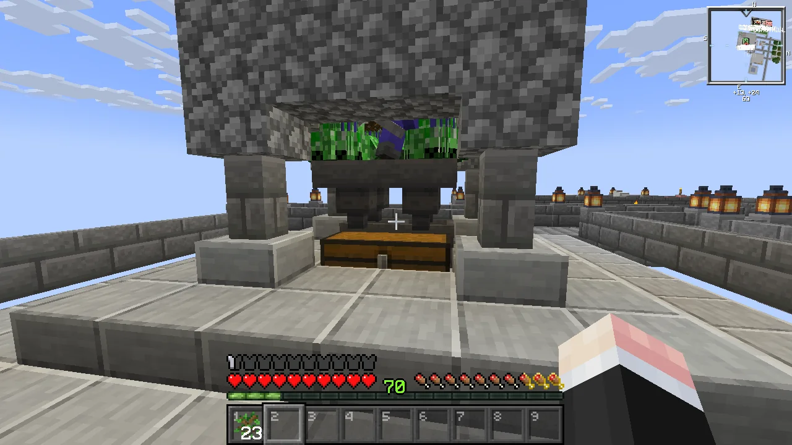

여태껏 마인크래프트를 하며 사진을 잘 찍지 않았기 때문에, 이번 스카이블록을 하면서 사진 찍을 타이밍을 놓치는 경우가 매우 잦다. 한참 나중이 되어서야 '아, 그때 그걸 사진으로 찍었어야 했는데'라며 후회하는 경우가 한두 번이 아니다.

사진 찍는 건 쉬운 일이 아니다.

철 주괴가 3개가 모였다. 몹 타워에 모인 좀비를 셀 수 없이 베어 넘긴 후 겨우 얻은 것이다.

좀비가 당근, 감자, 철 주괴를 전리품으로 함께 떨어트릴 확률은 각각 1% 정도이며, 플레이어가 좀비를 죽였을 경우에만 발생한다.

조건이 '플레이어가 좀비를 죽였을 때'이므로, 몹 타워에서 낙사한 좀비는 철 주괴, 당근, 감자 등을 떨어트리지 않는다. 하지만 다층 구조로 된 몹 타워에서 이 조건을 만족하는 좀비는 몹 타워 최하층에서 떨어진 좀비밖에 없기 때문에, 실질적으로 체감되는 확률은 1%보다 훨씬 낮다.

게다가 내가 느끼기에, 철 주괴보다 당근이나 감자가 더 많이 나왔다. 이건 너무한 거 아냐?



여태껏 아무 생각 없이 조약돌과 나무를 캐고, 몹을 잡아왔던 터라, 3개가 된 철 주괴를 보자 '이제 앞으로 뭘 해야 하지?'라는 생각에 순간 뇌가 굳었다. 그런 날 구원하는 것은 발전 과제일지니.

일단 엔더맨을 잡는 건 현재로선 불가능하다. 제대로 된 갑옷도 없는데, 엔더맨에게 두 대 정도만 맞아도 곧바로 유다희 양을 보게 될걸?

철 주괴로 철 곡괭이를 만들거나, 철 갑옷을 만들거나, 가마솥을 만들 수 있다. 하지만 철 주괴가 꼴랑 3개밖에 없어, 실질적으로 만들 수 있는 건 철 곡괭이밖에 없다. 하지만 이 귀한 철 주괴를 철 곡괭이에 쓰는 건 뭔가 좀 아깝단 말이지...

제작자는 흑요석을 구한 후 지옥에 가는 건 가마솥을 만든 다음이라 생각했던 모양이지만, 각종 아이템을 제공해 주는 모래섬을 별도로 추가한 덕분에 중간 과정을 뛰어넘게 되었다.

구리는 현시점에서 별로 쓸 곳이 없으므로, 구리를 구할 방법이 있어도 당장 하진 않을 것 같다. 구리로 할 수 있는 게 기껏해야 신호기 발동 -- 모드의 힘으로 가능해졌다 --, 피뢰침 만들기 정도밖에 없기 때문이다. 구리로 된 문이나 다락문이 추가되는 건 v1.21에서의 일이다.

TNT를 만드는 건 귀한 모래를 낭비하는 행위이니, 지금은 할 생각이 없다. 모래를 증식할 수만 있다면 상관없겠지만...

마녀가 현재 몹 타워에서 떨어지고는 있지만, 몹 타워 특성상 마녀를 그 안에서 꺼낼 방법은 없다. 자칫하다간 함께 떨어진 크리퍼에 의해 마녀는 물론 나까지 같이 폭사할 게 분명하거든. 따라서 마녀는 별도의 암실을 만든 후, 거기서 얻어야 한다. 주민 좀비 역시 마찬가지고.



돼지를 교배하는 건 돼지가 나와야 가능한 일이다. 잔디밭을 만들었는데도 동물이 나오지 않으니, 돼지 교배는커녕 돼지 코빼기도 못 보고 있는 상황이긴 하지만.

꿀이 조금 탐나긴 하지만, 벌집 가챠는 자작나무에서 하는 게 여러모로 편하기 때문에, 자작나무 묘목을 구하기 전까진 잠정 보류이다. 왜 자작나무냐고? 참나무는 가끔 엄청 큰 나무가 나올 수 있지만, 자작나무는 그런 변종이 없기 때문이다.

결국 발전 과제에서도 뭘 해야 할지 단서를 찾지 못한 난 위키를 뒤져 각종 자원을 수급하는 방법에 대해 읽어 보았고, 거기서 흙을 만드는 법에 대해 알게 되었다. 피글린 거래로 흙을 얻을 수 있다고?

그래서 지옥에 왔다.

내가 참고한 [영상](https://youtu.be/4JkpuBLC9Sc)은 지옥에서 한 칸 아래로 내려가기 위해 덩굴을 썼지만, 난 덩굴이 없다. 하지만 내겐 덩굴 대신 [Bridging Mod](https://modrinth.com/mod/bridging-mod)가 있다. 한 칸 아래에 블록을 놓는 게 베드락 에디션은 가능한데, 자바 에디션이라고 안될 건 뭐가 있겠는가.

나중에 알게 된 건데, 여기선 원래 발광 열매를 쓰는 거라고 한다.

그래서 완성한 좀비 피글린 농장이다. 여기서 금 조각을 대량으로 얻을 수 있다.

농장을 가동하기 위해선 활로 저 멀리 있는 좀비 피글린을 맞춰서 어그로를 끌어야 한다. 난 단 한 발이면 충분할 줄 알고 화살을 단 하나만 챙겨 왔는데, 보기 좋게 빗나가는 바람에 다시 집에 가 화살 다발을 들고 와야 했다.

와... 좀비 피글린이 아주 득실득실하네... 금 조각이 아주 우수수 쏟아진다.

금 조각보다 더 많이 떨어지는 건 썩은 고기와 금 칼이지만. 둘 다 쓸모가 없다.

세 플랫폼에서 좀비 피글린이 오와 열을 맞춰 이쪽으로 오고 있다. 중간에 저들끼리 서로 밀쳐 떨어질까 걱정했는데, 그 정도로 멍청하진 않았다.

한동안 좀비 피글린과 상대하니, 금 조각이 무수히 들어왔다.

그런데 좀비 피글린이 아닌 피글린은 대체 왜 여기에 온 걸까? 금 주괴를 떨어트리는 건 피글린인데 말이다.

집에 돌아가 금 조각을 금 주괴로 만들었다. 다음엔 지옥에 조합대를 가져다 둬야겠다. 금 조각을 금 주괴로 바꾸자고 집까지 왕복하는 건 시간 낭비 아니겠는가.

갖은 고생 끝에 피글린 교환소를 만들었다.

금 부츠를 신어 피글린에게 공격받지 않도록 한 후, 피글린을 피해 좀비 피글린만 잡아야 했다. 그러면서 동시에 피글린을 보트에 태워 안전한 장소로 보내야 했고 말이다.

이거 하나 만들겠다고 몇 번이나 죽은 건지 모르겠다. 죽는 건 그냥 기본이고, 피글린이 탄 보트 뒤에 좀비 피글린이 덜컥 타버린 경우도 있었다. 목적지에 도착하기 전의 보트라면 좀비 피글린을 죽이면 해결되는 문제고, 목적지에 도착한 후의 보트라면 좀비 피글린이 뒤의 벽에 알아서 껴 죽기 때문에 큰 문제는 아니었지만.

그동안 모은 금 주괴 2 세트를 피글린과 교환했더니 막대한 보상이 들어왔다. 하지만 여기서 제일 중요한 건 바로 자갈이다. 바로 이 자갈을 이용해서 흙을 얻거든.

흙 2개와 자갈 2개를 조합하면 거친 흙 4개가 된다. 거친 흙은 삽을 이용하면 잔디 길로 만들 수 있으며, 잔디 길은 삽으로 파면 흙이 된다.

따라서, 흙 2개만 있다면 자갈을 무한히 흙으로 바꿀 수 있다! 이러면 그 흙 2개는 '씨흙'이 되는 건가? 씨감자처럼 말이다.

거친 흙으로 탑을 쌓아 올라간 후, 마우스 오른쪽 버튼을 누른 상태에서 동시에 왼쪽 버튼도 같이 누르면 이렇게 거친 흙을 잔디 길로 만듦과 동시에 잔디 길을 캐게 된다.

갖고 있던 모든 자갈을 흙으로 만들었다. 이 정도의 흙이면 여태껏 흙이 없어서 만들지 못했던 모든 걸 다 만들 수 있다! 잔디밭이던 농경지던 다 오라고 해!

열심히 흙을 만드는 사이, 닭 한 마리가 잔디밭 위에 나타나 있었다. 난 여태껏 이 잔디밭이 너무 좁아서 동물이 나타나지 않는 거라 생각하고 있었는데, 그냥 내가 그동안 운이 너무 없었던 것이었다.

마치 막힌 혈이 뚫린 듯, 닭 뒤에는 소, 돼지 등 다양한 동물이 잔디밭 위에 나타났다.

그래서 원래 계획했던 농경지는 잠시 나중으로 미루고, 동물들이 거주할 구역을 만들어 주었다.

동물들을 가둬둘 때에는 울타리 문을 쓰는 대신, 이렇게 울타리나 벽 위에 카펫을 깔아 두는 게 좋다. 울타리 문을 쓰면 동물들이 자꾸 울타리 문을 통해 밖으로 나가려고 하기 때문이다. 하지만 동물들이 벽으로 인식하는 울타리나 벽 위에 카펫을 깔아 두면, 나는 정상적으로 넘나들 수 있지만 동물은 그럴 수 없는, 환상적인 출입구가 만들어진다.

이제 농경지를 위해 밀 씨앗을 구해야 한다. 너무 많이 쌓여 압축까지 해야 했던 뼛가루를 잔디밭에 사용해 풀을 키우고, 그 풀을 부수면 일정 확률로 밀 씨앗을 얻을 수 있다. 같이 나오는 꽃은 덤이고.

뼛가루 18개를 사용해 밀 씨앗 29개를 얻었다. 교환비가 1:1이어도 괜찮다고 할 텐데, 이 정도면 교환비가 굉장히 좋은 것이다.

그동안 틈틈이 나무를 베고 심기만 했지, 별로 쓰진 않은 탓에 나무가 굉장히 많이 쌓였다. 마침 조약돌 일색의 주변 환경에도 조금 질렸던 차라, 환경 미화라는 걸 해보기로 했다.

조약돌을 화로에 구우면 돌이 되고, 돌을 화로에 구우면 매끄러운 돌이 된다. 돌은 석재 절단기를 이용해 석재 벽돌로 만들 수 있다.

그래서 플랫폼은 매끄러운 돌로 만들고, 플랫폼 사이를 잇는 다리는 석재 벽돌로 만들었다. 벽 역시 전부 석재 벽돌로 만들었고.

그냥 서바이벌이었다면 좀벌레가 숨을 수 있는 석재 벽돌은 거들떠도 보지 않았겠지만, 여긴 스카이블록이지 않은가. 좀벌레가 나타날 리가 없지.

내게 좀벌레 트라우마를 심어줬던, 좀벌레 아포칼립스가 일어난 월드 역시 스카이블록 모드팩인 Agrarian Skies의 월드였단 사실은 잠시 잊기로 했다.

피글린 거래 덕분에 철 수급이 원활해졌기 때문에, 몹 타워에 약간의 업그레이드를 해주기로 했다.

떨어진 아이템을 회수하기 위해 몹 타워에 가까이 붙었다가, 크리퍼에게 발각당해 그대로 몹 타워와 함께 폭사하는 일이 잦았기 때문에, 안전하게 전리품을 회수할 수 있도록 깔때기와 상자를 설치했다.

원래 깔때기의 속도는 속이 답답해질 정도로 느리지만, 모드의 힘을 통해 깔때기의 속도를 조금 올렸다. 옛날 Conduit이나 Pipe를 쓸 때만큼은 아니지만, 그래도 참을 수 있을 정도의 속도가 나온다.

평소 셰이더를 끼고 살아서 그런가, 비가 오면 물에 동심원이 생긴다는 걸 이제야 처음 알게 되었다.

셰이더 말이 나온 김에 셰이더를 적용했다. 동심원은 동심원이고, 셰이더는 셰이더니까.

내가 쓰는 셰이더는 [Complementary Reimagined](https://modrinth.com/shader/complementary-reimagined)이다. 그동안 여러 셰이더를 써봤는데, 이게 제일 무난하더라고.

그동안 잔디밭에서 동물이 하나도 나오지 않은 걸 벌충이라도 하려는 건지, 눈만 돌리면 잔디밭에 동물이 뿅 하고 나타난다. 다만 지금은 저 동물들을 분류해 목장 안으로 밀어 넣는 게 힘들어, 그냥 보이는 족족 죽이고 있다.

목장 안에는 동물들이 각각 두 마리씩 있기 때문에 동물 교배에는 문제가 없지만, 이렇게 동물을 죽이자니 뭔가 아깝다. 나중에 동물들을 따로 분류해 목장 안으로 밀어 넣는 방법을 연구해 봐야겠다.



셰이더를 쓰니 지옥이 훨씬 지옥답게 변했다. 확 트인 시야는 덤이다.



농경지를 만들었다. 자동 수확 장치를 만들고 싶었지만, 작물을 다시 심을 방법이 없었기에, 포기했다.

꿩 대신 닭이라고, 대신 작물을 왼쪽 클릭으로 캐면 그 씨앗을 자동으로 다시 심어주는 모드를 썼다. 좌클릭 대신 우클릭으로 작동하는 모드도 있었지만, 그 모드는 그 작물에 해당하는 씨앗을 손에 들고 있어야 했기에 포기했다.

지금은 철이 제법 잘 모여 랜턴을 조명으로 쓰고 있지만, 만약 농경지를 조금 더 일찍 만들었더라면 랜턴이 아니라 잭 오 랜턴을 조명으로 쓰고 있었을 것이다.

랜턴과 잭 오 랜턴 모두 횃불을 재료로 쓰지만, 랜턴은 철 조각 8개를, 잭 오 랜턴은 조각된 호박 1개를 더 필요로 하거든.

그동안 모은 밀로 빵을 만들었다.

이 빵은 이제 내가 식량 사정이 넉넉해졌다는 걸 증명하는 음식이다. 사람은 빵만 먹고도 살 수 있어!

농장 한쪽 구석에 달콤한 열매를 심었는데, 제법 빨리 자란다. 그런데 달콤한 열매는 어디에 쓰는 거였더라?





농장에 있던 동물들을 서로 교배했다. 닭에게 씨앗을, 소와 양에게 밀을, 돼지에게 당근이나 감자를 주면 서로 몸을 비비며 교미를 시작한다.

'New Friends' 발전 과제를 깨려면 돼지를 교배시켜야 되는 건 줄 알았는데, 아무 동물이나 교배시키면 달성되는 것이었다.

또다시 뭘 해야 할지 감을 잃었기 때문에, 발전 과제를 열어보았다.

꿀을 얻기 위해선 먼저 자작나무 묘목을 구해야 하는데, 아직 구하지 못했다. 혹시 떠돌이 상인이 자작나무 묘목을 팔까? 떠돌이 상인은 어떻게 해야 나오게 할 수 있지?

아직 철 갑옷을 만들지 않았기 때문에, 난 엔더맨을 잡기 힘들거라 생각하고 있었다. 그런데 지옥에서 좀비 피그맨을 잡다 엔더맨을 발견하자, 뭔가 해볼 만하다는 생각이 들었다. 그래서 엔더맨에게 활을 쏴 어그로를 끈 후, 벽을 등지고 울타리를 사이에 둔 채로 싸웠고, 이겼다. 그때 'Enderman Hunter' 발전 과제를 달성한 모양이다.

다만 다음 발전 과제는 만만치 않아 보인다. 엔더맨이 잔디 블록을 들게 만든 후, 엔더맨을 죽여 그 잔디 블록을 얻어야 하는 발전 과제. 이건 엔더맨과 오버월드에서 싸우란 말이잖아.

제작자가 의도한 마법 부여 책을 얻는 방법은 주민과의 거래였던 모양이지만, 피글린이 거래에서 마법 부여 책을 준 덕분에 이전 발전 과제를 건너뛰고 'Fancy Reading' 발전 과제를 달성해 버렸다.

'아이스 버킷 챌린지'는 모래섬 상자에 들어있던 흑요석을 꺼낼 때 달성했다.

내가 이걸 지옥문 만들기 전에 봤으면 참 좋았을 텐데. 어떻게 해야 지옥문에 불을 잘 붙일 수 있는지 자세히 설명해주고 있지 않은가.

뭐, 이 발전 과제도 일찍 얻은 흑요석 덕분에 제작자의 의도보다 일찍 깨버렸기 때문에, 어쩔 수 없는 일이다.
