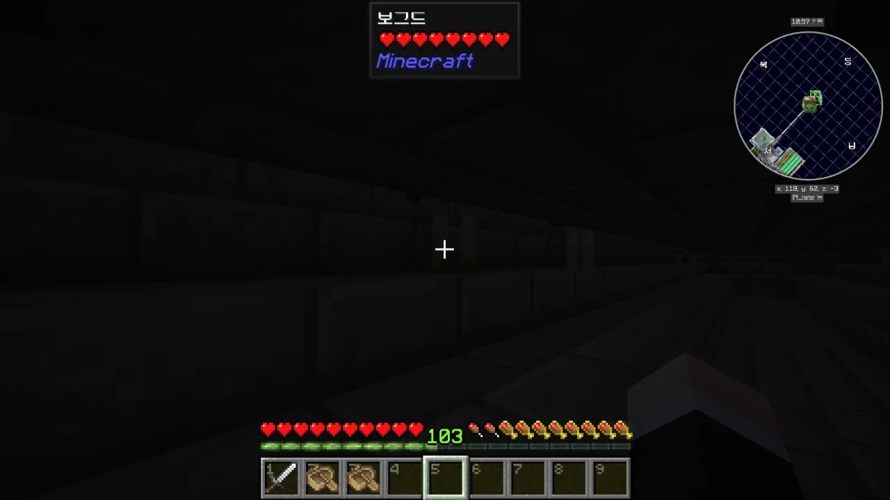

명조가 오픈한 이후, 명조를 하느라 바빠 마인크래프트에는 거의 손을 대지 못했다. 금희를 뽑기 위해 맵 구석구석을 필사적으로 파먹을 때에는 아예 손을 대지 못했고.

하지만 거기에서 너무 불태운 탓이었을까, 금희 픽업에서 금희를 뽑는 데 성공한 이후부턴 명조에 손이 가지 않았다. 이걸 번아웃 증후군이라 해야 할까, 아니면 현자타임이라 해야 할까.

금희 픽업 다음에 열린 장리 픽업 역시 별로 내키지 않는다. 장리를 뽑고는 싶지만, 그걸 위해 이전처럼 맵을 파먹기는 싫다. 간간히 모이는 별의 소리로 10 연차를 돌리고는 있지만, 장리가 나오면 좋고 안 나와도 어쩔 수 없다는 생각이다.

그래서 다시 마인크래프트에 손을 대기 시작했다. 역시 마인크래프트는 마음의 고향 같은 거라니까.

몹 타워에 했던 것처럼, 지옥에 있는 좀비 피글린 농장에도 깔때기를 설치했다. 

사실 내가 원하는 건 이렇게 모든 전리품을 곧바로 상자에 넣는 방식이 아니라, 썩은 고기 같은 쓰레기 전리품을 자동으로 내다버리고 나머지만 상자에 넣는 방식이다.

하지만 공간 문제가 발목을 잡았다. 좀비 피글린이 킬링 챔버가 아닌 아이템 필터 위로 떨어지는 일을 막기 위해선 아이템 필터의 크기가 윗 플랫폼의 크기보다 작아야 하는데, 윗 플랫폼의 넓이가 지나치게 좁은 탓에 아이템 필터를 설치할 공간이 도저히 나오지 않았다.

하는 수없이 모든 아이템을 상자에 넣도록 했지만, 썩은 고기와 금 칼 때문에 상자가 너무 금방 차버린다.



한동안 지옥에서 좀비 피글린을 잡다 오버월드로 돌아오니, 동물 농장 쪽에 늑대가 여섯 마리가 스폰되어 있었다. 양을 공격하려 했지만 벽 때문에 그러지 못하고 대신 벽 앞에 모여 서서 으르렁대기만 하고 있더라고.

부리나케 창고로 달려가 뼈다귀를 가져온 후, 늑대를 모두 길들였다.

이제 안전하게 늑대를 묶어두고 싶은데, 끈을 만들기 위해선 슬라임 볼이 필요하다.



그래서 내가 지금 서있는 청크가 슬라임 청크인지 아닌지 알려주는 [Slime](https://modrinth.com/mod/slime) 모드를 이용해 슬라임 청크를 찾았다.

원래 계획은 시드를 이용해 슬라임 청크를 찾는 웹사이트를 이용하는 것이었지만, 마지막으로 지원하는 마인크래프트 버전이 1.12였기에 웹사이트 대신 모드를 이용할 수밖에 없었다.

하필이면 물웅덩이가 있는 청크가 슬라임 청크였기에, 물웅덩이를 허무는 대신 물웅덩이 아래쪽에 슬라임 스폰 플랫폼을 만들었다.

길들여져 개가 된 늑대를 잘 묶어두었다.

스카이블록에서 개는 큰 쓸모가 없기에, 개를 어디다 쓸지는 나중에 생각해 봐야겠다.

마인크래프트 1.21 버전이 6월 14일에 나왔으니, 1.21 버전이 나온 지 벌써 한 달이 넘었다. 그 말인즉슨, 업데이트하기 딱 좋을 시기란 거다.

마인크래프트 버전이 먼저 1.21로 업데이트되었고, 스카이블록 데이터팩 역시 1.21 버전을 지원하는 최신 버전으로 업데이트되었다. VanillaTweaks 리소스팩 역시 1.21 버전으로 업데이트되었고.

하지만 기존에 사용하고 있던 모드 중 일부가 1.21로 업데이트되지 않아 빠지는 불상사가 발생했고, 그중에는 아이템을 압축하는 모드가 포함되어 있었다. 그탓에 내가 열심히 모아 압축해 둔 아이템이 몽땅 사라지는 사고가 발생했다.

하지만 내가 그만큼 아이템을 모았다는 건 그 아이템이 또다시 금방 많이 모일 거라는 말 아니겠는가? 그래서 아이템이 없어진 건 그냥 넘어가기로 했다.



'다음에 뭘 하지?'라는 생각이 들 때에는 발전 과제를 따라가면 된다.

발전 과제 중 가장 빠르게 완료할 수 있을 것으로 보이는 '마녀를 보트에 태우기'에 도전하기 위해, 마녀가 스폰할 수 있는 암실을 만들었다.

그런데 아무리 기다려도 마녀가 암실에 나타나지 않는다. 설마 저기 있는 몹 타워가 몬스터 스폰 확률을 다 가져가버린 탓에 이런 일이 생기는 걸까?

그래서 몹 타워를 허물고 새로 짓기로 했다. 새로 지을 몹 타워에는 레드스톤 신호를 이용해 끄고 켤 수 있는 조명을 추가하기로 했다. 몹 타워의 조명을 켜면 몹 타워에 몬스터가 나타나지 않을 거고, 그러면 마녀가 암실에 나타날 확률이 늘어나지 않겠는가.



여러 몹 타워 가이드를 보며 연구한 끝에 몹 타워를 완성했다. 기본 설계는 이전과 동일하지만, 몇 가지가 추가되었다.

* 내부 조명 추가
  조명을 켜면 몹 타워 내부가 밝아져, 몬스터가 스폰되지 않는다
* 거미 스폰 억제
  오직 맨 위층에서만 거미가 스폰하도록 몹 타워 내부에 카펫을 깔았다

몹 타워를 새로 지을 때, 몹 타워의 머리 부분이 다른 구역을 가리는 문제가 발생해 몹 타워의 위치를 다른 구역보다 아래로 옮겨야 했다.

아래로 내려가는 건 쉽다. 밑바닥에 물을 깔아 두고, 거기로 떨어지면 되니까. 하지만 다시 위로 올라오기 위해 한참 동안 사다리를 타는 건 답답해서 참을 수 없다. 그래서 예전에 모래 섬에서 얻은 영혼 모래로 물 엘리베이터를 만들었다.

암실에 몬스터가 나타나지 않았던 건 역시 몹 타워 때문이었다. 몹 타워에 조명을 밝히자, 암실에 몬스터가 스폰하기 시작한다.

하지만 내가 원하는 마녀는 여전히 코빼기도 보이지 않는다.

떠돌이 상인이 처음으로 나타났다. 마법 부여 황금 사과를 제외하면 별 쓸모없는 거래 품목밖에 없다.

어디선가 꼬르륵 소리가 들려오길래 찾아가 보니, 드라운드가 물 엘리베이터에서 방방 뛰고 있다. 대체 어디서 나타난 거지? 이 근방에 몬스터가 나올 공간은 몹 타워밖에 없을 텐데?



모드의 힘을 이용해 몹 타워에 전리품 필터링 시스템을 도입했다. 가능하면 모드 없이 필터링 시스템을 구현하고 싶었지만, 걸러내야 할 아이템의 종류가 늘어날수록 복잡해지고 커지는 필터링 시스템 때문에 하는 수없이 모드를 썼다.

쓸모없는 아이템이 버려지는 모습을 보니, 왠지 모르게 기분이 좋다.

쌓이기만 하는 경험치가 아까워, 경험치를 추출해 경험치 병으로 보관할 수 있는 모드를 설치했다. 경험치가 50 레벨 정도 쌓이면 뽑아다 저장할 생각이다.

사진을 찍자마자 드라운드가 나타나 내 등을 공격했다. 아니, 진짜 대체 어디서 나온 거야?



드라운드가 집 옆의 물웅덩이에서 나온 건가 싶어, 물웅덩이 밑에 랜턴을 설치했다. 이젠 물속 밝기까지 신경 써야 하는 건가?

몹 타워처럼, 좀비 피글린 농장에도 전리품 필터링 시스템을 설치했다.



스카이블록에서 파밍해야 할 지옥 몬스터는 좀비 피글린이 전부가 아니다. 블레이즈나 마그마 큐브 역시 파밍해야 한다. 하지만 데이터팩 때문에 이들이 스폰할 수 있는 구조물이 생성되지 않는다.

하지만 여기서 중요한 건 '구조물이 생성되지 않았다'이다. '구조물이 생성되어야 할 자리'는 여전히 존재하기에, 그 자리에 몬스터 스폰 조건을 만족하는 블록을 배치하면 거기에 몬스터가 나타난다. 말하자면 `0`과 `undefined`의 차이라고 해야 할까...?

하지만 내가 무슨 수로 그 자리를 찾겠는가? 당연히 여기선 모드를 써야 한다. 붉은색 윤곽은 지옥 요새, 흰색 윤곽은 보루 잔해, 초록색 윤곽은 슬라임 청크를 의미한다.



관전 모드로 구조물 자리를 찍고 내려오자, 드라운드가 삼지창을 들고 날 반갑게 맞아준다. 아니, 분명 물웅덩이는 랜턴으로 밝혀뒀잖아? 대체 왜 드라운드가 또 나타나는 거지?

저렇게나 많은 삼지창을 던져댔으면서, 정작 내게는 삼지창을 주지 않았다.



드라운드가 대체 어디서 나온 건지 알 수 없어서, 그냥 물이 있는 곳의 입구를 전부 울타리 문으로 막았다. 이러면 적어도 내 침대까지 드라운드가 쫓아오는 일은 없겠지.

드라운드를 상대할 때 어떤 도전 과제가 하나 달성되었는데, 나중에 확인해 보니 'Underwater Mob Farm'이었다. 드라운드가 삼지창 대신 구리 주괴를 떨어트린 모양이다.

어... 그러면 나중에 물로 된 거대한 몹 타워를 또 만들어야 하는 건가?

지금 좀비 피글린 농장에는 한 가지 큰 단점이 있다. 바로 플랫폼에 좀비 피글린뿐만 아니라 피글린도 나타난다는 것이다.

피글린은 좀비 피글린을 때려도 플레이어에게 화를 내며 달려오지 않기 때문에, 피글린이 쌓일수록 좀비 피글린이 나타날 경우의 수가 줄어들게 된다. 그리고 그건 곧 농장의 효율이 떨어진다는 말과 같다.

그래서 원래 좀비 피글린 농장의 플랫폼 바닥은 다른 몬스터가 스폰할 수 없게 마그마 블록으로 만든다. 마그마 블록의 재료인 마그마 크림은 마그마 큐브를 잡아야만 얻을 수 있기 때문에, 내가 쓸 수 있는 마그마 블록의 수는 턱없이 부족하다.



그래서 유튜브 영상을 참고해 거대 좀비 피글린 농장을 만들었다. 효율이 떨어진다면 양으로 극복하면 되지 않겠는가!

물론 이것도 시간이 지나면 효율이 매우 떨어지겠지만, 그때에는 조금 멀리 이동해 기존에 있던 몬스터들을 전부 디스폰시킨 후, 처음부터 다시 시작하면 된다.

갖고 있던 마그마 크림을 전부 털어보니 마그마 블록이 13개가 나온다. 좀비 피글린 농장에서 쓰기에는 턱없이 부족한 양이다.

언젠간 충분한 양이 쌓이겠지?

내가 필요로 할 때는 코빼기도 보이지 않더니, 몹 타워에서 주민 좀비가 나왔다. 주민 좀비에게 그 어떠한 대미지도 주지 않고 무사히 밖으로 빼내 안전한 곳에 주차시키는 건 불가능에 가깝기에, 그냥 죽일 수밖에 없었다.

이 녀석이 몹 타워가 아니라 암실에서 나왔으면 참 좋았을 텐데.

암실은 여전히 감감무소식이다. 대체 언제쯤 마녀가 나오는 걸까?

마녀 스폰을 하염없이 기다리기보다, 당장 할 수 있는 발전 과제를 먼저 처리하기로 했다.

가마솥 만들기? 쉽지.

이제 필요한 건 블레이즈 농장이다. 지옥 요새 자리까지 길을 만들어두긴 했는데, 그다음이 문제다.

블레이즈를 한 곳에 몰아넣기 위해선 용암을 써야 하는데, 지금 내가 갖고 있는 용암은 단 한 개가 전부이다. 용암을 늘려야 하는데, 그러려면 뾰족한 점적석이 필요하다.

다행스럽게도 떠돌이 상인이 뾰족한 점적석을 팔고 있는 것 같다. 그런데 떠돌이 상인은 에메랄드만 받는다. 스카이블록에서 에메랄드를 구하기 위해선 반드시 주민 거래를 이용해야 한다. 주민 거래를 이용하기 위해선 마녀와 주민 좀비가 필요하다.

결국 돌고 돌아 또다시 마녀로 돌아왔다. 그 밖의 다른 발전 과제 역시 마녀를 필요로 하기에, 마녀가 나타나기 전까진 말 그대로 아무것도 할 수 없는 상황이 되어버렸다.

기우제라도 지내야 하나...?
