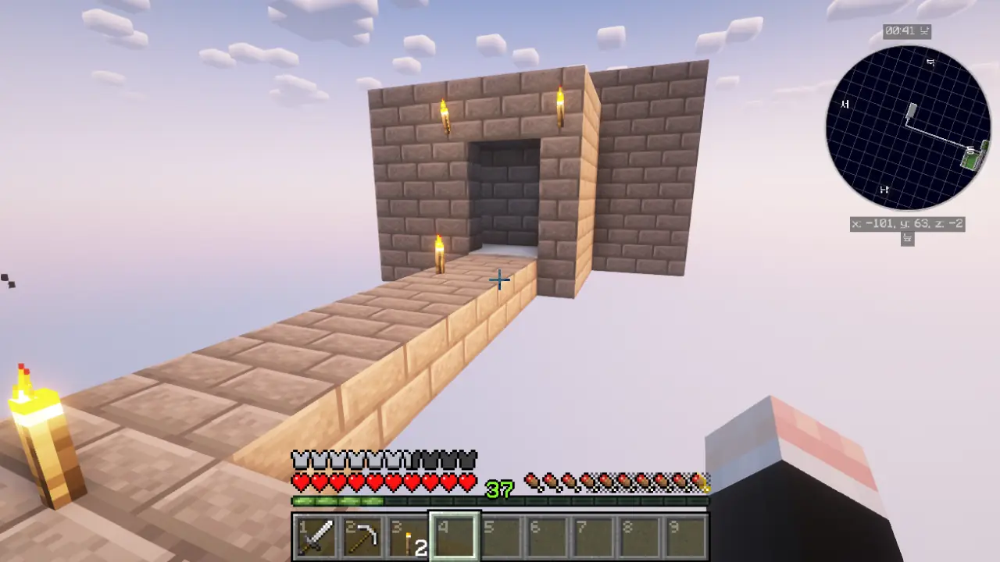
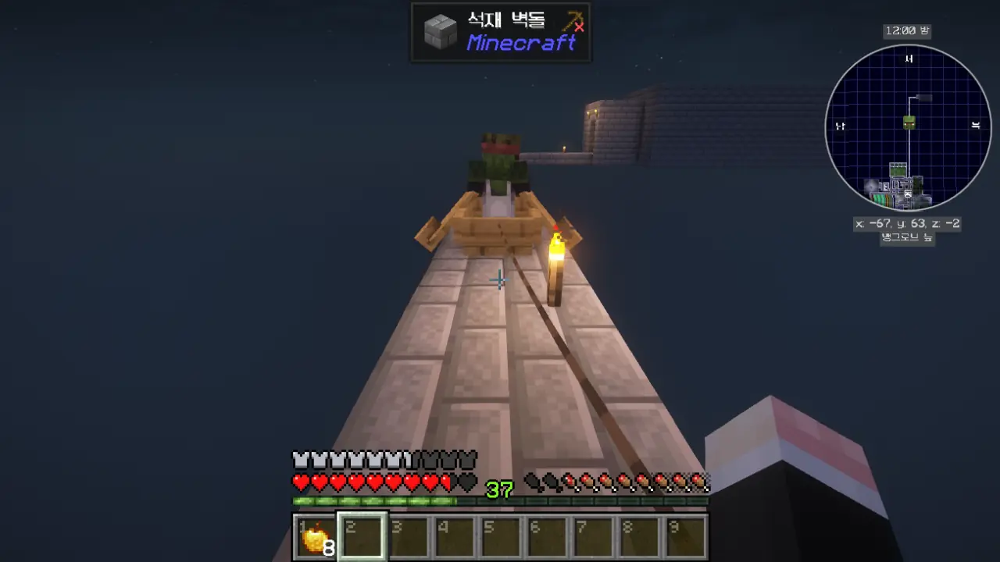

사진을 WebP로 변환할 때 화질 설정을 너무 낮게 했다는 걸 원본 파일을 지우고 나서야 알게 되었다. 약 한 달 동안 찍은 사진의 화질이... 죽어 버렸어...

어쩔 수 없는 일이다. 이미 지나간 일을 붙잡고 후회해 봤자 삭제해 버린 원본 사진은 돌아오지 않는 걸.

저번 편에서 내린 결론은 '뭘 하려고 해도 마녀가 필요하다'였다. 그래서 마녀를 찾기 위한 암실을 만들고, 마녀가 나올 때까지 무작정 기다리기로 했다.

다른 방법은 알지 못했으니, 이 방법이 내게 있어 유일한 방법이었다.

얼마나 기다렸을까, 드디어 미니맵에 마녀 얼굴이 나타났다. 떴다! 떴다고!

이제 미리 준비한 보트에 마녀를 태워 지정된 장소까지 데려가면 된다.

마녀는 플레이어를 직접 공격하는 대신, 플레이어에게 물약병을 던진다. 마녀가 물약병을 던지는 각도가 높기 때문에, 이렇게 마녀를 보트에 태워 이동하면 마녀가 아무리 열심히 물약병을 던져도 내게 맞지 않는다.

아니, 가끔은 맞는다. 그런데 무시할 수 있을 정도이다.

일단 마녀를 복도 끝에 세워두고, 주민 좀비를 잡을 채비를 하기로 했다. 마녀는 해가 떠도 좀비나 스켈레톤처럼 불에 타지 않으니, 이렇게만 해두어도 아마 문제가 되지 않을 것이다.

아까처럼, 이번에는 주민 좀비가 나타나기를 하염없이 기다린다.

혹시나 해서 마녀의 상태를 살펴보러 갔다. 마녀는 여전히 팔팔하게 물약병을 던지고 있다.

몬스터가 자연적으로 사라지는 데에 몇 분이 필요한 건지는 잘 기억나지 않지만, 기껏 주민 좀비를 구해왔는데 마녀가 사라져 있으면 매우 허탈할 것이다.

그러니까 빨리 주민 좀비가 나왔으면 좋겠네.

드디어 주민 좀비가 나타났다!

곧바로 보트에 태웠다. 뭐? 주민 좀비의 원래 직업이 도살업자였다고? 괜찮아! 나중에 화살 작업대 앞에 세워주면 직업을 바꿀 거야!



창고를 살펴보니, 필요한 물품을 아직 만들지 않았다. 화살 작업대와 황금 사과를 서둘러 만들었다.

좀비는 보트 앞 좌석에 탄 플레이어를 때릴 수 있기 때문에, 이렇게 보트에 끈을 매달아 옮겨야 한다.

보트에 끈을 매달 수 있는 기능이 이번 버전인 1.21 버전에 추가되었기 때문에, 일이 매우 수월해졌다. 만약 보트에 끈을 매달 수 없었으면 난 아마 다른 방법을 강구해야 했겠지.

여러 시행착오를 거친 끝에, 드디어 주민 좀비에게 나약함 효과를 거는 데 성공했다! 이걸 시도하다가 몇 번은 좀비에게 맞아 죽을 뻔했다고.

마녀가 나약함의 물약을 던지는 건 플레이어가 마녀와 정확히 세 블록 떨어져 있을 때이기 때문에, 그 간격을 잘 조절해야 한다. 그와 동시에 떨어진 물약의 효과 범위에 주민 좀비가 들어가게 해야 하기도 하고...

여태껏 마인크래프트를 하며 주민 좀비를 치유한 적이 단 한 번도 없었기 때문인지, 너무나도 힘들게 느껴졌다.

하지만 이제 끝이야!

아. 아! 아!!! 아!!!!!!

나약함 효과가 걸린 주민 좀비에게 황금사과를 먹인 후, 주민이 살 공간을 만들기 시작했다.

그런데 주민 좀비 위에 천장을 덮어주는 걸 깜빡한 탓에, 주민 좀비가 강렬한 햇살에 그만 한 줌 재가 되어버리고 말았다. 그때 난 집에서 건축 재료를 만들고 있었기에, 주민 좀비가 불에 타고 있는 줄도 몰랐고.

사진을 찍은 후, 한참 동안이나 가만히 서서 멍하니 빈 보트를 바라만 보고 있었다. 내 시간... 내 노력... 내 황금사과... 전부 어디로 간 거지?

&nbsp;

내가 기운을 차린 건 꽤 오랜 시간이 지난 후였다. 그래도 이번엔 하늘이 날 불쌍하게 여겼던 건지, 주민 좀비가 금방 다시 나오더라고.

이번엔 실수 없이 무사히 주민 좀비에게 황금사과를 먹이고 가둬둘 수 있었다.



본래 거래 내용은 막대기 32개에 에메랄드 1개였지만, 주민을 치유해 준 덕분에 막대기 26개라는 비교적 저렴한 가격에 교환이 가능하게 되었다.

옛날에는 주민을 좀비로 만들었다가 치유하는 걸 반복해서 말도 안 되는 가격으로 에메랄드를 수급할 수 있었지만, 내가 알기로 이번 버전에서 그 버그가 수정되었기 때문에, 이제는 그런 짓을 할 이유가 없다.

거래 내용이 그리 나쁘지 않다. 특히 몹타워에 조금만 서 있어도 쌓이는 실을 고작 7개만 줘도 에메랄드 1개를 얻을 수 있으니, 이건 정말 마음에 든다.

스카이블록이라서 그런 건지 몰라도, 떠돌이 상인이 약 1분마다 계속 거래 내용을 바꾸고 있다.

뾰족한 점적석이 있길래, 미리 쌓아둔 에메랄드로 최대한 뾰족한 점적석을 교환했다.

또다시 '내집구려병'이 도지는 바람에 기지 전체를 뜯어고쳤다.

기존엔 길이 너무 난잡하게 뻗어있었다면, 이번엔 길을 넓히고 각종 시설을 최대한 길에 붙여 깔끔하게 만들었다.

이제 남은 발전 과제를 하나하나 달성할 차례.

떠돌이 상인이 모래를 판 덕분에, 모래 걱정은 없게 되었다. 곧바로 TNT 제작!

이다음은 엔더 드래곤 사냥이다. 집에서 가장 가까운 근거지의 위치는 \[1312 -496\]에 있다.

이거 치트 아니냐고? 원래 계획은 명령어를 쓰는 대신 시드값을 기반으로 근거지의 위치를 알려주는 웹사이트를 쓸 생각이었다. 이거나 그거나 거기서 거기지, 뭐.

여기서 1,379 블록을 걸어가거나 뛰어가는 건 미친 짓이다. 그러니까 이동 거리가 1/8로 줄어드는 네더를 이용할 거다. 네더를 이용하면 이동 거리가 대략 170 블록으로 줄어드니까.

그러려면 동력 레일을 써야 한다. 금은 좀비 피그맨을 잡으며 수도 없이 모아 왔고, 레드스톤 가루 역시 몹타워에서 떨어진 마녀가 충분히 공급해 주었다. 막대기야 뭐, 쌓이는 게 막대기고.



그래서 만들었다. 광산 수레 속도가 느린 게 흠이긴 하지만, 아마 1.21.2 버전에서 광산 수레 속도를 조절할 수 있을 것이니 그때까지만 참기로 했다.



아직 블레이즈를 잡지 못했기 때문에, 기껏 근거지에 도착했지만 엔드 차원문에 들어가지는 못했다.

그 대신 차원문 밑에 있는 용암 연못 밑에 뾰족한 점적석을 설치해, 용암을 수집하는 장치를 만들었다.

블레이즈 스포너 없이 네더에서 블레이즈를 파밍 하는 방법을 알아보았는데, 대다수의 공략이 블레이즈 스포너가 있다고 가정하고 시작하는 바람에 그냥 내가 직접 만들기로 했다.

일단 블레이즈 농장이긴 한데, 정작 블레이즈보다 좀비 피글린이나 피글린이 더 많이 나타나는 기묘한 농장이다.

하지만 대충 필요한 블레이즈 막대는 다 얻었다.

좋아, 가보자고!

어... 내가 생각했던 엔드의 모습과는 많이 다른데...

그래도 섬 하나는 있을 거라 생각했는데, 그냥 흑요석 기둥 8개가 전부이다.

조약돌을 많이 가져오지 않았기 때문에, 자칫하다간 여기에 영원히 갇히게 생겼다.

하지만 이겼죠.

'높은 곳에 올라가 무작정 활만 쏘기'는 언제나 통하는 방법이다.

... 그래서 이제 뭐 함?

난 정말 진지하다. 엔더 드래곤을 잡고 나니, 갑자기 스카이블록에 대한 흥미가 뚝 떨어졌다.

다이아몬드 갑옷? 스카이블록에서 다이아몬드를 구할 수 있긴 해?

주민 거래를 통해 다이아몬드 갑옷을 구할 수 있다는 건 알고 있지만, 음... 귀찮은걸.

돼지가 번개를 맞으면 좀비 피글린이 된다고? 이건 그래도 해볼 만 한걸?



돼지를 피뢰침 밑에 묶어뒀는데도 번개가 내리치지 않자, 뭔가 잘못 설치한 건가 싶어 위키를 뒤져보았다.

그때 꽈르릉 소리가 들려 다시 마인크래프트 창을 열어보니, 돼지가 좀비 피글린으로 변해 있었다.

그런데 내 발전 과제는 왜 안 깨진 거야? 설마 인벤토리 창을 열어둔 채가 아니라 그걸 직접 보고 있어야 하는 거였어?

> **Witness** a Pig being struck by lightning and transforming into a Zombified Piglin

음... 목격하라고 적혀 있었으니, 돼지가 변하는 걸 직접 보고 있어야 했나 보다.

응, 그래서 달성.

***

이대로 가다간 스카이블록은 물론 마인크래프트 자체에 흥미를 잃을 것 같아, 일단 스카이블록은 여기까지 하기로 했다.

나중에 스카이블록이 다시 생각날 때 꺼내서 할 수 있도록 기존에 하던 모드팩을 따로 저장해 두었다.

다음엔 어떤 콘셉트로 마인크래프트를 해볼까...
