마인크래프트 글을 쓸 때마다 '이번 시리즈 제목은 뭐로 지어야 하지?'라는 고민에 빠지게 된다. '모드 싱글 플레이'라고 하면 너무 멋대가리 없는 제목이 되지만, 그렇다고 해서 별달리 떠오르는 제목이 있는 것도 아니다.

한참을 고민한 끝에, 이번 시리즈 제목을 '잡탕 모드팩 생존기'로 하고, 마인크래프트 시리즈 전체의 이름을 'TMS'로 정했다. TMS가 무엇의 약자인지는... 상상에 맡기겠다. 난 아무리 생각해도 이름 짓는 솜씨가 너무 없어.

저번에 했던 스카이블록을 시즌 1이라 치고, 이번 플레이를 시즌 2로 생각하기로 했다. 시즌의 뜻이 '어떤 활동이 활발히 이뤄지는 시기'이니, 이런 걸 시즌이라도 불러도 되겠지.

***

'TMS 시즌 2'라는 거창한 이름을 달고 새로 시작한 마인크래프트 글이지만, 그 시작은 별로 좋지 못했다. '이건 억까야!'라고 해도 될 정도의 악재가 계속 몰아닥쳤거든.

이번엔 직접 만든 모드팩을 플레이하기로 마음먹었는데, 추가한 모드들이 서로 꼬이는 바람에 하는 수 없이 여태껏 만든 모드팩과 진행 상황을 모두 포기하고 처음부터 모드팩을 다시 만든 것이 벌써 다섯 번이나 된다.  
한 번은 특정 모드에서 제공하는 아이템의 조합법을 보려 할 때마다 게임이 알 수 없는 이유로 튕기는 바람에, 하루 동안 플레이 한 모든 걸 --- 잘 찍은 사진까지 포함해서! --- 포기하고 모드팩을 바닥부터 새로 만든 적도 있다.

그래서 최종적으로는 [Fabulously Optimized](https://modrinth.com/modpack/fabulously-optimized) 모드팩의 모드를 기반으로 하여, 구조물 및 바이옴 추가 모드를 포함한 다양한 모드들을 섞은 나만의 잡탕 모드팩을 만들게 되었다. 제발 이번엔 게임이 튕기는 일이 없기를.

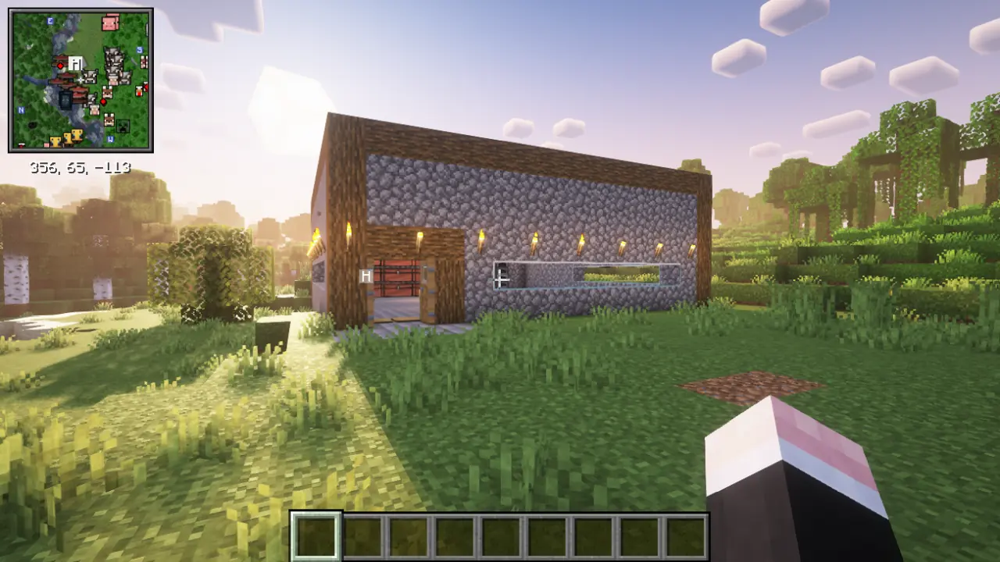

새 집을 사진으로 찍고, 해결할 수 없는 오류 때문에 모드팩을 삭제하고, 새로 모드팩을 만든 후 새 집을 짓고 사진을 찍는 걸 벌써 다섯 번이나 해서, 이번엔 그냥 크리에이티브 모드로 집을 지었다. 치트니 뭐니 따지기도 이젠 지쳤고, 어차피 모드팩 꼬이면 삭제될 집과 사진이니까!

집 양식은 언제나 똑같다. 한 청크 안에 벽 포함 16 × 16 크기의 집을 짓고, 한쪽 모퉁이에 입구를 만든 다음, 입구와 마주 보는 곳에 조합대를 시작으로 상자, 화로를 순서대로 두는 것이다.

&nbsp;

평소라면 외부로 탐사를 나가기 전, 먼저 땅을 파서 자원을 구했을 것이다. 하지만 그렇게 한다면 기껏 각종 바이옴과 구조물을 추가한 보람이 없지 않겠는가.

그래서 이번엔 땅을 최대한 늦게 파기로 했다. 마을을 포함한 구조물을 터는 것만으로 어디까지 갈 수 있나 한 번 보자고.

물론 눈앞에 대놓고 광석이 나와있다면 캘 거다. 그건 나보고 캐달라고 유혹하는 것과 다름없잖아.

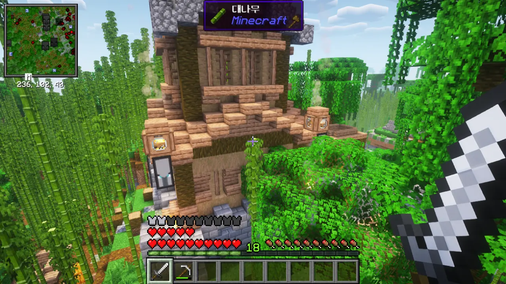

여길 뭐라고 불러야 할까? 대나무 숲에서 기묘한 모양의 마을을 발견했다.

일반적인 주민 마을과 달리, 이 마을의 집은 정글나무를 둘러싼 형태로 지어져 있으며, 집과 집 사이를 잇는 길이 공중에 둥둥 떠있는 모양이다. 한마디로 '공중 마을'인 셈인데... 대체 무슨 모드가 이걸 추가한 거지?

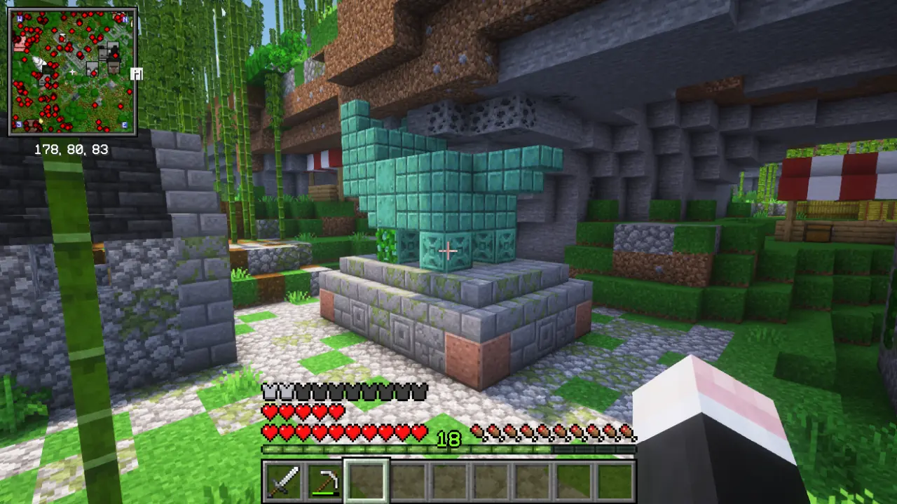

'공중 마을' 인근엔 폐허 같은 것이 있다. 폐허 곳곳에 이런 구리로 된 동상이 있는데, 자세히 보니 돼지 동상이었다. 대체 왜 여기에 돼지 동상이 있는 걸까?

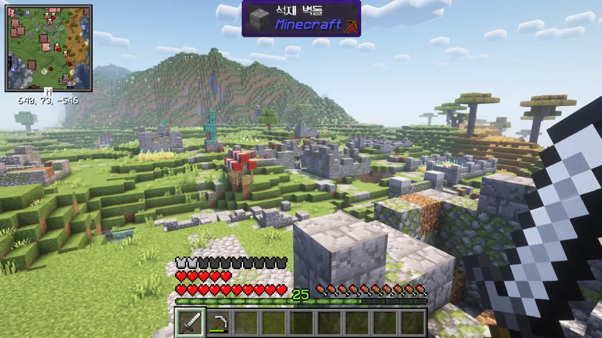

다른 곳에서 유사한 형태의 폐허를 발견한 후에야 난 이게 마을 폐허임을 깨달을 수 있었다.

마인크래프트에 기본적으로 포함된 '마을 폐허'는 주민 마을 건물의 일부 블록이 거미줄로 대체된 것에 불과하지만, 이 마을 폐허는 좀 더 본격적으로 건물이 무너진 형태이다.

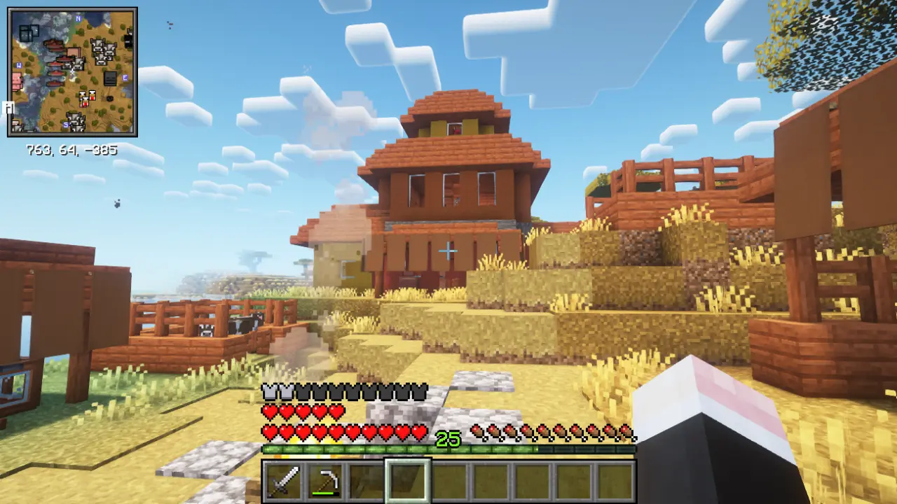

실수로 발전 과제 달성 알림 메시지를 삭제해 버렸지만, 그 발전 과제 이름이 'Safe Heaven'이었다는 건 기억난다.

여기를 안식처라고 부르기에는 저 건물 안에 주민이 고작 한 마리밖에 없었기에, 대체 뭘 근거로 여길 안식처라 부른 건지 알 수 없다. 설마 이 근방에선 몬스터가 나타나지 않는 건가?

'Safe Heaven' 다음 단계의 발전 과제가 있긴 했지만, 뭘 어떻게 해야 '퀘스트'라는 걸 받을 수 있는지 알 수가 없어, 결국 포기했다.

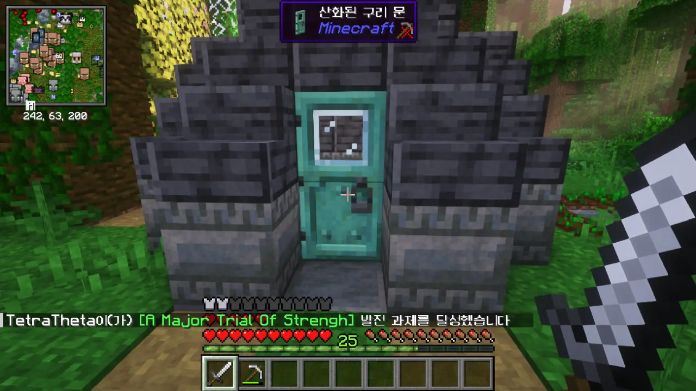

아마... 여기 이름이 '신사(Shrine)'였을 거다. 지금은 꼬여서 삭제한 이전 모드팩에서 여길 들어간 적이 있었는데, 그 구조가 '시련의 회당(Trial Chambers)'와 비슷했다. 몬스터를 생성하는 스포너가 방 한가운데에 있고, 모든 몬스터를 잡으면 스포너에서 아이템 보상을 준다. 그 보상 중에는 방 곳곳에 놓인 금고를 열 수 있는 열쇠가 있는데, 열쇠의 등장 확률은 100%가 아닌 건지, 열쇠가 나오지 않을 때도 종종 있다.

이미 한 번 했던 콘텐츠이기 때문에, 여긴 나중에 심심해지면 다시 오기로 했다.

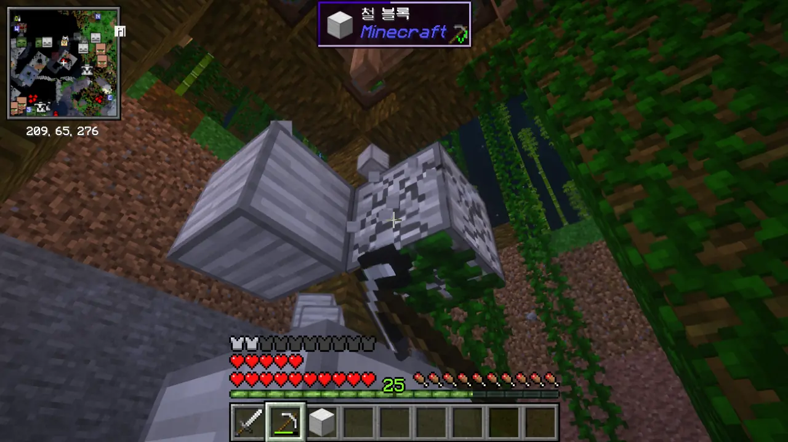

오, 공중 마을 밑동에 이렇게 철 블록이 있기도 하구나.

많을수록 좋은 것이 철이므로, 싹싹 긁어가기로 했다.

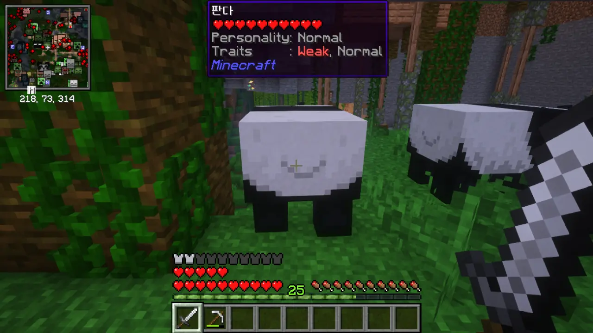

와... 나, 판다 처음 봐...

여태껏 영상으로만 보다가 실제로 판다를 보니, 조금 신기하다.

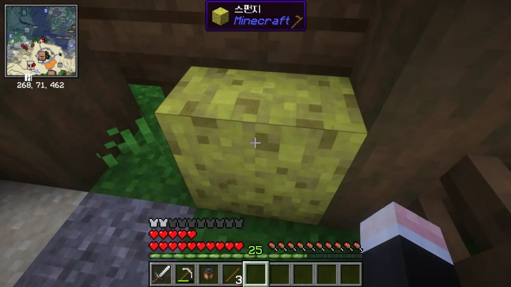

으아닛, 마을에 스펀지도 있다고? 바다 유적에 가야만 볼 수 있는 아이템인데...

곧바로 챙겼다. 스펀지는 있으면 편하거든.



여태껏 땅을 판 적이 단 한 번도 없음에도, 벌써 이렇게 상자에 전리품이 쌓였다. 심지어 이 상자는 식료품만을 담아두는 상자다!

버섯 스튜와 케이크가 너무 많이 쌓여, 억지로 먹어 없애야 했지만.

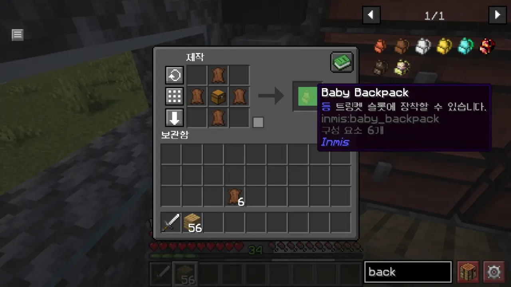

인벤토리 역시 부족하기에, 배낭을 만들기로 했다.

나중에 알고 보니 내가 만들어야 할 건 업그레이드가 가능한 Frayed Backpack이었기에, 근처에 돌아다니는 소를 잡아 Baby Backpack을 만드느라 낭비한 가죽을 보충해야 했다.



다시 말하지만, 난 여태껏 땅을 판 적이 단 한 번도 없다. 그런데 벌써 Bejeweled Backpack까지 만들었다. 여기까지 오는데 필요한 가죽, 철, 금, 다이아몬드, 에메랄드 모두를 구조물의 전리품 상자에서 얻을 수 있었다는 이야기다.

그래, 바로 이런 걸 원했어! 탐사 보상이 너무 짭짤하잖아, 이거?!

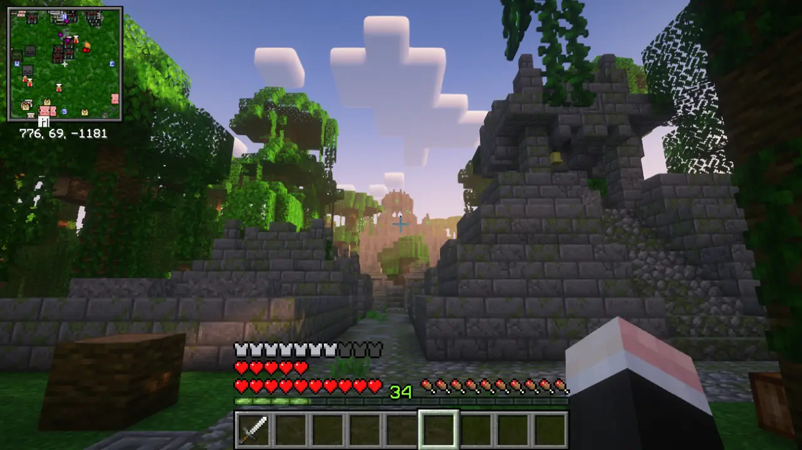

이걸 뭐라고 해야 할까? 정글 한복판에서 앙코르 와트를 연상시키는 피라미드 비슷한 건물을 발견했다.

가까이 가보니, 앙코르 와트 같기도 하고 테노치티틀란의 템플로 마요르 같기도 한 피라미드였다.



수상한 자갈을 발견했다. 곳곳에 쌓인 자갈을 보고 그냥 지나칠 뻔했는데, 이런 게 숨겨져 있었다니.

다만 수상한 자갈에서 쓸만한 물건은 하나도 나오지 않았다. 다음에는 그냥 지나쳐야지...

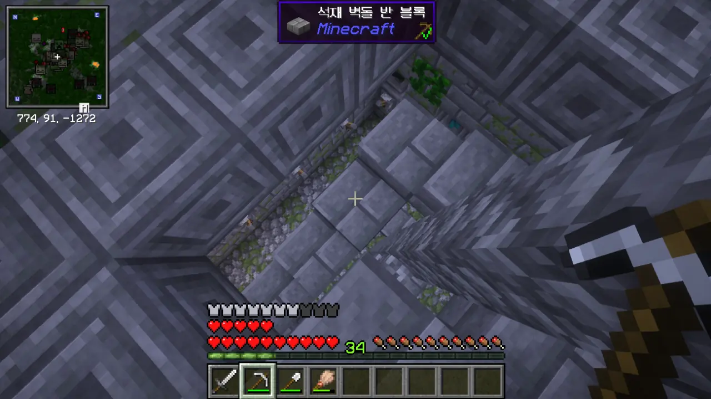

피라미드 꼭대기로 올라가니, 아래로 내려가는 계단이 나온다.

설마 여기, 던전이었나? 내가 분명 던전을 추가하는 모드도 넣었는데...



처음엔 이걸 보고 뭘 어째야 하나 고민했었다. 알고 보니, 파란색 양초가 있는 레버만 내리면 되는 것이었다.

놀라운 건, 올바른 레버만을 내린 후 버튼을 누르자, 익숙한 멜로디가 하나 흘러나왔다는 것이다. 정작 그게 정확히 무슨 멜로디였는지는 까먹었지만. 아마... 젤다의 전설에서 비밀문을 열면 나오는 멜로디였을 거다. 젤다의 전설을 플레이한 지도 오래되어, 그게 맞는지조차 확신할 수 없지만.

정답을 맞히자 아래로 내려가는 길이 열렸다.

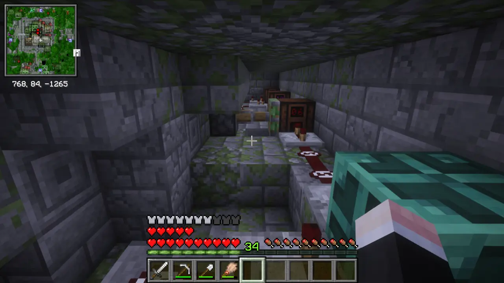

오, 이런 원리로 멜로디가 나오는 거였구나.

보통 이런 퍼즐은 레드스톤 장치를 꽁꽁 숨겨놓고 보여주지 않는데, 이 구조물은 벽 뒤의 레드스톤 장치로 가는 사다리가 따로 있다.

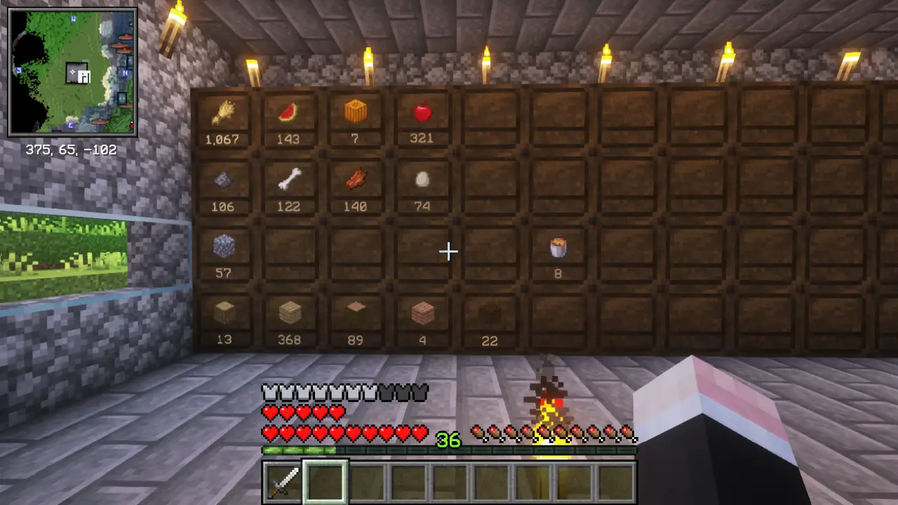

인벤토리가 가득 찼기에 피라미드 탐색을 중단하고 집으로 돌아왔다.

창고 역시 가득 찼기에, 일부 아이템을 따로 정리하기로 했다. 아니, 어떻게 밀이 1,000개가 넘어?

다시 말하지만, 난 여태껏 농사를 지은 적도, 땅을 판 적도 없다. 이게 다 상자 전리품으로 얻은 거라고!

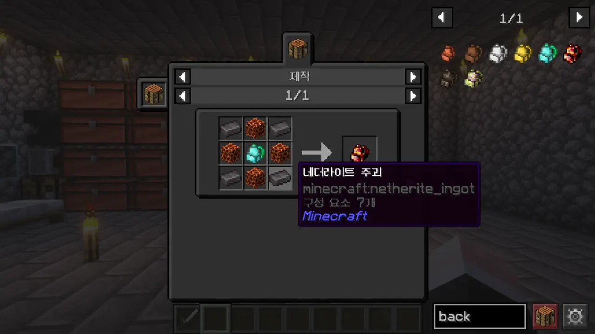

배낭 크기가 너무 작아 더 늘리고 싶지만, 다음 단계의 배낭을 만들기 위해선 네더라이트 주괴가 4개나 필요하다.

마그마 블록은 종종 보이는 것이니 상관없지만, 네더라이트 주괴를 4개나 요구하는 건 좀 너무하다는 생각이 든다.

'그냥 조합법을 쉽게 바꿔버릴까'라는 생각이 들었지만, 아직 내가 네더에 간 적이 없으니 일단 참기로 했다. 나중에 네더에 갔을 때, 아무리 찾아도 고대 잔해를 찾을 수 없으면 그렇게 하는 거로 하자고.

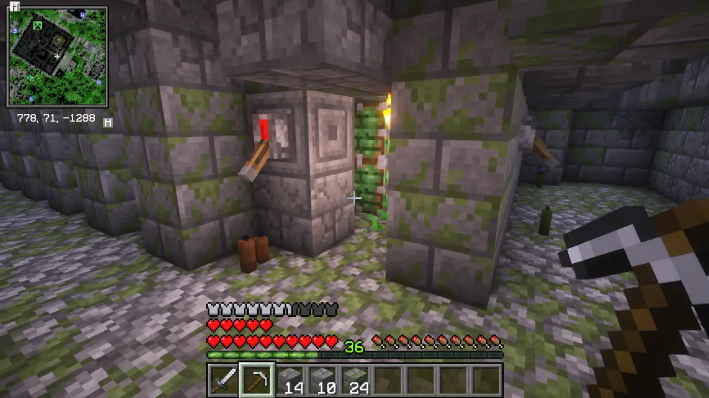

또 다른 레버 퍼즐을 발견했다. 다만 이번엔 돌아다니기 쉽게 주변 블록을 정리하는 과정에서 의도치 않게 퍼즐을 파괴해 버린 탓에, 그냥 들어가서 상자와 자원을 털었다. 에메랄드 블록과 금 블록이 가득하더라고.

이 퍼즐의 정답과 그 힌트가 과연 무엇이었을지는 지금도 알지 못한다.

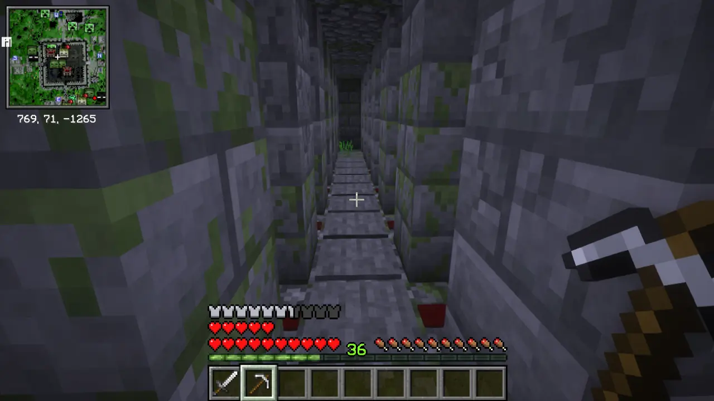

대체 이건 왜 있는 건지 잘 모르겠다. 통로 양쪽에 발사기가 있긴 하지만, 모든 발사기가 텅 비어있거든.

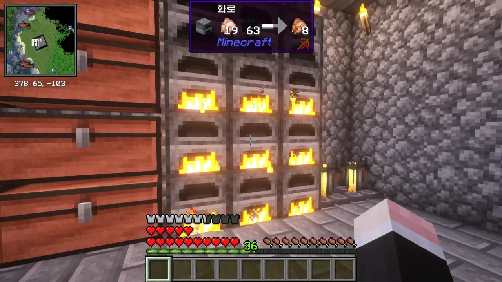

여태껏 쌓인 날고기의 양이 제법 되길래, 전부 화로에 굽기로 했다.

훈연기가 있었다면 더 빨리 구울 수 있었겠지만, 음식을 굽는 데에만 쓸 수 있는 훈연기를 만드는 건 좀 낭비 같더라고. 그에 비해 용광로는 구울 수 있는 아이템 종류가 더 많아, 만들 가치가 어느 정도 있다.
