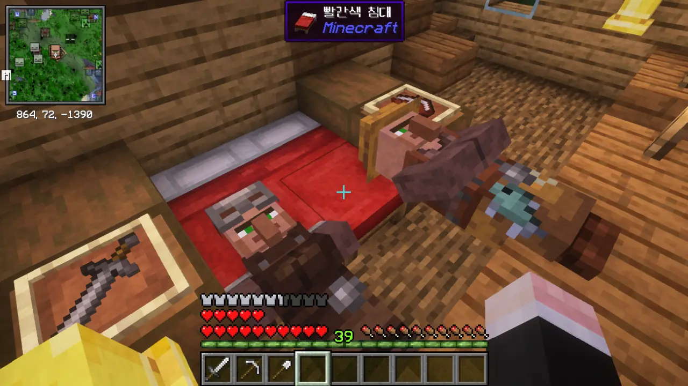

마인크래프트 사진이 제법 쌓였다. 그러면 풀어내야지.



기묘한 모양의 '도시'를 발견했다. 생긴 건 엔드 도시와 매우 유사하지만, 나무로 되어 있으며 내부에 주민이 살고 있다. 주민이 돌아다녀야 하기 때문에, 그 내부에는 계단이 많이 설치되어 있다.

일단 정식 명칭은 '오버월드 도시'라고 하는 것 같다.

음... 주민이 침대가 아닌 곳에서 자는 버그는 Paper를 쓸 때에만 볼 수 있는 건 줄 알았는데...

오, 광물 원석이잖아? 심지어 에메랄드 원석까지 있다.

당연한 말이지만, 하나도 남김없이 전부 싹 캐갔다.

집으로 돌아오는 길에 발견한 약탈자 전초기지에서 불길한 병을 얻었다.

흉조 디버프를 얻는 시점이 약탈자 대장을 처치하는 것이 아니라 불길한 병을 먹는 것으로 바뀌었기 때문에, 이제는 내가 원하는 시점에 마을 레이드를 시작할 수 있다.

이 주민 마을은 조금 기묘하다. 멀쩡한 집은 단 하나도 없고, 죄다 이런 진흙으로 된 집에 살고 있다.

이런 데서 살면 병에 걸리기 쉬울 거 같은데...

이 폐허는 원래 무엇이었던 걸까? 일반적인 주민 집의 크기는 절대 아니다.



우연찮게 발견한 마녀의 집. 검은색 고양이는 오직 마녀의 집에서만 나타나기 때문에, 갖고 있던 날생선을 잽싸게 바쳤다.

넌 이제 우리 집 대문을 지키는 고양이다. 이러면 크리퍼가 집 입구 가까이 다가오지 않겠지.

공중에 무슨 배 같은 것이 둥둥 떠있는데, 지금 저기까지 올라가기에는 조금 귀찮다. 배낭의 여유공간도 얼마 남지 않았기에, 저기는 나중에 가보기로 했다.



주민과 마녀가 공존하는 마을을 발견했다.

여기 있는 마녀는 플레이어를 공격하지 않는 건가 생각하고 가까이 다가갔더니, 냅다 독 포션을 던진다. 좋아, 여기 있는 마녀는 전부 몰살이다.

늪지대라서 그런가, 슬라임이 곳곳에서 튀어나온다. 집 안에서 튀어나오는 건 대체...

오... 마법 부여대라니. 예상보다 빠르게 마법 부여가 가능해졌다. 이미 집에 책이 많이 있기 때문에, 마법 부여대 레벨 역시 최대로 올릴 수 있다.



단일 아이템을 대량으로 저장할 공간이 모자라, 집을 확장했다. 이런 식으로 직사각형 집을 짓는 건 정말 오랜만이다.

아까 주워온 마법 부여대 역시 책장과 함께 잘 설치했다.

***

지상의 구조물은 나중을 기약한 걸 제외하면 대강 다 둘러본 것 같다. 그렇다면 이제 남은 건 지하의 구조물이지.

자원도 충분히 모였겠다, 늘 하던 대로 땅을 파내려 갔다.



아니나 다를까, 지하에도 이런저런 구조물이 잔뜩 있었다. '베이스캠프' 같은 구조물은 정말 자주 보인다.



다이아몬드 원석을 캐 다이아몬드를 얻자마자 베이스캠프의 상자에서 다이아몬드를 추가로 얻을 수 있었다.

오늘따라 운이 왜 이렇게 좋은 거지?



Alloy Forgery 모드를 괜히 깔았나? 광물 획득량을 늘려준다는 말을 듣고 설치한 모드인데, 기존과 별차이가 없다. 게다가 행운 곡괭이만 있다면 이것보다 더 많은 양의 자원을 얻을 수 있잖아.

다음 모드팩에서는 이 모드를 쓰지 말아야겠다.

베이스캠프에는 이런 함정도 있다. 뭣도 모르고 상자를 열면 바로 밑의 TNT가 점화되고, 그대로 펑 터지는 거지.

구조가 너무 단순한 탓에 걸리는 사람이 없을 거라고 생각하면 안 된다. 나도 몇 번 당해봤거든.



기존에 쓰던 Inmis 배낭 모드에 버그가 있는 것 같다. 배낭 내용물이 제때 저장되지 않아, 게임을 껐다 켜면 배낭에 넣어둔 아이템 중 일부가 증발한다.

그래서 Packed Up 모드로 갈아탔다. 배낭을 다시 만드는 건 쉬웠다. 오히려 이 조합법이 더 쉬운 것 같아...



동굴을 탐험하던 중, 이상한 벽을 발견했다. 미니맵을 보아하니, 이건 시련의 회당(Trial Chambers)이 분명하다.

저번에 봤던 신사(Shrine)도 그렇고, 시련 생성기 보상은 매우 짜다.



하지만 시련의 회당에는 브리즈가 있다. 브리즈 막대와 무거운 코어를 조합하면 철퇴를 만들 수 있다.

무거운 코어가 그냥 금고에서 낮은 확률로 나온다고 알고 있었는데, 알고 보니 불길한 병을 먹어 흉조 디버프를 얻은 상태에서 시련 생성기의 몬스터를 모두 처치해야 얻을 수 있는 '불길한 시련 열쇠'로 금고를 열어야 낮은 확률로 무거운 코어가 나온다고 한다.

그런데 여기 있는 금고나 시련 생성기는 전부 1회용인 것 같단 말이지... 흉조 디버프 없이 모든 금고를 열어버렸으니, 무거운 코어는 다른 시련의 회당에서 얻어야 한다.
