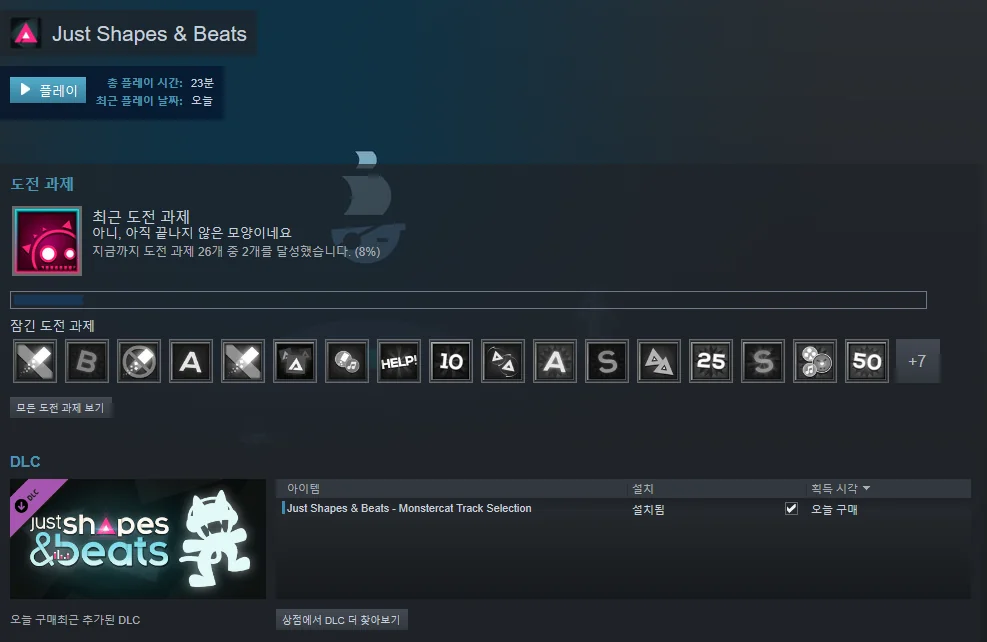

Just Shapes & Beats라는 게임을 샀다.

마침 스팀 월렛에 5,000원 정도가 있었기에 13,000원을 주고 샀다.

우연히 유튜브에서 JSAB 영상을 발견했을 때 '오, 이 게임은 언젠가는 꼭 사야지'라고 생각했었는데, 잘된 일이다.

잠깐 플레이해 보니 꽤 마음에 든다.

&nbsp;

다만 유튜브에서 본 영상에서는 360도 자유자재로 움직이던데, 정작 내가 키보드로 할 때는 45도 각도 단위로만 이동이 가능했다. 유튜브 영상을 찍은 사람은 게임패드로 플레이한 것이 아닐지 생각된다.

키보드로 이걸 All S 랭크를 찍으면 대단한 것 아닐까?

&nbsp;

JSAB은 나중에 다른 게임을 할 의욕이 나지 않을 때 조금씩 하며 천천히 스토리를 진행하면 될 것 같다.

다 하고 나선... 도전 모드에 뭐가 있는지 봐야겠지, 아마.

도전 모드도 할 게 없다면 아마 13,000원짜리 일회용 게임이 될 것 같은데... 적어도 13,000원의 가치는 있어 보인다.
