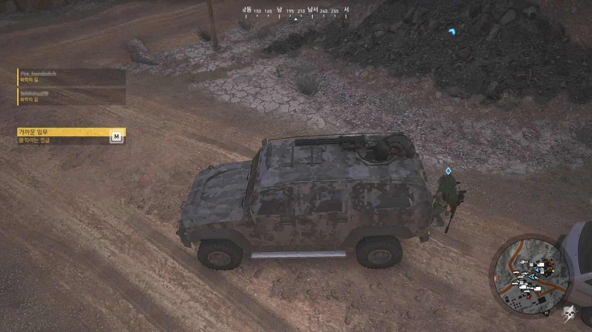

사진에서는 다른 플레이어가 내가 운전하는 차 뒤에 붙어있는 것처럼 보인다.

하지만 실제로 이 플레이어는 내 차의 사수 자리에 앉아있다. 적어도 본인이 말하는 바에 따르면.

&nbsp;

더욱 웃긴 건, 내가 보는 저 플레이어는 차 꽁무니에 붙어서 텅텅거리며 차를 따라오고 있고, 차 뒤에 뭔가가 걸리면 거기에 같이 걸려서 한참 뒤까지 걸려있다가 다시 차 꽁무니로 순간 이동해 또다시 텅텅거린다는 것이다.

&nbsp;

이게 그 핑 문제라는 건가?

안 그래도 분명 시스템 메시지로 쓰러졌다고 나오는 플레이어에게 가보면 멀쩡히 서 있거나 앉아있는 상황이 종종 보이던데 말이다.

&nbsp;

디비전 2와 고스트 리콘 와일드랜드 둘 다 안티치트로 EAC를 쓰고 있다.

그런데 고스트 리콘에 동봉된 EAC에 문제가 있는 것인지, 고스트 리콘 EAC를 설치하면 게임에서 EAC를 찾을 수 없다고 징징댄다.

그래서 혹시나 하는 마음에 디비전 2의 EAC를 설치했더니 고스트 리콘이 정상적으로 EAC를 인식한다.

&nbsp;

자기 안티 치트도 제대로 못 찾는 게 말이 돼?
