9월 9일까지 스팀에서 컨트롤 얼티밋 에디션을 3만 6천 원에 판매하고 있으니까, 관심이 있다면 사보는 것이 좋을 것이다.

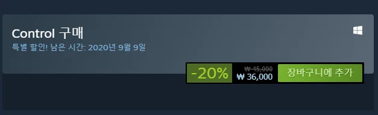

&nbsp;

게임 스크린샷으로 쓰는 글이 늘 그렇듯이, 게임 스포일러를 다량 함유하고 있다.

***

나는 SCP 재단과 같은 크리피파스트를 좋아하는 편이다. 그래서 컨트롤이 작년에 발표되었을 때 굉장히 신나 했었다.

컨트롤이 에픽 스토어 독점이라는 사실을 알게 되기 전까지 말이다. 뭐? 에픽 스토어 독점? 안 사!

&nbsp;

에픽 게임즈가 언리얼 엔진과 같은 훌륭한 프로그램을 만드는 회사인 것은 알고 있지만, 그와 별개로 에픽 게임즈를 좋아하지 않는다.

그 이유는 간단하다. 에픽 게임즈가 여러 게임 개발자에게 접근해 '돈 많이 줄 테니까 우리 에픽 스토어에서 독점 출시하지 않을래?'라며 유혹한 결과, 멀쩡히 스팀에 출시될 예정이었던 게임까지 스팀 출시를 취소하고 에픽 게임즈 독점 출시를 선언했기 때문이다.

그중에는 내가 좋아하던 메트로 엑소더스도 포함되어 있었고.

이러한 에픽 스토어의 돈지랄을 본 여러 게이머는 에픽 스토어라면 학을 떼게 된 것이다.

&nbsp;

곧바로 컨트롤에 대한 모든 관심을 끊어버린 난 그대로 컨트롤이라는 게임에 대해 잊고 있었다.

컨트롤이 출시 초기에만 반짝 빛났다가 곧장 잊히곤 하는 싱글 플레이 게임인 이유도 있었다. 아무도 컨트롤 이야기를 하지 않는데 누가 그걸 기억할까?

나중에 컨트롤에 대한 이야기를 들어도 '그게 무슨 게임이었더라?'라고 생각할 정도였다.

&nbsp;

그러다가 컨트롤이 스팀에서 할인 판매 중이라는 글을 읽었다. 컨트롤이 어떤 게임인지 한번 찾아본 후, 나는 곧바로 스팀에 가서 게임을 구매했다.

스팀에서 판매 중인 버전은 얼티밋 에디션이라고 해서, DLC 두 개가 포함된 버전이라고 한다.

페이데이 2가 DLC 장사질을 하는 걸 보고 DLC라는 것에 거부감이 생긴 지라, 만약 게임 본편을 구매하고 스토리 DLC를 또 사야 했다면 아마 게임을 아예 사지 않았을 수도 있었기에, 다행스러운 일이었다.

&nbsp;

게임을 시작하기 전에 게임 설정을 들여다보았는데, 매우 마음에 드는 것이 있었다.

바로 치트성 게임플레이 옵션이었다. 체력과 에너지 자연 회복량을 100%까지 설정할 수 있었고, 에임 어시스트나 원샷 원킬같은 치트 트레이너에서나 볼법한 옵션 역시 포함되어 있었다. 무적? 당연히 있었다.

&nbsp;

나는 체력과 에너지의 자연 회복량을 100%로 설정하기만 하고 게임을 플레이하기로 했다. 무적을 켜지 않은 이유는 체력 자연 회복량을 믿었기 때문이었다. 에이, 설마 내가 가장 쉬운 난이도에서 죽겠어?

***

나는 게임을 하기 전에 관련 정보를 알아보면서 스포일러를 당하는 것에 거리낌이 없다. 게임이 정말 재미있다면 스포일러를 당했어도 게임은 내게 충분한 재미를 줄 것이고, 게임이 재미가 없다면 스포일러를 당하지 않아도 재미가 없을 것이기 때문이다.

내가 깜놀 요소를 싫어하는 것도 이유 중 하나이기도 하다.

&nbsp;

이미 어느 정도 스포일러를 당했음에도 컨트롤은 도입부부터가 마음에 들었다.

국장과 같은 고위직의 사진이 잔뜩 걸린 벽에 '연방 통제국의 직원'이라며 청소부의 사진도 걸어둔 것을 보고 '이 조직은 말단 직원까지 따뜻하게 살피는 곳인가?'라고 생각했었는데, 청소부와 대화하고 돌아오니 아까 그 청소부의 사진이 걸린 액자가 엘리베이터로 변해있었다.

청소부의 허락을 받지 못하면 연방 통제국으로 들어가지 못하는 것 같다.

&nbsp;

이런 기믹을 SCP 재단 글과 같이 글로 읽는 것과 직접 내 눈으로 보는 것에는 큰 차이가 있다. 직접 두 눈으로 보는 것이 더 흥분되는 것은 당연한 일.

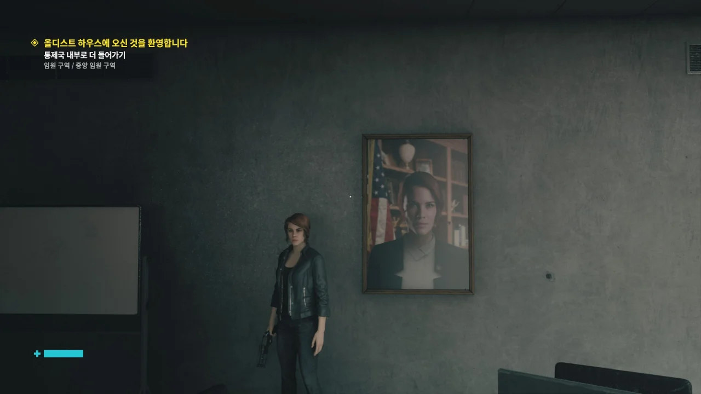

초반 내용은 잘 기억나지 않지만, 사람들이 공중에 둥둥 떠다니는 것을 보고 '아, 여기 뭔가 X 됐구나'라는 것은 확실히 알 수 있었다. 그야, 보통 사람들은 공중에 둥둥 떠다니지 않잖아.

게다가 멀쩡해 보이는 사람이 단 한 명도 보이지 않고 말이다.

&nbsp;

분명 처음 연방 통제국에 들어왔을 때는 잘생긴 중년 아저씨의 사진이 국장 액자에 걸려 있어, '이 아저씨와 대화하게 되는 것일까?'라고 생각했었는데, 막상 국장실에 가보니 그 아저씨가 자기 머리에 총을 쏜 채로 죽어있었다.

&nbsp;

그의 총을 집어 들고 무언가 시키는 대로 이래저래 했더니 그 이후 보게 되는 모든 국장 액자에 前 국장의 사진 대신 주인공의 사진이 걸리게 되었다.

심지어 몇몇 액자 밑에는 아예 대놓고 주인공의 이름인 '제시 페이든'이 적혀 있었다.

&nbsp;

죽은 전임자에 대한 예우 같은 건 없는 건가...?

&nbsp;

제대로 된 사람은 없는데 연방 통제국 자체는 누가 손대지 않아도 잘 돌아가니, 뭔가 무섭다. 음... 마치 게리 모드에서 빅 시티 맵을 혼자 돌아다니는 느낌이라고 해야 할까, 이걸.

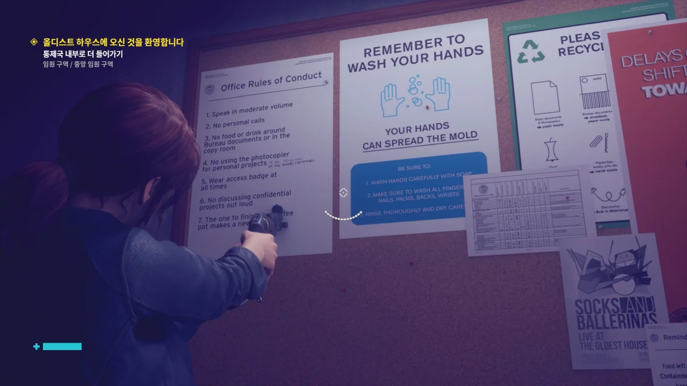

'곰팡이 확산을 막기 위해 손을 잘 씻으세요!'

지금 코로나바이러스 때문에 세상이 난리도 아닌 터라, 그 대상이 바이러스가 아닌 곰팡이라는 것만 빼면 정말 피부에 와닿는 캠페인 문구이다.

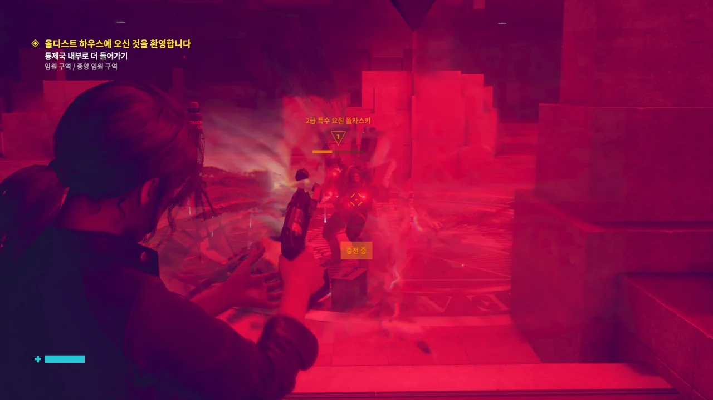

중앙 임원 구역에 오니까 난데없이 보스 같은 것이 날 반겨준다. 대충 헤드샷을 갈기면 픽픽 머리가 터져나가던 적들에 비해 꽤 단단해서 조금 고생했다.

그나저나 이 권총, 명중률이 굉장히 구리다!

&nbsp;

이렇게 이름이 있는 네임드들은 일종의 미니보스라고 생각하면 편할 것 같다.

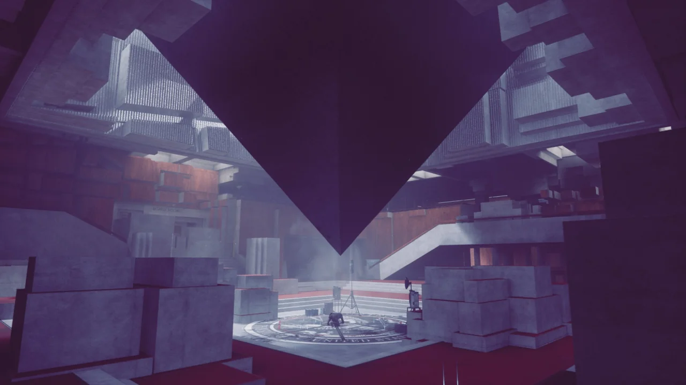

네임드를 잡고 나서 나타난 '통제 구역'이란 걸 점령하자 울퉁불퉁 콘크리트 육면체로 가득하던 공간이 단정하게 변하기 시작한다. 아무래도 붉은 기운에 침식당한 구역은 이렇게 콘크리트 육면체가 나타나는 등 공간 자체가 일그러지는 것 같다.

이걸 영상으로 남겨놓을 걸 그랬다. 이런 식으로 공간이 착착 변형되는 기믹은 내가 좋아하는 것 중 하나이다. 아아, 한 번 더 보고 싶어라.

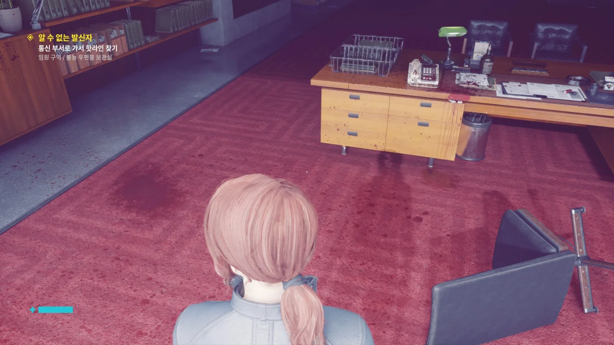

다시 국장실에 가보았더니 국장의 시체가 간데없이 사라진 상태였다. 주변에 튄 피는 전부 그대로인데...

설마 여기서 죽으면 시체조차 제대로 남기지 못하는 거야?

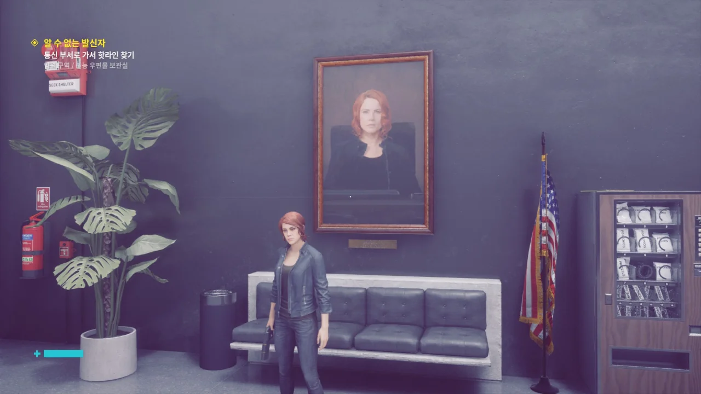

분명 주인공은 오늘, 이 건물에 처음 온 것이다. 오자마자 국장의 권총을 좀 쥐었다고 갑자기 국장이 되었고.

그런데 곳곳에 찍지도 않았을 주인공의 국장 모습의 사진이나 그리지도 않았을 주인공의 초상화가 곳곳에 걸려있는 것을 보면 으스스하다. 설마 이 공간이 살아있다거나 그런 건 아니겠지?

&nbsp;

주인공을 약간 위에서 내려다보면 이쁜데, 정면에서 보면 이쁘지 않은 것 같다. 저 초상화를 봐라. 무슨 중년같이 보이지 않은가.

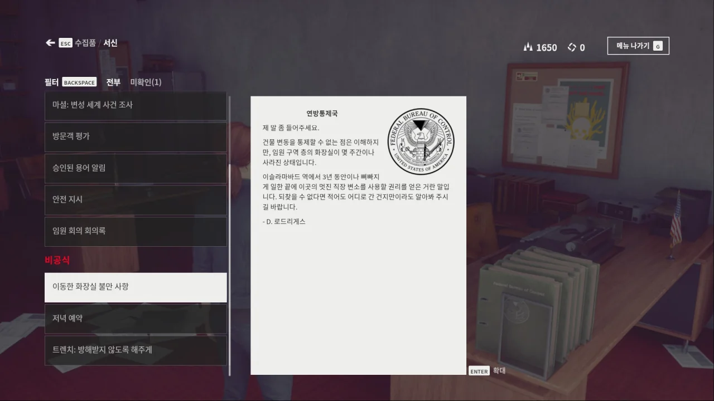

연방 통제국에 들어온 이유가 멋진 직장 변소를 이용하기 위해서라니... 정말 하찮은 이유다.

그나저나 임원 구역에 화장실이 하나도 없는 건 너무 불쌍하다. 아무리 이 건물 자체가 제멋대로 변하는 특성이 있다지만 화장실이 사라질 줄이야...

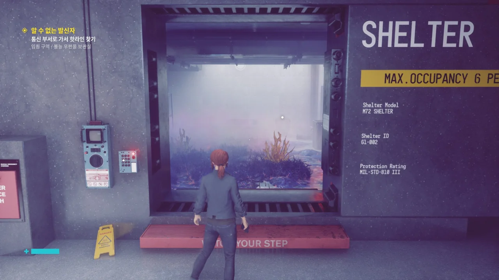

안전 구역으로 보이는 은신처의 문을 열었는데 안에는 곰팡이가 가득 자라있었다. 여기가 정말 비상시 사람들이 대피하게 되어 있는 안전 구역이 맞는 것인지, 연방 통제국의 일 처리 방식에 의구심이 들기 시작했다.

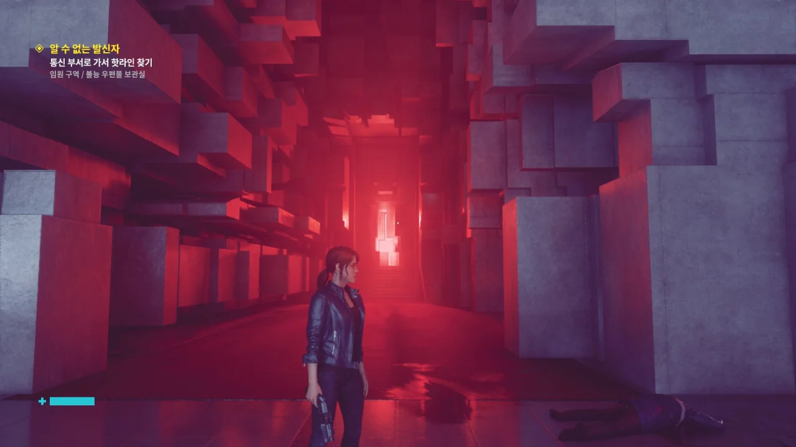

빨간 공간은 곧 '들어오지 마시오' 혹은 '얼른 들어오시오'이다.

게임 자체가 붉은색을 자주 쓰는 편인데, 적들마저 붉은색 일색이라 보다 보면 눈이 좀 피로해진다.

저곳으로 가려고 하니까 더 가지 말라는 듯이 소음의 크기가 커지며 화면도 일그러지더라. 심지어 주인공은 자기 머릿속 목소리에게 "여기 들어가지 말라는 거죠? 알겠어요."라고 하더라.

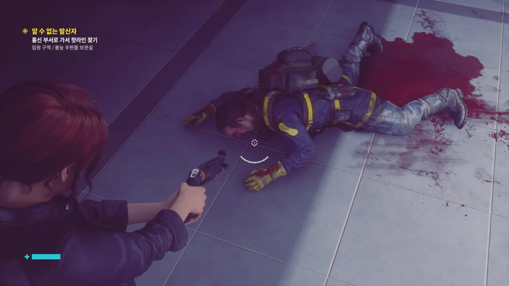

공중에 둥둥 매달린 사람 외에도 이렇게 그냥 시체가 되어버린 사람도 있다.

&nbsp;

공중에 매달린 사람 하니까 생각난 건데, 공중에 매달린 사람 근처에 가면 뭔가 중얼대는 소리가 들린다. 그 소리는 어딜 가나 들리는 소리이다.

그런데 공중에 매달린 사람을 총으로 쏘면 마치 풍선이 터지듯이 파삭- 하고 흩어지면서 중얼대는 소리의 크기가 조금 줄어든다.

만약 근처의 모든 풍선 사람을 죽이면 중얼대는 소리가 아예 들리지 않게 된다.

&nbsp;

뭐지, 이건?

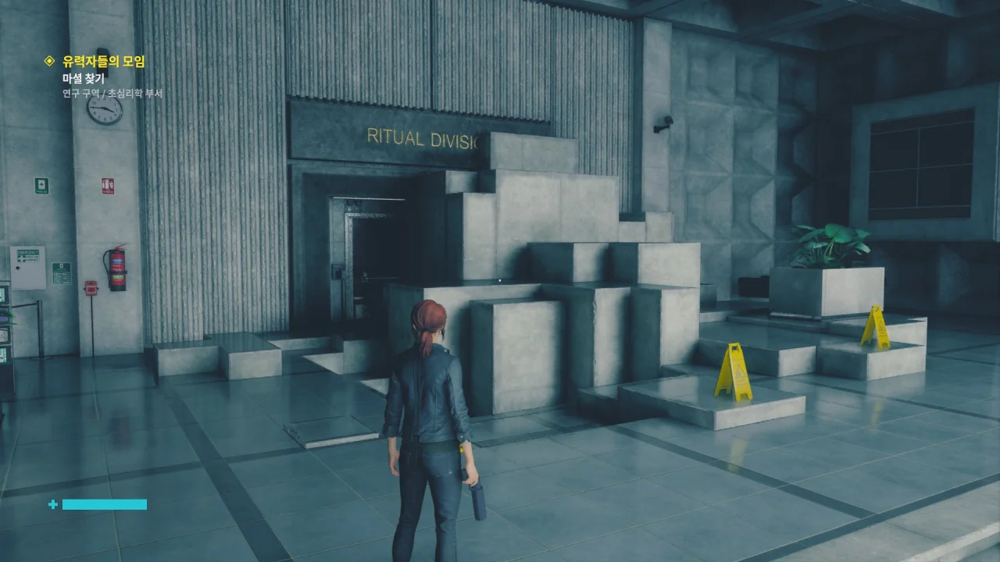

저걸 보고 나중에 저 문으로 들어갈 수 있을 것으로 생각했는데, 지금 글을 쓰면서 다시 생각해 보니 그러진 못할 것 같다.

저 공간의 일그러짐이 이번 사태로 인해 생긴 것이라면 진입 금지 표지판이 세워져 있을 리 없지 않은가?

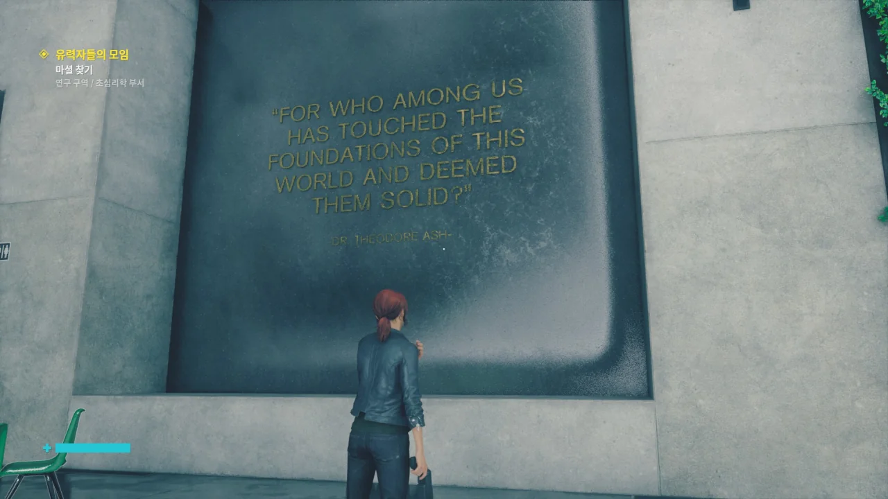

> FOR WHO AMONG US HAS TOUCHED THE FOUNDATIONS OF THIS WORLD AND DEEMED THEM SOLID?
> 우리 중에 이 세상의 기초를 만지고 그것들이 견고하다고 생각한 사람은 누구인가?
{.bq}

무슨 뜻인지 잘 몰라 번역기를 돌렸다. 저 말은 이 세상의 기초가 사실은 불안정하다는 걸까?

&nbsp;

그나마 다행인 점은 표지판 같은 것은 크로스헤어를 가져다 대면 화면 오른쪽에 번역이 나타난다. 아니 이런 세삼한 데가 다 있나.

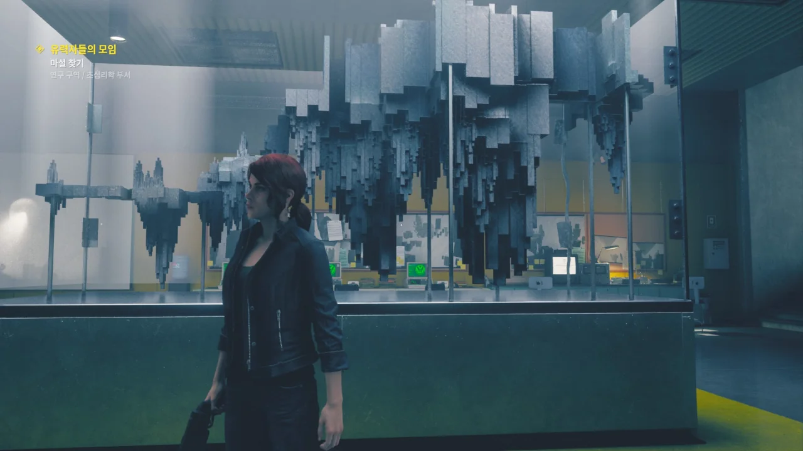

아까 '아스트랄 플레인'을 뛰어다닐 때 저런 모습을 본 것 같은데.

아마 이 미니어처는 아스트랄 플레인을 표현한 것 같다.

&nbsp;

이런 사각사각한 표현, 너무 이쁘다.

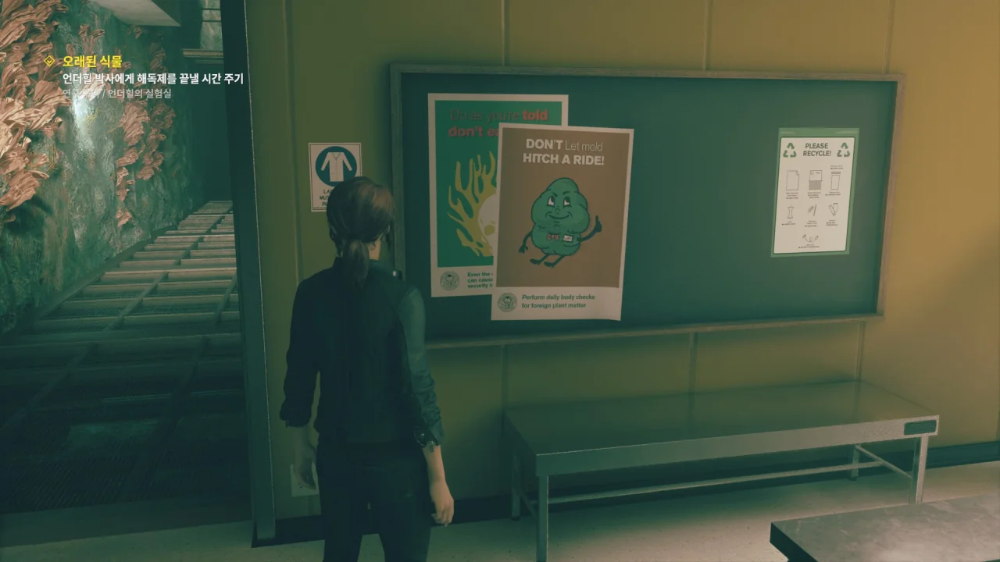

> Do as you're told
> don't ea[이하 생략]
{.bq}

아마 가려진 부분을 추측하자면 이렇게 될 것이다.

> Do as you're told
> don't eat mold!
{.bq}

곰팡이를 먹지 말라는 이야기이다. 곰팡이를 왜 먹어?

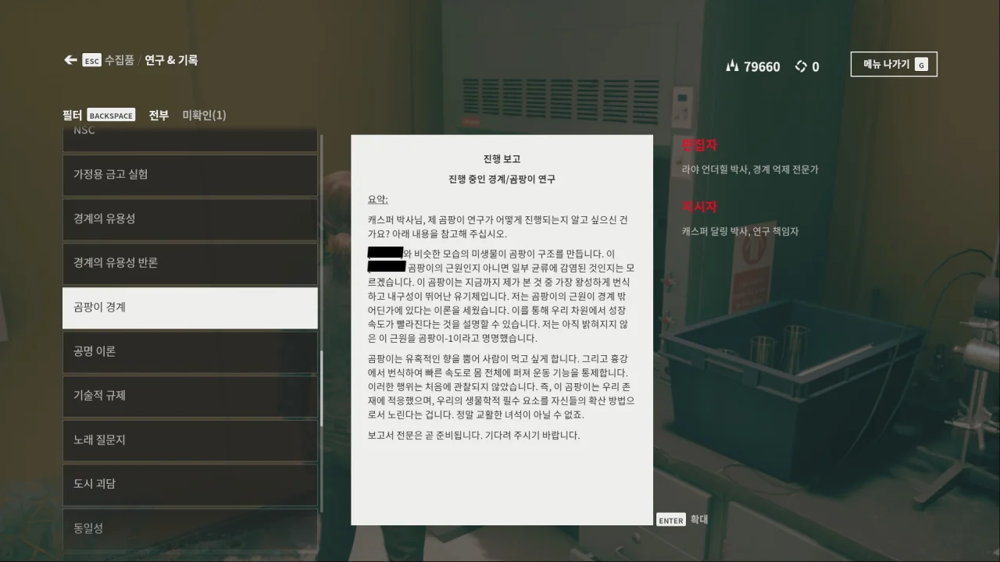

게임 중 발견할 수 있는 문서에 따르면 '곰팡이'라는 이름은 그저 우리가 부르기 편하게 적당히 붙인 이름이며, 저건 실제 곰팡이가 아니라고 한다. 애당초 외계에서 온 것인데 그게 우리가 아는 곰팡이일 리가 없지 않은가? 하지만 하는 짓이 곰팡이와 비슷해서 곰팡이로 부를 뿐이라고 한다.

&nbsp;

그런데 이 곰팡이에겐 무서운 특징이 하나 있다.

곰팡이를 보면 곰팡이를 먹고 싶어진다. 심지어 주인공마저 곰팡이를 보고 "왠지 맛있어 보이는데..."라고 중얼거릴 정도.

하지만 곰팡이를 먹게 되면 곰팡이 인간이 되어버린다. 곰팡이가 흉강에서부터 번식해 몸 전체를 점령하는 것이다. 이렇게 되면 살아있는 것이 아니게 된다.

&nbsp;

실제로 곰팡이 인간을 만난 적이 있었는데, 굉장히 몸이 단단해서 놀랐다. 이게 무슨 라스트 오브 어스도 아니고...

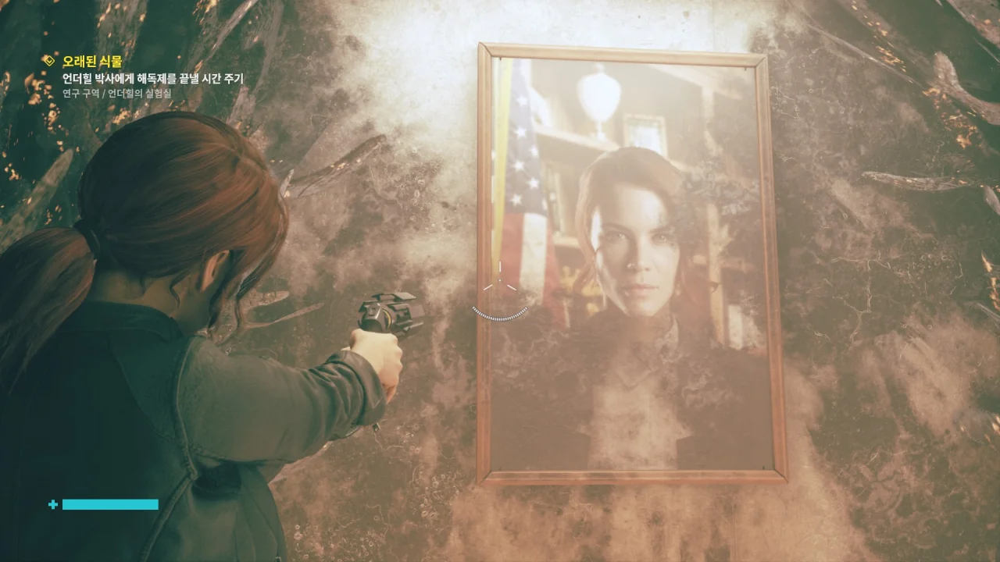

여기 걸린 액자도 주인공의 사진으로 교체되었다.

그런데 액자가 곰팡이에 침식된 모습을 보니 조금 불편해진다. 마치 주인공 얼굴에 곰팡이가 묻은 것 같잖아.

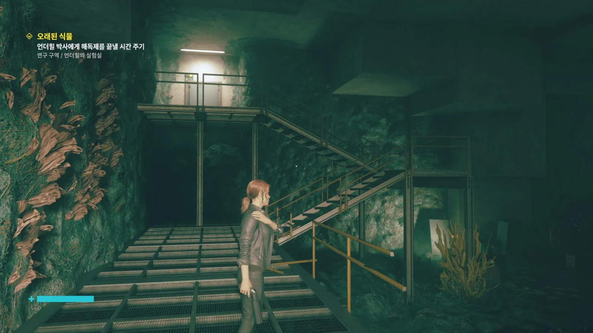

멀쩡하던 건물에 곰팡이가 대량 증식한 모습인데, 이걸 봐도 '곰팡이'가 곰팡이가 아님을 알 수 있다. 세상에 무슨 곰팡이가 저렇게 벽 전체를 덮어?

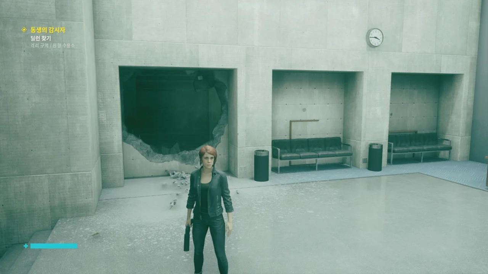

별생각 없이 돌아다니며 벽에 총을 쏘고 있었는데, 벽이 무너졌다. 안에 들어가 보니 아이템이 하나 있더라. 일종의 시크릿인가 보다.

내가 발견해 놓고도 놀라워서 한 장 찍었다.

&nbsp;

오늘의 교훈: 벽에 점 같은 것이 콕콕콕 찍혀 있다면 그 벽은 무너지는 벽이다.

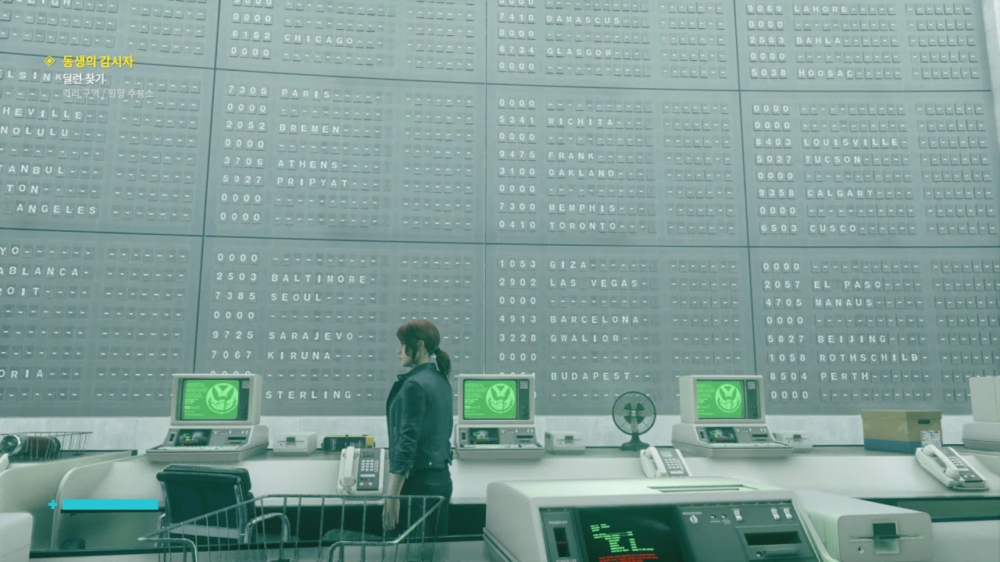

여긴 뭘 하는 곳인지 잘 모르겠지만, 전 세계의 도시마다 분류 코드 같은 것을 할당해 두고 있었다.

서울은 무슨 코드가 할당되어 있나 찾아보니 7385였다.

&nbsp;

서울 외에도 시카고, 파리, 사라예보, 다마스커스, 글라스고 같은 여러 도시가 있었는데, 도시 이름을 하나하나 보면서 내가 아는 도시인지 아닌지 생각해 보는 것도 재미있었다.

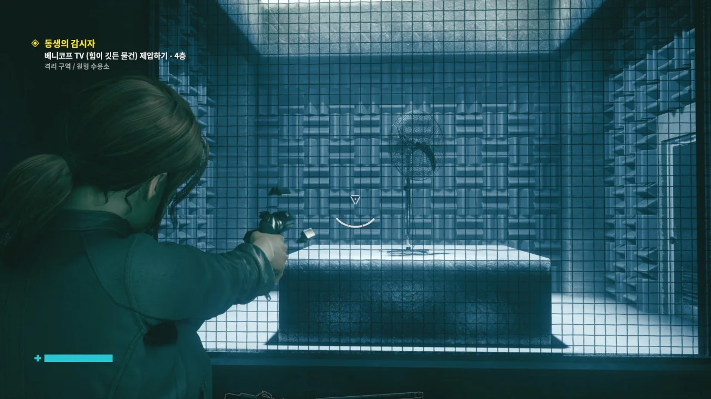

이게 그 유명한 '선풍기'이다.

게임 설정에 따르면 이 선풍기는 작동할 때 공기 분자를 변형시키기 때문에, 밀폐된 방에서 선풍기를 켜면 결국 질식해 죽게 된다.

그런데 연방 통제국 직원이 이 선풍기를 회수할 때 잘못 둘러댄 탓에 한국에 '선풍기가 산소 분자르르 반으로 갈라서 질식사하게 된다'라는 미신이 퍼졌다고...

&nbsp;

이 미신은 해외에서도 한국의 미신으로 잘 알려져 있다. 아예 영어식 이름도 붙었는데, Fan Death이다.

한국의 요소가 들어간 게임을 보는 것은 꽤 어려운 일이기 때문에, 뭔가 반갑다.

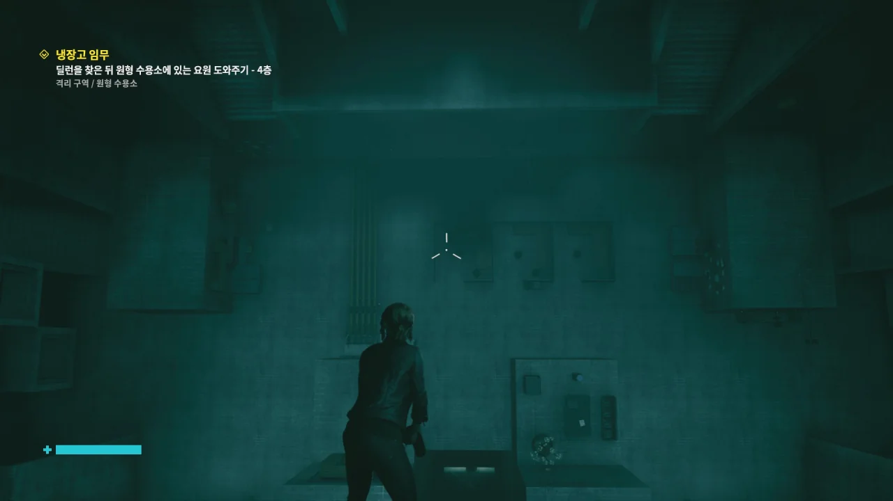

격리실에서 탈출한 어느 물건을 회수하려고 찾아갔더니 이상한 공간으로 날 끌어당겼다.

정신을 차리고 보니 조금 전까지 벽이었던 곳에 주인공이 서있다. 주인공 앞에 있는 건 방금 전까지 바닥이었고.

와, 이런거 나 좋아해.

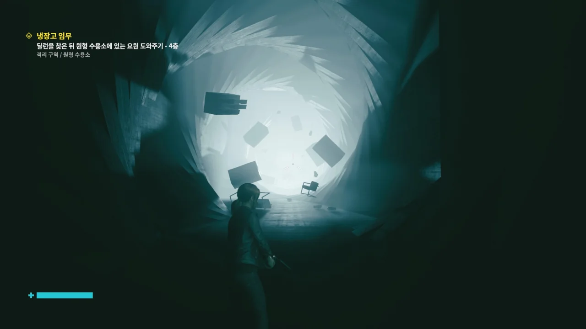

공간을 왜곡해대는 플라밍고를 계속 쫒아가니, 이번엔 공간을 나선형으로 비틀고 있다. 이런다고 내가 포기할 줄 알고? 어림도 없지. 플라밍고가 만든 주변 환경을 잘 감상하며 플라밍고를 회수하는 데 성공했다.

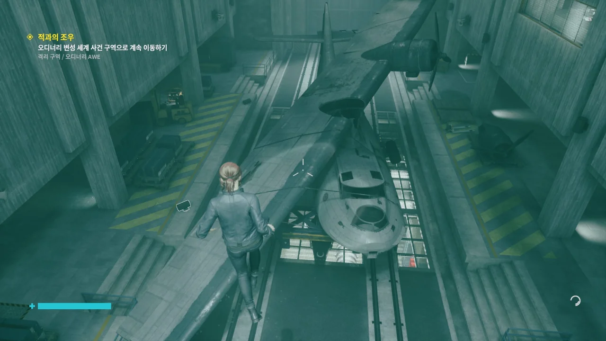

이 철로는 뉴욕 지하철과 연결되어 있다고 한다. 위에도 NEW YORK SUBWAY라고 적힌 팻말이 있다.

여기 이 생김새가 조금 UFO처럼 생긴 비행기는 변성 아이템인지 아닌지 조사하기 위해 뉴욕 지하철을 통해 가져온 것이라고 한다.

대체 이 큰 걸 어떻게 갖고 온 거지?

&nbsp;

연방 통제국이라고 해서 모든 걸 완벽히 파악하고 움직이는 것은 아닌 것 같다.

무슨 사건이 생겼다는 소식이 들려오면 그게 정말로 변성 아이템 때문에 일어난 일인지 아니면 그냥 헛소문인지 구분하기 힘들어 일단 직접 가서 조사해 보고, 의심쩍은 물건은 냅다 여기로 갖고 와 조사를 한다고 한다.

그래서 허탕을 치는 경우가 많다고.
