한동안 스크린샷을 찍지 못했다.

첫 번째 글의 마지막 사진을 찍은 후, '오디너리 변성 세계 사건' 관련 퀘스트를 진행하고 메인 허브로 돌아갔더니 게임이 그대로 굳어버렸다.

게임을 강제 종료하고 다시 실행했더니 첫 번째 글의 마지막 사진보다 더 앞의 시점으로 되돌아와 있었다.

내가 지금껏 한 모든 진행 상황이 초기화된 것이다.

그동안 오디오 로그나 기록물 같은 것을 열심히 수집하고 다녔는데, 그런 것마저 모두 도루묵이 되어버렸다.

&nbsp;

그래서 다시 진행 상황을 복구하기 위해 열심히 뛰어다녀야 했다.

수집물도 샅샅이 뒤지지 않고 적당히 눈에 보이는 것만 모으고 다녔으며, 전투조차 제대로 하지 않고 피할 수 있는 건 전부 피했다.

&nbsp;

게임이 왜 굳은 것인지 알지 못하기 때문에 중간중간 통제 지점으로 돌아와서 통제 지점의 메뉴를 열어 현재 위치를 저장한 후, 메인 메뉴까지 나갔다가 다시 돌아오는 귀찮은 일까지 해야 했다.

이게 다 게임이 중간에 멈추더라도 지금까지 한 내 진행 상황을 잃어버리는 일을 막기 위해서였다.

&nbsp;

당연히 사진 찍는 일은 뒷전이 되었다. 지금 내 게임 진행도가 더 중요한 걸!

&nbsp;

그래서 다음 사진을 찍는 건 한참 후가 되었다.

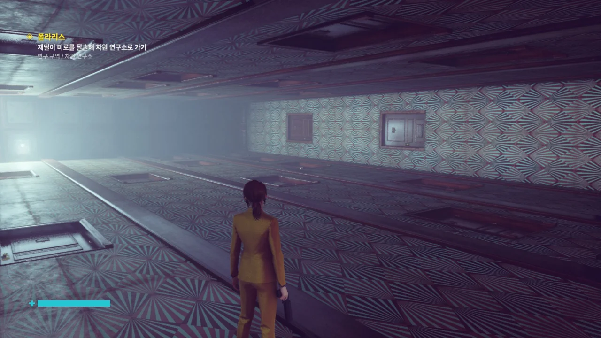

재떨이 미로에서의 경험은 그야말로 최고였다.

멀쩡하던 벽이 종이접기 하듯 접히며 새로운 통로를 만들기도 하고, 열려있던 통로가 접히며 막히기도 했다. 바닥이 솟아오르거나 꺼지며 새로운 공간을 만들기도 했고, 위 사진처럼 온갖 기묘한 공간이 나타나기도 했다.

&nbsp;

들려오는 BGM 역시 정말 멋졌다.



위키를 찾아보니 핀란드의 밴드 'Poets of the Fall'의 노래라고 한다. 재떨이 미로에서 나왔던 노래의 제목은 'Take Control'이고.

{}

Take control, take control

I see a vision rising, dreary  
Fading in as children play twilight games  
In the town called Ordinary  
An eye of light reveals a gateway to doomsday

In that projection of reality  
Something passes through the stars, shifting walls  
Enter agents of ill fantasy  
For evil holds you in its arms, false alarms

Illusory, treading on reality  
Polaris in a web of hypocrisy  
Take control, take control

Oh, can’t you see, see the light is fading?  
And in the night the demons rage and call your name  
No deeper madness than your own making  
Visions lashing blades of shame, but will you take the blame?

Hissing noises in the hallway  
Bloodshot eyes, staring through, what seeds are sown?  
Who’ll survive the blood red power play?  
Who’ll take control, whose name will be known?

Illusory, reality’s all fallacy  
Polaris in a web of hypocrisy  
Take control, take control

I wish I’d had the wherewithal to find you when I had the chance  
Instead I danced with death in fervour’s skin  
I missed the moment before the fall to recognise I had a voice  
A choice to stop it all from happening  
If only I could save you from the pain

A rising sense of awe and wonder  
A might I see has always been deep within me  
I can feel my inborn power  
I call the shots when it’s all finally clear to see

And so I’m drawn ever deeper  
In the Oldest House and all these empty rooms  
This vacant, spellbound mystery motel  
Where I’m the keeper, where I set the rules

Potency is my new reality  
Polaris living now inside of me  
I control, I control

{}

이다음에는 그토록 찾던 헤드론을 찾을 수 있었다.

하지만 히스가 레이저와 히스 감염체를 이용해 헤드론을 공격하기 시작했고, 그걸 애써 막아놓았더니 이번엔 헤드론이 붕괴해 버렸다.

&nbsp;

결국 주인공이 히스에 감염된 채 히스 감염체들이 하는 말과 똑같은, 알 수 없는 말을 중얼거리는 것으로 끝이 났다.

엔딩 크레딧이 나오는 것으로 확인 사살.

&nbsp;

뭐야, 이 게임 배드 엔딩이었어?

                                                      

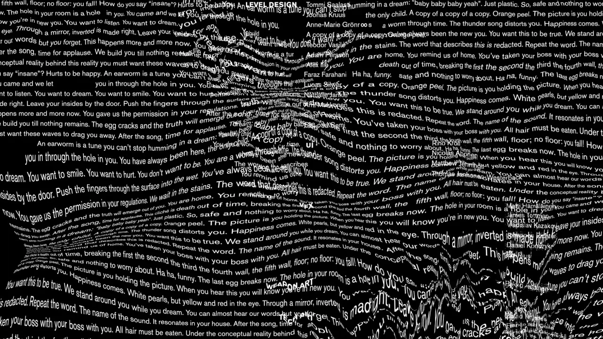

그럼 그렇지!

우리가 흔히 아는 엔딩 크레딧이 나오다가 스태프의 이름이 나오는 대신 히스에 감염된 사람들이 중얼거리는 대사가 대신 나오기 시작한다.

그다음에는 그 대사가 위 사진처럼 왜곡되어 나타난다.

결국 대사의 일그러짐은 갈수록 심해져 화면이 온통 흰색으로 덮였다.

&nbsp;

이 연출을 보면서 몸을 부르르 떨었다. 이런 연출, 너무 좋아! 내 취향 저격이야!

그래서 이걸 넘길 수 있었지만 넘기지 않았다.

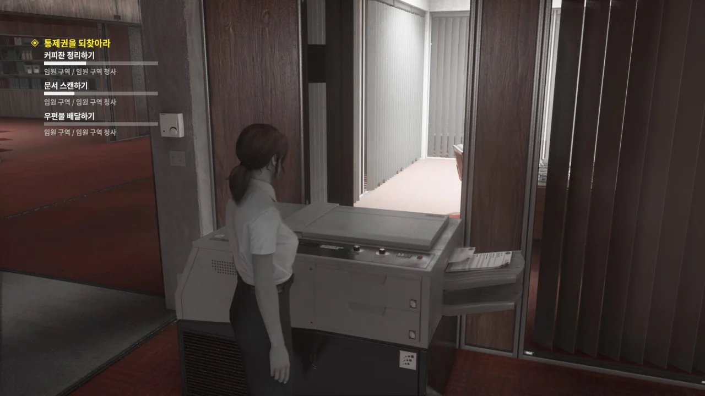

이 탈색된 세상 속에서 주인공은 말단 직원처럼 온갖 허드렛일을 하게 된다.

그런데 지금까지 주인공이 만났던 모든 사람이 주인공을 갈구고 있다.

"너에게 시킬 일 따위는 없어.", "얼른 가버려." 와 같은 말로 주인공을 매도하는 그들에게 주인공은 "감사합니다.", "아직 신참이라서 잘 몰라요. 죄송합니다." 같은 대답을 한다. 보는 내가 불편해질 정도로 말이다.

&nbsp;

그 와중에 임무 이름이 '통제권을 되찾아라'인데 정작 그 내용은 통제권을 되찾기는커녕 주변 사람들의 허드렛일을 하는 일뿐이다. 시키는 대로 한다고 통제권이 되찾아질까? 아닐 것 같은데...

&nbsp;

이 상황이 꿈과 같은 상황이라는 걸 강조라도 하려는 듯이, 분명 주인공이 신임 국장인 것 같은데, 정작 연방 통제국 사람들이 신임 국장에게 허드렛일을 시킨다. 위아래가 뒤집힌 것도 아니고...

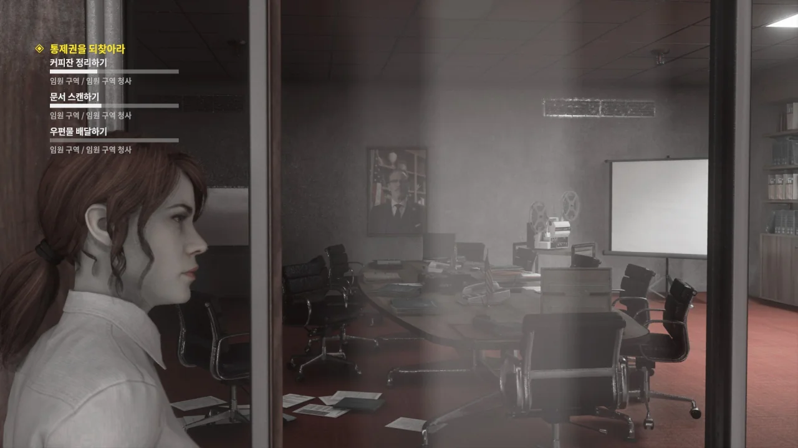

아무래도 여기에서의 주인공은 신임 국장이 아니라 그냥 신임 사무직인가 보다. 벽에 전임 국장의 사진이 걸려있는 걸 보면 말이다.

그런 거였다면 주변 사람들이 주인공에게 온갖 허드렛일을 시키는 게 자연스럽긴 하겠네.

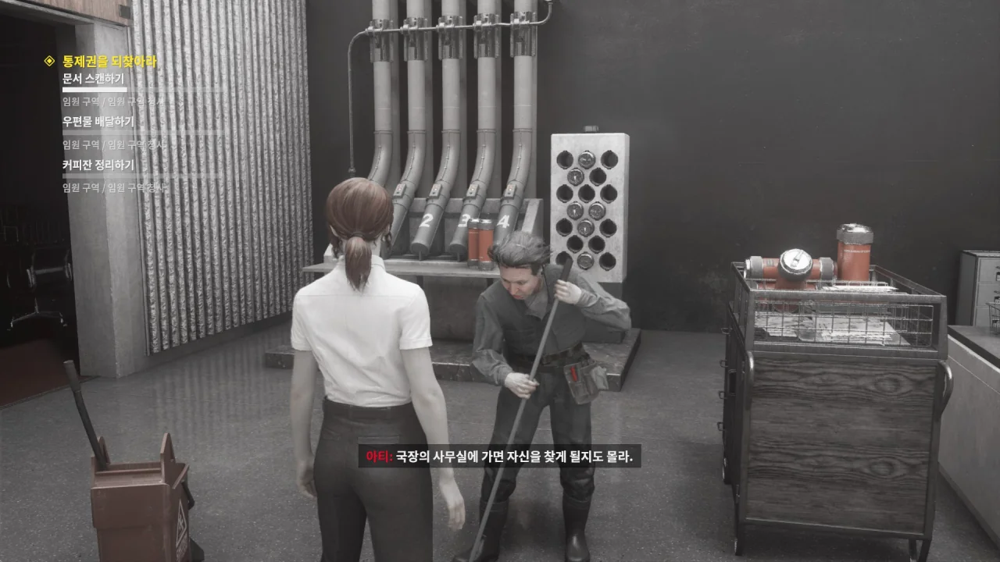

모두가 주인공을 매도하는 와중에 우리의 청소부, 아티는 주인공에게 따뜻한 말을 건네며 국장실에 가보면 자신을 찾을 수 있을 것이란 조언을 해준다.

&nbsp;

이 연방 통제국에서 제일 기묘한 인물을 꼽으라면 추호의 고민도 없이 아티를 꼽을 것이다.

휴가를 갈 것이라고 말하며 향한 곳이 연방 통제국의 최심부인 파운데이션이었고, 그곳으로 가보니 정말 해변의 선탠 의자에 앉아 맥주를 마시고 있는 것처럼 파도 소리와 맥주 캔 따는 소리가 들려온다.

그렇지 않아도 재떨이 미로와 관련해서 '대체 저 청소부는 여기에 어떻게 들어온 거냐?'라고 하는 문서도 있었는데.

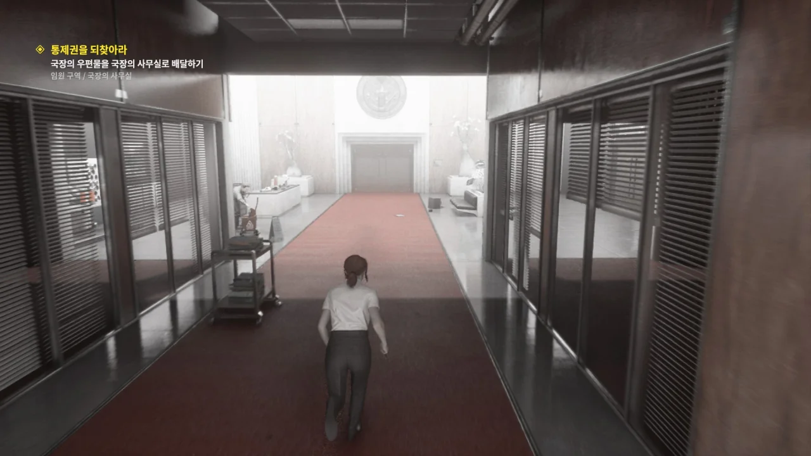

아티의 말을 따라 국장에게 줄 우편물을 들고 국장실로 향한다.

국장의 말에 따라 우편물을 전달한 후 다른 우편물을 가져오기 위해 발걸음을 옮기는데...

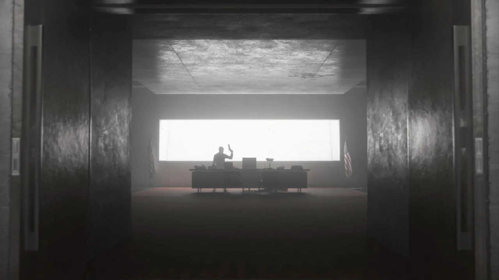

응??? 딜런 네가 왜 여기에 있니?

딜런이 서비스 웨폰으로 국장을 쏜 후, 마치 일순이라도 한 것처럼 다시 처음부터 시작하게 되었다.

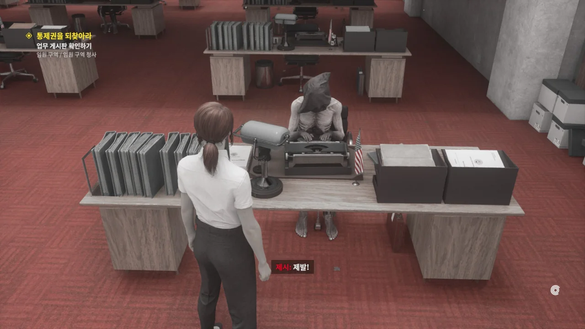

완벽히 처음으로 되돌아간 것은 아니다.

이렇게 히스 감염체가 멀쩡히 의자에 앉아 타자기를 치고 있거든.

그 외에도 사람들이 지나갈 때 몇몇 사람 뒤에 잔영 같은 것이 남기도 한다.

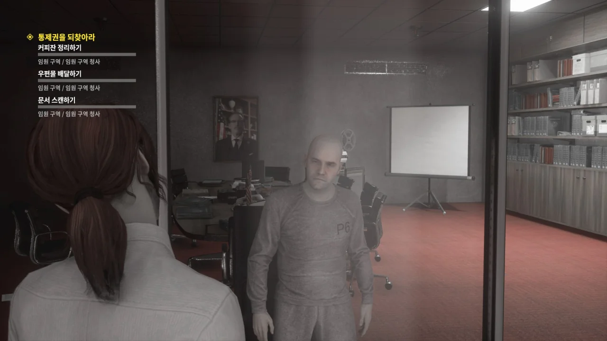

평안한가.

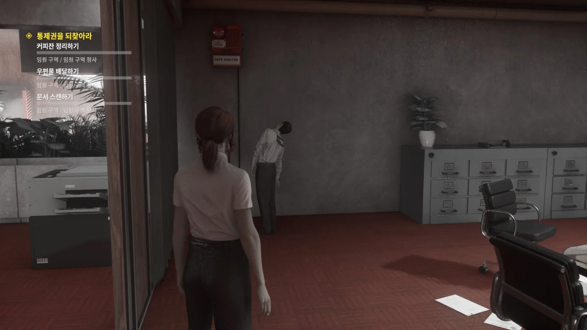

이렇게 풍선 인간처럼 기묘한 자세로 서 있는 사람도 많아졌다.

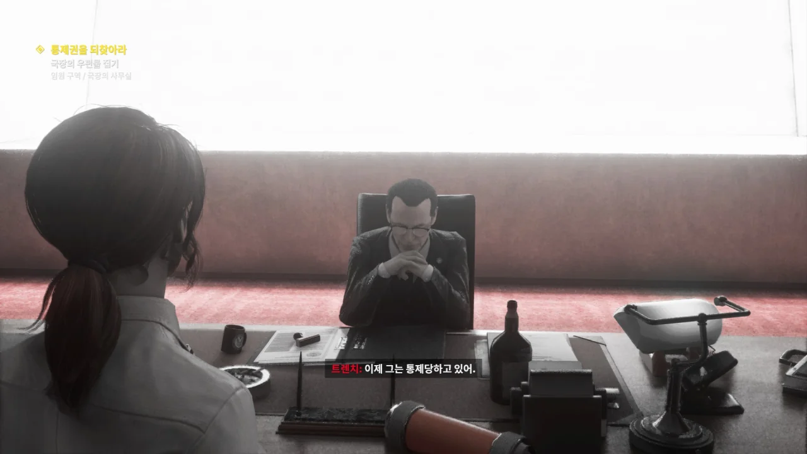

이번에도 아티의 조언에 따라 국장실로 향하니, 이번에는 국장이 나가보라는 말을 하지 않고 독백을 시작한다.





아무래도 히스가 국장을 속인 것 같다.

트렌치 국장이 처음 슬라이드 프로젝터를 이용했을 때 히스가 그를 잠식했고, 헤드론이 연방 통제국을 잠식하고 있다고 믿도록 만들었다. 하지만 헤드론은 역으로 히스가 연방 통제국에 퍼지는 것을 억제하고 있었다.

히스에게 세뇌된 트렌치 국장은 헤드론의 효과를 증폭해 사람들의 히스 감염을 막는 '헤드론 공명 증폭기'를 개발한 달링 박사 역시 싫어하게 되었고, 결국에는 자기 손으로 직접 슬라이드 프로젝터를 이용해 히스의 세계로 통하는 포탈을 연방 통제국 안에 열어젖힌 것이다.

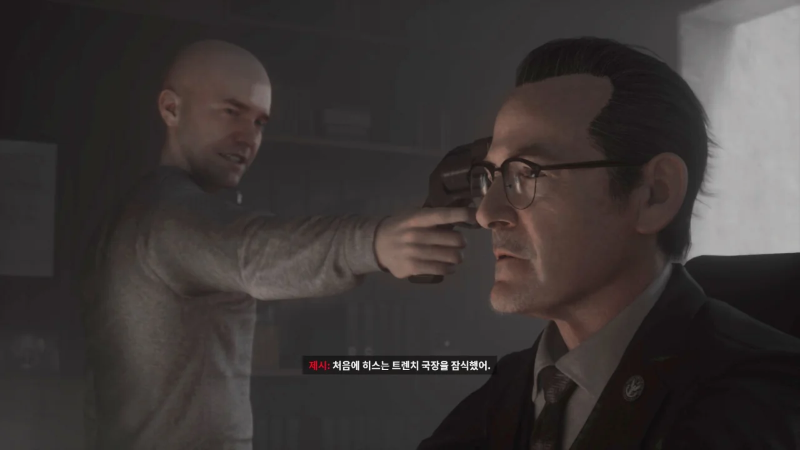

이런 장면을 보면 이게 정말로 있었던 일인지, 아니면 은유적인 표현인지 알기 어렵다.

그냥 보면 '연방 통제국 안에 갇혀 있던 딜런이 탈출해 국장의 서비스 웨폰으로 국장을 죽였다'라는 것으로 보이지만, 서비스 웨폰은 위원회의 시험을 통과하지 못하면 쓸 수 없는 무기이다. 아스트랄 플레인을 침식할 목적인 히스에게 잠식된 딜런이 위원회의 시험을 통과했을 리 없지 않은가.

이 장면은 은유적인 표현일 것이다. 히스가 이제 더 이상 쓸모가 없는 트렌치 국장을 자살하도록 만든 것이란 의미의 표현일 것이다.



곳곳에 정상이 아닌 사람들이 늘어나고 있다.

이 사람은 잔상이 심해졌고, 이 사람은 풍선 인간처럼 축 늘어져 있다.

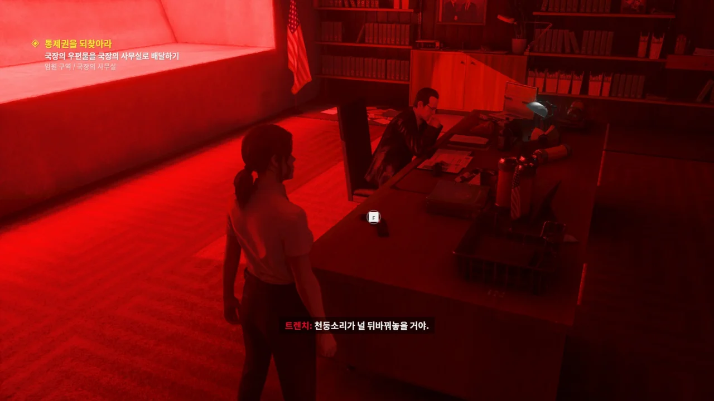

국장실에 가보니 이번엔 국장이 반응을 하지 않고 그저 히스의 중얼거림만 반복하고 있다.

그리고 그 옆에는 대놓고 '날 집으세요'라고 말하는 듯한 서비스 웨폰이 놓여 있다.

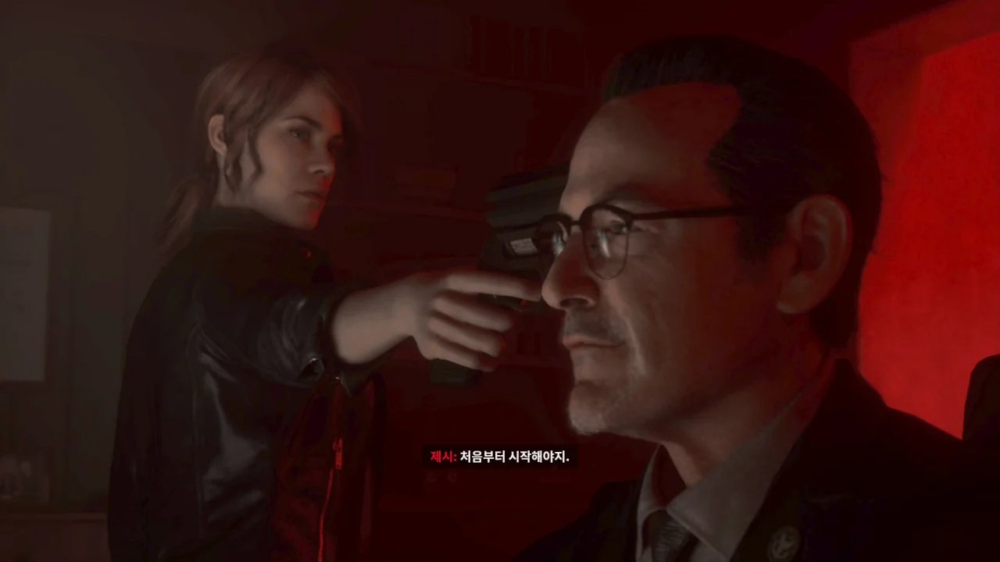

그리고 주저 없이 서비스 웨폰을 집어 트렌치 국장의 머리를 날려 버리는 주인공.

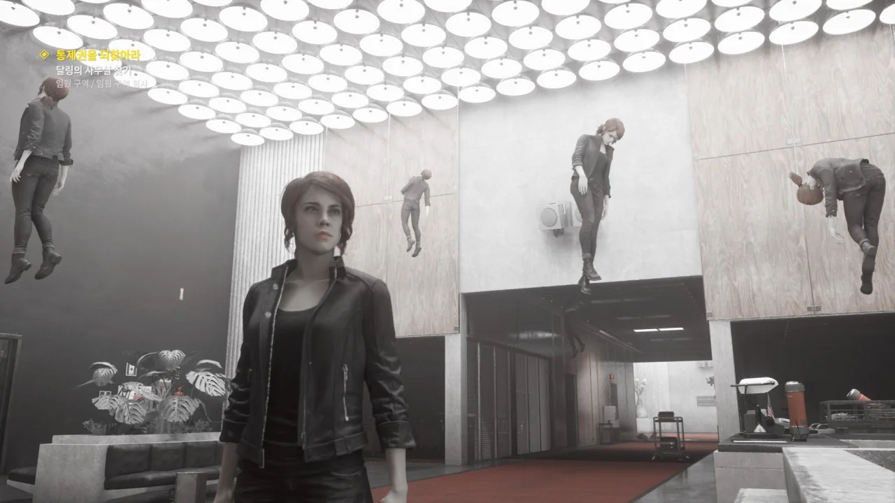

사람들이 모두 사라진 연방 통제국. 공중에 뜬 풍선 인간이 전부 주인공이다.

이런 연출은 조금 신기한걸. 그래도 이렇게까지 꿈이 뒤틀렸다는 건 끝이 다가왔다는 증거 아닐까?

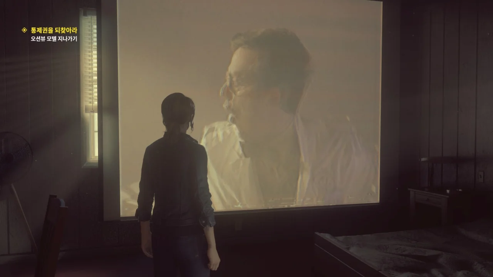

오션 뷰 모텔에 도착한 주인공. 어떤 방에 들어가 보니 달링 박사가 기괴한 막춤을 추고 있는 영상이 재생되고 있었다.

... 이거 설마 이스터에그야?

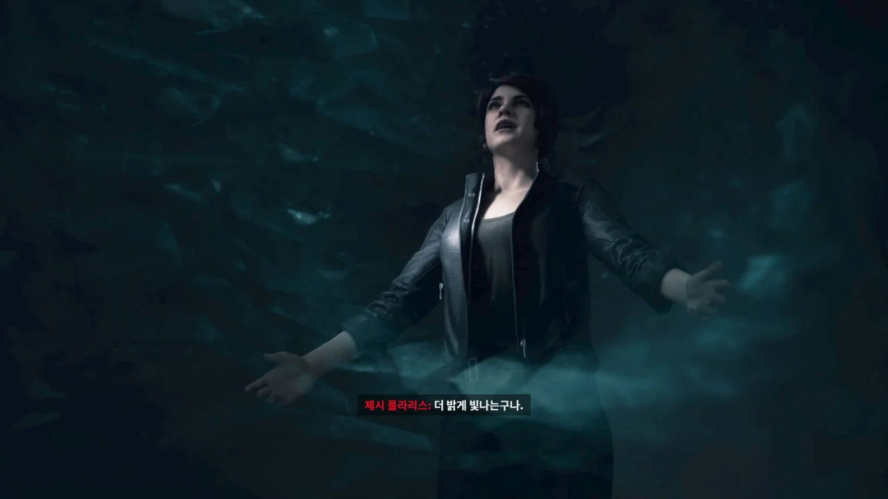

결국 히스를 극복해 내고 내면의 폴라리스를 완전히 깨운 주인공.

저번에도 말했지만, 주인공은 밑에서 보면 정말 못생겼다.

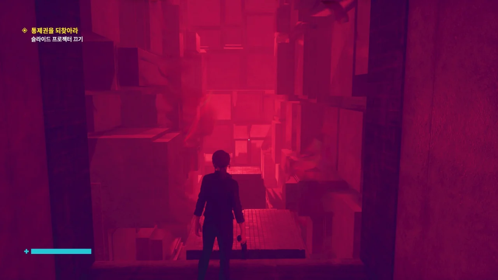

저번에 온통 빨간색으로 뒤덮여 갈 수 없었던 통로가 바로 '노스텔지어 부서'였다. 난 내가 직접 그곳까지 걸어갈 줄 알았는데, 히스의 잠식에서 벗어나 보니 곧바로 노스텔지어 부서 안이었다.

약간 실망스러운 걸...

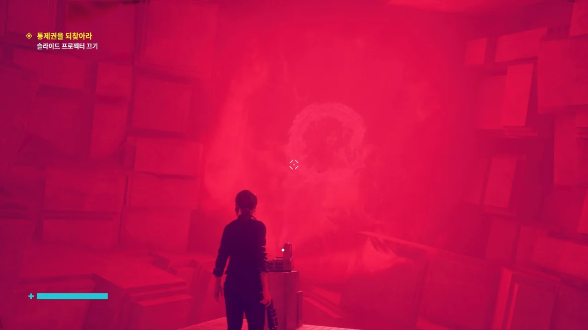

프로젝터 건너편에는 히스의 상징인 붉은 물감의 일렁임이 보인다. 이 프로젝터를 통해 히스가 연방 통제국 안으로 흘러들어오고 있었다.

곧바로 프로젝터를 꺼버렸다.

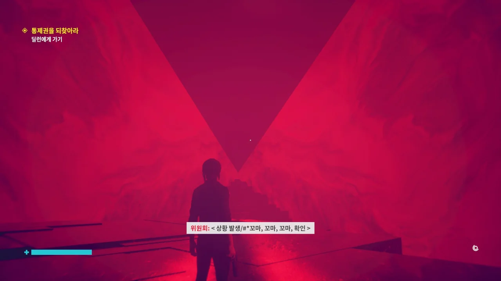

위원회의 본거지인 아스트랄 플레인 역시 히스의 침공을 받아 붉은 물감이 일렁이는 곳이 되었다.

위원회가 다급하게 주인공을 부르는데, 솔직히 이 녀석들이 말하는 것이 너무 건방져서 내키지 않는다.

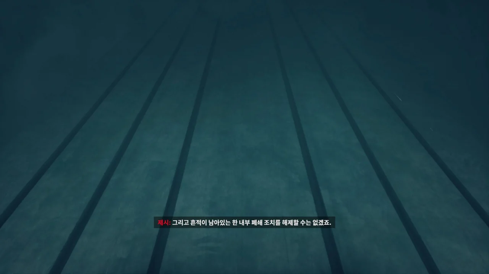

아스트랄 플레인에 들어온 히스까지 모두 격퇴한 주인공.

하지만 연방 통제국 안에는 여전히 히스가 득시글거리는 상황이다. 여기서 '이겼다! 컨트롤 끝!'이라고 선언할 수 있으면 좋으련만, 내부에 여전히 득시글거리는 히스 때문에 내부 폐쇄 조치는 해제될 수 없다.

그러니까 우리 아직 한참 남았다!

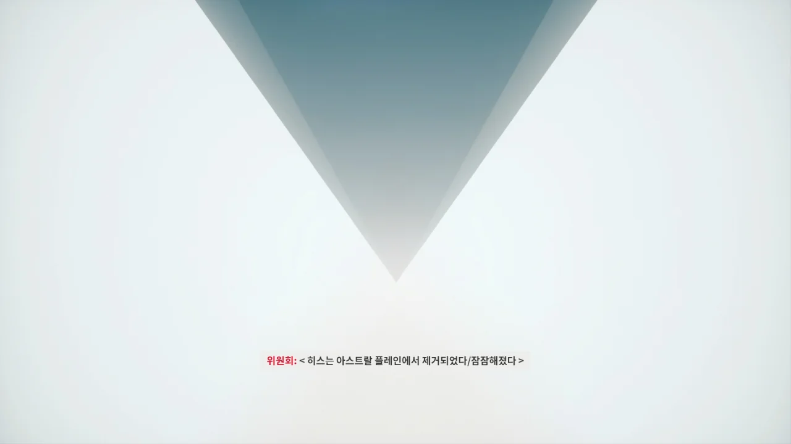

위원회는 아스트랄 플레인에서 히스가 사라졌다고 주인공을 칭찬한다.

위원회가 말하는 것을 들어보면 서로 정반대의 의미를 가진 단어를 동시에 말하거나 농담 같은 말을 하기도 해서, 위원회의 진의가 무엇인지 잘 모르겠다.

당장은 주인공의 아군인 것처럼 보이지만, 주인공을 체스 말처럼 다루려는 것 같단 말이지...

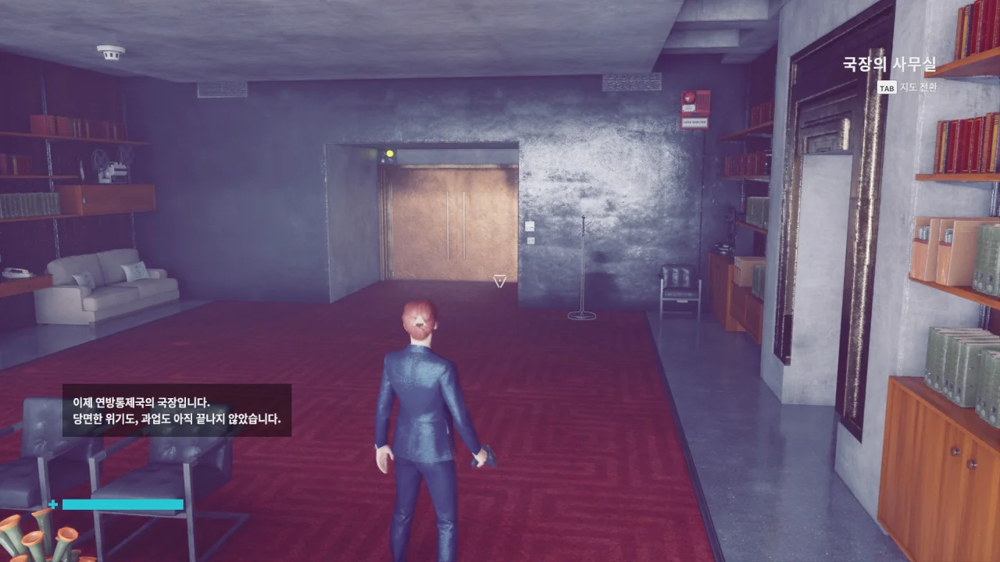

> 이제 연방 통제국의 국장입니다. 당면한 위기도, 과업도 아직 끝나지 않았습니다.
{.bq}

ㅋㅋㅋㅋㅋㅋ 아직 한참 더 남았다고 ㅋㅋㅋㅋㅋㅋ 엔딩이라고 완전한 끝이 아니라고 ㅋㅋㅋㅋㅋㅋ

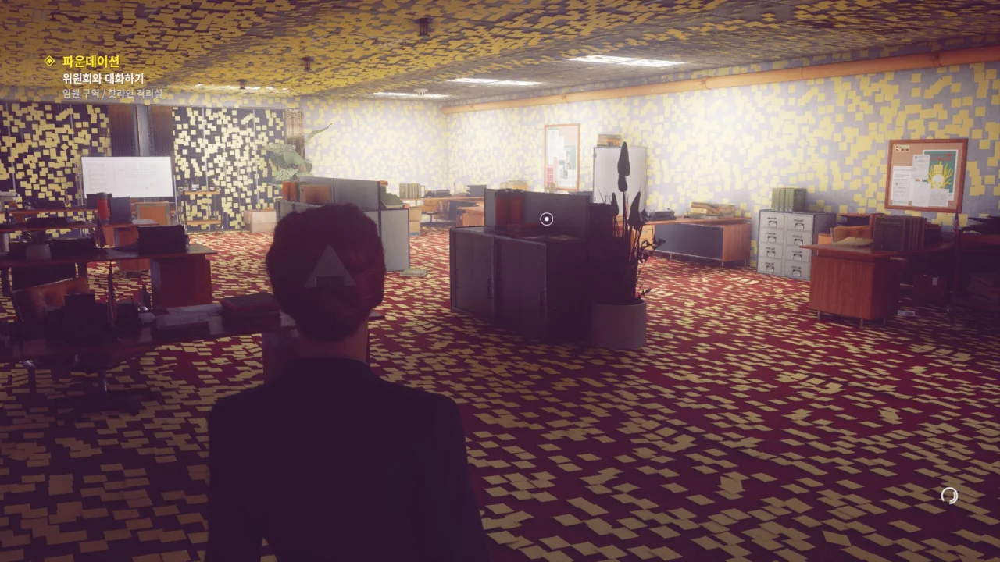

가고 싶어도 권한 부족이라며 들어가지 못했던 방에 이제 들어갈 수 있다. 왜냐면 내가 이제 국장이니까! 연방 통제국의 최고 대빵이니까!

그런데 이 방은 왜 이렇게 포스트잇이 많은 거지? 설마 포스트잇 성애자가 방 전체를 포스트잇으로 뒤덮은 것일까?

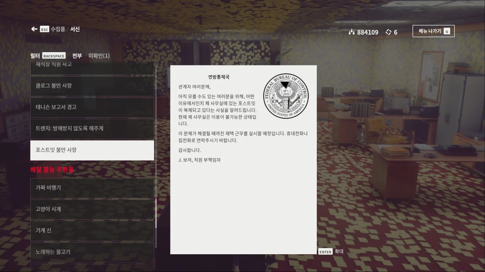

사무실에서 입수할 수 있던 문서에 따르면 이 사무실은 포스트잇이 무한히 복제되는 이상 현상 때문에 폐쇄되었다고 한다.

이전에 만났던, 골동품 시계를 무한히 복제해 대던 닻처럼 여기도 그런 이상 물체의 영향을 받은 것일까?

&nbsp;

그나저나 재택근무라니... 아마 이 사람은 히스의 영향을 받지 않았을 것이다. 올디스트 하우스 바깥에서 재택근무를 하고 있었으니 말이다.

이상 현상 때문에 자신의 사무실을 쓰지 못하게 되었지만, 그 덕택에 히스에게 잠식당하지 않을 수 있었다라... 새옹지마가 따로 없네.

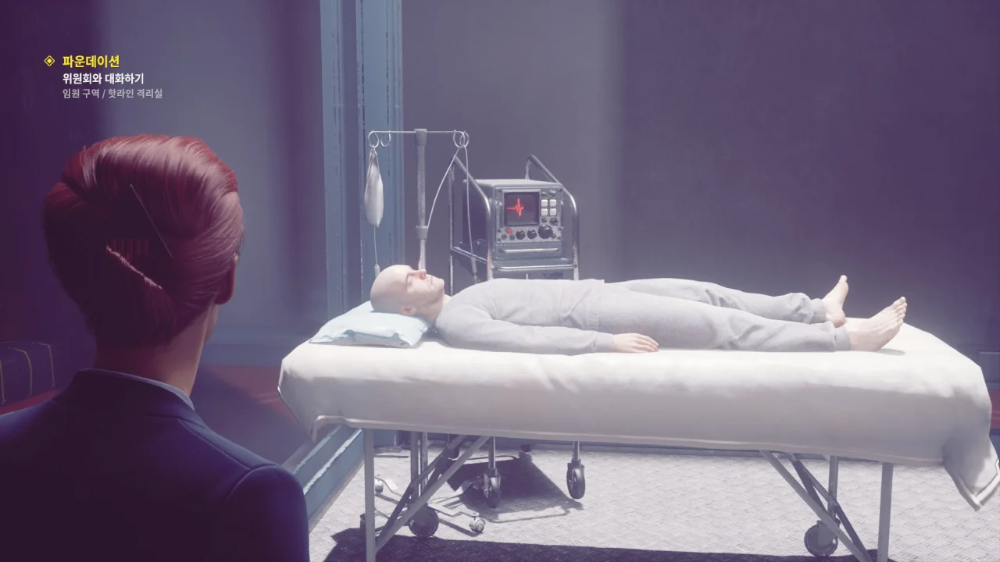

히스에 완전히 잠식된 사람은 히스를 제거할 때 같이 사라져 버리는데, 딜런은 그러지 않고 저렇게 누워서 잠만 자는 것 같다.

건강 검진 결과, 신체 건강에는 아무런 문제가 없지만 깨어나지 않고 있다고 한다.

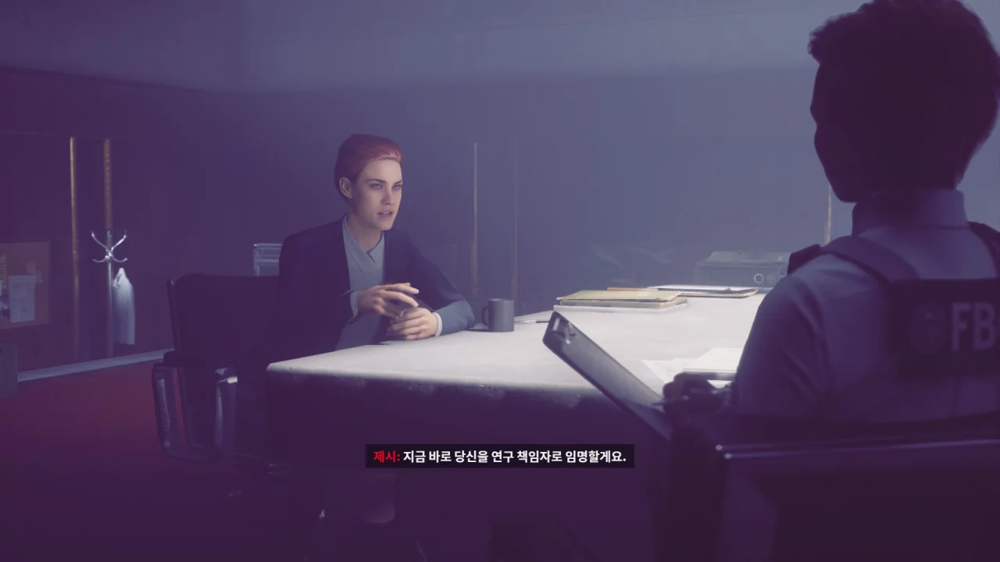

국장이 되자마자 곧바로 자연스럽게 국장의 권한을 행사하는 주인공. 달링 박사의 조수였던 연구원을 곧바로 연구 책임자로 승진시켜 버린다.

연구원의 말에 따르면 달링 박사는 이 세계를 벗어나 다른 곳으로 갔다고 한다. 죽은 건 아니고 말이다.

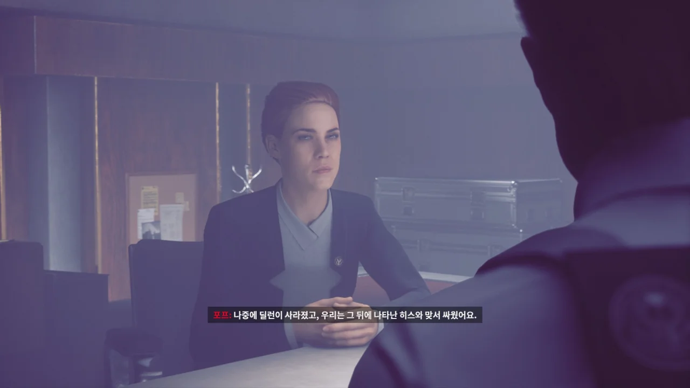

헤드론이 파괴되고 주인공이 꿈속에서 헤맬 동안, 히스는 임원 구역에 모여 있던 생존자들을 덮쳤다고 한다.

죄다 히스에 감염되어 해롱해롱하던 찰나, 주인공이 히스를 극복해 내면서 그 영향으로 사람들을 덮친 히스도 사라졌다고 한다.

&nbsp;

그렇지 않아도 히스 때문에 연방 통제국 전체가 뒤집어졌는데, 감시 대상인 딜런은 탈주하질 않나, 사람 맛을 본 히스가 생존자들을 덮치질 않나... 이곳도 주인공 못지 않게 고생했다.

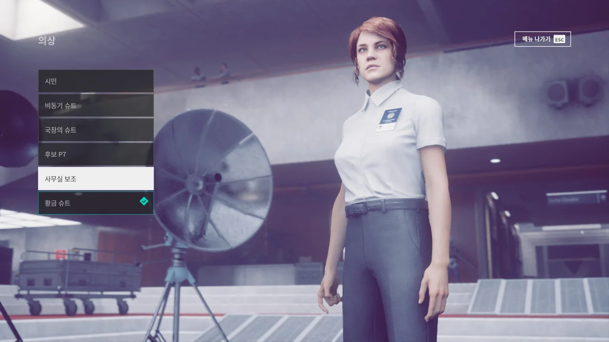

아니 ㅋㅋㅋㅋㅋㅋ 왜 꿈속에서 주인공이 입고 있던 옷이 여기에 있냐고 ㅋㅋㅋㅋㅋㅋ

***

이게 끝이냐고? 아직 DLC가 두 개 더 남았다!

하나는 'The Foundation'이라고, 연방 통제국의 과거와 관련한 DLC이다. 다른 하나는 앨런 웨이크와 관련한 DLC이다.

저번에 실수로 두 번째 DLC의 도입 영상을 봤는데, 앨런 웨이크는 여전히 소설을 쓰고 있었다.
