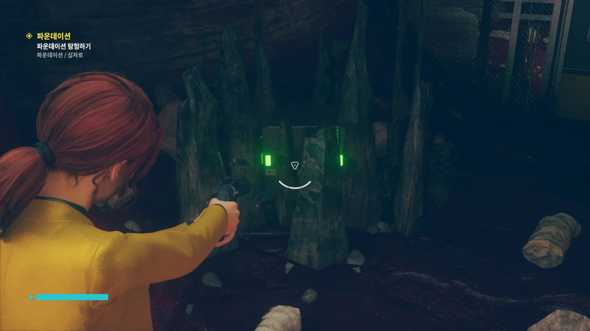

컨트롤의 DLC 두 개를 오늘 모두 다 하기로 했다. 가능할지는 잘 모르겠지만.

이게 웃긴 것이, 게임을 켜려고 하면 게임에 질려서 켜기가 싫은데, 막상 게임을 켜서 플레이하면 시간 가는 줄 모르게 플레이하게 된다. 웃긴 일이지.

&nbsp;

그런데 사진을 다 찍고 나니 DLC 하나를 하며 찍은 사진이 본편을 하며 찍은 사진의 양보다 많다. 다 찍고 나니까 총 97장이던데, 본편을 하며 찍은 스크린샷은 50장이 채 되지 않는다.

***

DLC를 시작하기 전 주변을 좀 둘러보았다. 절대로 내가 엘리베이터가 어디에 있는지 찾지 못해서 주변을 둘러보는 것이 아니다.

여기 있는 이 사진들은 분명 이 게임을 개발한 사람들의 사진일 것이다.

분명 읽었던 문서에 따르면 올디스트 하우스에는 최신식 장비를 들여오지 못한다고 되어 있었다.

루이스 경기관총은 구식 기관총이 맞으니 올디스트 하우스에 있을 법도 한 무기이지만, 저 돌격 소총은 불펍형 돌격 소총인데... 불펍은 나름 신식 총기 설계 아닌가?

돌격 소총과 경기관총이 너무 세대가 차이 나는 것 같은데...

&nbsp;

아무튼, 올디스트 하우스는 정말로 이름값을 하는 곳이다. 구닥다리만 모인 올디스트 하우스.

DLC의 시작은 핫라인에 걸려 온 전화를 받는 것이다. 국장실 옆에 이렇게 핫라인으로 통하는 길이 있다.

위원회가 파운데이션에 위기가 생겼다고 한다. 파운데이션에 가본 적이라고는 휴가 간 아티를 뒤쫓아갈 때밖에 없었는데... 마지막으로 아티를 본 것은 그가 파운데이션에서 PONY 워크맨을 주인공에게 줄 때였다.

아티는 정말 어디로 간 것일까? 휴가를 갔다고는 하는데, 마지막으로 본 곳이 올디스트 하우스의 깊은 곳인 파운데이션인지라, 정말 그가 바닷가로 휴가를 간 것이 맞는지조차 의문스럽다.

&nbsp;

이 PONY라는 이름의 브랜드는 사실 게임 개발자들이 전자 제품 회사 이름으로 SONY를 그대로 쓸 수 없으니 그 대신 글자 하나만 바꿔서 PONY라고 한 것이다.

PONY는 정말 여러 게임에서 쓰였다. 당장 카운터 스트라이크에 등장하는 TV 모델에도 PONY가 적혀 있고, 블랙 메사의 벽걸이 모니터 모델 역시 PONY가 적혀 있다.

채석장의 하늘은 언제 보아도 참 이쁘다. 누가 여길 올디스트 하우스 건물 안이라고 생각할까?



파운데이션으로 향할 때 '에이, 또 그 지루하기 그지없는 곤돌라를 타겠어?'라고 생각했다. 곤돌라가 너무 느렸거든.

그런데 또 탄다. 그나마 다행인 점은 처음 왔을 때와 달리 지긋지긋한 적이 나오지 않는다는 점이다.

&nbsp;

이 곤돌라는 속도가 3배만 더 빨랐어도 덜 지루했을 것이다. 곤돌라가 움직일 때 앞에서 뒤로 걸어보았더니 주변 배경의 변화가 없는 것으로 보아 곤돌라의 속도는 주인공이 걷는 속도와 동일한 것으로 보인다.

엘리베이터도 최소한 초당 1m는 움직인다!

이곳은 지도에도 없는 구역이다.

파운데이션은 올디스트 하우스에서 제일 중요한 곳이니, 아예 지도에 그려 넣지 않은 것으로 보인다.

애당초 지도가 필요할 만큼 복잡한 곳도 아니니까...

여기 처음 왔을 때는 해변에 파도가 치는 환상 너머로 아티가 맥주 캔을 따는 소리가 들려왔었는데... 지금은 아무것도 없이 조용하다.

이걸 누르면 되는 걸까?

뭐야, 조금 전까지 내가 있던 그 지하실이 파운데이션 아니었어? 여기가 파운데이션이라고?

&nbsp;

연방 통제국에 처음 들어왔을 때의 경험으로 미루어 생각해 보자면, 아까 그 건물의 기초같이 생긴 곳은 파운데이션의 입구인 것 같다. 허락받지 않은 사람이 들어오지 못하도록 막는 입구 말이다.

건물의 기초 역시 파운데이션이니, 틀린 말은 아니지 않은가.

곳곳에 놓인 철망과 표지판으로 미루어 보건대 누가 여기에 연구소를 차렸었던 것 같다.

적어도 사람 냄새는 맡을 수 있겠네.

이곳의 지형은 정말 거지 같다. 동굴이 이리 꼬이고 저리 꼬여서 어디가 어디인지 알기 힘든데, 그때 작은 도움이라도 되는 것이 바로 이 표지판이다.

게임에는 미니맵이 없고, `Tab` 키를 눌러 열 수 있는 지도는 단순한 평면 지도라서 내가 제대로 가고 있는 것인지 알 수가 없다. 도움이 전혀 되지 않는다.

물론, 여기에는 내가 길치인 것도 한몫한다.

마셜이 어디로 갔나 했더니, 여기로 온 것 같다. 히스가 파운데이션을 찾지 못하도록 막기 위해 파운데이션으로 내려온 것으로 보인다.

하지만 이 이야기가 핫라인으로 왔다. 내가 아는 한, 핫라인을 통해 대화할 수 있는 대상은 이미 죽은 사람이거나 위원회처럼 이 세계의 것이 아닌 존재뿐이다.

즉, 마셜은 이미 죽었다는 말이 된다.

&nbsp;

그런데 방금 어디론가 걸어가는 마셜을 봤단 말이지... 대체 뭔 상황이지?

이곳저곳에 사람의 흔적이 보이길래 이곳의 빛은 전부 조명에서 나오는 것으로 생각하고 있었다.

그런데 이 돌 틈 사이로 새어 나오는 빛을 보니, 이곳 역시 채석장처럼 아예 다른 세계인 것 같다.

&nbsp;

올디스트 하우스는 자연법칙 같은 것은 아무렇지도 않게 무시하는 곳이니, 뭐...

아까 마셜이 히스가 파운데이션을 찾는 것을 막기 위해 파운데이션으로 내려왔다고 했는데, 아무래도 실패한 것 같다. 여기에도 히스가 있잖아?

&nbsp;

난 히스가 정말 싫다. 가면 갈수록 히스 몹들이 단단해져서 상대하기 힘들다.

물론 원샷 원킬 옵션을 활성화하면 되는 일이지만, 그러면 보스도 단번에 죽어버리니 싫다.

보스도 분명 공격 패턴이 있을 것인데, 그걸 넘겨버리는 건 좀 꺼려진다.

이곳의 바닥은 온통 붉은 모래가 깔려 있는데, 작중 이 모래의 정체에 관해 설명한 문서는 보지 못했다.

하지만 난 이 모래가 분명 히스와 관련이 있을 것으로 생각하고 있다. 그야, 둘 다 붉은색이지 않은가?

상자 주변에 수정이 자라나 있어 상자를 열 수 없다. 뭐야, 이거. 날 놀리는 건가?

구역: 파운데이션

이곳의 맵은 정말 징글징글하게 넓다. 그리고 동굴 지역은 미로 그 자체이다. 온통 구불구불한 동굴이라, 어디로 가야 할지 알지 못해 길을 잃기 십상이다.



와, 대박.

이곳은 분명 아스트랄 플레인이 아닌 파운데이션 지역이다. 그런데 아스트랄 플레인의 모습이 곳곳에서 나타나고 있다.

뭐지? 아스트랄 플레인이 파운데이션을 침식하는 것인가?

점점 히스가 더 싫어져 간다.

왜 맨몸인 사람을 총으로 쏘는데 죽질 않는지 나 원 참... 게다가 이번엔 곡괭이로 사람을 내리찍으려 드는 히스조차 나왔다. 그 녀석, 심지어 차져 한 방으로도 처리가 되지 않았다.

&nbsp;

원샷 원킬 옵션 말고 대미지 계수를 조절할 수 있는 옵션이 있었으면 좋겠다. 대충 대미지가 3배 정도로만 올라가도 훨씬 편할 것 같은데...

아까 붉은 모래에 대해 추측한 것 취소.

히스에 대해 알기도 전에 작성된 문서에서 '모래', '녹슨 쇳조각'이라는 단어가 나온 것을 보면 이 붉은 모래는 연방 통제국이 처음 올디스트 하우스에 왔을 때부터 있었던 것으로 보인다.

> 유독 온수 장치를 조심하세요
{.bq}

그냥 유독 간헐천이라고 해도 되지 않았을까? 물론 정말 간헐천은 아니겠지만, 하는 행동이 유사하지 않은가.

아까도 말했지만, 여기는 올디스트 하우스 내부인 파운데이션이다.

아스트랄 플레인이 올디스트 하우스를 침범하고 있다.

여기는 대체 왜 십자로라고 불리는 것일까?

파운데이션 입구에서 보았듯이 건물 기초가 끝없이 늘어서 있다.

저기 끝에 무언가가 꿈틀대고 있는 것처럼 보이는데, 너무 멀어서 잘 보이지 않는다.

아스트랄 플레인이 올디스트 하우스를 침식하는 건 위원회도 바라지 않는 일이었던지, 십자로 가운데에 있는 '네일'이라는 석조물을 수리해 '아스트랄 충돌'을 막으라고 한다.

아스트랄 충돌이 뭔지는 잘 모르겠지만, 지금처럼 아스트랄 플레인이 올디스트 하우스를 침식하는 일을 말하는 것이겠지.

그런데 왜 능력 두 개를 보여주고 그중 하나만 선택하라고 하는 것이지? 왜 둘 다 쓰면 안 돼?

거 참 되게 쪼잔하네.



오른쪽은 서비스 웨폰을 이용해 수정을 깰 수 있는 능력이고, 왼쪽은 염력을 이용해 수정을 자라나게 하는 능력이다.

아까 수정 때문에 먹지 못한 상자가 생각나 오른쪽을 골랐다. 서비스 웨폰을 이용해 수정을 깨는 것이니, 서비스 웨폰을 업그레이드해야 한다.

그러고 보니 이렇게 서비스 웨폰을 소켓에 넣는 것은 국장 권한이 필요한 장치밖에 없다고 한다. 국장이 아니면 서비스 웨폰을 다룰 수 없으니까 말이다.

> 파멸의 탄피/예불기

이래저래 마음에 들지 않는 것이 많은 위원회이지만, 이렇게 가끔 중2병 냄새가 스멀스멀 풍기는 단어 선택을 해 큰 웃음을 주기도 한다. 파멸의 ㅋㅋㅋ 탄피 ㅋㅋㅋ

예불기가 뭔가 했는데, 그냥 예초기를 달리 부르는 말이었다.

서비스 웨폰으로 수정을 부수면 잠시 후 새로운 수정이 자라난다. 실수로 수정을 날려버려도 잠시 후면 다시 원래대로 돌아온다는 소리이다.

좋은걸?

> 추신/보너스 팁: 파운데이션에는 히스가 있다

거 참 빨리도 말해 준다. 이미 히스 몇 개체를 처리하고 오는 길이건만.

마셜은 대체 이 밑에서 무얼 붙잡아 두려는 것일까? 히스? 분명 아까 내려올 때는 히스가 파운데이션을 찾는 걸 막기 위해 파운데이션으로 내려간다고 말하지 않았어?

핫라인이란 저쪽이 제 할 말만 하고 뚝 끊는 단방향 통신이라, '그래서 그게 뭔 소리야?'라는 의문만을 남길 때가 더 많다.

지역 이름 자체가 '아스트랄 충돌'이다.

앞으로 나아가기 위해서는 저렇게 자라난 수정을 깨부숴 발판을 아래로 내려야 한다.

뭐야, 또 양자택일이야? 이번엔 무슨 차이인데?

오른쪽은 보지도 않고 냅다 왼쪽을 골랐다.

바닥이 없는 곳인 데다, 공중 부양을 이용해 천천히 내려가야 하는 곳이다 보니 없던 고소공포증도 생길 것 같다.

바로 이 DLC를 진행하면서 올라가기 불가능해 보이는 곳을 다른 오브젝트를 이용해 발판을 쌓아 올라간 적이 몇 번 있었기에 더더욱 불안하다.

히스 부유체처럼 축 처진 채 둥둥 떠다니는 아스트랄 카피가 있길래 엄청나게 놀랐다. 난 그게 처음에 아스트랄 플레인이 히스에게 잠식당해 생긴 건 줄 알았는데, 그냥 단순히 아스트랄 플레인의 존재가 히스 부유체를 따라 할 뿐이라고 한다.

이름조차 아예 '아스트랄 미믹'이라고 붙여졌다.

&nbsp;

귀찮은 것은 히스 부유체와 똑같지만, 히스처럼 몸이 단단하지 않아 내려찍기 한 방에 터진다.

히스 부유체와 아스트랄 카피가 서로 총과 염동력으로 싸우고 있지만, 서로에게 유효타를 단 한 번도 넣지 못하고 있다.

그래서 내가 다 죽였다.

본편에서 포머와 만났을 때는 포머가 하는 말을 단 하나도 알아들을 수 없었는데, 이번에 포머가 하는 말은 몇몇 단어를 이해할 수 있다.

여전히 무슨 뜻으로 하는 말인지는 모르겠지만.

저 구체를 수정에서 풀어주면 네일이 복구되는 것 같다.

대체 무슨 원리이지?

네일이 복구된다고 하는데, 내 눈에는 처음 봤을 때와 별 차이가 없어 보인다.

으응? 넌 대체 언제 여기로 내려왔냐?



심지어 에밀리 포프까지 내려와 있다.

아까 분명 주인공이 파운데이션을 돌아다닐 때 "아, 이거 에밀리 포프가 있었으면 딱 좋았을 텐데, 아쉽네"라고 독백을 한 적은 있지만, 직접적으로 에밀리를 부른 적은 없다.

하지만 에밀리는 주인공이 자신을 불렀다고 말한다. 주인공이 부른 적도 없는데 내려온 것에 대해서 쿨하게 "비동기화 문제라고 생각해 버리죠, 뭐"라고 넘겨버린다.

뭐, 일단 잘된 일이니까...

&nbsp;

아까 마셜이 핫라인을 통해 두 번이나 접촉한 건에 관해 물어보자, "핫라인은 차원 외 존재나 죽은 사람에게만 연결됩니다"라며 선을 긋는다. 그러면 정말 마셜은 죽었다는 이야기가 되는데... 그럼 내가 지금껏 본, 이곳저곳에서 돌아다니는 마셜은 뭐지?

문서를 수집하던 중 발견한 '레이선'이란 단어가 무슨 뜻인지 잘 모르겠다. 무슨 고유 명사인 걸까?

전전 국장인 노스무어 국장이 직접 데려온 '구스타프 바그너' 박사는 나치 독일에 부역했던 과학자로 보인다. 그러면 페이퍼클립 작전을 통해 미국으로 온 과학자라는 의미인데... 연방 통제국의 역사는 생각보다 오래되었다.

그나저나 문서 작성자가 '세상을 등진 그의 독재자'라며 재미있게 히틀러를 까대는 것이 마음에 든다.
