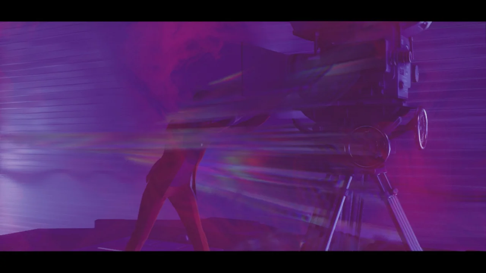



주변을 둘러보는데, 이런 식으로 뭔가 수정이 자랄 수 있을 것처럼 보이는 곳이 있다.

아까 염력으로 수정을 자라나게 하는 능력을 골랐으면 수정을 계단처럼 밟고 위로 올라갈 수 있었을 텐데...

마치 신토 신사의 토리이나 우리나라의 홍살문을 생각나게 하는 구조물이다.

처음에는 저게 나무로 만든 것인 줄 알았다. 하지만 파운데이션에는 식물이 일절 자라지 않는다. 즉, 저것은 수정이다.

울퉁불퉁하게 자라는 다른 수정과는 다르게 원형 기둥으로 깔끔하게 자란 수정... 누가 손을 댄 것일까?

아니, 여기에도 아스트랄 스파이크가 있어? 으으, 난 저게 정말 싫은데.

아스트랄 스파이크가 싫은 이유는 단 하나이다. 공포 게임에서 종종 볼 수 있는 '죽일 수 없는 적'을 연상시켜서이다. 죽일 수 없는 적이 날 계속 쫒아온다는 건 정말 짜증 나는 일이다.

원래 닿으면 죽는 몹이지만, 체력 재생을 +100%로 설정해서 그런지, 가까이 가도 화면이 엄청나게 뭉개지고 매우 시끄러운 소리가 나오는 것만 빼면 별다른 지장이 없다.

테이블 위에 `F` 키를 누를 수 있는 프롬프트가 나타나길래 '뭐지? 여긴 문서도 없는데?'라고 생각하며 버튼을 눌렀다.

그러더니 주인공이 테이블 위에 있는 마이크에 대고 "당장 여기에 지원을 보내라"라고 말한다.

놀라운 것은 정말로 주인공 뒤에 특수 요원이 뿅하고 나타났다는 것이다. 너, 대체 어떻게 여기에 온 거냐?

&nbsp;

아군 NPC가 전투에서 큰 도움이 되지 않는다는 것은 널리 알려진 상식이지만, 이 게임에서는 달랐다. 바로 다음 구간에서 일어난 전투에서 이 특수 요원이 적의 어그로를 굉장히 잘 끌어준 덕분에 수월하게 전투를 진행할 수 있었다.

아까와 다르게 이번에는 이리 갔다 저리 갔다 하면서 경로를 길게 비틀지 않고 곧바로 구체 앞으로 이동시켜 준다.

앞으로 남은 두 개의 구체도 이랬으면 좋겠는데...

구체를 복구하자, 갑자기 포머가 나타나 알 수 없는 말을 한다.

> 위험 / 국장 / 위원회 / 부서진 / 더 깊이 / 알겠나?

전혀 모르겠는데요.

&nbsp;

포머가 '알겠나?'라고 하니 갑자기 떠오른 것.



데스티니를 너무 많이 플레이했다.

포머가 갑자기 주인공을 아까 수정 관련 능력을 고르던 장소로 이동시켜 준다. 뭐지? 나머지 능력도 마저 가져가라는 건가?

고마워요, 포머!

&nbsp;

위원회는 주인공이 이 장소에 있는 것에 적잖이 놀랐는지, 주인공더러 "넌 여기에 있어선 안 된다, 나가라"라고 한다.

아, 자세한 건 포머와 상의하시기를 바랍니다. 난 아무것도 몰라요. 능력 둘 다 가질 거야!

위원회가 "다른 도구/무기는 금지다"라고 말하지만 못 들은 척하고 나머지 능력을 챙긴다.

여기는 염력을 업그레이드하는 것이기 때문에 손을 가져다 댄다.

위원회가 "우둔한 짓 하지 마라"라고 하지만, 주인공은 위원회를 무시하고 제 갈 길을 간다.

꼬우면 양자택일 같은 사람 애태우는 짓을 하지 말던가!

그다음에는 또다시 포머의 공간으로 이동했다. 이렇게 회색 안개가 낀 아스트랄 플레인은 포머의 공간이나 다름없으니 말이다.

> 아스트랄 플레인에서 바보 되는 것도 지겨워.

주인공의 말이 참으로 옳다.

위원회나 포머나 둘 다 주인공에게 제대로 된 말 한마디 없이 다짜고짜 주인공을 아스트랄 플레인의 이곳저곳으로 옮기지 않은가.

포머는 여기에 줄곧 혼자 있었던 것인지, 주인공을 보고 "혼자 / 오래 / 방문자 / 행복"이라고 말한다.

주인공이 오랜만에 방문해서 행복하다는 의미겠지? 그런데 왜 본편에서는 주인공을 보자마자 다짜고짜 공격했냐?

본편에서 대놓고 주인공을 공격하던 것과 달리, 이번에는 평화적으로 대화할 수 있었다.

처음부터 그랬으면 어디 덧나나?



하지만 포머와의 대화도 위원회의 것과 비슷하게 도통 무슨 말인지 알아들을 수 없다.

주인공이 왜 자신에게 또 다른 능력을 준 것이냐고 묻자, "공허 / 아무것도 / 떠남"이라고 답한다.

그러더니 "내부 / 넘어 / 네일 / 구출 / 하우스 / 아들 / 경고"라는 말도 한다.

주인공도 이런 스무고개 같은 이야기를 들으며 "이게 무슨 단어 퍼즐도 아니고"라며 한탄하더라.

&nbsp;

포머와 대화할 때 포머의 눈이 돌아가는데, 왠지 옛날 볼마우스의 볼을 생각나게 한다. 꺼내서 손안에서 굴려보고 싶다.

포머가 준 다른 능력을 이용해 파운데이션의 다른 영역에 가보았다.

저 벽에 있는 구불구불한 구멍은 자연적으로 생긴 구멍일까, 아니면 누군가가 인위적으로 파놓은 구멍일까?

&nbsp;

그나저나 히스는 좀 그만 만났으면 좋겠다.

샤워기가 보이길래 물에 젖은 주인공을 볼 수 있는 것인가 기대했는데, 물이 나오지 않는다.



주인공이 두 능력을 자유자재로 쓰는 것을 본 위원회는 갑자기 말을 바꿔 "그 능력 두 개 다 써도 좋은데, 포머와는 앞으로 말 섞으면 안 된다?"라고 한다.

거 참, 말 이쁘게 잘한다.

구체 주변에 있던 모든 수정을 제거했음에도 네일의 복구가 되지 않는다.

구체를 주변을 돌아다니며 잘 살펴보자, 구체의 일부분이 움푹 파여있는 것을 발견할 수 있었다. 파인 부분은 염력을 이용해 다시 수정으로 채울 수 있었다.

하지만 이는 기껏 제거한 수정 기둥 역시 마찬가지였고, 수정 기둥을 부수려다 애써 채워놓은 구체를 다시 부수기도 했다.

범위 공격은 신중하게 쓰자.

주인공이 드디어 위원회에 대해 의구심을 가지기 시작했다.

자기들 싸움에 자신을 끌어들이지 않았으면 좋겠다고 말하는데, 정말 동감이다.

애당초 포머(Former)라는 이름도 '前 위원회'라는 뜻이잖아.

지도에 무언가 직사각형의 구역이 있길래 가보았더니 '붕괴된 부서'라는 구역을 발견했다.

이곳은 연방 통제국의 일부 구역이 붕괴해 파운데이션으로 추락한 곳이다.

본편에서도 그렇지만 곳곳에 이렇게 용광로처럼 생긴 것의 사진을 걸어둔 곳이 많은데, 저 물건은 대체 뭘까?

&nbsp;

지금 화면을 가리고 있는 '유지관리: 직원 보호' 돌발 임무는 정말 하기 싫은 임무이다.

왜냐고? 보호해야 할 대상이 너무 잘 죽거든.

한번은 자폭하는 히스에게 공격받는 직원 둘을 구해야 했다. 그 히스는 죽고 나서 시체가 폭발하는 특성이 있었는데, 보호 대상인 직원 둘이 날 도와주겠다고 나에게 다가오다가 폭발하는 히스 시체 때문에 사이좋게 저세상으로 가버리더라.

이후 저런 부류의 임무는 전부 무시하고 있다.

기브스라는 사람이 쓴 문서를 읽고 있다.

이 구역은 말 그대로 물리적으로 파운데이션까지 추락한 모양이다. 추락의 충격으로 상당수가 다쳤다고.

파운데이션 구역의 존재는 직원들에게 비밀로 하고 있었던 것인지, 왜 사람의 흔적이 있음에도 우리가 이 구역의 존재를 알지 못했냐고 묻고 있다.

그러게. 파운데이션이 올디스트 하우스에 중요한 구역인 건 알지만, 정확히 왜인지는 잘 모른다. 네일을 복구하는 것도 그냥 하라니까 하는 것이고...

마지막에 '가장 중요한 것은, 여기서 어떻게 빠져나갑니까?'라고 묻는 것으로 봐서 이 사람들은 끝까지 이 곳에서 빠져나가지 못한 것 같다.

&nbsp;

그나저나 본편에서 RITUAL DIVISION에 출입이 불가능한 상태였는데, 여기가 '절차 및 의례 사무실'이라는 것을 보면 원래는 그 문을 넘어 방화대를 통과하면 이 사무실로 올 수 있었던 듯하다.

와, 정말 징그럽다. 저 방 하나하나에서 전부 히스가 나올 것 같다.

더 짜증 나는 건, 차져를 쏴 히스를 처리하려고 해도 차져가 유리창에 먼저 박혀 제대로 된 대미지를 주지 못한다는 거다.

화장실에 들어갔더니 화장실이 아스트랄 플레인이 되어 있었다.

주인공이 이걸 보고 "와, 누가 배관공 좀 불러야겠네!"라고 개드립을 쳤다가 자신도 부끄러운 것인지 "누가 이걸 듣진 않았겠지..."라고 하더라.

이웃집 꼬맹이가 컴퓨터 프로그램을 이용해 우주를 바꾸어 꼬맹이에게 큰소리를 친 자기 남편이 차에 치여 죽게 했다고 믿는 어느 과부가 하원에 보낸 편지가 여기에 있다.

개인적으로 이런 얼토당토않은 음모론을 보면 기분이 확 나빠진다. 적어도 그럴듯한 말이라면 동정이라도 할 텐데, 이건 너무 말이 안 되지 않은가.

&nbsp;

마치 서울 지하에 북한의 탱크 수백 대가 있다고 주장하는 북한 땅굴 음모론을 진지하게 믿는 사람을 보는 느낌이다.

당신의 북한 탱크, 이번 여름 장마로 인해 전부 고철 더미가 되었다. 불만 있어요, 코리안 음모론자?

이런 장면을 뭐라 말해야 할까? '안이 바깥보다 넓네'라고 해야 할까?

평가 홀? 뭘 평가하는 거지?

연방 통제국의 일부가 파운데이션으로 추락한 이후, 아무도 이들을 구해주러 오지 않은 것이 확실해 보인다.

보급품이 모자란 상태에서 아스트랄 스파이크에게 쫓기기까지 했다고 한다. 아마 이들의 최후는 그리 곱지 못했을 것이다.

변성 아이템인 영사기를 정화하려고 손을 댔는데, 갑자기 서 있던 플랫폼이 움직이기 시작하며 임무 내용이 ["움직이는 플랫폼" 주연 제시 페이든]으로 변했다.

화면 위아래에 레터박스가 생기며 정말 영화처럼 변한 것은 물론이다!

&nbsp;

왼쪽에 또 다른 플랫폼이 나타났고, 주인공은 앞에 나타나는 온갖 장애물을 두 플랫폼 사이를 뛰어다니며 피해야 했다.

속도가 워낙 빨라서 장애물에 부딪히면 즉사하는 것이 아닐지 생각했는데, 죽지는 않았다.

아, 당장 이리로 와!

첫 번째 정화 시도.

하지만 어째서인지 실패해 버렸다. 주인공 역시 "아, 아깝다. 거의 다 했는데."라고 아쉬워하더라.

&nbsp;

주인공 역시 여기에 심취한 것인지, 다른 플랫폼에 올라탄 히스를 죽일 때마다 액션 영화 주인공처럼 "너희들을 위한 자리는 없단다"와 같은 대사를 내뱉는다.

제일 웃겼던 대사는 체력이 무식하게 많던 몹이 표지판에 부딪혀 말 그대로 갈리는 모습을 보며 말한 "거길 지나가기에는 너무 뚱뚱했나 보네 ㅋㅋ"라는 대사였다.

아니 ㅋㅋㅋㅋㅋㅋ 어떻게 보스 이름이 '3장 악당' ㅋㅋㅋㅋㅋㅋ

보스도 처리했겠다, 또다시 정화를 시도한다.

짜잔, 알고 보니 이게 다 환상이었습니다!

영사기를 정화하고 나니 주인공은 여전히 플랫폼 위에 서 있는 상태였고, 플랫폼은 처음 영사기에 손을 댔을 때의 위치에서 움직인 적이 없었다.

&nbsp;

이렇게 갑자기 뜬금없이 새로운 걸 보여주는 것이 은근히 마음에 든다. 마치 게임 장르가 바뀌는 느낌이라고 해야 할까?

이런 방식의 연출 중 제일 마음에 든 것이 재떨이 미로였고, 이 영사기가 그다음이다.



마셜은 네일 주변에 C4를 둘둘 감은 뒤 터트려 네일을 파괴하면 히스가 올디스트 하우스의 기반인 네일을 침식하지 못할 것으로 생각했다.

아, 그러니까 네일이 박살이 난 것이 마셜이 C4를 터트린 것 때문이었어? 아스트랄 플레인이 올디스트 하우스를 침범한 것도 그것 때문이었고?

&nbsp;

휴먼, 미쳤습니까?

제시 말 그대로 "그래 놓고 난 준비가 덜 되었다고 하다니."인 셈이다.

마지막 구체를 복원하려는데, 갑자기 포머가 나타나더니 아스트랄 플레인이 붕괴라도 할 듯 난장판이 되었다.

> 네일 / 떠나라 / 끝

이건 대체 무슨 뜻이지? 네일이 끝장났다고?

주인공의 수정 조작 능력이 갑자기 증폭이라도 한 것처럼 수정이 마구잡이로 자라나기 시작한다.



마셜의 HRA가 아스트랄 스파이크에 의해 망가졌다고 한다. 그 말인즉슨 마셜이 이미 히스에 잠식되었을 확률이 높다는 것이다.

마셜은 위원회가 아스트랄 스파이크를 자신에게 보냈다는 것에 자신의 한 달 월급을 걸겠다고 한다.

&nbsp;

음, 그러니까 순서를 잘 모르겠다.

마셜이 네일을 히스로부터 보호하기 위해 파운데이션으로 내려왔지만, 아스트랄 스파이크에 의해 HRA가 망가졌고 히스의 영향을 받은 마셜은 네일을 폭파하는 것이 올디스트 하우스를 지킬 방법이라고 믿게 된 것일까?

네일이 망가져 올디스트 하우스와 아스트랄 플레인이 서로 겹치게 되었고, 그렇게 된다면 현재 올디스트 하우스 내부에 퍼진 히스가 다시 아스트랄 플레인으로 갈 수 있으니 말이다.

저기 수정 가운데에 누군가가 공중에 둥둥 떠 있다.

저 과도하게 자라난 수정을 전부 부숴줘야 하는 것일까?

공중에 떠 있던 사람의 정체는 바로 마셜이었다.

하지만 마셜이 중얼거리는 말을 들어보면 이미 히스에게 완전히 잠식당한 것 같다.

그리고 곧바로 보스전이 시작되었다.

오늘의 의문점. 평범한 사람들은 히스에 잠식되면 그저 풍선 인간이 될 뿐인데, 어째서 연방 통제국 고위직이 히스에 잠식되면 강력한 성능의 보스가 되는 것일까?

마셜은 총도 쏘고 수류탄도 던지고 염력도 쓰고 순간 이동도 쓸 줄 알더라!

물론 주인공도 할 수 있다. 수류탄만 빼고.

연방 통제국에 있는 위원회 모형이 180도 뒤집어지는 연출이 나온다.

작중 위원회에 반대했던 애쉬 박사가 '위원회를 묘사할 때의 연출은 전부 우리가 위원회를 올려다보는 구도인데, 왜 위원회를 내려다본 사람은 없는 걸까?'라고 말한 것과 연결되는 연출일지도 모른다.

&nbsp;

이 연출을 보면 주인공과 위원회 사이의 관계도 예전 같지 않을 것이라는 생각이 든다.

역시 그랬다. 주인공은 이제 위원회가 하라는 대로만 하는 것이 아니라, 진정으로 연방 통제국의 목표를 향해 나아갈 것이라고 한다.

&nbsp;

원래 계획은 이다음에 곧바로 다음 DLC를 하는 것이었지만, 여기까지 글을 쓰고 나니 지친다. 다음 DLC는 다음에 하는 것으로 해야지.
