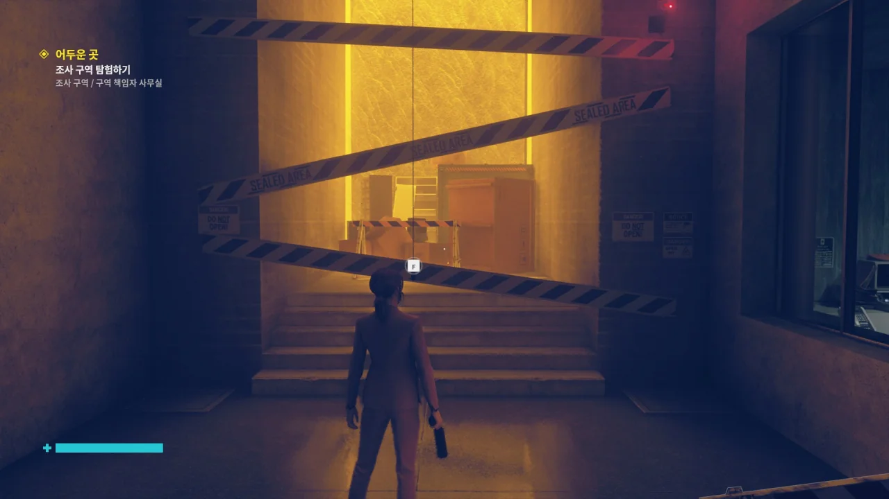
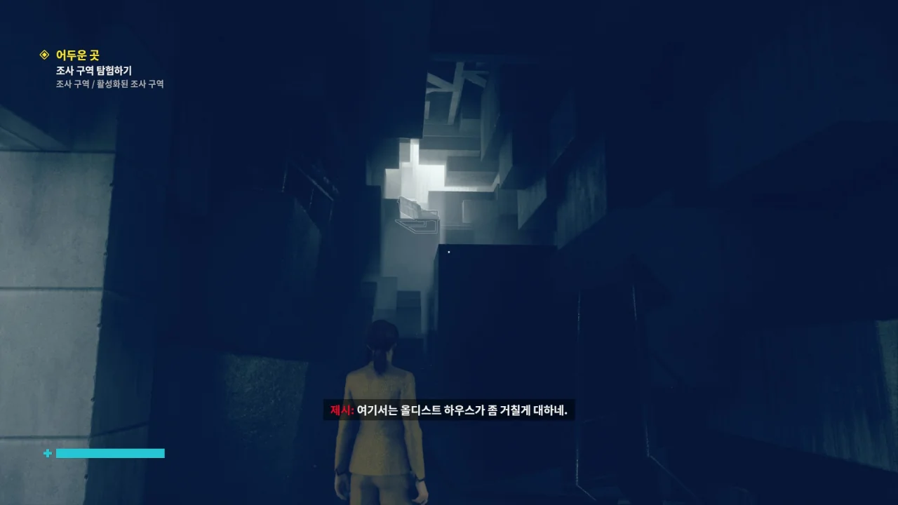
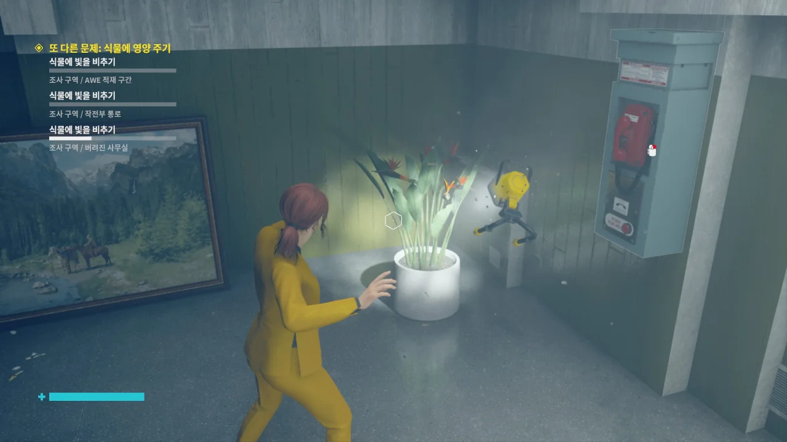
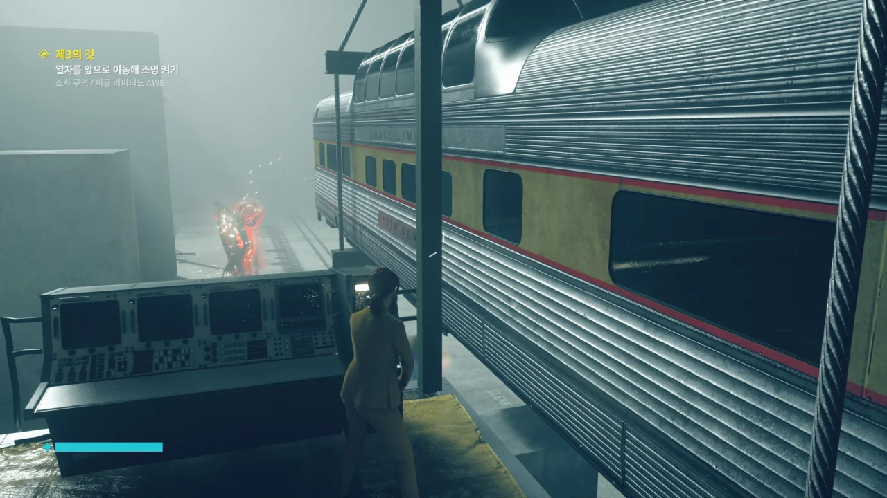
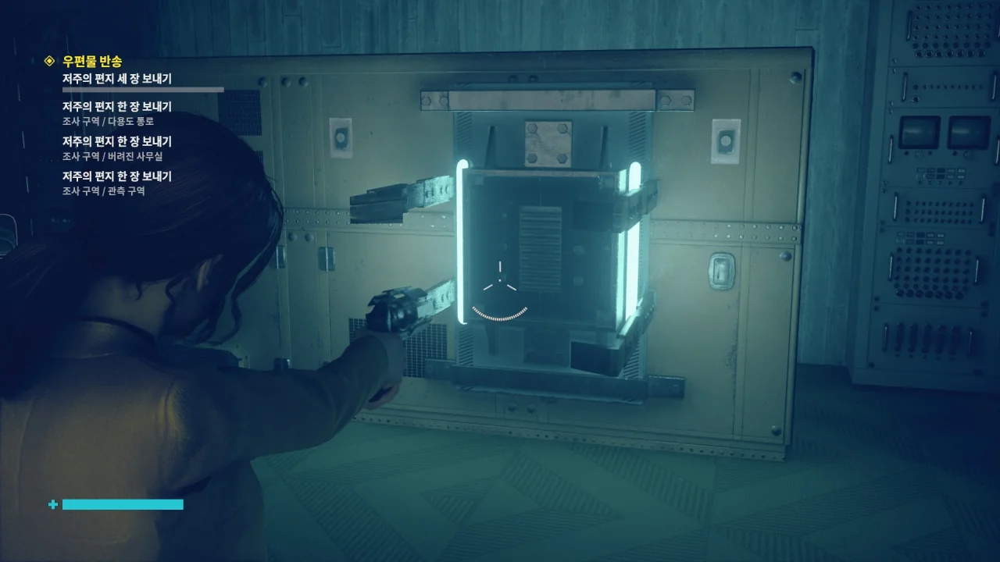
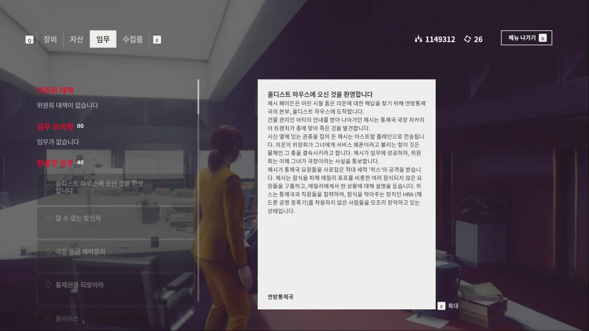

영어 단어 Awe에는 경외감이라는 뜻이 있지만, 컨트롤 세계관에서 AWE라고 대문자로 쓰면 '변성 세계 사건(Altered World Event)'라는 뜻이 된다.

물론 말장난이다. 나, 이런 거 굉장히 좋아한다.

&nbsp;

두 번째 DLC의 이름이 바로 이 AWE이다. 앨런 웨이크와의 콜라보 DLC라고 하던데, 앨런 웨이크를 접해본 건 위키에서 대충 읽은 스토리 요약과 게임의 극초반 플레이 영상이 전부인지라, 솔직히 기대가 많이 된다.

그도 그럴 것이, 앨런 웨이크 시리즈와 관련한 것을 직접 경험하는 것은 이번이 처음이다.

***

마지막 DLC를 시작하려면 구역 엘리베이터를 타고 조사 구역으로 가면 된다.

본편 스토리를 밀고 있을 때, 조사 구역이 DLC 지역인 것을 모르고 갔다가 앨런 웨이크의 대사가 나오는 것을 보고 화들짝 놀라 임무를 비활성화하고 다시 하던 임무를 하러 간 기억이 난다.

... 불이 전부 꺼져 있다니, 내 미래를 보여주는 것인가?

다행스럽게도 엘리베이터를 나와 안으로 들어가자, 조명이 팡팡 소리를 내며 켜졌다.

지금껏 게임을 하며 발견한 모든 문서를 자세히 읽어봤다고 생각했는데, '방화대'가 무엇인지 순간 이해하지 못했다.

한참을 곰곰이 생각한 끝에야 방화대가 '끝없는 검은 절벽 사이에 흰색 다리가 몇 개 놓여있는 공간'을 가리킨다는 것을 기억해 냈다.

응? 방화대로 가는 길이 막혀있다. 그 대신 오션 뷰 모텔로 가는 스위치가 놓여 있다.



앨런 웨이크의 말이 모텔의 방 안에서 들리자, 주인공이 살짝 열린 틈 사이로 빼꼼 들여다본다.

안에서 앨런 웨이크와 톰 제인이라는 사람이 대화하는 것 같다. 하지만 어째서인지 둘이 굉장히 많이 닮았다.

&nbsp;

내가 앨런 웨이크에 대해 아는 것은 그가 소설가이며 게임 시리즈의 주인공이라는 것 정도밖에 없다. 그가 쓰는 소설이 현실이 된다는 것을 어디선가 듣긴 했는데, 정말인지는 잘 모른다.

그렇다면 톰 제인은 앨런이 쓴 소설의 등장인물인가? 자기 소설의 등장인물과 대화를 한다고?

&nbsp;

젠장, 이 DLC는 앨런 웨이크 시리즈를 하지 않으면 이해조차 할 수 없는 건가?

앨런이 무슨 말을 하는 것인지 도저히 알아들을 수 없다. 왜 나만 모르는 이야기 해!

아스트랄 스파이크가 다리 위를 돌아다니고 있다.

이곳의 방화대 문은 금이 간 채 망가져 있다.

방화벽의 문은 두꺼운 돌로 되어 있기에, 이 문이 이렇게 망가질 줄은 정말 상상도 못 했다.

&nbsp;

이 길이 막혔기 때문에, 아스트랄 스파이크가 돌아다니던 다리로 향할 수밖에 없다.

어우야, 시체의 상태가 매우 심각하다. 아무래도 아스트랄 스파이크가 문에 깔려 죽은 시체를 잔뜩 헤집은 모양이다.

&nbsp;

시체에 붙어 있는 살점이 별로 없다. 이는 이 사람이 시체가 된 지 굉장히 오래되어 살점이 모두 썩어 없어졌거나, 시체가 된 이후 외부의 무언가에 의해 살점이 분리되었다는 의미이다.

하지만 주변에 묻은 피의 색깔이 아직 붉다. 이는 이 사람이 죽은 지 얼마 되지 않았다는 의미이다. 만약 죽은 지 오래되었다면 피가 검게 변했을 테니.

그렇다면 남은 가능성은 문에 깔려 죽은 사람의 시체를 아스트랄 스파이크가 잔뜩 헤집어 살점을 뜯어냈다는 것밖에 없다.

정말 가차 없는 녀석이다.

아무튼 조사 구역으로 들어왔다. 이곳은 조명이 제대로 들어오지 않는 것 같다.

앞으로 계속 전진하는데 갑자기 물건들이 공중에 둥둥 뜨기 시작한다. 뭐지? 대체 무슨 일이지?

어랍쇼, 여긴 더 가관이네.

휴지통을 비롯한 주변의 물체들이 무한히 복제되며 무한히 사라져간다. 마치 프렉탈 영상을 보는 느낌이다.

한 가지 다른 점은 이 장면은 어째서인지 계속 보고 있자니 속이 메슥거린다는 것뿐이지만.

얼씨구, 이젠 액자와 의자까지 자가복제를 거듭하고 있다.

이 게임에서 무언가 이상 현상이 생겼다면 일단 히스를 의심해 보면 된다. 대부분은 히스의 영향을 받아 무언가가 폭주하거나 이상 현상을 일으키는 것이거든.

난 히스가 정말 싫어.

이 통로는 공간의 변형 때문에 갈수록 좁아지는 구조로 변했다. 혹시 여기로 가야 하는 것일까?

아니었다.

약이 오르는 것은, 앞으로 더 갈 수 있을 것처럼 만들어 놓고 투명한 벽으로 주인공의 앞을 막고 있다는 것이다.

이게 어딜 봐서 '어둠'이야... 이건 차라리 검은색 슬라임이라고 부르는 것이 낫겠다.

초·중생들이	 갖고 노는 슬라임 괴물, 혹은 액체 괴물이 생각나는 디자인이다. 왠지 만지면 쫀득쫀득 말랑말랑할 것 같다.

트레일러에서 보았던 대로, 랜턴을 들고 와 빛을 비추자, 어둠이 눈 녹듯이 사라진다.

어둠이 사라질 때 희고 강하게 빛나며 사라지는데, 눈이 아플 정도로 밝게 빛난다.

앞으로 랜턴을 유용하게 쓸 수 있을 것 같아 랜턴을 들고 이동하던 중, 마치 히스가 나올 때처럼 앞이 흐려진다.

새로운 적이 나오는 것인가 싶어 잔뜩 긴장했지만, 아무것도 나오지 않았다.

&nbsp;

방금 그것이 내 랜턴을 망가트렸다는 것을 깨달은 건 조금 후였다.

> 빛이 당신을 불태울 것입니다!
{.bq}

어둠이 녹아 사라질 때 내뿜는 빛이 너무 강하다. 어둠이 빛에 불타올라 사라지는 모습을 표현하고자 한 것 같은데, 누가 보면 저게 어둠이 아니라 마그네슘 덩어리인 줄 알 것이다.

여기에는 미국 전역의 지도가 있다. 몇몇 도시가 선으로 이어져 있는데, 무슨 의미로 선을 그어 둔 것일까?

아티가 오랜만에 등장해 보조 임무를 주었다.

&nbsp;

어둠을 태운다? 좋죠.

곰팡이를 없앤다? 더 좋죠.

네? 식물에... 빛을 주라고요?

하트먼 박사의 오디오 로그를 많이 발견할 수 있었다.

내 기억이 맞는다면, 하트먼 박사는 앨런 웨이크 시리즈에 생긴 모든 일을 배후에서 꾸민 만악의 근원이다.

아무리 이 게임이 온갖 초자연적 현상을 다루는 게임이라고 하지만, 이건 정말 이해할 수 없다.

아무리 봐도 내 눈앞에 있는 이 식물은 인조 식물이다. 플라스틱으로 만들어진 가짜 식물이다.

그런데 이 식물에 랜턴으로 빛을 비추면 시들어 있던 식물이 다시 팔팔하게 살아난다.

넌 대체 뭐로 이루어져 있는 거냐?

누군지는 몰라도, 여기에 식물을 가져다 둔 사람은 어디 길 가다가 돌부리에 발이 걸려 넘어지길 빈다.

벽을 부숴야만 갈 수 있는 곳에 왜 식물을 숨겨두는 건데!

열심히 식물을 찾아다니는 중이다. 아무리 주변을 돌아다녀도 식물이 보이지 않는다.

'혹시 너니?'라는 생각에 복도의 아무 식물에 조명을 비추어 보았지만, 이 식물은 아니었던 것인지 임무가 달성되지 않는다.

아니, 왜? 이것도 식물은 식물이잖아. 임무 내용도 '식물에 빛을 비추기'였잖아.

아까 식물을 찾을 때는 그곳까지 가는 길을 찾지 못해 애를 먹었다면, 이번에는 이해할 수 없는 곳에 식물을 가져다 두어 날 화나게 만든다.

이 식물을 보라. 이미 천장에서 내려오는 빛을 충분히 받고 있지 않은가? 그런데 왜 또 랜턴으로 빛을 줘야 해? 왜? 왜? 왜왜왜왜왜왜?

이 방 안은 주황색 연기 같은 것으로 채워져 있는데, 그 안에 들어가면 주인공의 에너지가 조금씩 닳기 시작한다.

염력이나 회피 같은 기술을 쓰려면 에너지가 필요하기 때문에, 여기에 오래 있을수록 그만큼 전투가 힘들어진다.

다행스럽게도 이 안에서 서비스 웨폰은 쓸 수 있다.

이 DLC에서는 빛이 정말 중요한 요소이다. 그러니 혹시 모를 앞날을 대비해 랜턴을 챙겨간다.

엘리베이터 버튼을 누르자마자 정전이 되어 방 안의 불이 모두 꺼진다.

그리고 엘리베이터 문 너머에는... 저건 대체 뭐냐? 저거 혹시 사람이야? 대체 뭘 먹어야 저렇게 변하는 거야?

저 사람이 누군지는 잘 모르겠지만, 이미 사람이 아니게 된 것은 확실하다.

갈비뼈처럼 보이는 것이 등 뒤로 튀어나와 있고, 팔다리도 기괴하게 변했다. 저게 어떻게 사람이야...

전원을 다시 공급해 방 안의 조명을 켜자, 빛에 약한 것인지 괴물이 몸에서 연기를 내뿜으며 괴로워하다 환풍기 안으로 도망친다.

전원을 다시 공급하고 남은 파워 코어를 챙겨가기로 했다. 오는 길 중간중간에 마주쳤던 잠긴 문과 빈 파워 코어 슬롯이 생각나서였다.

문에 전원을 공급해야 문을 열 수 있었던 것 같은데, 그 당시에는 파워 코어가 없어 문을 열지 못했었다.

만약 앞으로 가다 또 다른 빈 파워 코어 슬롯을 만나게 된다면 이 파워 코어를 쓰면 될 것이다.

어둠 슬라임을 녹이자, 바닥에 검은 흔적이 남았다.

혹시 이 어둠도 '더 파운데이션' DLC에서 본 수정처럼 다시 자라지는 않겠지?

SHUM이라는 변성 아이템을 발견했다. 이걸 작동시키면 게임을 할 수 있다.

하지만 그 내용은 정말 실망스럽기 그지없었다. 그냥 넓은 공간에서 여러 몹 웨이브를 막는 것이 전부였는데, 너무 지루했다.

오죽하면 내가 몹을 잡다가 지겨워서 설정에 들어가 원샷 원킬 옵션을 활성화하고 마주치는 몹에게 스핀을 대충 갈겼을까.

원샷 원킬 옵션 덕분에 몹이 시원시원하게 터지는 것은 마음에 들었다.

SHUM을 완료하면 그 옆의 SHUM 2를 플레이할 수 있다.

놀랍게도 SHUM 2에서는 본편에 있었던 일부 임무를 다시 플레이할 수 있었다!

이걸 어떻게 참아?! 곧바로 재떨이 미로 임무를 시작했다.

&nbsp;

다시 만난 재떨이 미로는 공간 변형 연출 중 일부가 삭제된 것으로 보였지만, 정말 재미있게 플레이했다. 재떨이 미로를 처음 했을 때의 그 전율을 다시 느낄 수 있었다.

어쩌면 공간 변형 연출이 일부 삭제된 것 같다고 느낀 건 재떨이 미로를 오랜만에 다시 해서일지도 모른다.

응? 저거 혹시 달 착륙선 아냐? 저게 왜 여기에 있어?

주변에서 찾을 수 있었던 문서를 읽어보았다.

&nbsp;

아폴로 14호가 발사될 때는 분명 우주 비행사가 3명 타고 있었지만, 다시 돌아온 우주선에는 우주 비행사가 4명이 타고 있었다고 한다.

돌아온 우주 비행사 중 횡설수설 이상한 말만 하는 우주 비행사를 외계인 혹은 변성 물체로 취급하고 여기에 가둬두었다.

&nbsp;

보조 임무로 이 외계인(?)과 대화할 수 있었는데, 무언가를 가져다 달라며 하는 말이 "머리! 병!" 이런 식이다. 마치 포머와 대화하는 느낌이다.

알 수 없는 단어만 두서없이 이야기하니, 주인공도 나도 짜증이 났다.

"학교의 먼지!"라고 자꾸 외치는 걸 보면 그게 욕인 것 같은데...

&nbsp;

그런데 내 생각에 저기 갇혀 있는 외계인(?)은 진짜 외계인이나 변성 물체가 아니라, 변성 물체에 영향을 받은 진짜 우주 비행사인 것 같다.

이런 전개, 흔하지 않은가.

변성 물체에 접촉한 우주 비행사는 언어 능력을 빼앗겨 제대로 된 말을 할 수 없게 되었고, 변성 물체는 우주 비행사의 외형과 언어 능력으로 우주 비행사 행세를 하는 그런 전개 말이다.

더군다나 연방 통제국의 일 처리 방식은 주먹구구인 경우가 많아, 더욱 그럴 가능성이 높다.

이번에는 열차 차량이 격리되어 천장에 매달려 있다.

아까 만났던 그 괴물이 또다시 나타났다.

하, 어림도 없지! 빛이 당신을 불태울 것입니다!

이 열차 차량 자체가 변성 아이템이다. 열차에 사고가 나기 직전 있었던 상황을 재구성해야 열차 바깥으로 나갈 수 있다.

앞이 검은 벽으로 막힌 가운데 덩그러니 놓여있는 전등 스위치.

모텔로 돌아갈 시간이다.

> 웨이크에게 무슨 문제가 있는지 몰라도, 제정신이 아닌 건 분명해.

정말 공감한다. 앨런 웨이크는 미친 것이 틀림없다.

그가 말하는 것의 80% 이상은 무슨 의미인지 도저히 이해할 수 없다. 자신이 미쳤다는 것을 증명이라도 하고 싶은 것인지, 저 혼자만 아는 말을 중얼거리고 있다.

제발, 앨런 웨이크 게임을 하지 않은 사람에 대한 배려는 어디 간 거냐?

어둠의 영향이 심각하긴 한 것 같다. 모텔에도 어둠이 퍼졌다고?

물론 빛에 약한 것은 동일하기에, 옆에 있는 전등 같은 광원을 켜주면 알아서 타죽는다.



앨런에게는 글을 쓰면 그 내용이 현실로 되는 능력이 있는 것 같다고 말한 것 기억하는가? 앨런의 말에 따르면 컨트롤 게임에서 일어난 모든 일이 다 앨런 때문인 것 같다.

&nbsp;

앨런에게는 자신을 구해줄 영웅이 필요했고, 그걸 위해 정부 기관과 관련한 이야기를 썼다.

그 이야기에는 '인간 지능을 흉내 내는 외계 존재'가 등장하며, '오렌지 껍질', '미쳤다'라는 단어가 나오는데, 이건 히스를 의미한다. 히스에 감염된 사람이 중얼거리는 문장 중에는 그 두 단어가 들어간 문장이 있거든.

> This cliché is death out of time, breaking the first the second the third the fourth wall, the fifth wall, floor; no floor: you fall!
> How do you say "***insane***"?
> Hurts to be happy.
> A copy of a copy of a copy.
> ***Orange peel***.
> The picture is you holding the picture.
{.bq}

내가 추측하는 모든 일의 인과관계는 다음과 같다.

앨런이 자신을 구해줄 영웅을 만들기 위해 '정부 기관과 관련한 스토리'를 쓰며 넣은 '인간 지능을 흉내 내는 외계 지능' 때문에 해당 조건을 만족하는 '연방 통제국'과 '히스'가 글의 직접적인 영향을 받게 되었다.

영웅이 나타나기 위해선 사건이 필요하다. 사건이 일어나지 않으면 영웅도 존재하지 않는다. 그래서 앨런의 글은 정부 기관에서 발생한 사건을 묘사하게 되었고, 연방 통제국에 히스가 범람하는 사건이 발생했다.

히스 감염체는 글의 영향 때문에 '오렌지 껍질', '미쳤다' 등의 단어가 포함된 문장을 중얼거리게 되었다.

&nbsp;

즉, 앨런이 그런 글을 쓰지 않았더라면 연방 통제국의 수십에서 수백명의 사람이 히스 때문에 죽지 않았을 것이다.

이렇게 보니 앨런 웨이크 역시 악당으로 보인다. 그냥 모텔 방에 영원히 갇혀 지냈으면 좋겠다.

이 격리 구역은 안에서 무슨 큰일이라도 벌어졌던 것인지, 벽의 철근이 드러날 정도로 많이 손상되어 있다.

괴물의 정체는 하트먼 박사였다. 대체 뭘 어떻게 했길래 저런 모습의 괴물이 된 것일까? 뭐, 크게 궁금한 것은 아니다.

&nbsp;

핫하, 이제 도망칠 곳도 없다, 이 괴물 녀석아! 순순히 빛을 맞고 죽어라!

대미지는 기대하지 않으니, 하트먼의 어그로를 끌 요량으로 부른 특수 요원이 의외로 하트먼에게 딜을 잘 넣고 있다.



이번 DLC의 엔딩은 더더욱 이해하기 어렵다.

미래의 브라이트 폴즈에서 AWE 활동 경보가 들어오고, 앨런 웨이크는 "다시 반복하는 거야"라고 말한다.

&nbsp;

... 지금 앨런을 죽이면 이 모든 일이 다 해결되지 않을까?



브라이트 폴즈가 앨런 웨이크 게임의 배경인 것 같다. 솔직히 이런 문서만 봐서는 앨런 웨이크 게임에 대해 이해하기 힘들다.

&nbsp;

두 번째 문서에 등장하는 록밴드 '아스가르드의 옛 신(Old Gods of Asgard)'은 [Take Control](https://youtu.be/k0QsHKH77MI) 등을 부른 'Poets of the Fall'의 '게임 내 다른 자아(In-game Alter Ego)'라고 한다. ㅋㅋㅋㅋㅋㅋ

이건 또 뭐야 ㅋㅋㅋㅋㅋㅋ

브라이트 폴즈와 관련한 사진을 발견했다. 아마 이 사진은 전부 게임 내에서 찍은 사진이겠지?

***

남은 부가 임무를 하기로 했다.

저주의 편지를 발견했는데, 이 세계관은 미신이 현실이 될 수 있는 곳이므로 얌전히 편지가 하라는 대로 하기로 했다.

어차피 연방 통제국은 지금 거의 마비 상태라 편지를 보내도 받을 사람이 없을 것이다.

이런 버그는 또 처음 보네.

파워 코어가 꽂혀있지 않은데 전원이 공급되고 있다.

편지가 하라는 대로 전부 했건만 주는 것이라고는 무기 개조 부품이 끝이었다.

그래도 지금까지 모은 개조 부품 중 유일한 네임드 개조 부품이라서 마음에는 들었지만...

&nbsp;

이리하여 게임에서 발견한 모든 임무를 끝냈다. 아직 발견하지 못한 임무도 있겠지만, 그걸 지금 하나하나 찾아서 하기는 또 싫다.

모든 DLC를 다 끝냈으니, 이제 앞으로 컨트롤 게임을 다시 켤 일은 없을 것 같다.

그것이 싱글 플레이 게임의 숙명이니까...
