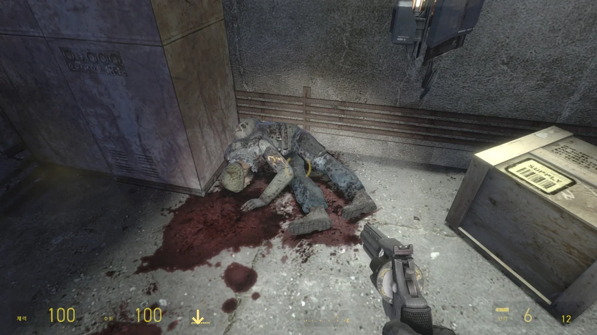

이상하다. 분명 아주 옛날에 이 게임을 플레이한 후 사진을 블로그에 올렸던 것 같은데... 내가 그 글을 지운 것인지, 아니면 단순한 데자뷔인지 잘 모르겠다.

아무튼, 아주 옛날에 했던 이 게임을 지금 또다시 플레이하는 이유는 정말 별것 없다.

&nbsp;

할 게임이 없어서.

&nbsp;

평소 하는 게임이라고는 기껏해야 원신, 블루 아카이브, 마인크래프트 이 셋 정도밖에 없는데, 원신과 블루 아카이브는 하루 숙제를 다 끝내면 할 수 있는 것이 별로 없다. 그러니 스팀 라이브러리에 잠자고 있는 게임을 꺼내 들 수밖에.

스팀 라이브러리를 둘러보다 이 게임을 보고 예전에 '나중에 한 번 더 해야지'라고 다짐했던 것이 기억나, Transmissions: Element 120를 다시 설치했다.

게임의 첫 시작은 열차 안이다.

옆에 기차가 빠아앙 경적을 울리며 지나가는 소리가 들리는데, 왜 G맨은 고든을 이런 위험한 곳으로 보낸 걸까?

자칫 기차에 고든이 치이려면 어쩌려고.

사진만으로는 이 화면의 아름다움을 전부 표현할 수 없다. 실제로 이 게임을 플레이해 보면 알 것이다.

게임을 하다 보면 '와, 이 오래된 게임 엔진으로 이 정도의 표현을 해냈다고?'라는 생각이 절로 들 수밖에 없다.

이번 플레이가 두 번째 플레이이기 때문에, 대충 뭘 어떻게 해야 진행할 수 있는지 기억날 법도 한데, 전혀 기억나지 않았다.

계속 E를 연타하며 돌아다니다 드디어 빠루를 손에 넣었다.

여기 이 시체에서는 권총을 얻을 수 있다. 불쌍하게도 권총으로 자결한 것이 아닐까?

그런데 왜 난 이 게임에는 별다른 무기가 없다고 알고 있지? 무슨 중력건 같은 무기 하나만 쓴 기억이 나는데...

포이즌 헤드크랩은 바나클과 동귀어진하도록 내버려 둔다.

바나클이 웬만한 생물 NPC는 소화할 수 있지만, 포이즌 헤드크랩을 먹으면 포이즌 헤드크랩이 죽음과 동시에 바나클 역시 포이즌 헤드크랩의 독 탓에 죽어버린다.

이 게임에서 제일 인상 깊은 것을 고르라면 이 QR코드를 고를 것이다.

처음 플레이했을 때에는 저 QR코드를 하나하나 휴대전화 카메라로 찍어 해석했었는데, 그냥 HEV 슈트의 줌 기능으로 QR코드를 바라봐도 해석을 해준다.

그러니까 지금 화면에 보이는 QR코드는 실제로 작동하는 QR코드이다.

> THE BREATHLESS CANNOT SEE IN THE DARK
> 숨 못 쉬는 것들은 어둠 속에서 보지 못한다
{.bq}

왜 내가 '숨 못 쉬는 것'이라고 번역했는지는 조금 나중에 알 수 있을 것이다.

야광 페인트 역시 이 게임의 독특한 디자인 중 하나이다.

저 야광 페인트는 그냥 단순히 어둠 속에서 빛나고 있는 것이 아니다.

처음에는 아무런 빛을 내지 않지만, 플레이어가 플래시 라이트로 일정 시간 빛을 비추어 주면 그 빛을 일부 저장했다가 어둠 속에서 내뿜는 것이다.

심지어 어둠 속에서 오랫동안 빛을 내뿜으면 빛을 잃고 사라지기까지 한다.

> THEY CAN'T SEE IN THE DARK EITHER
> 놈들도 어둠 속에서 보지 못하는 것은 매한가지다
{.bq}

정말로 그렇다. 다만 빛이 조금이라도 새어 들어오면 곧바로 우리를 발견한다.



> DO NOT GO GENTLE INTO THAT GOOD LIGHT
> CALM CALM WITH THE GUARD OF THE LIGHT
{.bq}

빛을 피해 다니면 적은 나를 발견하지 못한다.

저 시가 무슨 의미인지 찾아봤는데, 영국의 시인, 딜런 토머스의 시를 일부 변형한 것 같다.

> Do not go gentle into that good night,
> 어두운 밤을 쉬이 받아들이지 마세요.
> Old age should burn and rave at close of day;
> 노년은 날이 저물수록 불타고 포효해야 하므로,
> Rage, rage against the dying of the light.
> 꺼져가는 빛을 향해 분노하고, 또 분노하세요.
{.bq}

그래봤자 무슨 뜻인지 잘 모르겠다는 건 여전하지만.

아, 여기는 기억이 확실히 난다.

왼쪽에 있는 발전기를 켜면 이 터렛들도 활성화되어 날 쏠 것이다.

그러니 발전기를 켜기 전에 터렛들을 옮겨 벽을 바라보도록 했다.



이 부분 역시 발전기를 꺼 조명을 끄면 오른쪽 사진처럼 야광 페인트가 빛나면서 '이걸 작동시켜라'라는 힌트를 준다.

그런데 이 문을 열 때, 자꾸 게임이 튕기더라. 대체 왜지?

> ZOMBIES CAN'T SEE IN THE DARK
> 좀비들은 어둠 속에서 보지 못한다
{.bq}

바로 눈앞에 고든이 서 있는데도 고든을 보지 못하고 지나치는 좀비. 터렛 역시 마찬가지이다.

빠루로 터렛의 다리를 때렸더니 터렛이 넘어졌다. 어... 난 이게 될 거라고 전혀 상상조차 못 했는데.



> VEILED IN THE BLACK OF NIGHT
> THE WOLF MOVES FREELY AMONGST THE FLOCK
{.bq}

이 구절 역시 다른 시에서 가져온 것으로 생각해 검색해 보았지만, 원본이 되는 시를 찾을 수 없었다.

이 구절은 제작자가 직접 창작한 모양이다.

해석하면 늑대(고든)이 양 떼(좀비 무리) 사이를 어둠 속에서 자유로이 누빈다는 이야기이다.

그게 무슨 말이냐면, 지금 저 좀비들은 불이 꺼져있기 때문에, 고든을 보지 못한다는 말이다.

그러니 저 밑으로 내려가서 아무런 방해도 받지 않고 가운데에 있는 도르래를 돌릴 수 있다.

하지만 그냥 지나치기에는 아쉬워서 좀비들을 다 죽였다.

대부분의 좀비는 반격하지 않았지만, 몇몇 좀비는 내가 때리니까 거기에 반응해서 날 때리더라고.

어우...  저 건너편에 좀비들이 득시글대는 걸 보고 저기 있는 좀비를 죽이는 건 포기하기로 했다.

나중에 보니, 저 너머에서는 좀비가 무한히 생성되어 나오고 있었다. 괜히 시간 낭비할 뻔했네.

열린 문으로 들어오자, 무슨 숙소 같은 공간이 나타난다.

> Tomorrow we begin our assault on the combine and Michael is ordering that we leave one EP behind. I've pleaded with him, but he won't budge.
> This could cost us our lives. He's never given up hope, that they're still alive and Jill. It's why he has us risking our lives putting up those damn codes.
> He thinks they can find us. I hope he's right. We could sure use their help
> --- JT
{.bq}

완벽히 해석할 수 있는 건 아니지만, EP라는 것이 언급된다. 이게 무엇인지는 조금 더 가보면 알 수 있겠지. 아마 중력건처럼 생긴 무기가 아닐지 생각된다.

현재까지 문서에서 등장한 사람들은 Michael, Jill, JT 이렇게 셋이다.

하프라이프 시리즈의 게임은 어째 항상 환기구를 따라 이동하는 것 같다.

그리고 절반 정도는 환기구에서 이렇게 떨어진다.

이게 그 EP라는 물건인가 보다. Zero Point Energy Projector. 줄여서 EP.

그림을 해석해 보니, EP로 슈퍼 점프를 할 수 있다.

Mike와 JT가 EP로 누가 더 높이 올라가나 대결을 한 것 같다.

Mike는 분명 Michael의 애칭일 것이고, JT는 아까 그 문서의 JT겠지.

왼쪽 탁자 위에 EP가 아주 탐스럽게 놓여 있다. 이게 아까 그 문서에서 언급한 '남겨둔 EP'일 것이다.



글이 너무 많아서 가까이 다가가면 글이 잘려버린다.

> He's remarkable! By utilizing combine technology Fredrick has managed to not only stabilize and create element 120 but sustain it for longer than we ever thought possible. So far the tests on Unbinilium are stunning!
> The energy it transmits not only deforms time & space, but also dimensionality! We don't yet fully understand the outcomes of this effect but I suspect it will be of great use on our struggles.
> One known side effect so far, the build up of deadly radiation, but it is nothing that can't be overcome with the right equipment.
{.bq}

EP를 만든 후, '이거 개쩌는데?'라고 감탄하는 것이 아닐까?

아, 그래. 바로 이 재미지!

앞에 잔뜩 쌓여 있는 나무 상자가 박살 나며 흩날리는 것이 아주 마음에 든다.

다만 이 무기는 중력건이 아니기 때문에, 우클릭으로 물건을 끌어당길 수는 없다. 좌클릭으로 분홍빛 에너지 볼을 쏘는 것이 전부이다.

어? 원래 이 문이 닫힐 수 있었나?

처음 이 문을 닫았을 때는 내가 나 스스로를 여기에 가둔 줄 알고 당황해했었는데, 옆에 문을 다시 여는 버튼이 있었다.

밑에서 구경할 건 다 본 것 같으니, 위로 올라왔다.

오, 샷건을 준다고?

철판을 덧대어 막은 문이 있다고요? 걱정하지 마세요! 그냥 앞을 보고 쏘면 길을 개척할 수 있습니다!

원래 이 게임이 무기를 풍족하게 주는 게임이었나?

콤바인 자물쇠로 잠긴 문은 자물쇠에 붙은 장치에 대고 E 키를 길게 눌러 강제로 따버릴 수 있다.

이런 기능이 하프라이프 2에 들어있어야 했는데.

다만 E키를 누르고 있어야 하는 시간이 조금 길다. 약 5초 정도 되는 것 같던데.

콤바인이건 좀비건 전부 이 EP 하나로 해결할 수 있다. 에너지볼 하나면 황천으로 보내버릴 수 있다고.

이게 너무 편리한지라 무기를 아예 안 쓰게 되었고, 그래서 내가 이 게임에 무기가 별로 없다고 착각한 것일 수도 있다.

이렇게 잠긴 철망 문도 따버릴 수 있다.

오, 이 시체는 매그넘을 주네. 나중에 요긴하게 쓸지도 모르겠다.

저 철판 때문에 막혀 지나가지 못했던 곳을 이제는 지나갈 수 있다.



가운데에 대롱대롱 매달려 있는 쇳덩이를 EP로 툭 쳐주면 그대로 좀비들을 갈아버리는 믹서기 같은 것이 된다.

처음 이 게임을 했을 때, 신나서 쇳덩이를 EP로 마구 치다가 날아온 쇳덩이에 내가 갈렸던 기억이 난다.

음, 여기가 제일 귀찮았던 곳으로 기억하는데... 좀비가 계속 나왔거든.

문을 열기 위해선 발전기를 작동시켜야 한다.

발전기를 작동시키기 위해선 여기에 있는 전선을 연결해야 한다. 그렇지 않으면 발전기가 돌아가는 듯하다가 곧바로 꺼져버린다.

발전기를 작동시키자, 발전기의 손잡이가 떨어져 나간다.

이제 돌이킬 수 없다.

좀비들이 오기 전, 얼른 이 자물쇠를 따고 여길 빠져나가려 했지만, 좀비들이 오는 속도가 더 빨랐다.

결국 보이는 모든 좀비를 청소한 후에야 이 장치를 작동할 시간을 벌 수 있었다.

하하, 내가 이겼다고.

올라가니 막다른 길이다.



이렇게 천장을 막고 있는 철망에 대고 EP를 톡 쏴주면 이렇게 철망이 활짝 열린다.

어... 반시민들이 죽어있다.

> We have orders to bunker here for the night. Too many of us are hurt or worse. I never thought we could have survived that last horde. It cost us the last of our turrents.
> We made too much fucking noise working our way here. If the combine heard us we will be slaughtered. We have no cnoice but to press our luck. We'll do no good beginning the assault in this condision.
> --- JT
{.bq}

아까 밑에서 좀비 무리를 해치울 때, 터렛을 몇 개 발견했었다.

이들은 콤바인을 습격하기 위해 움직이던 중 좀비 무리와 마주치게 되었고, 거기서 갖고 있던 마지막 터렛을 다 써버린 모양이다.

게다가 좀비 무리를 상대할 때 지나치게 소음을 내게 되었고, 우려하던 대로 콤바인이 이를 듣고 반시민들을 역으로 습격해 전멸시킨 듯하다.



이곳에서 발견한 반시민 시체는 총 네 구. 지금껏 발견한 문서에 언급된 사람 역시 네 명이다.

전부 다 죽었나 보다.

&nbsp;

그 와중에 마지막 한 명은 천장에 거꾸로 매달린 채 헤드크랩에게 머리를 냠냠 당하고 있었다.

이 시체, 크로스보우를 정말 끈질기게 붙들고 있다. 중력건이 있었으면 참 좋았을 것 같은데, 그게 없으니, E로 잡아당겨야만 한다.

그렇게 크로스보우와 씨름하길 한참, 드디어 시체가 크로스보우를 손에서 놓았다.

아무튼 이건 내가 잘 씁니다.



또다시 막다른 길이 나왔다. 이번엔 창문을 깨고 나가면 될 것 같다.

창문을 깨고 나가니, 콤바인이 고든을 격하게 환영해 준다.

스트라이더를 EP로 죽일 수 있나 궁금해서 열심히 쏴봤다. 콤바인 에너지볼은 스트라이더를 죽일 수 있거든.

그런데 일단 맞추기가 더럽게 힘들고, 맞는다고 하더라도 별다른 대미지를 입는 것 같지도 않다.

그래서 반시민이 준 RPG를 열심히 쏴주었다.

건물 안에 숨어서 얌체처럼 RPG를 쏘려고 하니, 건물 벽을 박살 내고 그 틈 사이로 내게 총을 쏜다.

그냥 밖에 있을 때보다는 확실히 덜 맞는데, 아예 맞지 않는 건 아니다.

여기서 계속 버티고 있으면 건물을 아예 부술까 궁금해서 계속 안에 있어 보았다.

애석하게도 그냥 입구 양옆의 벽을 부수는 것 말고는 하는 게 없더라.

내가 설정을 수정해서 그렇지, 원래 RPG 탄은 3발만 들고 다닐 수 있다. 그리고 스트라이더는 RPG를 총 5발 맞춰야 죽일 수 있고.

그렇다면 어딘가에 RPG 탄이 있을 텐데, 정말 있었다.

이렇게 RPG 탄이 보급된다는 건, 여기서 스트라이더를 죽일 때 RPG를 쓰라는 거다.

저 컨테이너가 괜히 매달려 있는 건 아닐 거 같은데... 어떻게 해야 저걸 떨어트릴 수 있을지 잘 모르겠다.



기왕 이 높은 곳에 올라왔으니, 위에서 스트라이더에게 RPG를 쐈다.

핫하, 요 녀석, 아무것도 못 하지? 약 오르지?

그렇게 스트라이더를 총 세 마리 격파했더니 G맨이 나타난다.

***

도전과제 창을 보니 아직 달성하지 못한 도전과제가 조금 있는데, 그건 나중에 몰아서 할 생각이다.

저널도 다 모으지 못한 것 같기도 하고.
