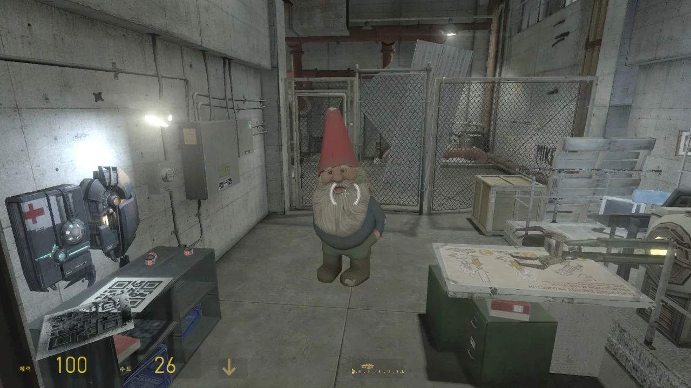
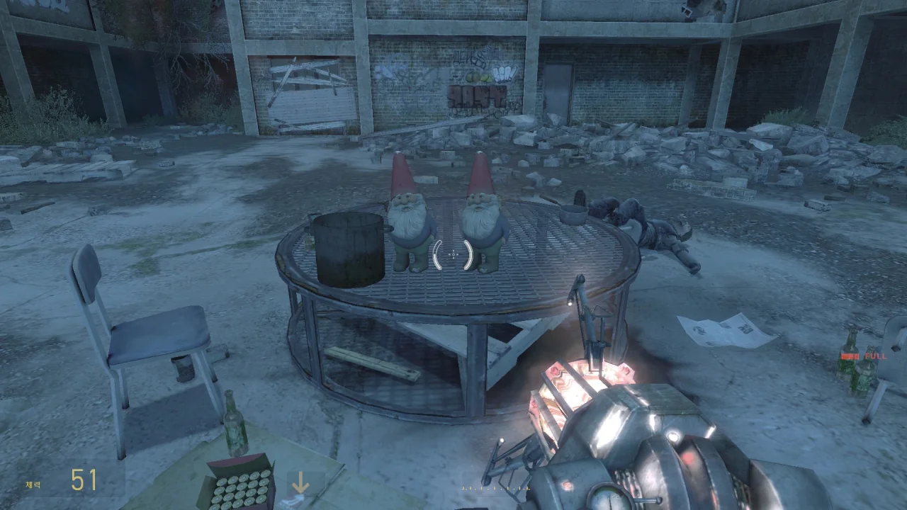
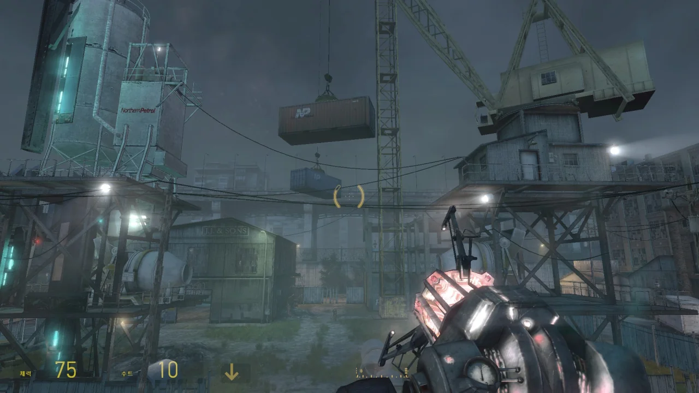
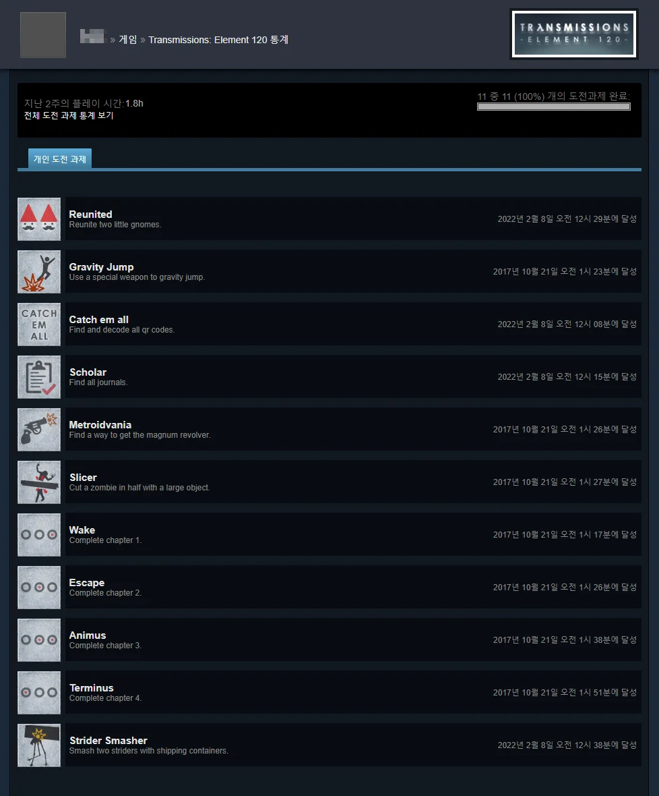

사실 Transmissions: Element 120을 모두 플레이한 후 게임을 삭제할 생각이었다.

하지만 아직 못다 한 도전과제 때문에 게임을 한 번 더 플레이하게 되었다.

&nbsp;

현재 미달성 도전과제는 총 네 가지가 있다.

* Scholar : 저널 4개 모두 찾기
* Catch em all : QR코드 8개 모두 찾기
* Reunited : 노움 인형 두 개를 한데 모으기
* Strider Smasher : 스트라이더 2마리를 컨테이너로 죽이기

딱 봐도 난이도가 장난 아니게 생겼다.

다행스러운 점이라면 게임의 길이가 그리 길지 않아, 하려면 할 수는 있다는 것이다.

***

Catch em all 도전과제는 이미 몇 번이고 모든 QR코드를 다 찾았지만, 플레이할 때 `sv_cheats`을 `1`로 설정해 놓고 한 바람에 도전과제 달성이 안 되었던 것이었다.

그래서 이번엔 `sv_cheats`을 `0`으로 한 상태에서 다시 게임을 진행해 해당 도전과제를 달성했다.

***

이제 남은 건 저널, 노움, 스트라이더 셋이다.



첫 번째 저널의 위치는 숙소의 침대 위에 있다.

> Tomorrow we begin our assault on the combine and Michael is ordering that we leave one EP behind. I've pleaded with him, but he won't budge.
> This could cost us our lives. He's never given up hope, that they're still alive and Jill. It's why he has us risking our lives putting up those damn codes.
> He thinks they can find us. I hope he's right. We could sure use their help.
> -- JT
{.bq}

여기서 말하는 'codes'는 분명 QR코드를 의미하는 것일 테다. EP는 우리가 게임을 하며 정말 잘 써먹는 Energy Projector를 말하는 거고.

&nbsp;

이 반시민 그룹의 대장인 Michael은 Jill과 다른 대원이 아직 어딘가에 살아있으리라 믿고 곳곳에 QR코드를 뿌리도록 한 모양이다.

하지만 이곳에 올 동안 살아있는 반시민은 단 한 명도 보지 못했으니, 아마 그들도 이미 콤바인에 의해 사살당했을 것으로 생각된다.



두 번째 저널은 연구소의 카펫 위에 있다.

> For years I've been down here working on this, for what?! All it takes is one mistake and boom! That's it. It's no good. I'm no good.
> Back to the drawing board.
{.bq}

EP를 개발한 사람으로 추정되는 사람이 거듭되는 실험 실패로 인한 한탄을 늘어놓고 있다.



세 번째 저널은 EP를 얻는 곳 오른쪽 탁자 위에 있다.

> It's remarkable! By utilizing combine technology Fredrick has managed to not only stabilize and create element 120 but sustain it for longer than we ever thought possible. So far the tests on Unbinilium are stunning!
> The energy it transmits not only deforms time & space, but also dimentionality! We don't yet fully understand the outdomes of this effect but I suspect it will be of great use in our struggles.
> One known side effect so far, the build up of deadly radiation, but it is nothing that can't be overcome with the right equipment.
{.bq}

Fredrick이 결국 120번 원소의 안정화에 성공한 것 같다. 아까 그 저널을 쓴 사람이 Fredrick이었던 건가?

여기서 120번 원소의 이름을 운비닐륨이라고 부르는데, 실제로도 그렇다.

실제로는 120번 원소의 안정화에 성공하지 못하고 있지만, 여기선 콤바인 기술을 이용해 120번 원소를 안정화하는 데 성공한 것으로 보인다.

이 세상에서 120번 원소는 시간과 공간을 주무르는 특성이 있다고 되어 있다.

&nbsp;

설마 고든이 여기에 온 이유가 이 운비닐륨 때문은 아니겠지.

이 노움은 Reunited 도전과제를 위해 챙겨가야 한다. 긴 복도 끝 상자 더미 위에 올려져 있으니 찾기 어렵지 않을 것이다.

난 처음에 이걸 그냥 이스터에그인 줄로만 알고 있었는데, 도전과제용 아이템이었다니...

반시민들이 싹 다 죽어있는 공터의 왼쪽 뒤편에 보급 상자가 하나 있는데, 그걸 부수면 나머지 노움이 나타난다.

이 두 노움을 이렇게 잘 붙여두면 Reunited 도전과제 완료.



여기 이 탁자 위에는 마지막 저널도 있다.

> We have ordered to bunker here for the night. Too many of us are hurt or worse. I never thought we could have survived that last horde. It cost us the last of our turrets.
> We made too much fucking noise working our way here. If the combine heard us we will be slaughtered. We have no choice but to press our luck.
> We'll do no good beginning the assault in this condition.
> -- JT
{.bq}

내가 그러했듯, 이들도 여기까지 오면서 좀비 무리를 상대해야 했고, 그 과정에서 너무 큰 소음을 내 콤바인을 자극해 버렸다.

결국 이들은 소음을 듣고 찾아온 콤바인들에게 그대로 썰려버린 것 같다.

마지막 도전과제인 Strider Smasher를 달성하기 위해선 저 위에 대롱대롱 매달린 두 컨테이너를 EP로 쳐 아래로 떨어트려 스트라이더를 박살 내야 한다.

잘 안 될 것이 분명하니 미리 세이브를 해두었다.



그런데 단 한 번 만에 성공해 버렸다.

Transmissions: Element 120의 모든 도전과제 달성 완료!

&nbsp;

이렇게 모든 도전과제를 달성한 게임은 아마 지금까지 없었을 텐데, 뭔가 감격스럽다.

***

데드 스페이스처럼 각 챕터의 제목이 무슨 단어를 만드는 것이 아닐지 하여 챕터의 제목을 차례로 나열해 보았다.

1. Wake
2. Escape
3. Animus
4. Terminus

아니었다.

&nbsp;

하지만 도전과제의 이미지는 확실히 이진법으로 친 드립이 맞다.

001(2) = 1  
010(2) = 2  
011(2) = 3  
100(2) = 4
