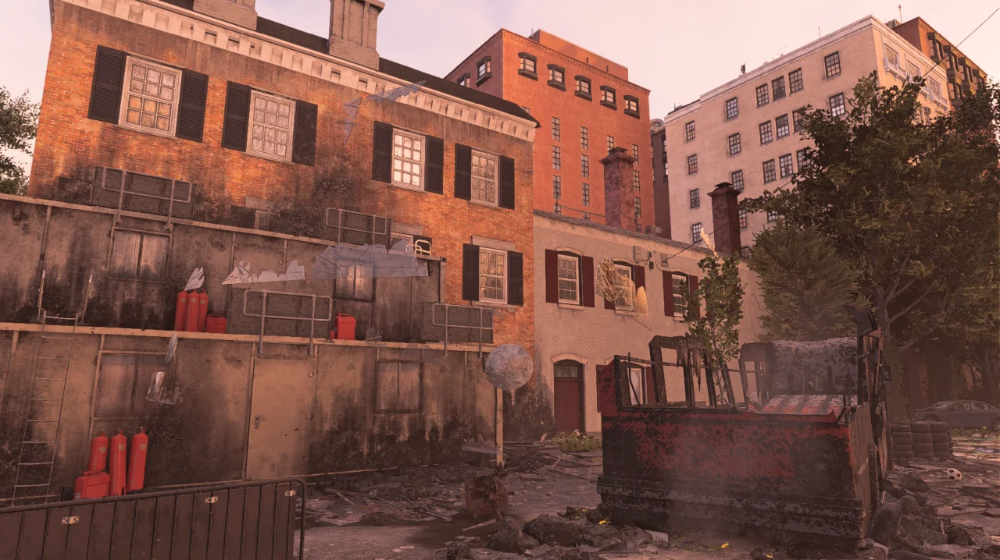
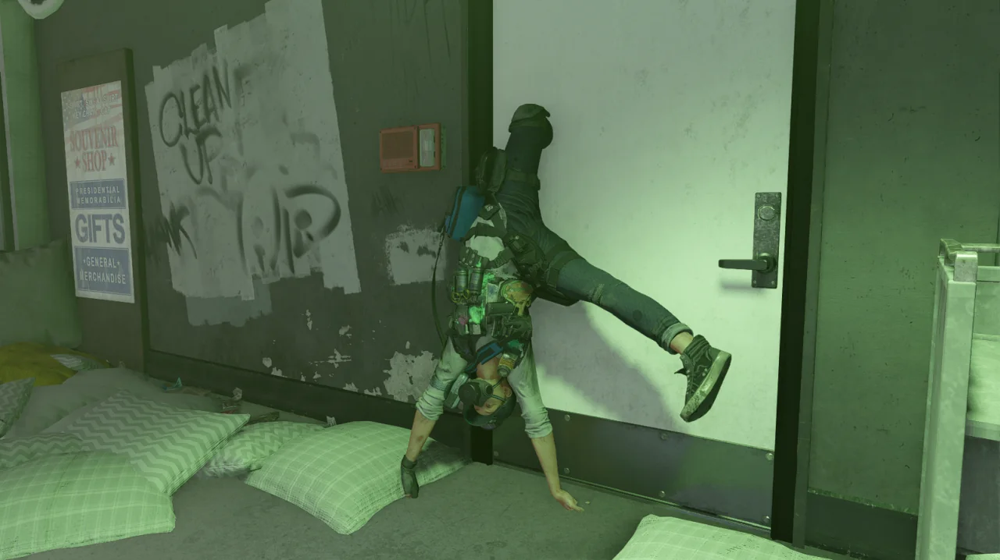
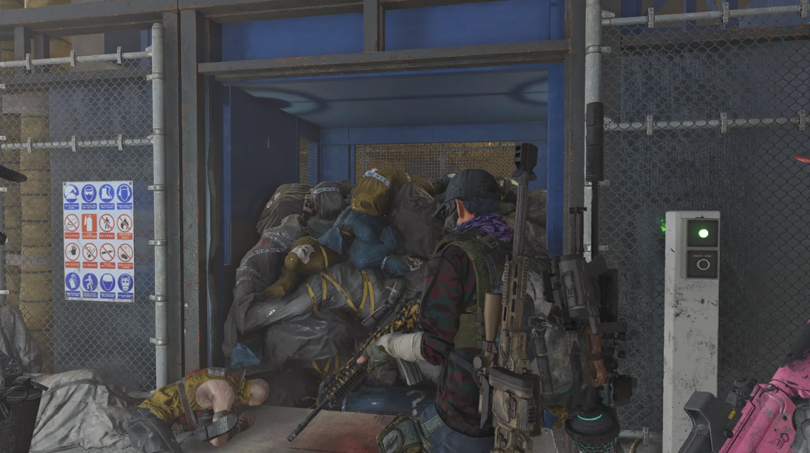
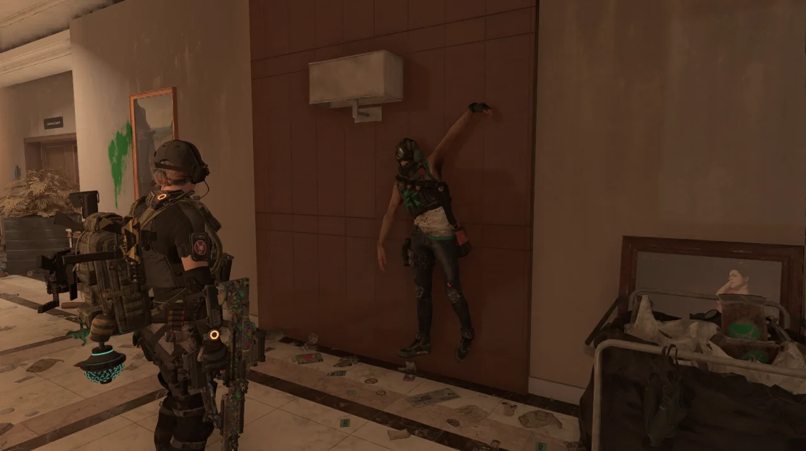

디비전 2에는 '사진 모드'라는, 게임 속 장면을 다양한 모습으로 찍을 수 있도록 해주는 기능이 있다.

처음에는 '스크린샷이면 충분하지, 뭔 또 쓸데없는 사진 모드지?'라고 생각했었는데, 게임을 하며 자주 마주치는 버그를 찍는 데 이 사진 모드가 탁월하다는 것을 깨닫게 되었다.

그냥 보면 평범한 통제 지점의 모습이지만, 잘 살펴보면 깨진 유리창 오브젝트가 공중에 붕 떠 있는 것을 발견할 수 있다.

디비전 2에는 이런 게임 플레이에 큰 지장을 주지는 않지만, 보면 피식하게 되는 종류의 버그가 참 많다.

&nbsp;

저 유리창 오브젝트가 어디에서 온 것인지는 잘 모른다. 분명 이 근처에 저 유리창이 들어갈 만한 곳은 없을 텐데...



질병통제본부 임무에서 지나가게 되는 이 방은 전투를 하지 않고 몰래 통제실로 가 아웃캐스트를 불태울 수 있다.

타오르는 아웃캐스트는 언제 봐도 전혀 질리지가 않는다. 그야말로 'It never gets old'인 셈이다.

​&nbsp;

사람을 산 채로 불태우는 것이 잔인하지 않냐고? 게임을 하면서 발견할 수 있는 온갖 배경 설정과 이야기를 들어보면 아웃캐스트에 대한 동정심이 싹 가신다.

북두의 권에서 켄시로가 "오물은 소독이다~!!"라고 외치는 모히칸의 화염방사기를 빼앗은 후 "네 말이 맞다. 오물은 태워서 소독해야지."라고 말하며 모히칸을 불태우지 않은가? 아웃캐스트에게는 그런 결말이 어울린다.

​&nbsp;

PRO TIP: 키보드를 조작했을 때 산 채로 불타는 아웃캐스트는 키보드를 조작할 때 플레이어의 시야 바깥 구역에서 생성된다. 즉, 저 방에서 방 안의 모든 아웃캐스트를 먼저 제거했더라도 키보드를 누르는 순간 불타는 아웃캐스트가 나타난다.

무릎이 문에 낀 채 매달려 아크로바틱 한 모습을 남긴 하이에나 시체를 발견했다.

자칫 보면 옆 구르기라도 하는 줄 알겠다.

이유는 모르겠지만, 난 이 엘리베이터가 시체 가방을 잔뜩 실은 채 올라왔다가 그 무게를 이기지 못하고 엘리베이터의 줄이 핑~ 하며 끊어지는 소리가 정말 마음에 든다.

&nbsp;

이 임무를 처음 플레이할 때에는 끊어진 엘리베이터의 줄을 타고 아래로 내려가는 줄 알았다. 하지만 나중에 이 임무를 여유롭게 다시 플레이할 때 다시 살펴보니, 엘리베이터의 줄은 끊어진 채 그대로이고 천장에서 새로운 줄이 생성되어 아래로 떨어지는 것이었다. 플레이어는 그 줄을 타고 아래로 내려가는 것이고.

이 녀석은 대체 어디가 벽에 낀 것인지는 잘 모르겠지만, 누군가에게 붙들려 하늘로 승천하는 듯한, 인상적인 자세를 남겼다.

왼쪽 손목이 벽에 낀 것처럼 보이는데, 그렇다고 보기에는 나머지 신체 부위들이 힘없이 축 늘어진 것이 아니라 확신할 수 없다.



제퍼슨 트레이드 센터 임무를 하던 도중, 어디선가 푸드덕거리는 소리가 났다. 한창 전투 중이었기 때문에 '뭐지? 나중에 한번 찾아봐야겠다'라고만 생각하고 전투를 마무리했다.

전투가 끝난 후, 여전히 들려오는 푸드덕 소리를 찾아가 보니... 와우, 이런 진귀한 장면이.

&nbsp;

믿지 못하겠지만, 이것은 하이에나 엔지니어의 시체이다. 대구경 저격 터렛을 설치하는 녀석 말이다. 그 녀석의 시체가 괴기하게 뒤틀려 있다.

&nbsp;

이러한 레그돌 버그는 Havoc Physics를 사용한 게임에서 빈번하게 발견된다. Havoc Physics를 사용한 게임 혹은 게임 엔진을 들어보자면...

* 소스 엔진
  * 하프라이프 2 시리즈
  * 게리 모드
* 스노우드랍 엔진
  * 톰 클랜시의 더 디비전 시리즈
* 엔진 불명
  * 스케이트 3

이 모든 게임에 레그돌 버그가 있다.

&nbsp;

하복 만세! 오늘도 하복 물리 엔진 덕분에 웃고 간다.

***

오늘의 덤:



'삽질 버그'에 걸린 김에 다른 사람에게 온갖 춤을 추는 내 모습을 찍어달라고 부탁했다.

'삽질 버그'란 현재 플레이어가 가만히 대기 중임에도 불구하고 다른 플레이어에게는 삽질하는 것과 같은 동작을 반복적으로 취하는 것처럼 보이는 버그이다.

이 버그는 감정 표현 중에도 발생하기 때문에, 위 영상처럼 춤을 추다 말고 삽질을 하는 동작을 취하게 되어 결과적으로 괴기한 춤을 추게 만들기도 한다.
