오늘도 여전히 디비전을 한다. 디비전 정도면 이제 나에게 있어 인생 게임이라고 해도 무방하지 않을까?

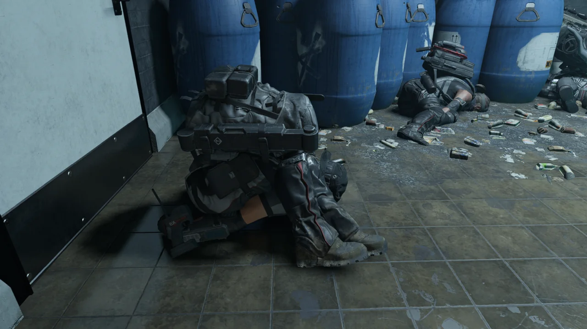

블랙 터스크 병사의 몸이 마치 샌드위치처럼 기괴하게 접혔다.

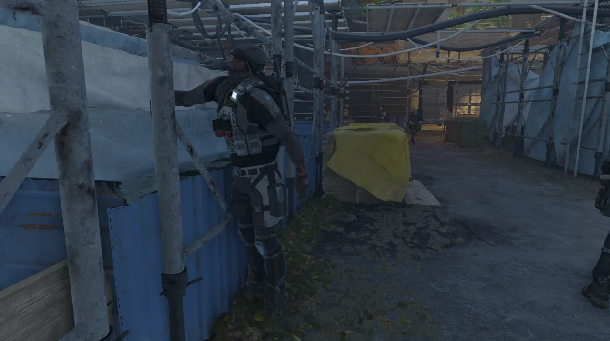

대체 몸의 어느 부분이 어디에 걸려서 이렇게 된 것인지는 잘 모르겠지만, 재미있는 모습을 죽었다고 생각해서 찰칵 사진을 찍었다.

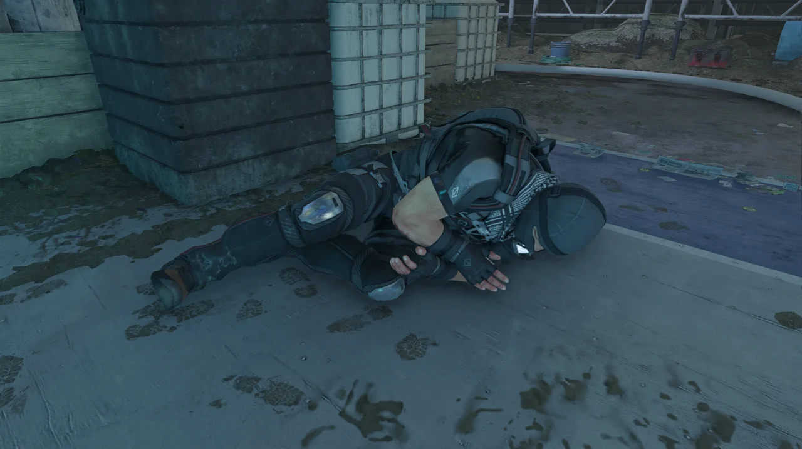

흡사 드래곤볼의 야무치를 생각나게 하는 자세로 죽은 블랙 터스크 병사.

지금껏 드래곤볼을 본 적은 단 한 번도 없지만, 워낙 야무치가 유명하지 않은가. 그 정도는 나도 알고 있다.

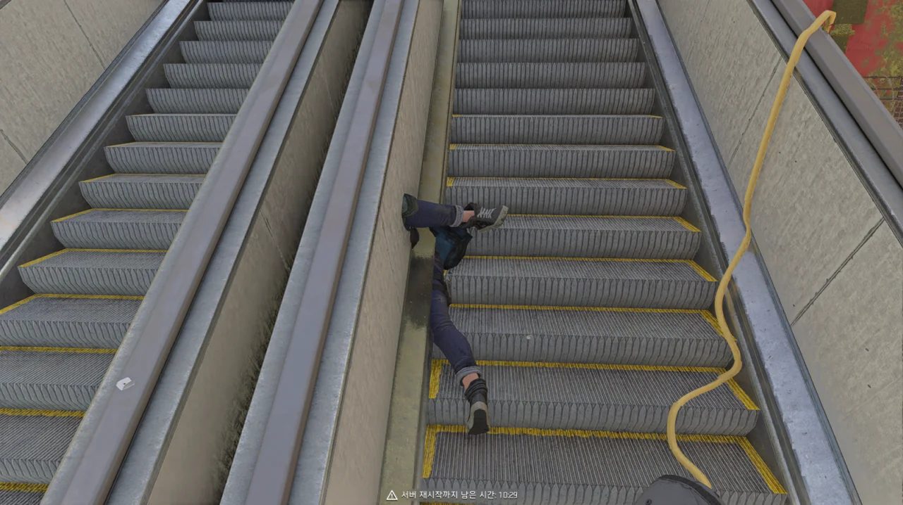

*선생, 몸뚱이는 어디다 두고 다리만 오셨소?*

이 정도면 시체가 벽에 끼다 못해 벽 속으로 사라진 수준이다.

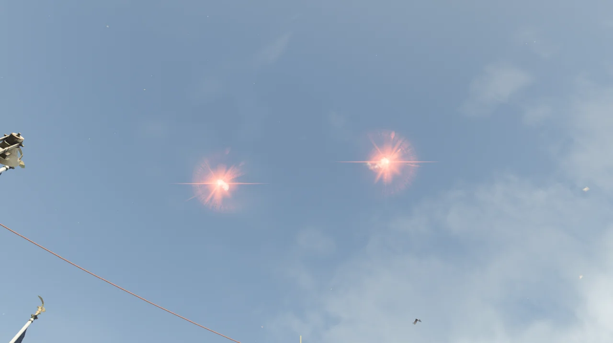

다크존에서 놀다가 우연히 플레어를 두 개나 띄웠다. 보통 플레어를 한 번 쏘면 다른 사람은 플레어를 쏠 수 없게 되어 있기 때문에, 이런 경우는 처음 본다.

만약 두 명이 동시에 플레어를 쏠 수 있다면, 네 명 역시 가능하다는 소리겠지?

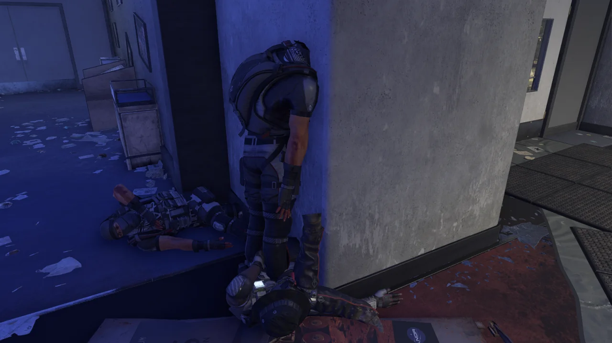

만화적 표현 중에는 사람의 머리를 벽에 파묻어 버리는 표현이 있다. 이 블랙 터스크 병사는 정말로 머리를 벽 속에 파묻어버렸다.

오늘 디비전 2 사진전은 매우 성행할 것으로 보인다.

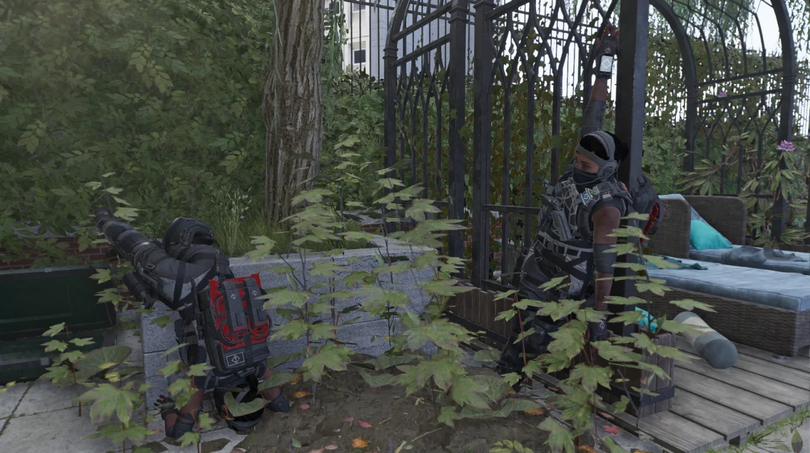

*PUT YOUR HANDS UP IN THE AIR!*

한쪽은 오른손을 하늘 높이 들고 있고, 다른 한쪽은 땅에 머리를 박고 뱅글뱅글 돌다가 처박힌 듯한 모습을 취하고 있다.

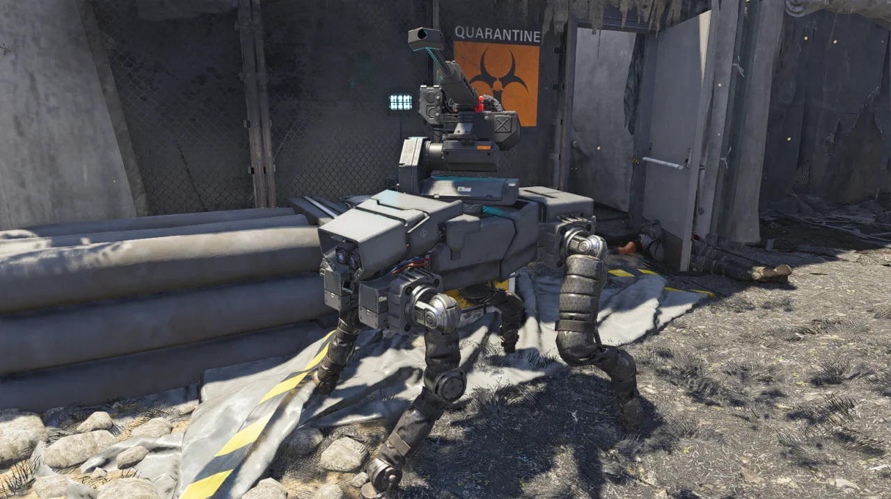

철댕이 특) 폭발 대미지로만 죽었을 시, 시체가 이렇게 온전히 남는다.

이렇게 보면 철댕이가 참 귀여운데, 노란색 철댕이는 전혀 귀엽지 않다. 한 대 맞으면 바로 출혈이 걸리고, 그러면 힐이고 자시고 어찌할 새도 없이 그냥 죽어버리거든.

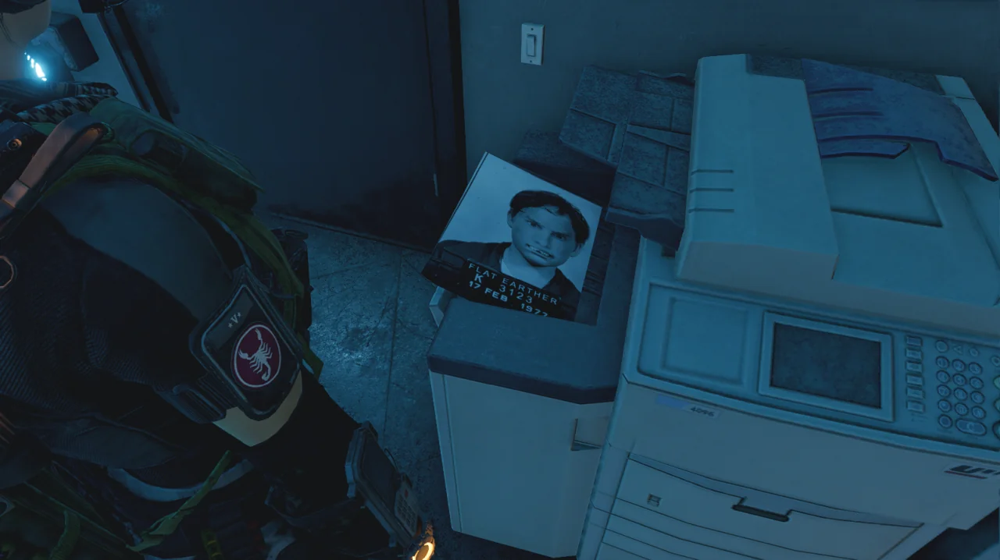

미 항공우주국 본부 임무에서 지구평면설 이스터에그를 발견할 수 있다고 해서 직접 해보았다.

이 사진이 두 번째 사진이라고 하던데, 첫 번째는 아무리 찾아도 나오지 않는다.

&nbsp;

사진에 나온 숫자는 3123이다. 다른 숫자로는 1977이 있긴 한데, 이 숫자가 첫 번째 사진에 있는 숫자는 아닐 것 같다. 듣기로는 첫 번째 사진에는 고양이가 있다던데...

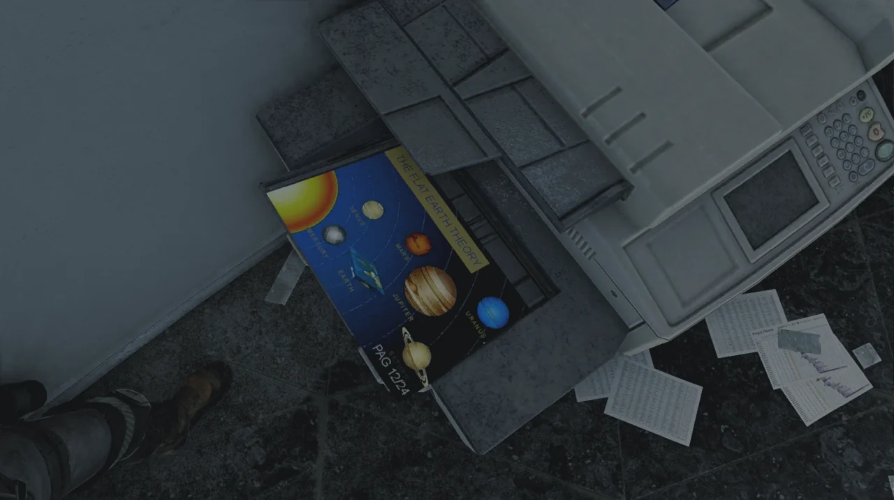

THE FLAT EARTH THEORY라면서 다른 행성들은 둥근 와중에 혼자서만 평면인 지구를 그려놓았다. 이거, 100% 지구평면설 지지자들을 비꼬는 목적의 그림이다.

그림에 적힌 숫자는 1224.

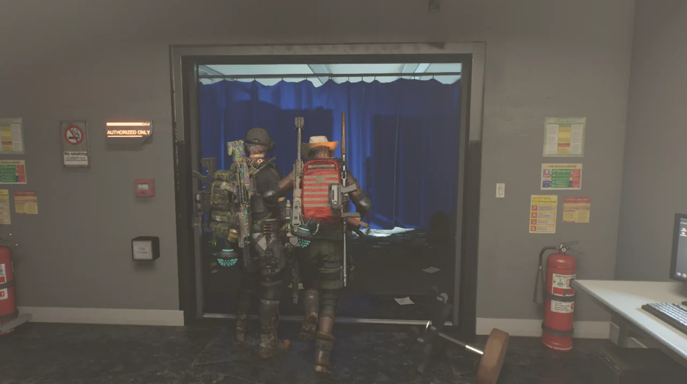

아무래도 두 번째 사진에서 찾았던 번호인 3123이 이 문의 비밀번호인 것 같아, 그걸 입력했더니 문이 열리긴 했다. 그런데 투명한 벽이라도 있는 것인지, 안으로 들어갈 수가 없다.

안쪽을 향해 권총을 몇 번 쏘고 나니까 들어갈 수 있었다. 대체 뭔 버그지, 이건.

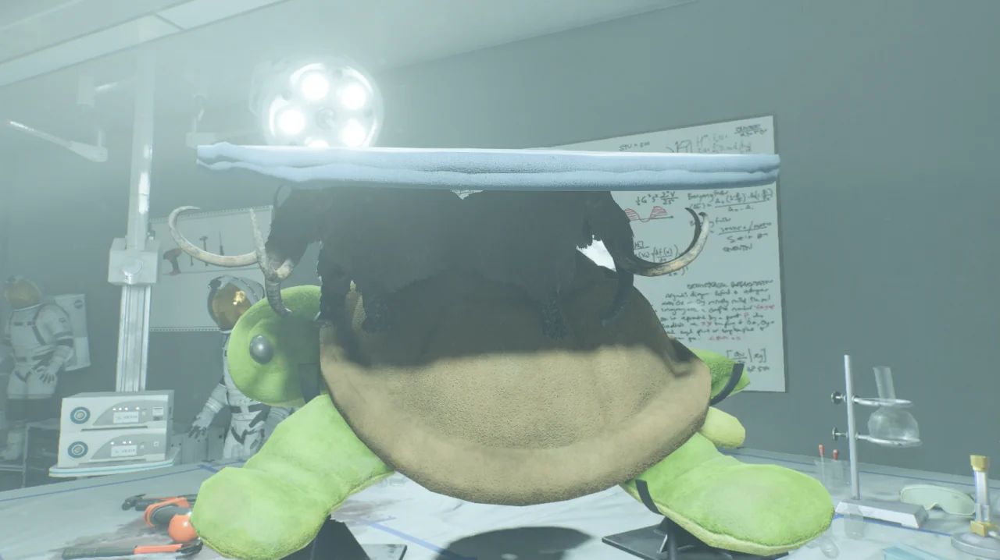

보자마자 디스크월드 패러디인 것을 알아차렸다.

거북이 등짝 위에 코끼리 네 마리가 받치고 있는 원판 위의 세계, 이거 디스크월드잖아.

&nbsp;

물론 디스크월드의 우주관은 힌두 신화에 영향을 받았으니 저게 힌두 신화에 레퍼런스를 두고 있다고 해도 틀린 말은 아니다.

힌두 신화에서 지구를 지탱하는 세 코끼리를 짊어지고 있는 거북이의 이름이 '아쿠파라'라고 하던가?

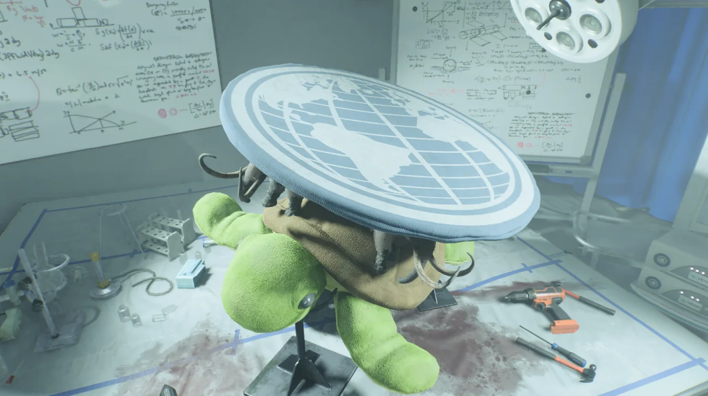

모델의 질감을 정말 훌륭하게 표현했다. 정말 봉제 인형처럼 생겼다.

만약 저 봉제 인형 부분만 똑 잘라내서 다른 사람에게 보여주면 누구라도 '이거 사진이야?'라고 물을 것이다.

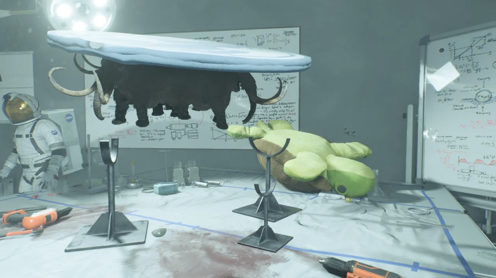

거북이 인형은 다른 모델을 재활용한 것인지, 총으로 쏴서 위치를 바꿀 수 있었다.

코끼리와 평면지구는 자신을 받치고 있던 거북이 인형이 저 멀리 튕겨 나갔음에도 공중에 둥둥 떠서 제자리를 고수하고 있다.

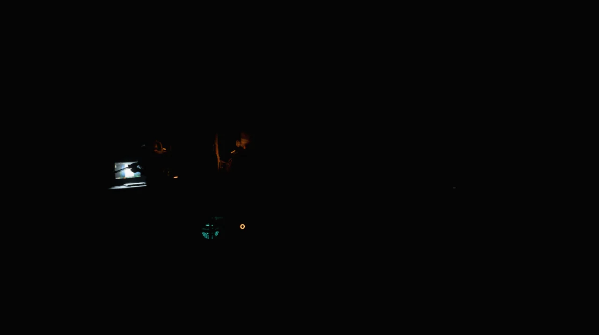

디비전의 특징이라면 특징이라고 할 수 있는 이것. 방 안의 조명을 쏴서 끌 수 있다.

방 안의 모든 조명을 쏴서 방을 암실로 만들었다. 지금 환하게 켜져 있는 저 노트북의 화면도 쏘면 조명이 꺼진다.

*어두운_방에서_요원_셋이서.png*

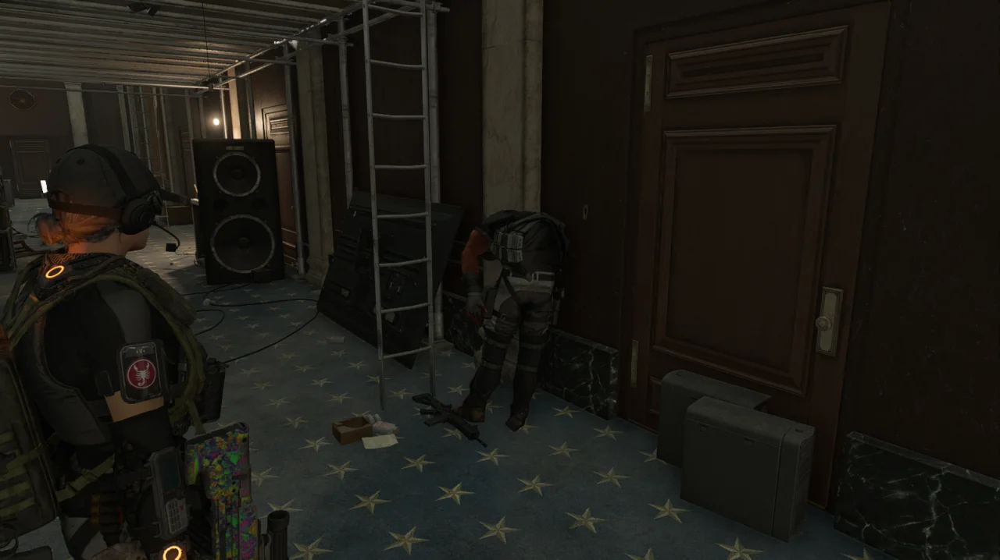

블랙 터스크 병사가 사다리를 타고 올라가다가 총에 맞고 죽었다. 분명 처음 죽였을 때는 사다리에 걸친 상태였는데, 나중에 다시 확인할 때는 걸친 자세 그대로 바닥에 내려와 있었다.

이런 버그는 또 처음 보네.

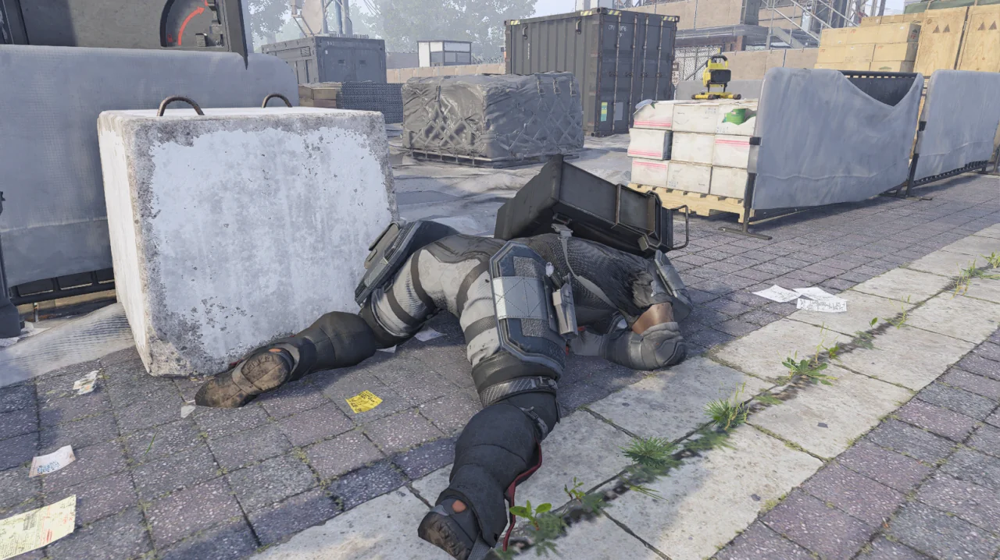

블랙 터스크 중갑병의 탐스러운 엉덩이. ~~*ANG*~~
