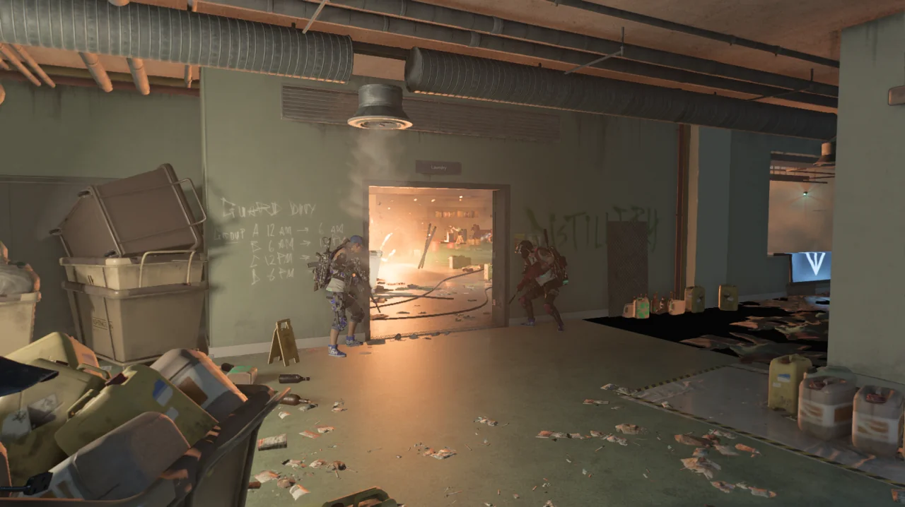
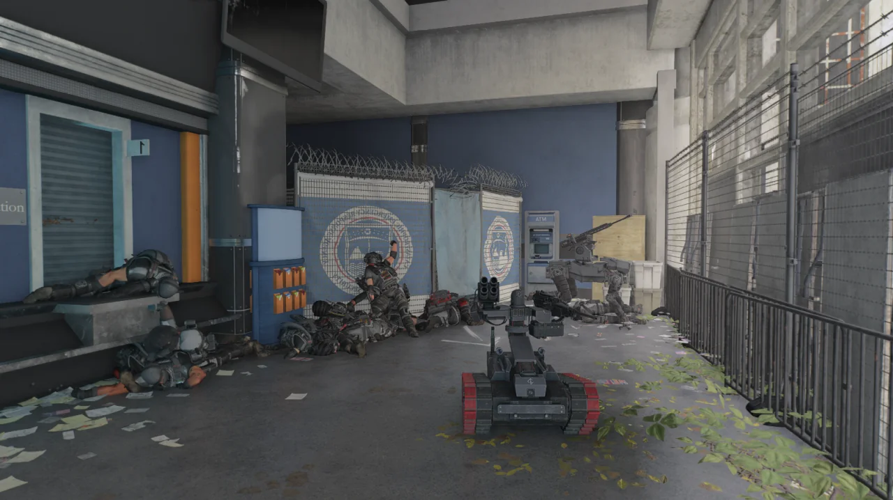

'사진 모드의 미학'이라니 뭔 개똥 같은 철학이냐고 할 테지만, 내가 사진 모드를 이용해서 찍는 대상은 어느 정도 정해져 있다.

이쁜(?) 자세로 죽은 시체라던가, '어머, 이 장면은 꼭 기록으로 남겨놔야만 해!'라고 생각하는 장면이라거나.

&nbsp;

절대로 허투루 찍는 사진이 아니다.

이렇게 스폰 장소에서 나오자마자 학살당한 블랙 터스크 병사들의 시체를 보며 인생의 무상함을 생각해 보기도 하고

온갖 기묘한 자세로 죽은 시체들을 보며 이 NPC가 죽음의 문턱에서 과연 무엇을 표현하고자 했던 것일까를 고민해 보기도 한다.

앞서갔던 다른 동료들이 외마디 비명과 함께 죽어 볼품없이 널브러지는 것을 보았음에도 불구하고 바득바득 위로 기어 올라가겠다고 하다가 다른 동료들과 똑같은 꼴이 된 블랙 터스크 병사들을 보며 이 녀석들에게 과연 뇌라는 것이 있는가 숙고해 보기도 한다.

&nbsp;

아마 없을 것이다.

정작 그러는 나 역시 죽을 것을 알면서도 단지 재미있다는 이유 하나만으로 20mm 기관포 앞에서 팔 벌려 뛰기를 하므로 거기에 대해서 뭐라 할 수 없다.

죽는 장면을 찍고 싶었는데, 사진을 찍을 새도 없이 곧바로 볼품없이 바닥에 내 시체가 처박히더라.

아, 이 깨끗한 백악관의 모습을 보라!

내 세션은 이미 매주 블랙 터스크의 침입을 받고 있어 백악관의 조명이 온통 붉은데, 이 세션의 주인은 이제 막 월드 랭크 5에 올라온 터라 블랙 터스크의 침입을 모두 격퇴한 상태이다.

물론 조만간 이 세션의 백악관도 붉은 조명이 함께할 것이다.

&nbsp;

인간적으로 그 주 블랙 터스크 침입 임무를 모두 클리어했다면 백악관의 조명도 다시 원래대로 이렇게 흰색으로 되돌려주었으면 좋겠다. 붉은색 조명만 보다 보니까 여기가 백악관인지 정육점인지 잘 모르겠다고.

게임을 하다 보면 아무래도 매주 블랙 터스크 침입 임무를 하게 되고, 자연스럽게 우스꽝스럽게 죽은 블랙 터스크 병사의 시체를 자주 만나게 된다.

이 녀석들, 의외로 다양한 자세를 취할 줄 안다니까.

내 기억에 여기 이 장소에서 딱히 전력맨이 드론 폭격을 하거나 돌돌이를 터트린 적이 없음에도 블랙 터스크 시체가 한 무더기로 쌓여있다.

이렇게 되기 참 힘든데.

안전 가옥의 천장에 구멍이 뚫렸다. 애틱(다락방) 아니랄까 봐 바깥에서 내리는 비가 그대로 들어오네.

물론 버그다. 바깥에서 비가 내리든 말든 안전 가옥 안은 비가 들어오지 않아야 하는데...

평범한 낙서를 찍은 것처럼 보이는 사진이지만, 이 사진에는 버그가 하나 있다.

바로 데칼이다. 낙서 데칼이 벽에 붙어있는 것이 아니라 벽에서 떨어져 나와 공중에 붕 떠 있다.

&nbsp;

카스 글옵을 위한 맵을 만들 때 데칼에 대해서 잠깐 배운 적이 있었는데, 이 데칼은 대체 무슨 오류 때문에 이렇게 벽에서 떨어져 공중에 붕 떠다니는 것인지 모르겠다.



하복 엔진 만세. 온갖 기묘한 자세로 죽어있는 시체들을 보면 그냥 반사적으로 사진 모드를 켜고 사진을 찍게 된다.

이 사진 역시 평범한 사진이 아니다.

현재 이 지역의 셀 로딩이 덜 되어, 곳곳에 있어야 할 프롭들이 전혀 보이지 않는다. 단적인 예로, 안쪽 방에는 대형 세탁기들이 늘어서 있어야 하지만 이 사진에서는 전혀 보이지 않는다.

사진을 찍기 전에는 더 심했는데, 바닥 텍스쳐가 로딩되지 않아 바닥 너머의 하늘이 보였고, 방 안쪽의 테이블과 그 위에 있는 플라스크 역시 보이지 않았다.

그러니까 그냥 벽만 공중에 붕 뜬 상태에서 역시 공중에 붕 뜬 적만 보였다는 말이다.

굉장히 편한 자세로 누워있는 블랙 터스크 병사.

시체가 공중에 똑바로 서 있는 것도 아주 기괴한데, 꺾인 팔의 각도 역시 기괴하다.



한차례 드론 폭격이 지나가면 이렇게 블랙 터스크가 단체로 영원한 휴식을 취하게 된다.

트루 썬이 올바르게 분리수거된 모습이다. 암, 쓰레기는 쓰레기통에 넣어야지.

사실 저건 쓰레기통이 아니라 물건을 운반하는 카트이지만, 거기에도 쓰레기를 일단 담을 수 있으니까 아무튼 쓰레기통인 셈이다.

이 트루 썬은 다리 찢기에 너무 몰두하다가 가랑이가 찢어졌다. 이미 회복 불가능한 수준이다.

내 Mk17 소총이 소총을 그만둔 것 같다. Mk17에 저격 소총인 네메시스의 조준경이 붙었다고? 그것도 조준경이 붕 뜬 상태로?



심지어 이 버그는 무기를 바꾸거나 다른 장소로 이동해도 그대로이다.

&nbsp;

조준을 하면 더 가관인 모습을 볼 수 있다. 조준경이 이마에 철썩 달라붙는다.

심지어 Mk17에 탄창도 달리지 않았다.

그야말로 조준경 빼고는 모든 개조 부품이 사라진 셈. 이건 대체 뭔 버그지.

블랙 터스크 병사들의 시체는 전부 벽 쪽에 나란히 놓여있는 가운데 미니 탱크 혼자 가운데 서서 삐삐쀼쀼 하는 것 같아 찍었다.

미니 탱크 역시 다른 블랙 터스크 병사들과 함께 터진 지 오래이지만, 버그 때문에 나에게는 미니 탱크가 적을 인식하지 못한 대기 상태로 가만히 서 있는 것으로 보인다.

*GET, SET, GO!*

오늘도 워싱턴의 하루는 평화롭다.
