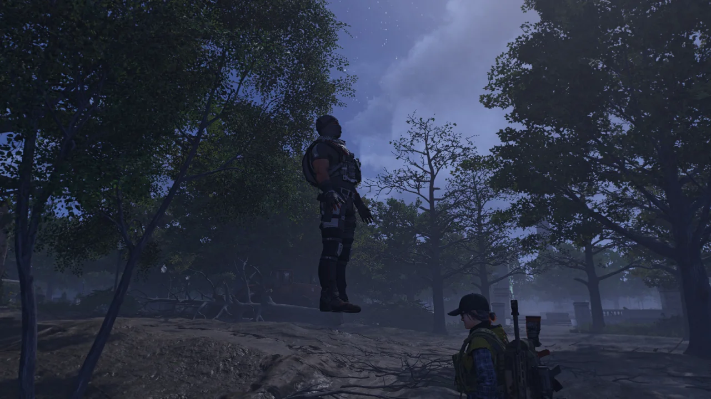
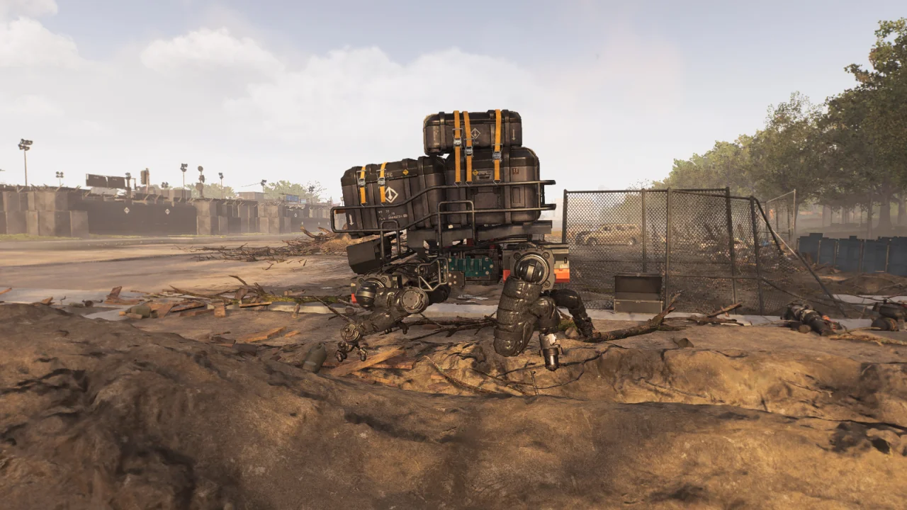

디비전 2의 첫 레이드, '칠흑의 시간 작전'이 나오자마자 바로 레이드에 뛰어들었다.

아니, 난 며칠이면 될 줄 알았지. 그런데 그게 6일이나 걸릴 줄 누가 알았겠는가.

호기롭게 레이드가 새벽 1시에 열리자마자 사람들과 함께 워싱턴 내셔널 공항으로 뛰어들었다.

레이드를 처음 시작하면 도착하는 장소에서 한 컷 찍었다.

&nbsp;

그런데 우리가 1넴도 깨지 못할 줄은 정말 몰랐다. '아직 너는 준비가 안 되었다! 돌아가라!'라고 1넴, 부머가 외치는 것 같더라.

부머의 벽은 우리에게 너무 높았다.

&nbsp;

그래서 필사의 파밍을 시작했다.

1넴인 부머를 잡기 위해서는 부머의 공격을 받아줄 피통돼지 탱커가 필요한 것으로 보였다. 그렇다면 필요한 것은 '파괴 불가' 탤런트와 '인내심' 탤런트. 이 두 탤런트를 모으기 위한 여정에 돌입했다.

파밍 중 철댕이 셋이 보기 좋게 나란히 서서 죽은 장면을 발견했다. 이게 다 무자비 덕분이다.

중갑병 돼지? 철댕이? 무자비의 폭발 대미지 앞에서는 죄다 밥이다, 밥.

마치 신을 영접한 듯한 블랙 터스크의 시체. 공중에 꼿꼿이 서 있다.

> 놀랠 노 자로구만!
{.block-quote}

아무리 봐도 저 블랙 터스크가 이렇게 말하는 것 같다.

최근 패치 이후로 블랙 터스크 침입 임무의 마지막인 타이들 베이슨 임무를 클리어하지 않으면 타이들 베이슨 근처에 철댕이 호송대가 돌아다닌다는 이야기를 들었는데, 정말이었다.

지금까지 하면서 철댕이 호송대는 거들떠보지도 않았기에 이번이 철댕이 호송대를 처음 보는 것이다.

파밍 도중 잠깐 기분이라도 전환할 겸 백악관 안에서 사진 모드를 켜고 이곳저곳을 촬영하던 중 발견한 것.

NPC의 뒤통수 안쪽을 촬영할 수 있다.

&nbsp;

의외로 안구, 치아, 혀 등을 어느 정도 구현해 놓았다. 아마 대화할 때 보이는 부위라서 그럴 것이다.

여기 이 자리에 칠흑의 시간 작전을 전 세계에서 처음 클리어한 사람들의 사진이 걸린다고 한다.

난 이거 절대로 못 하겠지. 앞으로 나올 레이드도 그렇고.

디스트릭트 경기장을 어려움 난이도로 권총 솔로 플레이에 도전하던 중, 갑자기 배가 아파 화장실에 다녀왔더니 느닷없이  비가 내리고 있었다.

여긴 실내인데 비가 온다고?

백악관을 돌아다니던 중 발견한, 그 어떤 선도 꽂혀있지 않음에도 잘 작동하는 컴퓨터이다.

아마 디비전 1 때에도 이런 식으로 뒤편에 아무런 선도 꽂혀 있지 않은데 잘 돌아가는 컴퓨터가 많았던 것으로 기억한다. 대체 선이 어디에 있었던 것일까...

다른 것은 전부 분수의 물줄기에 가려 보이지 않는데, 선글라스 혼자 선명하게 자신의 존재감을 빛내고 있다.





온갖 녀석들이 온갖 기묘한 자세로 죽은 모습이다.

지치고 고된 파밍 중 날 웃게 하는 것은 바로 이런 버그뿐이다.

사진을 찍을 때는 잘 몰랐는데, 어쩌다 보니 총탄이 날아가는 모습도 같이 찍게 되었다.

디비전 2에서의 총탄은 전부 히트 스캔 방식이라 총탄이 날아가는 트레이서를 굳이 구현하지 않았으리라 생각했는데, 의외다.

이런 문양을 뭐라고 부르더라? 휘장?

아마 이게 미국 대통령의 휘장일 것이다.

VERITAS OMNIA VINCIT의 뜻을 찾아보니 '진실이 모든 것을 지배한다'라는 뜻이라고 한다.

이제 준비가 되었다고 생각해, 다시 사람들을 긁어모아 레이드에 재도전했다.

이번에는 1넴을 무사히 클리어할 수 있었다.

&nbsp;

토요일 새벽의 일이었다.

내친김에 쭉쭉 나가 2넴도 클리어했다. 어째서 2넴이 1넴보다 쉬운 것인지는 잘 모르겠다.

3넴 역시 여유롭게... 까지는 아니더라도 무사히 클리어했다. 루시와 버디의 체력을 골고루 깎는 것이 얼마나 힘들던지...



하지만 거기까지였다.

4넴의 벽에 가로막혀 처절하게 무너져 내린 우리는 또다시 무기와 방어구 파밍을 시작했다.

막넴이라고 너무 어렵게 만든 거 아냐, 이거? 한 명이라도 삐끗하면 모두가 미사일 폭격을 맞고 나락으로 떨어진다.

지금 보고 있는 것은 국회의사당에 있는 한 방의 천장이다.

그럼 저 시체는 뭐냐고? 바로 위층에 있는 시체가 바닥을 뚫고 아래층 천장에서 보이는 것이다.

원래 여기 바닥이 이렇게 얇았나?

뷰포인트 박물관 옥상에서 사진 모드를 이용해 외부를 바라보면 놀랍게도 멀리 있는 건물까지 전부 구현되어 있다.

다만 멀리 있는 건물들은 낮은 품질의 모델을 쓰다가 시간이 지나면서 점차 고품질의 모델로 교체되더라.

당장 저기 있는 낮은 돔 역시 각진 모양이었다가 지금 보이는 것처럼 둥근 모양이 되었다.

그리고 5월 22일 오후 11시경, 대망의 레이드 클리어. 드디어 레이드를 클리어했다!

4넴은 이 거대한 차량인데, 꼿꼿이 서 있던 레이더 탑이 힘없이 풀썩 쓰러진다.

첫 클리어 기념으로 모두가 함께 사진을 찍었다.

정작 레이드 클리어에 가장 많은 도움을 주신 분이 사진을 찍겠다고 앞으로 나가셔서 그분은 사진에 있지 않다.

사실 레이드가 나온 첫 주에 레이드를 클리어하면 특별한 휘장을 준다. 그것이 내 휘장 목록에 등록되었는지 확인해 보았는데 휘장이 없다.

물어보니 해당 휘장을 얻으려면 레이드를 처음부터 끝까지 공격대 멤버의 변동 없이 연속적으로 클리어해야 얻을 수 있다고 한다.

&nbsp;

그래서 다들 '한 번 더 할까?'라고 의견을 모아 레이드를 한 번 더 클리어했다. 아무리 생각해도 이건 내가 휘장을 얻고 싶다고 징징대서 한 번 더 간 것 같지만...

이번에는 그리 오랜 시간이 걸리지 않았다. 약 1시간 30분 정도.

1넴, 2넴은 단 한 번에 끝냈고, 3넴에서 세 번 시도했다. 4넴은 다시 한번 만에 끝냈고. 루시와 버디 둘이 좀 많이 까다로웠다.

&nbsp;

아무튼 만세다, 만세. 레이드 클리어라고!
