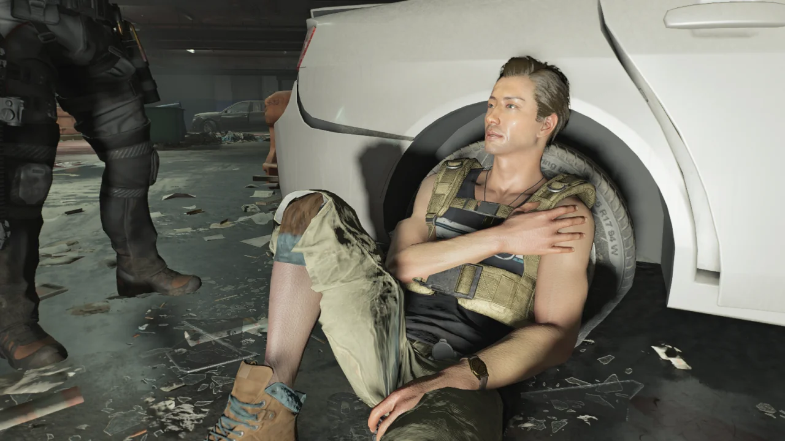

농담이 아니다.

이 느낌을 뭐라고 해야 할지 잘 모르겠다. 디비전을 켜서 하는 모든 행위가 그저 레이드를 돌기 위한 사전 준비를 하는 것으로만 느껴진다.

&nbsp;

도전 측면에서도 김이 팍 식었다.

그렇게나 어렵던 영웅 난이도는 전력맨이 한 손에 폭격 드론, 한 손에 돌돌이를 쥐고 휘리릭 뿅 휘두르면 필드 위의 적이 모두 삭제된다. 그 대신 전력맨은 레이드에서 전혀 쓸모가 없는 짐짝이 되어버렸지만 말이다.

&nbsp;

상황이 이렇게 되다 보니 게임을 하는 이유가 그저 더 좋은 아이템을 얻기 위해서라는 생각밖에 들지 않는다.

물론 디비전은 루트 슈터 장르의 게임이니, '더 좋은 아이템을 얻기 위해' 게임을 하는 것 자체가 틀린 목적은 아니다. 하지만 내가 원하는 것은 '게임을 즐기는 것'이지, '게임을 하는 것'이 아니다.

이 느낌은 마치 얏지가 말한 것처럼 '붙어있는 숫자가 더 높은 바지'를 찾기 위해 몇 시간 동안 뺑이치고 중노동 하는 느낌이다.

&nbsp;

뭔가 이상하다.



통제 지점 근처의 활동을 완료해 통제 지점을 4단계로 만든 후 야금야금 먹던 도중, 분명 보이는 모든 적을 전부 다 죽였음에도 불구하고 통제 지점 점령이 완료되지 않는 현상이 발생했다.

대체 무엇 때문인가 하고 주변을 샅샅이 뒤져보다가 발견한, 땅바닥에 파묻혀 머리만 덜렁 튀어나온 트루 썬 머머리.

저렇게 머리만 튀어나온 채 계속해서 전투 대사를 내뱉는 모습이 참 기괴했다.

&nbsp;

그래서 사진을 찍고 난 후 빠르게 보내주었다.

클랜 상점을 27레벨일 때 이용하면 '전체 방어도 +30%' 속성이 붙은 길라 가드 조끼가 나온다는 말을 듣고 예정에도 없던 부캐를 부랴부랴 키우게 되었다.

한 대 한 대가 아픈 레이드에서 방어도 수치는 소중하니 말이다.

&nbsp;

그랜드 워싱턴 호텔을 돌던 중 발견한 이 녀석은 대체 뭘 하다가 이렇게 된 것인지는 몰라도 허공에 손이 고정된 채 매달려 있다.

이런 건 찍어주는 것이 예의겠지.

이번에 키우는 부캐의 성별은 남성으로 골랐다. 본캐의 성별은 여성이고.

하지만 플레이어 캐릭터는 게임 내에서 단 한마디도 말하지 않기 때문에, 캐릭터의 성별을 운운하는 것이 그리 큰 의미가 없다.

&nbsp;

캐릭터의 얼굴은 미리 제공된 프리셋에서 약간씩 변형해 쓰고 있다. 적당히 마음에 드는 프리셋을 고른 후, 얼굴의 세부 사항을 조금씩 만지다 보면 '오, 이거 괜찮은데?'라는 생각이 드는 얼굴이 나온다.

하지만 나중에 다시 보면 그 얼굴이 영 못마땅하게 느껴진다. 이것이 바로 커스터마이징의 늪이다. 한 번 빠지면 빠져나올 수 없지.

다들 끄라고 하는 '그 위키'에 따르면 여기 이 요원은 별도의 요원 모델을 쓰지 않고 그냥 일반 시민 모델을 가져다 쓴다고 한다. 그래서 매번 플레이할 때마다 요원의 얼굴과 피부색이 바뀐다고 한다.

그나저나 이 요원의 오른 무릎의 색깔이 심상치 않다. 혹시 이거 모델의 일부분이 늘어나거나 그런 건 아니지?

세네트인지 아네트인지 이름이 굉장히 헷갈리는 다크존 담당관이 아무것도 없는 가방을 뒤적거리고 있다.

플레이어의 시야에 보이지 않을 곳에서 가방을 뒤적거리기 때문에 가방 내용물을 굳이 구현하지 않았다고 한다면 당연히 그럴 수 있다고 생각하겠지만, 여긴 굳이 사진 모드가 없어도 가방 안쪽을 볼 수 있는데 대체 왜 그런 걸까.



온갖 아크로바틱한 자세를 남긴 하이에나 시체들.

아아, 난 이렇게 우스꽝스럽게 죽은 시체 사진을 찍는 것이 제일 재미있다. 나중에 다시 봐도 재미있거든.

***

레이드를 돌았다. 처음 보는 사람이 꽤 섞인 레이드 파티였는데 큰 마찰 없이 무사히 레이드를 끝마칠 수 있었다.

같이 하던 사람이 하소연하길, 자신이 루리웹 같은 곳에서 레이드 파티를 꾸려 레이드를 갔을 때는 서로 남 탓하기 바쁜 데다, 자기가 잘못해놓고 되레 적반하장인 태도를 취하는 사람까지 있어 멘탈이 적잖이 나갔다고 한다.

적어도 내 파티에서는 그런 일은 절대로 허용되지 않는다. 만약 그런 식으로 괜스레 남 탓을 하며 꼽주는 사람이 내 파티에서 발견된다면 묻지도 따지지도 않고 그 사람을 추방할 것이다.

사과는 바로바로, 원인 파악과 개선 방안 도출은 침착하게. 이렇게 하면 얼마나 아름다워.

레이드를 같이 돈 사람 중 한 명이 이글 베어러를 얻었다.

정식 명칭이 뭐였더라? '독수리를 품은 자'? 그걸 하나하나 다 치느니 그냥 속 편하게 '이글 베어러'라고 하련다.

이글 베어러를 얻은 사람이 곧바로 이글 베어러를 장착하고 쏴보더니 하는 말이 재미있다.

> 에임이 하늘로 승천하는데, 이래서 '독수리'를 어쩌고 한 건가?

&nbsp;

그런 건 잘 모르겠고, 일단 저 사람이 부럽다! 악!

이글 베어러는 레이드를 끝마치고 나오는 상자를 열 때나 각 네임드 보스를 잡을 때에만 낮은 확률로 나온다고 하던데, 네임드 보스 보상으로 나오는 것 역시 해당 주에 처음 돈 레이드에서만 나온다고 한다.

난 이미 레이드를 한 판 끝마쳐 레이드 상자를 열었기 때문에, 이번 주 이글 베어러는 물 건너갔다.

아무튼... 레이드가 끝났으니 사진 한 장. 원래 레이드가 끝나면 기념사진 한 장 정도는 찍는 법이다.

다른 사람이 사진 촬영이 끝난 후 레이드 상자를 열었더니 이글 베어러가 나왔다고 한다. 이번 레이드에서만 두 명이 이글 베어러를 얻은 셈이다.

그리고 내 배는 두 배로 아파졌다.

물론 레이드에서는 무자비를 들어야 하므로 이글 베어러를 쓸 수 없지만! 에임이 하늘로 승천한다고 하지만! 하지만 갖고 싶은걸!
