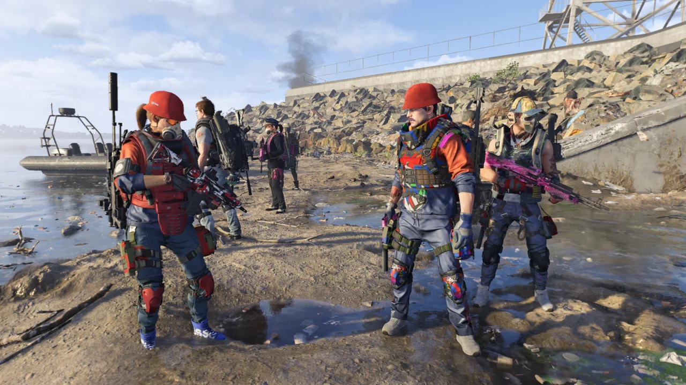
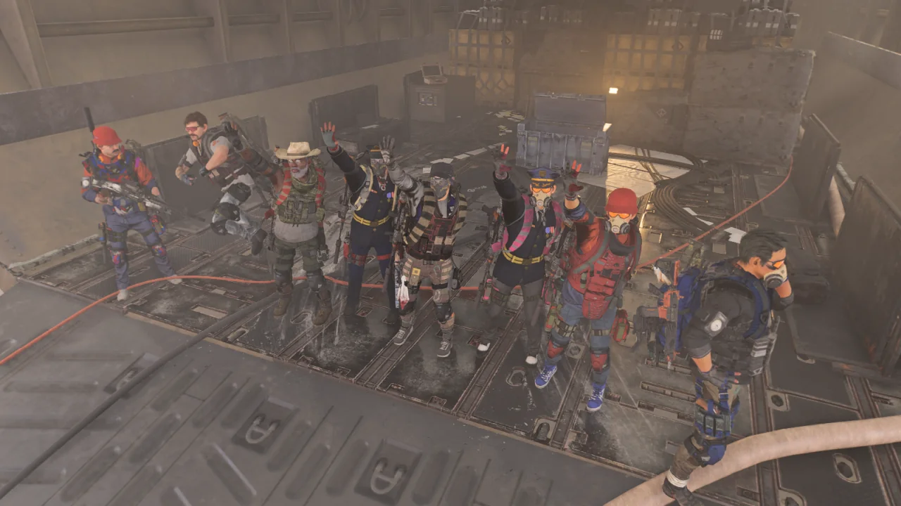
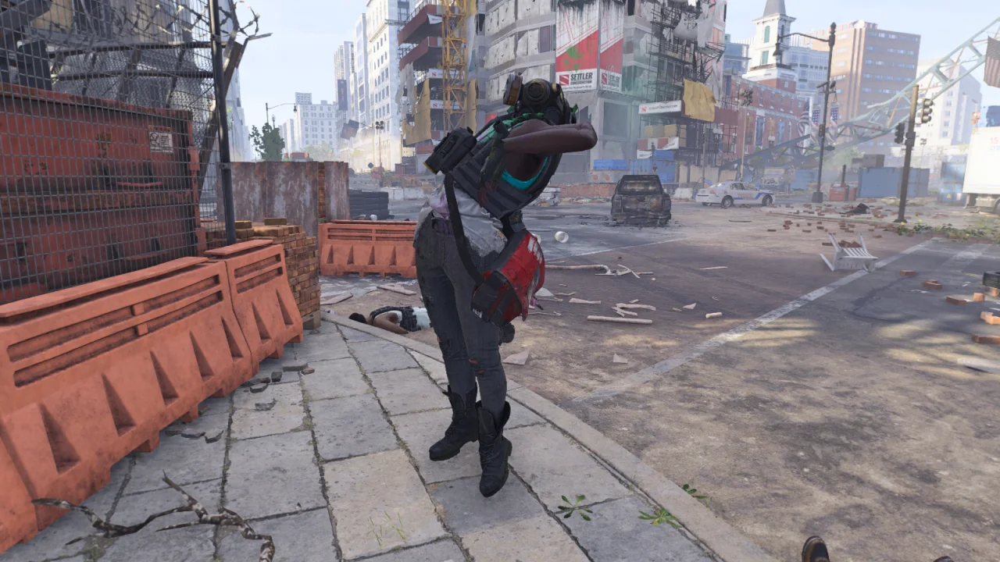
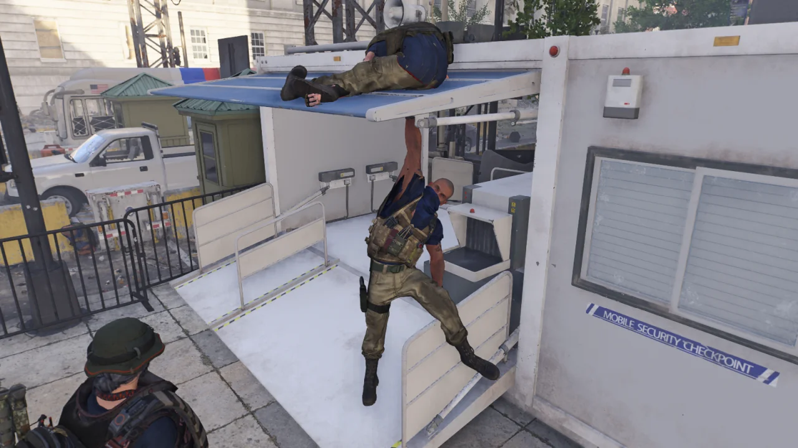
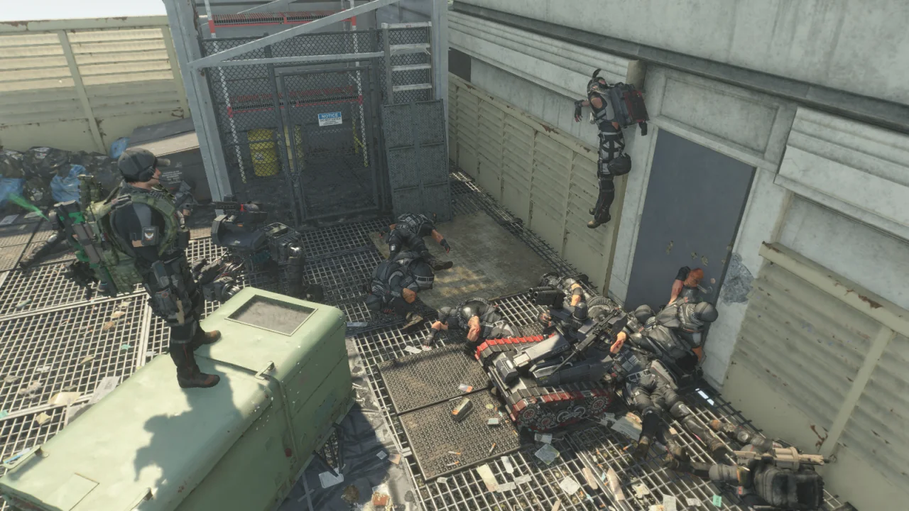

이게 다 이글 베어러 때문이다.

뭐? 상자에서 10% 확률로 나오고, 각 네임드마다 1%의 확률로 나온다고? 아닌 것 같은데?

내 주변 사람들이 하나둘 "까르륵 저도 이글 베어러 먹었어요"라고 할 때마다 부럽기 짝이 없다.

&nbsp;

이글 베어러가 탐나는 이유 중 하나는 바로 탄창 용량이 60발이나 된다는 것이다.

현재 여유분 탤런트가 붙은 일반 돌격 소총에 +20발 확장 탄창을 붙여도 한 탄창에 53발밖에 들어가지 않는데, 이글 베어러는 그에 비해 7발을 더 쏠 수 있는 것이다.

그렇다면 한 탄창에 많은 총탄을 담은 대신 한 발 한 발의 대미지가 약한가?

아니다. 오히려 다른 돌격 소총보다 높은 대미지를 갖고 있다는 사용 소감이 있다.

본인이 돌격 소총 대미지 수치를 얼마나 올렸냐에 따라 다르긴 하겠지만, 24K 정도의 대미지가 나온다는 말이 있다.

이러니 탐나지 않을 수가 없다.

&nbsp;

물론 이글 베어러에도 불안 요소는 존재한다.

헤드샷으로 적을 처치할 때 발동되는 버프의 지속 시간이 다 되기 전에 다섯 명의 적을 죽이지 못하면 버프가 활성화되는 동안 받은 모든 대미지의 80%를 몰아서 받는다.

하지만 이 단점 역시 엄폐하며 싸운다면 큰 의미가 없다. 레이드에서는 그게 좀 힘들지 몰라도 말이다.

'슈퍼 마리오 삼 형제'라는 구도를 생각하고 찍은 사진인데, 나머지 한 명이 화면 바깥으로 나가버렸다. 큿.

셋의 의상이 정말 비슷했다. 빨간 모자, 빨간 상의, 파란 바지. 슈퍼 마리오가 생각나는 의상이지 않은가?

레이드를 무사히 클리어했지만, 상자는 열지 못했다. 어디서 열쇠를 얻는 걸 까먹은 것 같은데...

레이드가 끝나고 또다시 파밍 모드로 전환해 무한 파밍을 시작했다.

요즘에는 기묘한 자세로 죽은 시체를 너무 많이 봐서인지, 재미있게 죽은 시체를 보더라도 사진을 찍고 싶다는 생각이 별로 들지 않는다.

사진을 찍는 데에는 그 당시의 기분도 역시 중요한 것 같다.

NPC가 폭발로 죽을 경우, 이런 식으로 어딘가에 신체 일부분이 끼어 대롱대롱 매달리는 경우가 잦다.

이 시체는 오른손이 검문소 천장에 매달린 것과 동시에 한쪽 다리를 칸막이에 걸치고 있다.



이제는 레이드 도중 사진을 찍지도 않는다. 이제는 그저 레이드 완료를 기록하기 위해 레이드가 끝나고 레이드 상자 앞에서 사진을 찍을 뿐이다.

저번 주도, 이번 주도 여전히 이글 베어러는 나오지 않는다.

별수 없이 다음 주 레이드를 기다려야 할 판이다.

&nbsp;

나오지 않는 이글 베어러를 보니, 내가 데스티니 가디언즈를 접었던 이유인 '요툰'이라는 이름의 무기가 생각난다.

그 무기도 주마다 한 번의 도전만 가능했고, 도전에서 요툰이 나올 확률 역시 극악이었다. 결국 그 무기가 나오지 않자, 게임에 대한 흥미가 떨어진 나는 데스티니 가디언즈를 접었다. 흔히 말하는 '꼬접'이었다.

만약 내가 디비전 2를 접게 된다면 이글 베어러가 나오지 않아서라고 생각하면 될 것이다.

저번 주에 클랜 상점에서 '방어력 +30%' 옵션이 붙은 길라 가드 조끼를 사기 위해 만든 부캐를 레이드용 부캐로 용도 변경을 시도 중이다.

별것은 아니다. 그저 27레벨이었던 캐릭터를 30레벨까지 올린 후, 월드 랭크 5까지 침입 임무를 완료하는 것뿐이니까.

이렇게 하면 캐릭터별로 레이드를 돌 수 있다. 본캐와 부캐 합해서 두 번 이글 베어러에 도전할 수 있는 것이다.

본캐에서 이글 베어러가 나오지 않아도 부캐에서 이글 베어러가 나왔다면 그걸 보관함을 통해 본캐에게 옮기면 된다.

&nbsp;

문제는 현자 타임이 오려고 한다는 것이다.

부캐를 키우려고 할 때마다 자꾸 하기 싫다는 생각이 드는 건 역시 한 번 했던 걸 또 하기 싫어서겠지.

부캐를 3개나 키우는 사람이 무척 대단해 보인다. 난 부캐 하나 키우는 것마저도 귀찮고 하기 싫은데, 그 사람들은 대체 그걸 어떻게 참으며 한 것일까?
