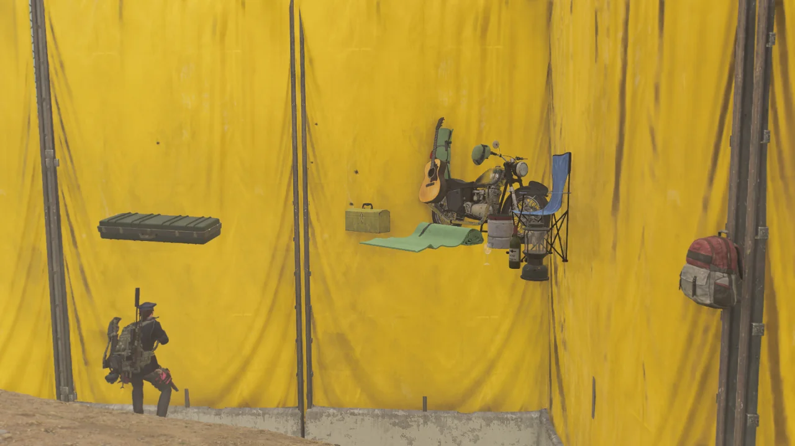
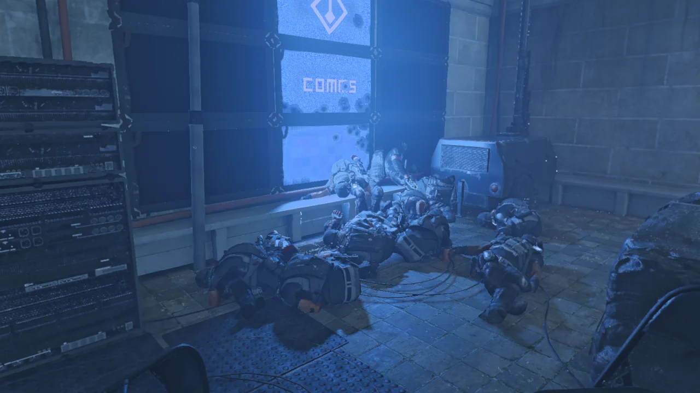
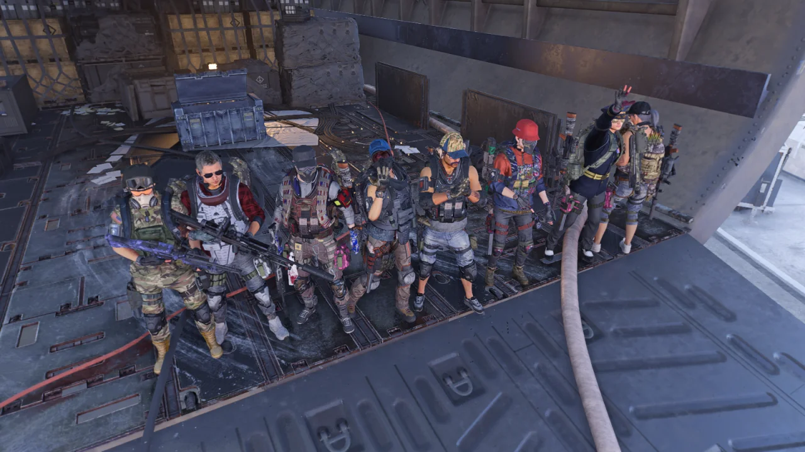
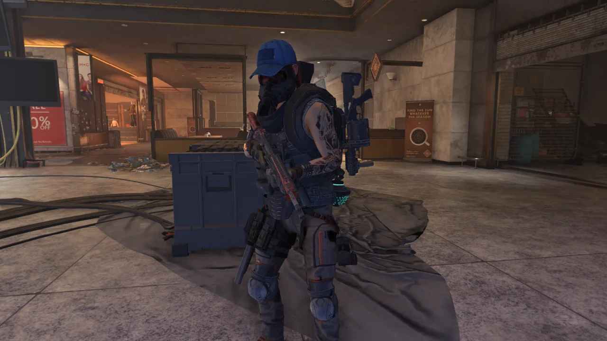
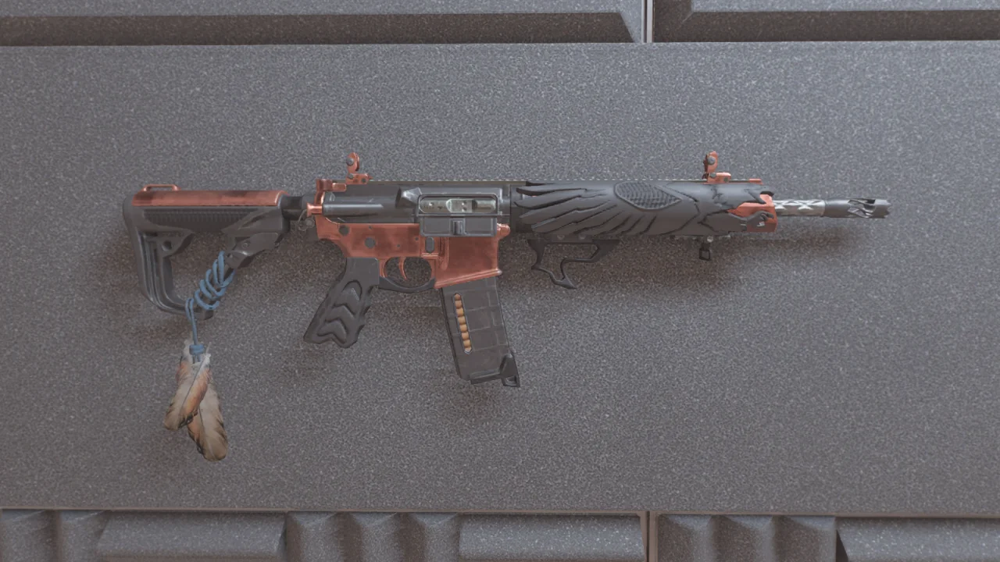
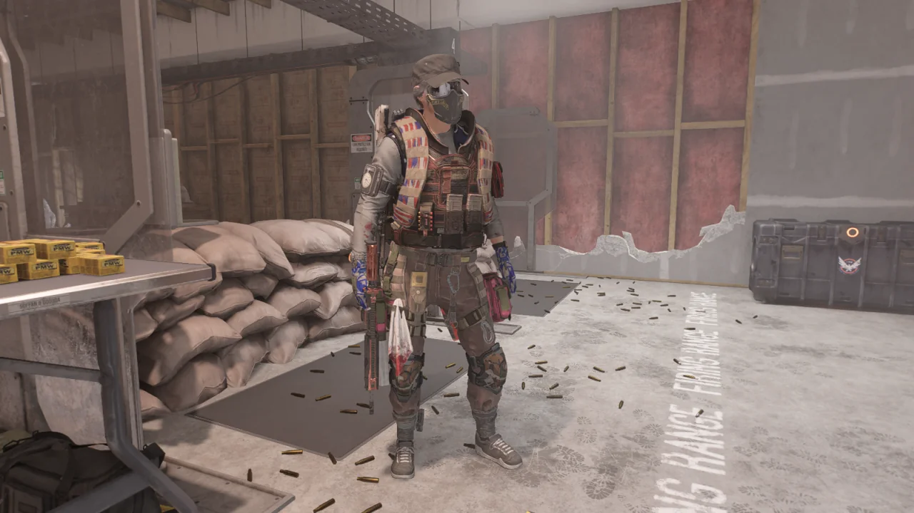

최근 들어 딱히 사진 모드를 쓰지 않았다.

예전에는 특이하게 죽은 시체 찍는 맛으로 사진 모드를 썼었는데, 워낙 많이 찍고 다니다 보니 시체가 다 고만고만해 보여 그냥 찍지를 않았다.

하기야, 특이하게 죽는 시체라고 해봤자 어디 사지 중 하나가 대롱대롱 매달리는 것 밖에 있겠냐만.

파밍을 하는데 이런 어이없는 지형을 발견했다. 땅은 푹 꺼져있는데 다른 프롭들은 둥둥 떠 있다.

이게 어디였는지는 잘 기억나지 않는다. 분명 워싱턴 기념탑 근처였던 거 같은데.

블랙 터스크를 대체 몇 마리나 죽인 건지 모르겠지만, 내 앞에만 블랙 터스크가 열댓 마리가 쏟아져 내려왔다.

같이 하던 사람이 "와 이거 완전 맛집이네"라고 할 정도였다.

최근 트위치에서 보게 된 R모 스트리머와 함께 레이드를 클리어했다.

이번 레이드는 본캐로 클리어했고, 그다음에 바로 부캐로 레이드에 또 도전했다. 스트리머도 나도 아직 레이드에 도전할 수 있는 부캐가 남아 있었거든.



부캐로 레이드를 갈 준비를 하는 스트리머를 기다리면서 홀로 내 세션에서 임무를 진행하다가 발생한 버그다.

레그돌 하나는 푸다닥거리다가 천장에 고정되어 버렸고, 다른 하나는 철제 난간에 고정되어 버렸다. 아래쪽 레그돌은 언뜻 봐서는 멀쩡한 것처럼 보이지만, 자세히 들여다보면 기괴하기 짝이 없다.

R모 스트리머와 함께 두 번째 레이드를 돌았다.

세 번째 네임드인 루시와 버디를 처리한 후 바닥에 떨어진 전리품을 보는데 R모 스트리머가 아주 약간 놀랐다는 어조로 "어, 독수리 먹었다."라고 말했다.

아니, 레이드가 나오고 나서 지금까지 매주 꼬박꼬박 빠짐없이 레이드를 돈 나도 아직 독수리를 얻지 못했는데, 이제 고작 레이드를 두 번 온 것이 전부인 사람이 독수리를 먹었다고? 그것도 레이드 상자가 아니라 네임드 전리품으로?

이게 뭔 개수작이냐, 매시브!

&nbsp;

물론 그 스트리머가 독수리를 얻은 것이 잘못했다는 말은 절대 아니다. 오히려 축하해 줄 일이지.

단지 내 배가 굉장히 아플 뿐이다.

그런데 짜잔! 나도 독수리를 얻었다.

방금 그 레이드가 끝난 후 레이드 상자를 열었는데 독수리가 뙇 하고 나왔다.

환호성을 크게 지르고 싶었지만, 새벽이라 소리를 크게 내지 못해 입을 틀어 막고 환호성을 나지막이 질렀는데, 그 소리를 들은 사람들은 내가 독수리가 나오지 않아 샷건을 친 줄 알았다고 하더라.

음...;;

그래서 기념 착용샷.

&nbsp;

그러고 보니 이번 금요일에 매시브가 긴급 점검을 하더니 무자비의 폭발 대미지가 중갑병에게 들어가지 않도록 바꾸었다고 한다. 대신 중갑병의 체력을 대폭 낮추어 밸런스를 맞추었다고 했다.

하지만 실제로 레이드에서 중갑병 대처 방안을 바꿔 시도해 보니, 하드코어가 따로 없다.

이게 게임이냐, 매시브?
