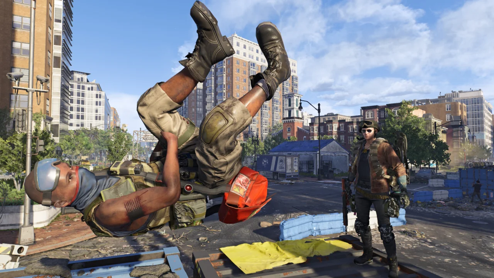
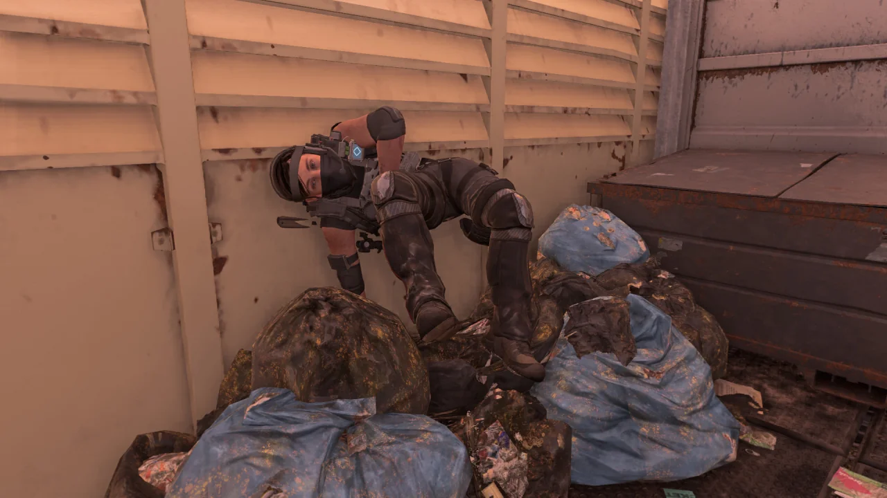
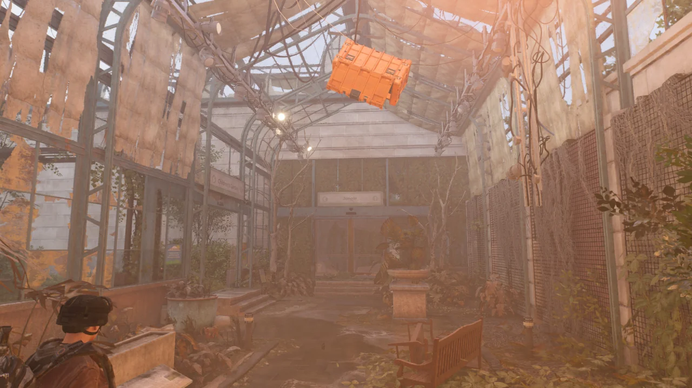
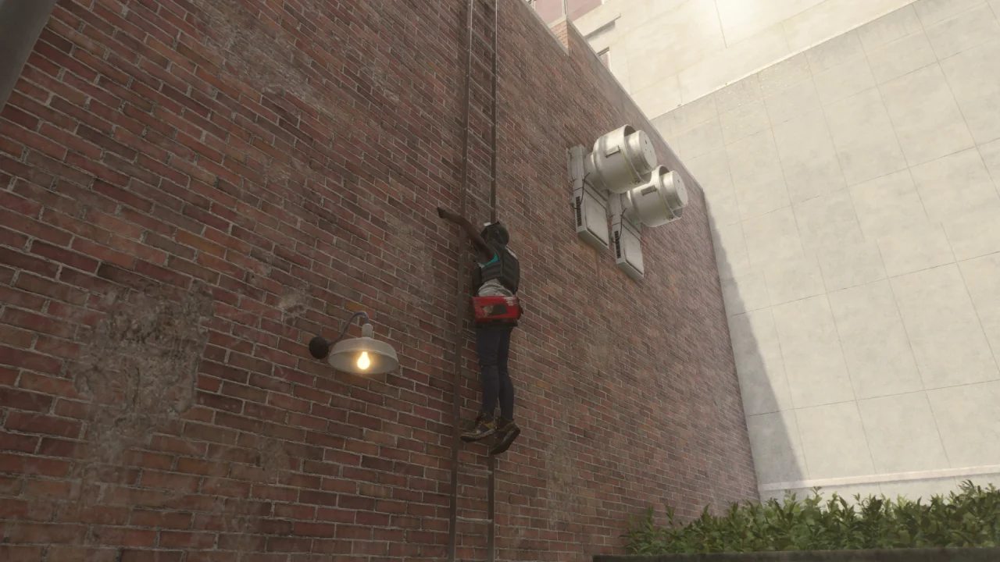

사진 모드 결산이라고 해보았자, 그냥 컴퓨터를 청소하기 전에 쌓인 디비전 2 스크린샷을 정리한다는 느낌이 더 강하다.

처음 찍을 때에는 '오, 웃긴 자세로 죽었네'라고 생각하고 찍은 것인데, 막상 글을 쓸 때 다시 사진을 보니 좀 많이 징그럽다.

그도 그럴 것이, 트루 썬 녀석들은 트루 썬 문양을 자기 팔뚝에 그린답시고 생살을 칼로 죽죽 긋고 지져놓았다.

그 피가 흐르다가 굳은 것까지 그대로 보이는데, 보다 보니 비위가 상한다.

위 사진과 다르게 이 사진은 그냥 순수하게 웃겨서 찍었다.

국회의사당 침입 임무를 보통 난이도로 빠르게 밀다가 발견한 것인데, 역시 난이도가 낮으니까 시원하게 미는 맛은 있다.

보상이 짜서 그렇지...

디비전 2 시연 영상의 배경이 된 곳이다. 아마 E3에서 시연 영상이 처음 공개되었던가?



식물원의 모습은 영상과 비교하면 화단의 위치가 중앙으로 옮겨진 것을 빼면 거의 동일하다. 하지만 시연 영상에서 플레이어가 들어갈 수 있었던, 식물이 가득 자라있던 식물원 내부는 입구가 잠겨 들어갈 수 없다.

사진 모드로 창문 너머를 들여다보아도 식물 모델이나 텍스쳐가 없는 것으로 보아, 플레이어가 식물원 안으로 들어갈 일은 영원히 없어 보인다.

그런데 식물원 안쪽에서 적 NPC가 나타나고 전리품도 식물원 안쪽에 떨어진다. 뭐야 이건?

사다리를 타고 올라오던 적을 죽이자, 그 시체가 사다리 중간에 매달렸다.

대충 보면 아직도 저 적이 여전히 살아있는 줄 착각할 것이다.
