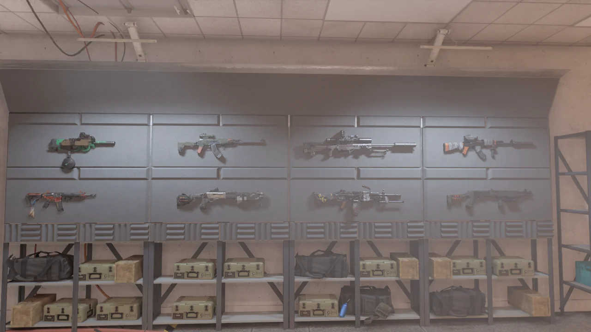

오늘 '타이틀 업데이트 5(TU5)' 겸 '에피소드 1(EP1)' 업데이트가 있었다.

새로운 스토리? 이걸 어떻게 참아? 서버가 열리자마자 곧바로 게임을 켰다.

&nbsp;

일단 새로 추가된 임무부터 먼저 플레이해 보았다.

* **캠프 화이트 오크(일반 임무)**:  
  가야 할 길을 가지 말고 중간중간 옆으로 빠지면 아이템이 적잖게 많이 나온다.  
  대부분은 폐지 수준이지만.
* **매닝 국립 동물원(요새 임무)**:  
  화이트 오크와는 다르게 옆으로 빠져도 별로 먹을 것이 없다. 길이가 매우 길어서 좋긴 했지만...  
  마지막에 에멜린 쇼를 잡을 수 있었던 것은 매우 마음에 들었다. 석궁 두세 발 맞춰주니까 아주 좋아하더라고.
* **켄리 대학(원정 임무)**:  
  놀랍게도 이 원정 임무가 '에피소드 1'의 주요 콘텐츠이다. 그런데 더럽게 재미가 없다.  
  하는 거라곤 ECHO에 나타난 세 목표 중 하나를 골라 켄리 대학이라는 좁은 건물 안에서 뺑이를 도는 것밖에 없다. 그리고 그걸 세 번 반복한다.  
  숨겨진 방 같은 요소를 찾는 재미가 있긴 하겠지만, 한 번 찾고 나면 끝이다.

내가 볼 때, 이번 에피소드 1은 그냥 쓰레기다.

타이틀 업데이트 5를 제외하면 에피소드 1의 내용은 기밀 과제 두 개와 켄리 대학에서 진행하는 '원정 임무'가 전부인데, 이 원정 임무를 3주 동안 로테이션을 돌린다고 한다.

3주 동안? 이건 하루에 하나씩 로테이션을 돌려도 될 분량이다! 난이도가 스토리 하나밖에 없는데 말 다 했지, 뭐.

***

오히려 시즌 패스 구매자에게 주는 기밀 과제가 켄리 대학보다 더 재미있었다.

&nbsp;

기밀 과제 중 NSA와 관련한 무언가를 조사하라는 임무가 있었다. 그 이전에 수족관 비슷한 곳을 간 것도 있긴 한데, 그 부분은 별로 인상 깊지 않아 사진을 찍지 않았다.

지하에 들어오면 뭔가 메트로2의 워싱턴 버전처럼 생긴 승장강이 있다.

저 'WEST ELEVATOR' 글꼴을 보라! 대충 5, 60년대의 분위기가 풍기지 않은가?

오래전에 지은 시설치고는 그리 낡아 보이지 않은 시설이다. 그동안 관리를 매우 잘했거나, 내가 연도를 잘못 추정했을 수도 있다.

이런 모양의 지하철을 어디서 봤나 했는데, 폴아웃 3에서 봤다. 거기 나오는 열차도 대충 이런 모양으로 생겼었지.

폴아웃 시리즈가 50년대 미국의 정서를 표현했으니, 내가 연대 추정을 잘못한 것 같지는 않은데...

벽에는 미국의 각 주의 주기가 걸려있다. 맨 앞부터 순서가 오클라호마, 뉴멕시코, 몬태나, 노스다코타, 노스캐롤라이나이다.

> First train design
{.bq}

아주 옛날의 사진이다. 이 정도면 사진이라고 하기보다는 그림이라고 하는 편이 더 정확하겠지.

미국에서 열차가 처음 운행한 것이 언제였더라?

낡은 통로의 끝에는 NSA의 비밀 벙커처럼 생긴 시설이 있었다.

여태껏 지나오면서 발견한 것과는 분위기가 사뭇 다르다. NSA가 이 시설 하나만큼은 제대로 관리를 하며 현대식 시설로 업그레이드를 한 것일지도 모른다.

오... 뭔가 멋진걸. 그런데 왜 여기에 블랙 터스크 장비가 있냐?

비상 전력으로 돌아가던 곳의 전원을 복구하자 더 이뻐졌다.

짐벌 공이 있길래 몸으로 이리 굴리고 저리 굴리고 놀다가 짐벌 공이 벽에 껴버렸다.

짐벌 공과 벽 사이에 충돌 판정을 넣지 않은 것 같다. 크윽, 이렇게 짐벌 공을 놓쳐버리다니...

아까 가운데에 있던 사무실에서는 이 기밀 임무의 마지막 백팩 수집품을 얻을 수 있다.

이 사무실은 아무리 봐도 생긴 것이 이 시설의 수장이 지낼만한 곳이다. 사무실에서 아래를 내려다보면 이 넓은 공간이 한눈에 들어오거든.

아래로 어떻게 내려가는지는 잘 모르겠지만.

모든 특급 무기를 모으고 있다. 이제 자유만 다시 만들면 모든 특급 무기가 마련된 컬렉션을 완성할 수 있다.
