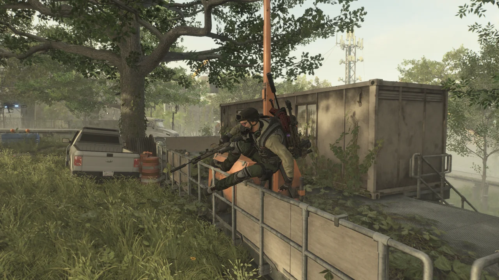
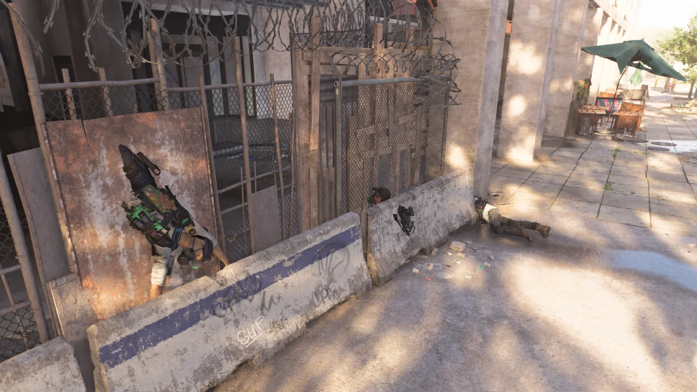
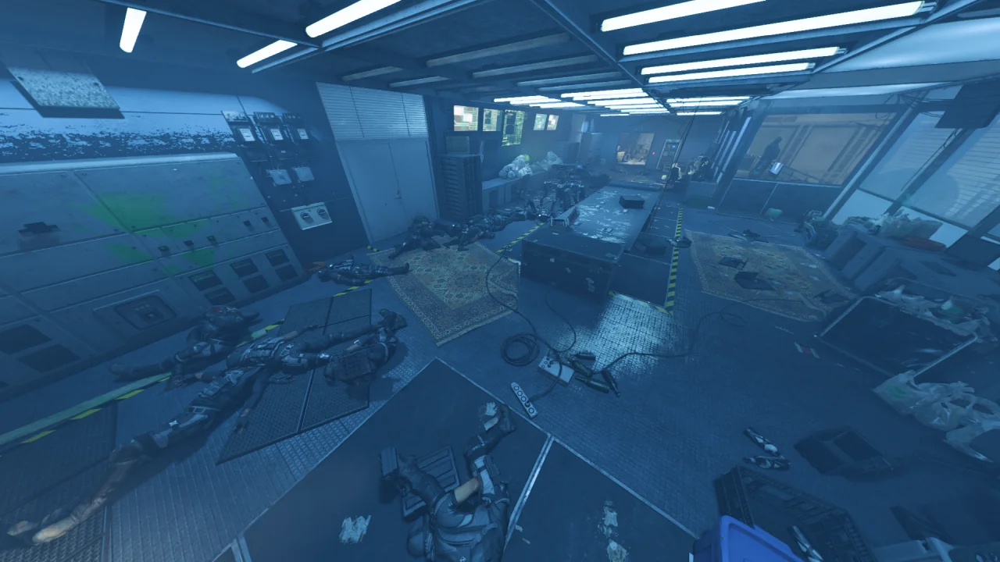
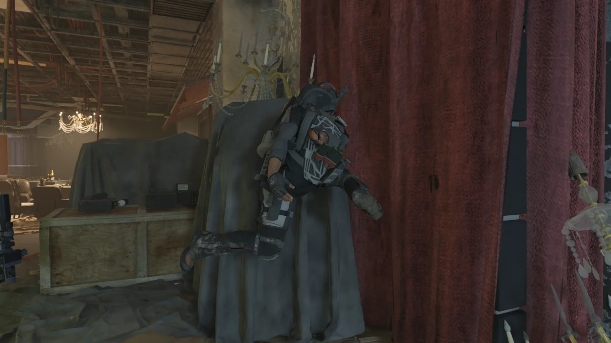
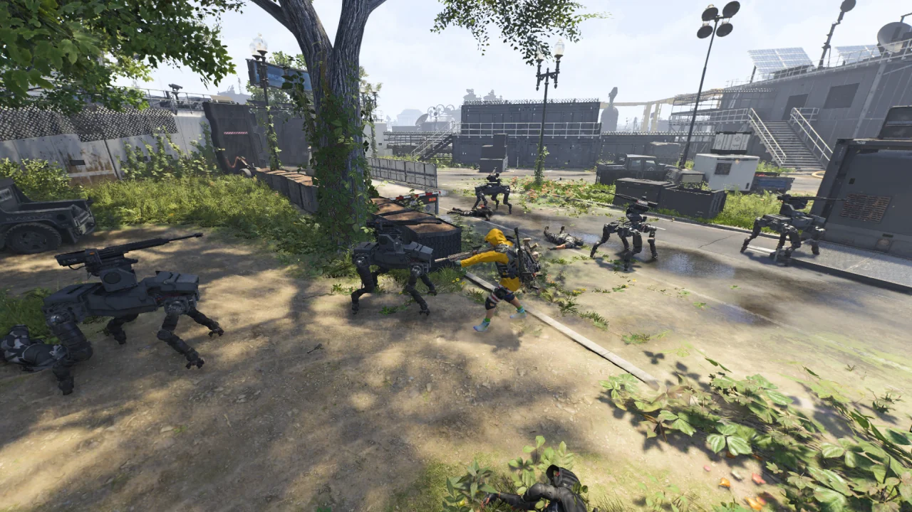
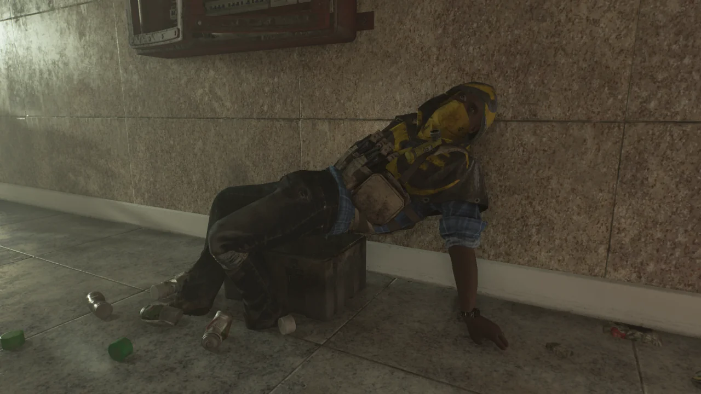

오랜만의 사진 모드다.

간혹 게임을 하다가 좋은 사진 거리를 만나면 사진을 찍는 터라, 사진이 아예 쌓이지 않는 것은 아니다. 그렇다고 하더라도 쌓이는 사진의 양이 그리 많지는 않지만.

다크존을 다른 사람과 파티를 짜 돌던 중, 같이 하던 사람의 게임이 튕겨버렸다.

난간을 넘던 도중 게임이 튕긴 탓인지, 그 사람의 캐릭터가 난간을 매우 느리게 슬로우모션으로 넘고 있다.

워낙 느리게 움직인 탓에, 난간을 다 넘지 못하고 그대로 뾱 사라졌지만.

전력맨과 함께 돌아다니면 이런 꼴을 자주 만날 수 있다.

폭격 드론이 한차례 지나간 후, 하이에나들이 단체로 벽과 하나가 되었다.

은행 본부 침입 임무를 매우 어려움 난이도로 다른 사람과 함께 돌았다.

몹이 나오는 구역의 양 끝에 서서 각자 입구 하나씩을 맡고 블랙 터스크가 나오자마자 신나게 녹여댔다.

그 결과가 이렇게 수두룩하게 널려있는 블랙 터스크의 시쳇더미다.

&nbsp;

나오자마자 탄환 세례를 실컷 얻어맞고 차가운 바닥에 단체로 몸을 뉘는 블랙 터스크를 보며 '사람 목숨이 이리도 가볍구나'라는 생각을 해본다.

대체 이 시체는 무슨 자세를 취하려고 했던 것일까?

타이들 베이슨 영웅 난이도에서는 철댕이가 굉장히 많이 나온다. 토가 나올 정도로 말이다.

이 사진에만 철댕이가 다섯 마리가 있는데, 사실 사진에 나오지 않은 오른쪽에도 철댕이의 멀쩡한 잔해가 두 대나 더 있다.

독수리 오형제도 아니고, 철댕이 칠형제인 셈이다.

아웃캐스트를 죽였는데, 쓰러진 시체가 뭔가 굉장히 편해 보이는 자세로 특수탄약 상자에 앉은 모양이 되었다.

실제로는 밑에 있던 특수탄약 상자가 터지는 바람에 엉덩이를 계속 들썩들썩하였지만.
